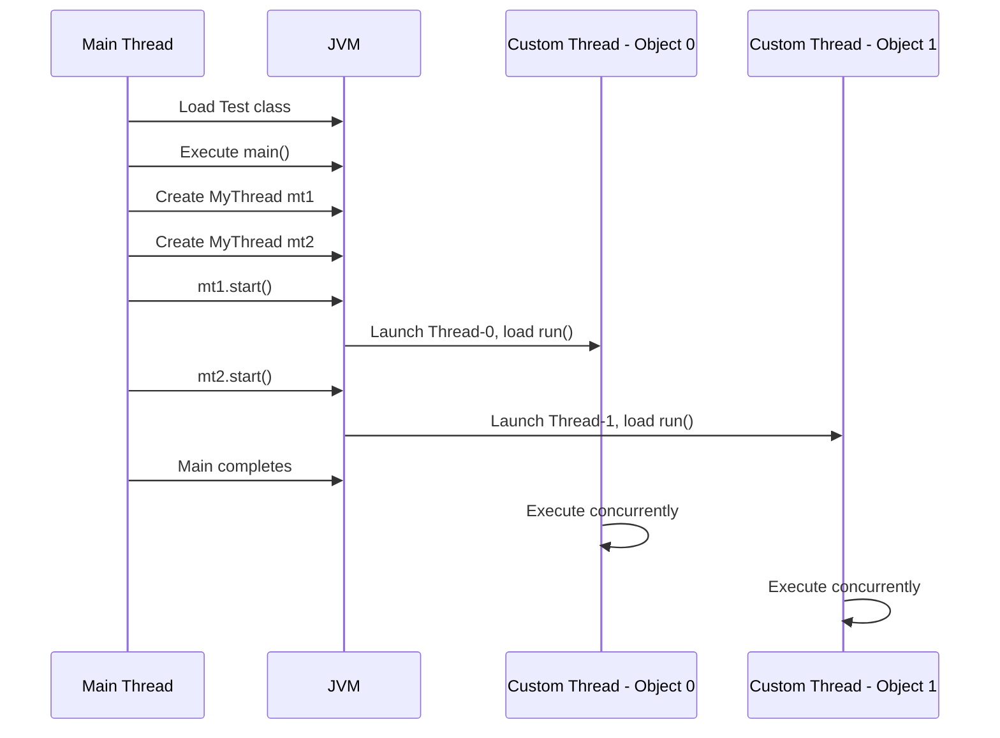

# Session 04: Multithreading Fundamentals and Custom Thread Creation

- [Session 04: Multithreading Fundamentals and Custom Thread Creation](#session-04-multithreading-fundamentals-and-custom-thread-creation)
  - [Start Method Usage Restrictions](#start-method-usage-restrictions)
  - [Creating Multiple Custom Threads](#creating-multiple-custom-threads)
  - [JVM Architecture for Multiple Threads](#jvm-architecture-for-multiple-threads)
  - [Passing Arguments to Custom Threads](#passing-arguments-to-custom-threads)
  - [Bank Deposit Project Implementation](#bank-deposit-project-implementation)
  - [Executing Different Logics in Multiple Threads](#executing-different-logics-in-multiple-threads)
  - [Ways to Create Custom Threads](#ways-to-create-custom-threads)
  - [Concurrent Deposit and Withdraw Operations](#concurrent-deposit-and-withdraw-operations)
  - [Executing Multiple Methods Concurrently](#executing-multiple-methods-concurrently)
- [Summary](#summary)

## Start Method Usage Restrictions

### Overview
In Java multithreading, the `start()` method is a critical mechanism for launching threads. It can only be invoked once per thread object to initiate thread execution, preventing redundant launches that could lead to resource waste or inconsistent program behavior. This enforcement ensures proper thread lifecycle management and resource allocation within the JVM.

### Key Concepts/Deep Dive
- **Method Invocation Limit**: Calling `start()` multiple times on the same `Thread` instance will throw an `IllegalThreadStateException`. This restriction prevents attempting to restart a terminated or running thread, as thread states cannot cycle back to the initial state upon completion.


- **Exception Behavior**: Attempting redundant `start()` calls results in immediate runtime errors, halting program execution unless caught and handled appropriately. This design choice promotes defensive programming practices.
- **Alternative Approaches**: To achieve repeated or controlled executions, developers should instantiate new thread objects for each required execution cycle or utilize thread pools for resource-efficient task management.

```java
// Incorrect: Attempting to call start() multiple times
class MyThread extends Thread {
    public void run() {
        System.out.println("Thread executing");
    }
}

public class Test {
    public static void main(String[] args) {
        MyThread mt = new MyThread();
        mt.start();  // First call: Valid
        mt.start();  // Second call: Throws IllegalThreadStateException
    }
}
```

> [!NOTE]
> The JVM restricts `start()` invocation to ensure thread objects maintain a one-to-one relationship with their execution lifecycle, preventing potential deadlock scenarios or stack overflow issues in recursive thread designs.

> [!IMPORTANT]
> Always instantiate separate thread objects when needing multiple executions of the same logic, rather than reusing terminated thread instances.

## Creating Multiple Custom Threads

### Overview
Java enables concurrent execution through the creation of multiple custom threads, each operating independently within the JVM's thread scheduler. This approach allows parallel processing of tasks, improving application responsiveness and resource utilization in multi-core environments.

### Key Concepts/Deep Dive
- **Thread Instantiation**: To spawn multiple threads executing identical logic, developers must create distinct thread objects. Each object manages its own execution context, including local variables and stack space.
- **Execution Independence**: Multiple thread instances process concurrently, with the operating system's scheduler determining execution order and resource allocation.
- **Resource Considerations**: Each thread consumes memory and system resources, necessitating monitoring to prevent exhaustion in high-concurrency scenarios.

### Lab Demo: Creating Multiple Threads with Loop Output

**Steps to implement**:
1. Create a custom thread class extending `Thread`.
2. Override the `run()` method with desired logic (e.g., printing loop iterations).
3. In the main method, instantiate multiple objects of the custom thread class.
4. Call `start()` on each object to initiate concurrent execution.

```java
class MyThread extends Thread {
    public void run() {
        for (int i = 1; i <= 5; i++) {
            System.out.println(Thread.currentThread().getName() + ": Run " + i);
        }
    }
}

public class Test {
    public static void main(String[] args) {
        MyThread mt1 = new MyThread();
        MyThread mt2 = new MyThread();
        
        mt1.start();  // Launches thread 0
        mt2.start();  // Launches thread 1
    }
}
```

**Expected Output (order may vary due to concurrency)**:
```
Thread-0: Run 1
Thread-1: Run 1
Thread-0: Run 2
Thread-1: Run 2
Thread-0: Run 3
Thread-1: Run 3
Thread-0: Run 4
Thread-1: Run 4
Thread-0: Run 5
Thread-1: Run 5
```

> [!NOTE]
> Output interleaving demonstrate genuine concurrency, with thread scheduler determining execution sequence per system capabilities.

## JVM Architecture for Multiple Threads

### Overview
Java Virtual Machine (JVM) architecture provides a structured environment for multithreaded execution, maintaining separate runtime stacks for each thread while sharing method and heap areas. This design ensures thread safety while enabling efficient resource sharing.

### Key Concepts/Deep Dive
- **Memory Areas**:
  - **Method Area**: Contains class metadata and static variables, accessible across all threads.
  - **Heap**: Stores objects instantiated via `new` keyword, shared among threads with synchronization implications.
  - **JVM Stack**: Each thread possesses its private stack for method calls, local variables, and execution context.
  - **Program Counter (PC) Register**: Maintains the address of the currently executing JVM instruction.
  - **Native Method Stack**: Supports native method invocations.

```mermaid
graph TD
    A[JVM Architecture]
    A --> B[Method Area (Shared)]
    A --> C[Heap (Shared)]
    A --> D[JVM Stack (Per Thread)]
    D --> D1[Thread 0 Stack]
    D --> D2[Thread 1 Stack]
    A --> E[PC Register (Per Thread)]
    A --> F[Native Method Stack (Per Thread)]
```

- **Thread Lifecycle Integration**: Custom threads begin with `start()` calls, loading `run()` method logic into designated stack frames.
- **Reference Sharing**: Main thread and custom threads may reference identical heap objects, requiring careful synchronization for data integrity.
- **Garbage Collection**: Thread-held object references prevent premature garbage collection, even after main thread termination.

**Scenario Diagram (Multiple Thread Objects)**:


> [!IMPORTANT]
> Proper visualization of JVM memory areas is essential for understanding thread isolation, shared resources, and potential race conditions in multithreaded applications.

## Passing Arguments to Custom Threads

### Overview
Java threads lack parameterized constructors by default, necessitating alternative strategies for transmitting runtime values. Developers overcome this limitation through instance variables initialized via custom constructors, enabling dynamic thread behavior based on passed arguments.

### Key Concepts/Deep Dive
- **Constructor Role**: Custom thread classes can define parameterized constructors to receive and store input values.
- **Instance Variable Storage**: Arguments populate class-level variables, accessible within the overridden `run()` method.
- **Dynamic Execution**: This approach allows identical thread logic to process varied inputs across multiple instances.

### Lab Demo: Thread with Variable End Value

**Steps to implement**:
1. Extend `Thread` and declare instance variables for parameters.
2. Create a parameterized constructor to initialize variables.
3. Override `run()` to utilize the initialized variables.
4. In main, create thread objects with different arguments and call `start()`.

```java
class MyThread extends Thread {
    int x;  // Instance variable to store parameter
    
    MyThread(int x) {
        this.x = x;
    }
    
    public void run() {
        for (int i = 1; i <= x; i++) {
            System.out.println(Thread.currentThread().getName() + ": " + i);
        }
    }
}

public class Test {
    public static void main(String[] args) {
        MyThread mt1 = new MyThread(10);  // 1 to 10
        MyThread mt2 = new MyThread(20);  // 1 to 20
        
        mt1.start();
        mt2.start();
    }
}
```

**Expected Output (concurrent execution)**:
```
Thread-0: 1
Thread-1: 1
Thread-0: 2
Thread-1: 2
...
Thread-0: 10
Thread-1: 20
```

| Constructor Parameter | Thread Instance 1 | Thread Instance 2 |
|-----------------------|-------------------|-------------------|
| Argument Passed | 10 | 20 |
| Loop Range | 1-10 | 1-20 |
| Concurrent Execution | Yes | Yes |

## Bank Deposit Project Implementation

### Overview
Multithreading enables concurrent banking operations, simulating real-world scenarios where multiple customers perform deposits simultaneously. This project demonstrates thread synchronization for shared resources, showcasing practical application of custom thread creation and argument passing.

### Key Concepts/Deep Dive
- **Class Hierarchy**: Application comprises `BankAccount`, custom thread, and main classes for modular design.
- **Object Sharing**: Thread instances reference common `BankAccount` objects, requiring thread-safe operations.
- **Business Logic Encapsulation**: Banking methods reside in domain classes, called from thread `run()` methods.

### Lab Demo: Concurrent Bank Deposits

**Steps to implement**:
1. Define `BankAccount` class with balance field and `deposit()` method.
2. Create `DepositorThread` extending `Thread`, storing account and amount references.
3. In `run()`, invoke `account.deposit(amount)` and display updated balance.
4. In main, instantiate multiple accounts and deposit threads with varying parameters.
5. Call `start()` on each thread for concurrent execution.

```java
class BankAccount {
    private long accountNumber;
    private String holderName;
    private double balance;
    
    BankAccount(long accNo, String name, double bal) {
        accountNumber = accNo;
        holderName = name;
        balance = bal;
    }
    
    public void deposit(double amount) {
        balance += amount;
        System.out.println("Deposited " + amount + ". New balance: " + balance);
    }
    
    public double getBalance() {
        return balance;
    }
}

class DepositorThread extends Thread {
    BankAccount account;
    double amount;
    
    DepositorThread(BankAccount acc, double amt) {
        account = acc;
        amount = amt;
    }
    
    public void run() {
        account.deposit(amount);
    }
}

public class BankDemo {
    public static void main(String[] args) {
        BankAccount acc1 = new BankAccount(123456, "Customer A", 10000.0);
        BankAccount acc2 = new BankAccount(654321, "Customer B", 20000.0);
        
        DepositorThread dt1 = new DepositorThread(acc1, 5000);
        DepositorThread dt2 = new DepositorThread(acc2, 7000);
        
        dt1.start();
        dt2.start();
    }
}
```

| Account | Initial Balance | Deposit Amount | Thread Execution |
|---------|-----------------|----------------|------------------|
| acc1 | 10000.0 | 5000 | Concurrent |
| acc2 | 20000.0 | 7000 | Concurrent |

## Executing Different Logics in Multiple Threads

### Overview
Applications often require parallel execution of disparate operations, necessitating distinct thread classes for each logic type. This approach separates concerns while maintaining concurrent performance benefits.

### Key Concepts/Deep Dive
- **Dedicated Thread Classes**: Each unique logic requires its own thread subclass to prevent code intermingling.
- **Logic Isolation**: Separate `run()` implementations ensure clear responsibility boundaries.
- **Concurrency Benefits**: Independent operations execute simultaneously, optimizing resource utilization.

### Lab Demo: Addition and Subtraction Threads

**Steps to implement**:
1. Create `AddThread` with addition logic in `run()`.
2. Create `SubThread` with subtraction logic in `run()`.
3. Instantiate and start both threads from main.

```java
class AddThread extends Thread {
    public void run() {
        int sum = 0;
        for (int i = 1; i <= 20; i++) {
            sum += i;
            System.out.println("Addition: " + sum);
        }
    }
}

class SubThread extends Thread {
    public void run() {
        int diff = 0;
        for (int i = 20; i >= 1; i--) {
            diff += i;  // Note: Example logic, adjust as needed
            System.out.println("Subtraction: " + diff);
        }
    }
}

public class LogicDemo {
    public static void main(String[] args) {
        AddThread at = new AddThread();
        SubThread st = new SubThread();
        
        at.start();
        st.start();
    }
}
```

## Ways to Create Custom Threads

### Overview
Java provides multiple mechanisms for custom thread creation, each offering flexibility for different use cases. Extending `Thread` or implementing `Runnable` forms the foundational approaches, augmented by modern alternatives like lambdas and executor frameworks.

### Key Concepts/Deep Dive
- **Core Approaches**:
  - Extending `Thread`: Direct subclassing with `run()` override.
  - Implementing `Runnable`: Interface-based design promoting composition.
  - Implementing `Callable`: Advanced interface for result-returning tasks.
  - Executor Framework: Thread pool management for efficient resource handling.

| Approach | Implementation Style | Use Case |
|----------|----------------------|----------|
| Extend `Thread` | Class inheritance | Simple standalone threads |
| Implement `Runnable` | Interface composition | Flexible, reusable logic |
| Executor Framework | Thread pool usage | Scalable concurrent execution |

- **Alternative Approaches**: Anonymous classes, lambda expressions, and method references offer concise implementations for functional interfaces like `Runnable` and `Callable`.

## Concurrent Deposit and Withdraw Operations

### Overview
Complex banking scenarios demand concurrent handling of mixed operations like deposits and withdrawals, demonstrating advanced multithreading concepts through proper resource synchronization to prevent race conditions.

### Key Concepts/Deep Dive
- **Operation Diversity**: Separate thread classes manage distinct transaction types while sharing account resources.
- **Synchronization Needs**: Shared account access requires atomic operations to ensure data consistency.

### Lab Demo: Deposit and Withdraw Threads

**Steps to implement**:
1. Extend deposit thread from previous example.
2. Create `WithdrawThread` with withdrawal logic.
3. Instantiate accounts and mixed operation threads.
4. Execute concurrently, monitoring shared state changes.

```java
class WithdrawThread extends Thread {
    BankAccount account;
    double amount;
    
    WithdrawThread(BankAccount acc, double amt) {
        account = acc;
        amount = amt;
    }
    
    public void run() {
        // Assuming BankAccount has withdraw method
        account.withdraw(amount);
    }
}
```

## Executing Multiple Methods Concurrently

### Overview
Object-oriented applications frequently invoke multiple instance methods concurrently across different threads, requiring careful consideration of object sharing and state management to ensure thread safety.

### Key Concepts/Deep Dive
- **Method Parallelism**: Threads can execute different object methods simultaneously when proper synchronization exists.
- **Object Sharing**: Threads may reference the same or separate instances, depending on application requirements.

### Lab Demo: Concurrent Method Execution

**Steps to implement**:
1. Create class with multiple methods.
2. Develop thread classes calling specific methods.
3. Instantiate threads with shared or separate object references.

```java
class Example {
    public void method1() {
        System.out.println("Method 1 executed by " + Thread.currentThread().getName());
    }
    
    public void method2() {
        System.out.println("Method 2 executed by " + Thread.currentThread().getName());
    }
}

class Method1Thread extends Thread {
    Example ex;
    
    Method1Thread(Example obj) {
        ex = obj;
    }
    
    public void run() {
        ex.method1();
    }
}

class Method2Thread extends Thread {
    Example ex;
    
    Method2Thread(Example obj) {
        ex = obj;
    }
    
    public void run() {
        ex.method2();
    }
}

public class MethodDemo {
    public static void main(String[] args) {
        Example obj = new Example();  // Shared object
        
        Method1Thread t1 = new Method1Thread(obj);
        Method2Thread t2 = new Method2Thread(obj);
        
        t1.start();
        t2.start();
    }
}
```

# Summary

## Key Takeaways
```diff
+ Create multiple thread objects for concurrent identical logic execution
+ Use parameterized constructors to pass arguments to custom threads via instance variables
+ JVM provides separate stacks for each thread with shared heap and method areas
+ Different logics require separate thread classes extending Thread
+ Consider executor frameworks for scalable thread management
- Avoid calling start() multiple times on the same thread object
- Refrain from direct thread method overriding without understanding JVM lifecycle
- Prevent unsynchronized shared object access causing race conditions
```

## Expert Insight

### Real-world Application
In enterprise banking systems, multithreading enables handling thousands of concurrent transactions across ATM networks, web applications, and mobile banking platforms. Proper thread design ensures database integrity and user experience during peak loads, with thread pools dynamically allocating resources based on server capacity.

### Expert Path
Master thread synchronization using `synchronized` blocks, `java.util.concurrent` utilities like `ReentrantLock`, and atomic classes from `java.util.concurrent.atomic`. Study thread pool configurations (`ThreadPoolExecutor`) for optimal resource utilization. Practice with JMeter or custom benchmarks to understand concurrency limits and bottleneck identification in production environments.

### Common Pitfalls
- **Race Conditions**: Unprotected shared variable access leads to inconsistent data states, resolved through synchronized methods or atomic operations. For example, concurrent balance updates without locks can overwrite each other.
- **Deadlocks**: Nested synchronized blocks on multiple resources cause threads to wait indefinitely, mitigated by consistent lock ordering (e.g., always acquire Account A before Account B lock).
- **Thread Starvation**: Over-subscription of CPU resources prevents critical threads from executing, addressed by priority settings (`Thread.setPriority()`) and fair scheduling policies.
- **Memory Leaks**: Static collections holding thread references or improper daemon thread configuration can leak memory, monitored via profiling tools like VisualVM.
- **Lesser Known**: Implicit thread start order assumptions lead to unreliable testing; always use `Thread.join()` for deterministic completion assurance in unit tests. Platform-specific thread limits (Linux default ~30,000) require application-level pooling for high-scale scenarios.
