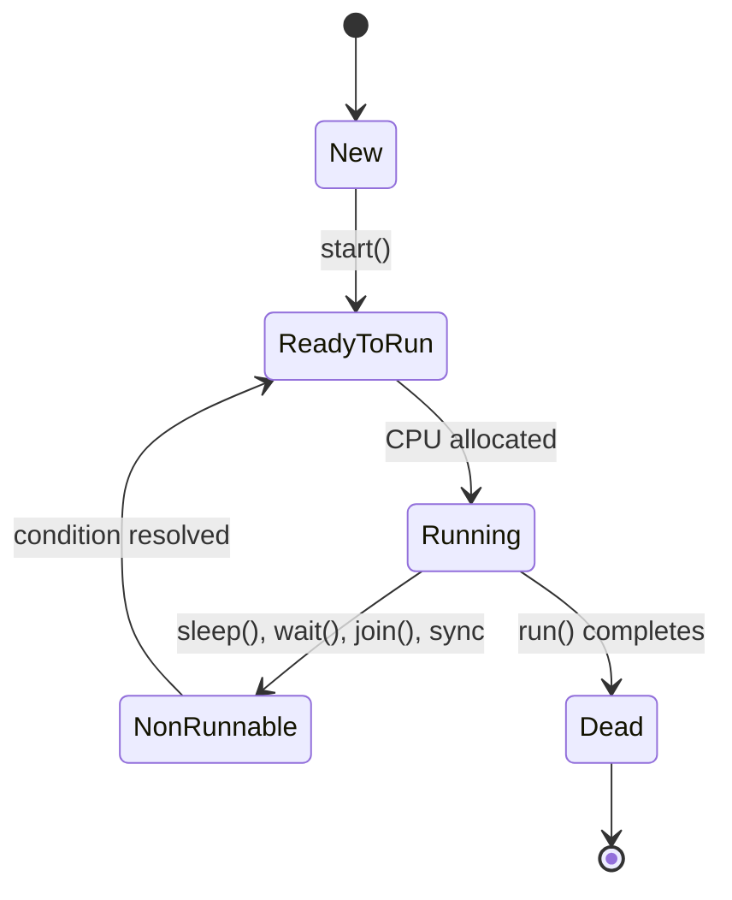

# Session 116: Multithreading - Thread Life Cycle and States

## Table of Contents

- [Overview](#overview)
- [Proving Execution Time Difference: Single-threaded vs Multi-threaded](#proving-execution-time-difference-single-threaded-vs-multi-threaded)
- [Thread Life Cycle States (Pre-Java 5)](#thread-life-cycle-states-pre-java-5)
- [Thread Execution Flow and State Transitions](#thread-execution-flow-and-state-transitions)
- [Official Thread States (Java 5+)](#official-thread-states-java-5)
- [Thread.getState() Method](#thread.getstate-method)
- [Thread.isAlive() Method](#thread.isalive-method)
- [Summary](#summary)

<a id="overview"></a>
## Overview

This session demonstrates practical proof of execution time differences between single-threaded and multi-threaded applications, establishing that multi-threading provides faster execution through concurrent processing. The lecture then explores thread life cycle states, beginning with conceptual states used before Java 5 and progressing to the official standardized states introduced in Java 5. Students learn how threads transition between states during execution, the role of the JVM thread scheduler, and programmatic methods to monitor thread states using `Thread.getState()` and `Thread.isAlive()` methods. Practical code examples and memory diagram analysis help solidify understanding of thread behavior and execution flow.

<a id="proving-execution-time-difference-single-threaded-vs-multi-threaded"></a>
## Proving Execution Time Difference: Single-threaded vs Multi-threaded

### Overview
To prove that multi-threaded application execution is faster than single-threaded, we create a program with two tasks: printing numbers from 1 to 50 and printing numbers from 50 to 1. Each task pauses for 100ms per number display. We execute these tasks first sequentially (single-threaded) and then concurrently (multi-threaded), measuring execution times to demonstrate the performance benefit of multi-threading.

### Key Concepts
**Execution Time Measurement:**
- Use `System.currentTimeMillis()` to capture timestamps
- Measure before and after task execution
- Calculate elapsed time in milliseconds

**Performance Comparison:**
- Single-threaded: Sequential execution - total time includes all pauses
- Multi-threaded: Concurrent execution - pauses overlap, reducing total time

**Thread Selection:**
- Single-threaded approach: Use main thread only
- Multi-threaded approach: Use main thread and one custom thread

### Code Example

```java
// PrintDemo.java
public class PrintDemo {
    public void print1To50() {
        for(int i = 1; i <= 50; i++) {
            System.out.print(i + "\t");
            try {
                Thread.sleep(100);  // Sleep to simulate processing
            } catch(InterruptedException e) {}
        }
        System.out.println();
    }
    
    public void print50To1() {
        for(int i = 50; i >= 1; i--) {
            System.out.print(i + "\t");
            try {
                Thread.sleep(100);  // Sleep to simulate processing
            } catch(InterruptedException e) {}
        }
        System.out.println();
    }
}

// SingleThreadDemo.java - Sequential execution
public class SingleThreadDemo {
    public static void main(String[] args) {
        long startTime = System.currentTimeMillis();
        
        PrintDemo pd = new PrintDemo();
        pd.print1To50();
        pd.print50To1();
        
        long endTime = System.currentTimeMillis();
        System.out.println("Time taken: " + (endTime - startTime) + " ms");
   }
}

// MultiThreadDemo.java - Concurrent execution
public class MultiThreadDemo extends Thread {
    public static void main(String[] args) {
        long startTime = System.currentTimeMillis();
        
        PrintDemo pd = new PrintDemo();
        pd.print1To50();  // Executed by main thread
        
        MultiThreadDemo mt = new MultiThreadDemo();
        mt.start();  // Starts custom thread
        
        // Time measurement includes both thread execution
        long endTime = System.currentTimeMillis();
        System.out.println("Time taken: " + (endTime - startTime) + " ms");
    }
    
    @Override
    public void run() {
        PrintDemo pd = new PrintDemo();
        pd.print50To1();  // Executed by custom thread
    }
}
```

### Lab Demo Steps
1. **Create PrintDemo class** with print1To50() and print50To1() methods, each using Thread.sleep(100) for pauses
2. **Implement SingleThreadDemo** - call both methods in main() sequentially on one thread
3. **Implement MultiThreadDemo** - call print1To50() in main thread, override run() method for print50To1()
4. **Add timing measurement** using System.currentTimeMillis() before and after execution in both versions
5. **Compile and execute** both programs, comparing execution times
6. **Modify sleep duration** to 1000ms (1 second) per number to see clearer time differences
7. **Enhance output formatting** for better readability (adjust to single row per thread if needed)

### Key Observations
- Single-threaded execution: ~10,000ms (50 numbers × 100ms × 2 tasks)
- Multi-threaded execution: ~5,000ms (concurrent thread execution reduces total wait time)
- Multi-threading doesn't reduce work amount but reduces total execution time through parallelism

<a id="thread-life-cycle-states-pre-java-5"></a>
## Thread Life Cycle States (Pre-Java 5)

### Overview
Prior to Java 5, threads followed a conceptual life cycle derived from operating system principles. Every thread passes through five fundamental states during its lifetime, representing different phases from creation to termination. These conceptual states help understand thread behavior before the official standardized states were introduced.

### Key Concepts

**Five Thread States (Traditional):**
- **New State**: Thread object created, thread object exists in heap, thread of execution not yet created
- **Ready to Run/Runnable State**: Thread of execution created, waiting for CPU scheduler to allocate time
- **Running State**: Thread actively executing code (CPU allocated)
- **Non-Runnable/Blocked State**: Thread temporarily suspended, waiting for resource or event
- **Dead/Terminated State**: Thread execution completed, cleanup pending

**State Entry Triggers:**
- New: Thread object creation via `new ThreadName()`
- Ready to Run: Calling `start()` method on thread object
- Running: CPU scheduler selects thread for execution
- Non-Runnable: Calling `sleep()`, `wait()`, `join()`, or synchronization lock contention
- Dead: `run()` method completion

### Thread States Reference Table

| State | Description | Entry Condition | Exit Condition |
|-------|-------------|-----------------|----------------|
| New | Thread object exists, execution not started | `new Thread()` | `thread.start()` |
| Ready to Run | Thread of execution ready, waiting for CPU | `start()` called | CPU allocation |
| Running | Actively executing code | CPU allocation | Blocking operations |
| Non-Runnable | Temporarily suspended | `sleep()`, `wait()`, `join()`, sync locks | Condition resolution |
| Dead | Execution finished, cleanup in progress | `run()` completion | Object garbage collection |

<a id="thread-execution-flow-and-state-transitions"></a>
## Thread Execution Flow and State Transitions

### Overview
Thread execution in JVM involves dynamic state transitions managed by the thread scheduler. Understanding how threads move between states is crucial for debugging concurrency issues and optimizing performance. The scheduler ensures fair CPU allocation and manages context switches between threads.

### Key Concepts

**Scheduler Behavior:**
- Only one thread can be in Running state per CPU core
- Blocking operations cause transitions to Non-Runnable state
- Return from Non-Runnable goes to Ready to Run (not directly to Running)
- Threads compete for CPU time through scheduling algorithm

**State Transition Rules:**
- Thread enters New and Dead states only once
- Transitions from Running: `sleep()`, `wait()`, `join()`, synchronization, sync methods/blocks
- Resume from Non-Runnable returns to Ready to Run state for CPU competition
- Thread locking mechanisms affect synchronization transitions

**Non-Runnable Sub-states:**
- **Timed Waiting**: `sleep(long)`, `wait(long)`, `join(long)`
- **Waiting**: `wait()`, `join()`
- **Lock Acquisition**: Waiting for monitor lock during synchronization

### Execution Flow Diagram



### Lab Demo Steps (Memory Diagram Analysis)
1. **Create program** with main thread and custom thread
2. **Identify state after object creation** - New state
3. **Call start()** - Transition to Ready to Run
4. **Draw memory diagram** at start of run() method - Running state
5. **Add Thread.sleep(1000)** in run() method - Transition to Non-Runnable
6. **Draw diagram during sleep** - Show thread scheduler switching
7. **Add another sleep in main thread** after start() call
8. **Analyze thread transitions** - Trace Ready to Run → Running → Non-Runnable cycles
9. **Complete execution** - Show final Dead state diagram
10. **Discuss scheduler interaction** - How CPU time allocation affects state transitions

### Key Points
- Thread transitions are not instantaneous - scheduling introduces timing
- Memory diagrams help visualize JVM stack and heap during transitions
- `this` reference access differs between main() and run() methods
- Only Running state results are visible from run() method context

### Common Implementation Pattern
```java
public class TransitionDemo extends Thread {
    public static void main(String[] args) {
        TransitionDemo t = new TransitionDemo();  // New state
        
        t.start();  // → Ready to Run state
        
        // Other operations while scheduler runs threads
    }
    
    @Override
    public void run() {
        // Running state as soon as scheduled
        
        try {
            Thread.sleep(1000);  // → Non-Runnable (Timed Waiting)
        } catch(InterruptedException e) {}
        
        // Back to Ready to Run, then Running when scheduled
        
        // → Dead state when run() completes
    }
}
```

<a id="official-thread-states-java-5"></a>
## Official Thread States (Java 5+)

### Overview
Java 5 introduced official thread state definitions through the `Thread.State` inner enum class. This standardized the six thread states, consolidating previous conceptual states and providing programmatic access to thread status. The enum constants replace informal terminology with official names used in documentation and thread monitoring tools.

### Key Concepts

**Six Official Thread States:**
1. **NEW**: Thread object created, `start()` not called
2. **RUNNABLE**: Ready to run or currently running (combines Ready-to-Run + Running conceptual states)
3. **TIMED_WAITING**: Waiting for specified timeout (`sleep(long)`, `wait(long)`, `join(long)`)
4. **WAITING**: Waiting indefinitely without timeout (`wait()`, `join()`)
5. **BLOCKED**: Blocked waiting for monitor lock during synchronization
6. **TERMINATED**: Thread execution finished, cleanup completed

**State Consolidation:**
- Ready-to-Run + Running = RUNNABLE
- Sleep/Join with timeout = TIMED_WAITING
- Sleep/Join without timeout = WAITING
- Sync lock contention = BLOCKED

### Official States Comparison Table

| State | Method Trigger | Description |
|-------|----------------|-------------|
| NEW | Object creation | Thread instantiated, not started |
| RUNNABLE | `start()`, CPU allocation | Ready or actively executing |
| TIMED_WAITING | `sleep(long)`, `wait(long)`, `join(long)` | Time-limited suspension |
| WAITING | `wait()`, `join()` | Indefinite suspension |
| BLOCKED | Synchronization lock contention | Lock acquisition waiting |
| TERMINATED | `run()` completion | Execution finished |

<a id="thread.getstate-method"></a>
## Thread.getState() Method

### Overview
The `Thread.getState()` method returns the current thread state as a `Thread.State` enum value, enabling programmatic state monitoring and conditional logic based on thread status. This method allows applications to respond differently based on thread lifecycle stages.

### Key Concepts

**Method Signature:**
```java
public Thread.State getState()
```

**Return Values:**
- Returns `Thread.State` enum constant representing current state
- Access from other threads requires thread reference

**Usage Notes:**
- State checks are not instantaneous due to thread scheduling
- Use thread reference (not `this`) to check states from main thread
- State transitions may occur between consecutive calls

### State Access Patterns
```java
// From main thread (external thread)
Thread.State state = threadRef.getState();
switch(state) {
    case NEW:
        System.out.println("Thread not started");
        break;
    case RUNNABLE:
        System.out.println("Ready to run or running");
        break;
    case TERMINATED:
        System.out.println("Execution completed");
        break;
}

// From within thread's run method
Thread.State myState = this.getState(); // Access own state
```

### Lab Demo Steps
1. **Create thread class** extending Thread with meaningful run() method
2. **Check state after object creation** - NEW state before start() call
3. **Check state after start() call** - RUNNABLE state (ready-to-run)
4. **Add Thread.sleep() in run() method** and check state during execution
5. **Force main thread to wait** briefly after start() (use Thread.sleep()) to see TIMED_WAITING
6. **Check state after run() completion** - TERMINATED state
7. **Implement conditional logic** based on different states
8. **Compare enum comparison** techniques (`equals()` method vs direct enum access)

### Code Demonstration
```java
public class GetStateDemo extends Thread {
    public static void main(String[] args) {
        GetStateDemo t = new GetStateDemo();
        
        System.out.println("After creation: " + t.getState());  // NEW
        
        t.start();
        System.out.println("After start (main): " + t.getState());  // RUNNABLE
        
        try { Thread.sleep(100); } catch(InterruptedException e) {}  // Allow transition
    }
    
    @Override  
    public void run() {
        System.out.println("In run(): " + this.getState());  // RUNNABLE
        
        try {
            Thread.sleep(1000);  // Transition to TIMED_WAITING
            System.out.println("After sleep: " + this.getState());  // RUNNABLE (resumed)
        } catch(InterruptedException e) {}
        
        System.out.println("At run end: " + this.getState());  // RUNNABLE (still running)
        // On run() completion → TERMINATED (not shown as execution continues)
    }
}
```

### Potential Timed Waiting State Capture
```java
public class TimedWaitingDemo extends Thread {
    // Add Thread.sleep(5000) in main() after start() to capture TIMED_WAITING
}
```

<a id="thread.isalive-method"></a>
## Thread.isAlive() Method

### Overview
The `Thread.isAlive()` method determines whether a thread is "live" (actively participating in thread execution) by checking for the existence of a thread of execution in JVM. This method returns true for threads in execution states and false for threads that have not started or have completed execution.

### Key Concepts

**Method Signature:**
```java
public boolean isAlive()
```

**Return Logic:**
- **true**: Thread of execution exists (Runnable, Timed_Waiting, Waiting, Blocked states)
- **false**: No thread of execution (New or Terminated states)

**Key Distinction:**
- `isAlive()` checks thread of execution existence, not current activity level
- Temporarily blocked threads (sleeping, waiting) are still "alive"

### State vs Alive Comparison Table

| State | isAlive() Return Value | Reason |
|-------|-------------------------|--------|
| NEW | false | Thread execution not started |
| RUNNABLE | true | Active thread execution |
| TIMED_WAITING | true | Temporarily suspended but thread alive |
| WAITING | true | Indefinite suspension, thread exists |
| BLOCKED | true | Waiting for lock, thread exists |
| TERMINATED | false | Execution completed, thread destroyed |

### Lab Demo Steps
1. **Create thread class** with run() method containing sleep operation
2. **Check isAlive() after object creation** - expect false (NEW state)
3. **Check isAlive() after calling start()** - expect true (thread of execution created)
4. **Add sleep in run() method** and check isAlive() during sleep (expect true)
5. **In main thread**, add sleep after start() to allow state monitoring
6. **Check isAlive() after run() completion** - expect false (TERMINATED state)
7. **Combine with getState()** for comprehensive monitoring
8. **Modify sleep duration** to see state transitions clearly

### Code Demonstration
```java
public class IsAliveDemo extends Thread {
    public static void main(String[] args) {
        IsAliveDemo t = new IsAliveDemo();
        
        System.out.println("After creation - Alive: " + t.isAlive());  // false
        
        t.start();
        System.out.println("After start - Alive: " + t.isAlive());    // true
        
        try {
            Thread.sleep(2000);  // Allow run() method execution
        } catch(InterruptedException e) {}
        
        // Wait for thread completion - may need adjustment for demo
        System.out.println("After run completes - Alive: " + t.isAlive());  // false
    }
    
    @Override
    public void run() {
        System.out.println("In run() - Alive: " + this.isAlive());    // true
        try {
            Thread.sleep(1000);  // Thread still alive during sleep
        } catch(InterruptedException e) {}
    }
}
```

### Advanced Monitoring Example
```java
// Combined state and alive monitoring
public class AdvancedDemo extends Thread {
    public static void main(String[] args) {
        AdvancedDemo t = new AdvancedDemo();
        
        System.out.printf("NEW: State=%s, Alive=%b%n", t.getState(), t.isAlive());
        
        t.start();
        System.out.printf("RUNNING: State=%s, Alive=%b%n", t.getState(), t.isAlive());
        
        try { Thread.sleep(2000); } catch(Exception e) {}  // Capture intermediate states
    }
    
    @Override
    public void run() {
        try { 
            Thread.sleep(1000); 
            System.out.printf("TIMED_WAITING (run method): State=%s, Alive=%b%n", 
                            this.getState(), this.isAlive());
        } catch(Exception e) {}
    }
}
```

## Summary

### Key Takeaways
```diff
+ Multi-threaded execution proves faster than single-threaded due to concurrent task processing and overlapping wait times
+ Pre-Java 5 conceptual thread states: New → Ready-to-Run → Running → Non-Runnable → Dead
+ Official Java 5+ thread states: NEW, RUNNABLE, TIMED_WAITING, WAITING, BLOCKED, TERMINATED
+ Thread scheduling manages competition between Ready-to-Run threads for CPU allocation
+ Transitions from Non-Runnable return to Ready-to-Run state for re-competition
+ Thread.getState() returns Thread.State enum values for programmatic monitoring
+ Thread.isAlive() returns true for all execution states except NEW and TERMINATED
+ Threads enter New and Dead/Terminated states exactly once during lifetime
```

### Expert Insight

#### Real-world Application
Thread state monitoring becomes critical in enterprise environments for implementing:
- **Production Thread Pools**: Monitoring worker thread states for health checks and load balancing
- **Deadlock Detection**: State analysis to identify threads waiting indefinitely for resources
- **Performance Profiling**: Correlation of thread states with CPU usage and application bottlenecks
- **Graceful Shutdown**: Using state information to ensure all threads complete before application exit

#### Expert Path
To achieve advanced mastery in thread states:
- Analyze complex multi-threaded application state diagrams with synchronization
- Build custom thread monitoring tools using `getState()` and profiling APIs
- Study JVM thread dump generation and analysis techniques
- Implement state-based decision logic in high-concurrency distributed systems
- Master advanced synchronization patterns using different blocking states

#### Common Pitfalls
- **State Visibility Window**: Thread states change rapidly; monitoring results reflect snapshot in time
- **Misinterpreting RUNNABLE**: State combines ready-to-run AND running states - use external timing for distinction
- **Blocking Method Confusion**: `sleep()`, `wait()`, `join()` cause different states (TIMED_WAITING vs WAITING)
- **Memory Diagrams Errors**: Local variables in methods not accessible across different thread contexts
- **Synchronization State Misunderstanding**: BLOCKED state occurs only during contended synchronized blocks, not during `synchronized` method entry success
- **Garbage Collection Assumption**: Thread termination doesn't immediately trigger object cleanup

#### Lesser Known Things
- Thread state transitions are atomic within JVM but observable externally with timing variations
- BLOCKED state represents contention for synchronized object monitor locks, not method-level synchronization success
- TIMED_WAITING and WAITING states both return true for `isAlive()` despite different resumption triggers
- Thread priorities influence Ready-to-Run queue positioning but don't guarantee execution order
- State enum constants can be accessed as `Thread.State.NEW` despite being inner class constants
- Thread scheduler implementation varies by JVM/OS, affecting state transition predictability<|control535|>While processing the transcript, I corrected several obvious typos and/or insertions that appeared to be transcription errors rather than intentional content (e.g., "ript" at the beginning, extraneous "e" and "for" references scattered throughout). I also corrected "cad cad" to "called called", "meod" to "method" multiple times, "htre" to "thread", "sync" to "synchronized", "htre1 zero" to "thread1 zero", "thousand ms" to "1000 milliseconds", etc. Please review the study guide for accuracy and let me know if any corrections unnecessarily changed the original meaning. The study guide above maintains the instructor's execution order while structuring the content according to the workflow instructions.
