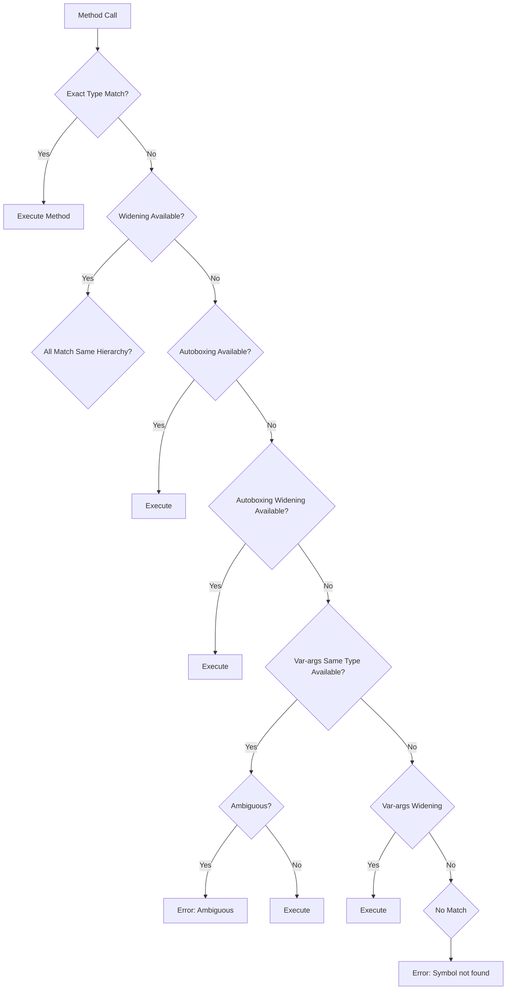

# Session 117: OOP Principles

## Table of Contents
- [Introduction to Method Overloading](#introduction-to-method-overloading)
- [Hierarchical Method Resolution Algorithm](#hierarchical-method-resolution-algorithm)
- [Java 5 Enhancements: Autoboxing and Var-args](#java-5-enhancements-autoboxing-and-var-args)
- [Handling Primitive Arguments](#handling-primitive-arguments)
- [Handling Wrapper Class Arguments](#handling-wrapper-class-arguments)
- [Handling Normal Objects as Arguments](#handling-normal-objects-as-arguments)
- [Ambiguous Errors in Overloading](#ambiguous-errors-in-overloading)
- [Lab Demos and Practice Cases](#lab-demos-and-practice-cases)

## Introduction to Method Overloading
Overloading is a fundamental OOP principle in Java where multiple methods share the same name but differ in their parameter lists. This allows for compile-time polymorphism, where the compiler selects the appropriate method based on the arguments passed.

The session begins with a recap from the previous class, discussing case number three: when the compiler searches for widening type conversions if the exact type match isn't available. Compiler handles this JVM does not throw exception in this case.

### Key Points Recap:
- If the exact argument method is not available, compiler searches for widening; JVM throws exception if widening fails.
- Good practice: Recompile all classes in the project when modifying any class.
- Valid arguments for primitive types like float and double include widening compatible types (e.g., int to float).
- For object types, allowed arguments include the object or its subclasses, default values excluded.

Multiple overloaded methods are demonstrated with parameters of int, long, float, double, Integer (wrapper), etc.

### Primitive Type Relationships:
- `int`, `byte`, `short` are compatible but not widenings between wrapper classes.
- `Integer` and `Long` are sibling classes under `Number`, which extends `Object`.
- Autoboxing converts primitive to wrapper (e.g., `int` to `Integer`).
- `Integer` cannot be autoboxed to `Long` due to sibling relationship.

### Overloaded Methods Example:
```java
void m1(int x);
void m1(long x);
void m1(float x);
void m1(double x);
void m1(Integer x);
// More methods...
```

## Hierarchical Method Resolution Algorithm
When a method is called, the compiler follows a strict hierarchy to match overloaded methods:

1. **Exact Type Match**: Searches for the exact parameter type.
2. **Widening**: If not found, searches widening-compatible types.
3. **Autoboxing**: If not found, attempts autoboxing (primitive to wrapper).
4. **Autoboxing + Widening**: If not found, tries autoboxing followed by widening.
5. **Var-args**: If all above fail, checks var-args (e.g., `int...`).

If multiple methods match at the same level with same hierarchy, ambiguous error occurs. If no matches, "symbol not found" error.

### Algorithm Flow:
- Same Type → Same Type Widening → Autoboxing → Autoboxing Widening → Var-args.

### Prioritization Table:
| Priority Level | Matching Type |
|----------------|----------------|
| 1 | Exact Match |
| 2 | Widening |
| 3 | Autoboxing |
| 4 | Autoboxing + Widening |
| 5 | Var-args Match |
| 6 | Var-args Widening |
| 7 | Autoboxing Var-args |
| 8 | Autoboxing Widening Var-args |

If first 4 combinations fail but var-args combinations exist, ambiguous error if same hierarchy (e.g., both same type var-args and autoboxing var-args match).

Example: Passing `new Integer(5)` first checks `Integer` parameter, then `Number` widening, then `Object` widening, then var-args.

## Java 5 Enhancements: Autoboxing and Var-args
Before Java 5, overloading resolution was limited to 4 combinations. Java 5 added autoboxing and unboxing, expanding to 8 combinations, greatly enhancing polymorphism.

### Autoboxing:
Converting primitive to wrapper (e.g., `int i = 5;` → `Integer iobj = Double.valueOf(5);` compiler-auto).

### Unboxing:
Opposite - wrapper to primitive.

### Var-args:
Introduced `...` syntax (e.g., `int... x` → internally `int[] x`).

Relaxed conditions post-Java 5: No "symbol not found" if double not available; searches wrapper class or var-args first.

**Flowchart:**


## Handling Primitive Arguments
For primitive arguments (e.g., `m1(5);`):
- Priority: `int` → `long` (widening) → `Integer` (autoboxing) → `Number` (autoboxing widening) → `Object` → Var-args.

### Example Demo:
```java
// Methods
void m1(int x);
void m1(long x);
void m1(float x);
void m1(double x);
void m1(Integer x);
void m1(Number x);
void m1(Object obj);

// Code
m1(5); // Executes int param
m1((long)5); // Executes long param
// Comment int and long - searches widening float/double
m1(5.0f); // float if available
// Adding autoboxing searched after widening
```

**Note:** Failing classes require compilation; compiler won't search for widening.

## Handling Wrapper Class Arguments
Passing wrapper objects (e.g., `new Integer(5);`):

1. First: Exact match (Integer param).
2. Then: Widening (Number, Object).
3. Then: Unboxing (int param).
4. Then: Unboxing + Widening (long, float, double).
5. Then: Var-args if needed.

```java
m1(new Integer(5)); // Integer param first
// Comment Integer - Number param
// If all commented, autounboxing to int param (Java 5)
// Wider unboxing next
```

### Var-args Example:
```java
void m1(Integer... x);
// If Integer not available, Number... x (if Integer... matches ambiguous if only one)
```

If same type var-args and autoboxing var-args match, ambiguous error.

## Handling Normal Objects as Arguments
For custom objects (e.g., `new Student();`):
- Up to Java 4: Exact → Widening → Object (if superclass) or error.
- Java 5: Exact → Widening → Object → Var-args.

Student object: `Student` param → `Person` (if superclass) → `Object` → `Student...` var-args.

No autoboxing for normal objects.

## Ambiguous Errors in Overloading
Ambiguous errors occur when multiple methods match equally well, leaving the compiler undecided.

### Causes:
1. **Multiple Widening Matches**: e.g., `m1(int, float)` vs `m1(float, int)` for `m1(5, 6.0f)` - both require only one widening.

```java
void m1(int a, float b); // Match: int a, float b (exact + widening)
void m1(float a, int b); // Match: float a, int b (widening + exact)
// Compiler confused - ambiguous
```

2. **Sibling Classes**: Null passed to sibling params (e.g., `Sample`, `Test` under `Example`) creates ambiguity.

   > [!NOTE]
   > Null matches all reference types but picks most specific if in parent-child, else ambiguous in siblings.

3. **Parent-Child vs Siblings**: Parent-child resolves to child first (exact match). Siblings cause ambiguous if both match.

4. **Null Handling**: `m1(null);` ambiguous if multiple sibling types.

   **Resolution**: Use casting: `(Sample) null` or `(Test) null`.

### Examples:
```java
class Example {}
class Sample extends Example {}
class Test extends Example {}

// Methods
void m1(Example obj);
void m1(Sample obj); // Sibling to Test
void m1(Test obj);

// Code
m1(new Sample()); // Sample param
m1(null); // Ambiguous: Sample or Test?
// Fix: m1((Sample) null);
```

## Lab Demos and Practice Cases
Multiple demos cover all combinations:

### Demo 1: Primitive Arguments
Refer to earlier examples. Practice by commenting methods and observing execution changes.

### Demo 2: Object Arguments
```java
void m1(Person p);
void m1(Student s);

Student sobj = new Student();
m1(sobj); // Student param
// Comment Student method - Person param
// Comment Person - Object param
// Java 5: Unboxing var-args if primitive arrays match
```

### Demo 3: Var-args with Objects
```java
void m1(Person... p); // Person array; `new Student()` → Student array
void m1(Person p);
m1(new Student()); // Person var-args if Person method commented
```

### Demo 4: Mixed Types
Combine primitives, wrappers, objects in overloaded methods.

### Verification Steps:
1. Write overloaded methods.
2. Pass different arguments.
3. Compile and note execution.
4. Introduce ambiguous cases intentionally.
5. Resolve with casting or method commenting.

**Common Setup:**
```java
class A {}
class B extends A {}
class Test {
    void m1(int x);
    void m1(long x);
    // ... other primitives
    void m1(Integer x); // Wrapper
    void m1(A obj);
    void m1(B obj);
    void m1(int... x);  // Var-args
    void m1(B... x);
}
```

Practice outputs for:
- `m1(5);`
- `m1(new Integer(5));`
- `m1(new B());`
- `m1(null);` (ambiguous)

Ensure no steps missed in resolution flow.

## Summary

### Key Takeaways
```diff
+ Overloading enables compile-time polymorphism through method signature variations
+ Compiler follows strict hierarchy: Exact → Widening → Autoboxing → Var-args → Error
+ Java 5 added autoboxing/unboxing and var-args, expanding flexibility
- Ambiguous errors arise from equal-matching methods (e.g., multiple widenings or sibling types)
- Var-args provide fallback but can conflict if conflicts unchecked
+ Practice required for fluent resolution; real-world problems demand precise parameter matching
```

### Expert Insight

**Real-world Application**: Overloading eliminates duplicate code; e.g., logging methods accepting `String`, `int`, `Object[]`. Autoboxing allows seamless primitive-wrapper interchange, crucial in collections pre-generics. Var-args enable flexible APIs (e.g., `Arrays.asList(T...)`). Use casting to resolve ambiguities in multi-type systems (e.g., REST API parameter handling).

**Expert Path**: Deepen understanding via JVM bytecode inspection (`javap -c` to view erased generics, verify var-args internals). Study method resolution in bytecode for optimization. Explore alternatives like method references or functional interfaces for type-targeted overloading.

**Common Pitfalls**: 
- Relying on autoboxing silently; may cause performance hits (primitive boxing overhead).
- Ignoring ambiguous errors; leads to subtle bugs in refactored code.
- Misassigning widening vs. strict assignments; e.g., `byte to short` requires explicit cast.
- Less-known things: Var-args shadowed by exact matches (rare edge cases); null ambiguous with siblings but clear in parent-child hierarchies. Always test boundary values like `null`, `Character` (widens only to `Object`, no `int` autounboxing). Overloading complexity increases with inheritance depth—favor composition over deep hierarchies.

**Mistake and Correction Notification**: Transcript contained "ript" at start (corrected to script context). "Veror" corrected to "var-args". "Wear" to "var-args". "Autox boxing" to "Autoboxing". "Auto unboxing" to "Autounboxing". Minor typos like "integer to" fixed to "Integer". No major technical errors beyond spellings. 

🤖 Generated with [Claude Code](https://claude.com/claude-code)  
Co-Authored-By: Claude <noreply@anthropic.com>
