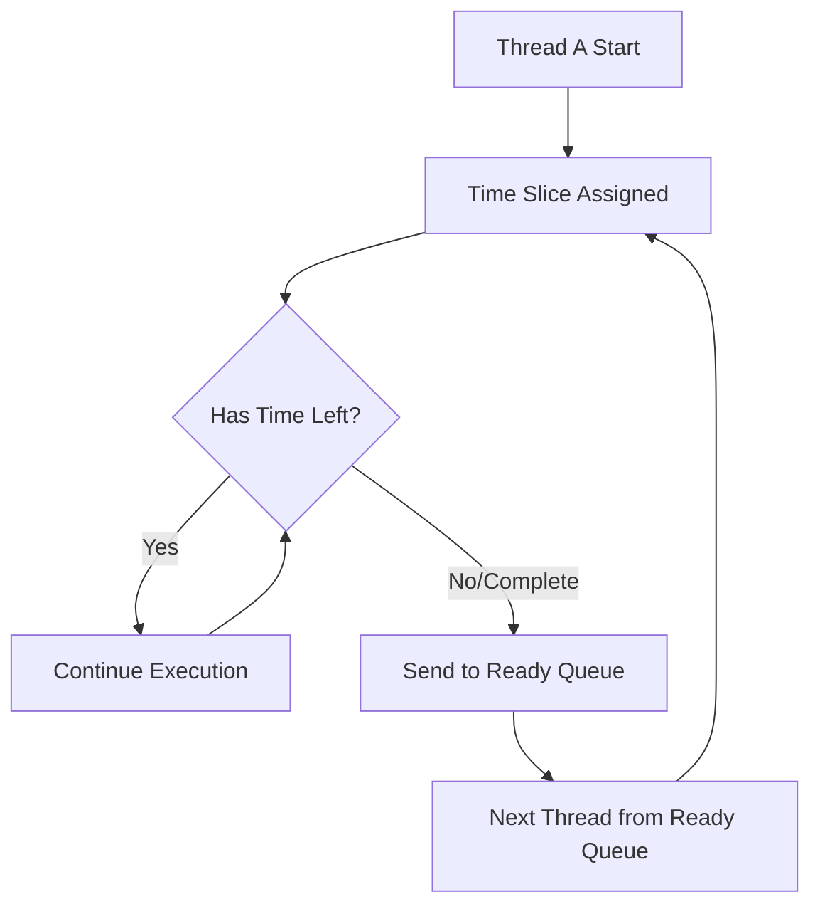

# Session 118: Multithreading

## Table of Contents
- [Thread Life Cycle States Review](#thread-life-cycle-states-review)
- [Thread Execution Algorithms Overview](#thread-execution-algorithms-overview)
- [Thread Scheduling Algorithm](#thread-scheduling-algorithm)
- [Thread Priority Algorithm](#thread-priority-algorithm)
- [Setting and Getting Thread Names](#setting-and-getting-thread-names)
- [Practical Code Demonstrations](#practical-code-demonstrations)
- [Concurrent Thread Modifications](#concurrent-thread-modifications)
- [Summary](#summary)

## Thread Life Cycle States Review

### Overview
In multithreading, threads transition through various states during their lifecycle. Understanding these states is crucial for effective thread management and debugging concurrent applications.

### Key Concepts/Deep Dive

Thread lifecycle states determine when and how threads execute. The core states are:

- **New State**: Thread object created but not yet started
- **Runnable/Ready to Run State**: Thread started, ready for CPU execution
- **Running State**: Thread actively executing on CPU
- **Blocked/Waiting State**: Thread paused, waiting for resources or conditions
- **Terminated/Dead State**: Thread execution completed

**Important Behavior**: Threads do not execute immediately upon start. They must wait for their turn when the currently running thread pauses or completes.

```java
public class ThreadStatesDemo {
    public static void main(String[] args) {
        Thread t1 = new Thread();
        System.out.println("State after creation: " + t1.getState()); // NEW

        t1.start();
        System.out.println("State after start: " + t1.getState()); // RUNNABLE

        try {
            t1.join(); // Wait for thread to complete
            System.out.println("State after completion: " + t1.getState()); // TERMINATED
        } catch (InterruptedException e) {
            e.printStackTrace();
        }
    }
}
```

## Thread Execution Algorithms Overview

### Overview
Thread execution is managed by the operating system's thread scheduler, not Java directly. The JVM provides APIs, but actual scheduling uses native OS capabilities through JNI calls.

### Key Concepts/Deep Dive

Two fundamental algorithms govern thread execution:

- **Thread Scheduling**: Time-based execution allocation
- **Thread Priority**: Priority-based execution ordering

> [!IMPORTANT]
> Thread scheduling and priority are OS-level mechanisms exposed through Java APIs.

**Time Slice Concept**: Each thread receives a CPU time allocation. When exhausted, the thread pauses unless execution completes first.

## Thread Scheduling Algorithm

### Overview
Thread scheduling uses time slice allocation where threads execute concurrently but not simultaneously. Each thread gets CPU time in quantum chunks.

### Key Concepts/Deep Dive

**Algorithm Flow**:
```diff
- Thread enters RUNNING state
- Assigned time slice (e.g., 2 seconds)
- Executes until time slice expires OR task completes
- Paused and sent to READY state
- Next READY thread promoted to RUNNING
- Process repeats until all threads complete
```

**Visual Flow**:


**Key Points**:
- Time slices vary (not user-controllable)
- Multiple threads appear concurrent due to rapid switching
- Continues until all threads terminate

```java
// Demonstrates concurrent execution appearing due to scheduling
public class SchedulingDemo extends Thread {
    public void run() {
        for(int i=1; i<=50; i++) {
            System.out.println("Thread " + Thread.currentThread().getName() + ": " + i);
        }
    }

    public static void main(String[] args) {
        SchedulingDemo t1 = new SchedulingDemo();
        SchedulingDemo t2 = new SchedulingDemo();
        t1.start();
        t2.start();
    }
}
```

## Thread Priority Algorithm

### Overview
Thread priority influences execution order but doesn't guarantee sequence. Higher priority threads typically execute first and receive larger time slices.

### Key Concepts/Deep Dive

**Priority Scale**: 1 (minimum) to 10 (maximum), 5 (normal)

**Algorithm Rules**:
- Higher priority → First execution
- Lower priority → Later execution
- Same priority → Random selection (first-come-first-serve basis)

> [!NOTE]
> Priority affects initial execution order but not completion sequence. Higher priority threads get more CPU time overall.

```java
// Priority demonstration
public class PriorityDemo extends Thread {
    public void run() {
        for(int i=1; i<=10; i++) {
            System.out.println("Thread " + Thread.currentThread().getName() +
                             " (Priority: " + Thread.currentThread().getPriority() + "): " + i);
        }
    }

    public static void main(String[] args) {
        PriorityDemo t1 = new PriorityDemo();
        PriorityDemo t2 = new PriorityDemo();

        t1.setPriority(7);
        t2.setPriority(10);

        t1.start();
        t2.start();
    }
}
```

**Key Methods**:
- `setPriority(int priority)` - Set thread priority (1-10)
- `getPriority()` - Get current thread priority
- Default: Inherits parent thread priority (usually 5)

> [!WARNING]
> Invalid priority values (< 1 or > 10) throw `IllegalArgumentException`

## Setting and Getting Thread Names

### Overview
Threads have string identifiers for programmatic identification. Default naming uses "Thread-N" format, but custom names provide better debugging and tracking.

### Key Concepts/Deep Dive

**Naming Methods**:
- Constructor: `Thread(String name)` or `Thread(Runnable, String name)`
- Runtime: `setName(String name)` and `getName()`

**Default Behavior**:
- Thread-0, Thread-1, etc.
- Unique by default

```java
// Custom naming demonstrations
public class NamingDemo extends Thread {
    public NamingDemo(String name) {
        super(name);
    }

    public void run() {
        System.out.println("Running thread: " + Thread.currentThread().getName());
    }

    public static void main(String[] args) {
        NamingDemo t1 = new NamingDemo("Worker-1");
        NamingDemo t2 = new NamingDemo("Worker-2");

        t1.setName("Renamed-Worker-1"); // Runtime rename

        System.out.println("t1 name: " + t1.getName());
        System.out.println("t2 name: " + t2.getName());

        t1.start();
        t2.start();
    }
}
```

## Practical Code Demonstrations

### Overview
Multiple code examples demonstrate concurrent execution patterns, priority effects, and thread state monitoring.

### Key Concepts/Deep Dive

**Lab Demo 1: Basic Thread Execution**
```java
class MyThread extends Thread {
    public void run() {
        for(int i=1; i<=50; i++) {
            System.out.println(Thread.currentThread().getName() + ": " + i);
        }
    }

    public static void main(String[] args) {
        MyThread mt1 = new MyThread();
        MyThread mt2 = new MyThread();

        mt1.start();
        mt2.start();

        System.out.println("mt1 Priority: " + mt1.getPriority());
        System.out.println("mt2 Priority: " + mt2.getPriority());
    }
}
```

**Lab Demo 2: Priority Modification**
```java
// Continuation showing priority changes
mt1.setPriority(7);
mt2.setPriority(9);

System.out.println("After priority change:");
System.out.println("mt1 Priority: " + mt1.getPriority());
System.out.println("mt2 Priority: " + mt2.getPriority());
```

**Lab Demo 3: Thread Construction with Names**
```java
class NamedThread extends Thread {
    public NamedThread(String name) {
        super(name);
    }

    public void run() {
        for(int i=1; i<=10; i++) {
            System.out.println("Thread " + Thread.currentThread().getName() + " running: " + i);
        }
    }

    public static void main(String[] args) {
        NamedThread t1 = new NamedThread("Child-1");
        NamedThread t2 = new NamedThread("Child-2");

        System.out.println("Initial names:");
        System.out.println("t1: " + t1.getName() + " Priority: " + t1.getPriority());
        System.out.println("t2: " + t2.getName() + " Priority: " + t2.getPriority());

        t1.setName("Renamed-Child-1");
        t1.setPriority(6);
        t2.setPriority(9);

        System.out.println("After modifications:");
        System.out.println("t1: " + t1.getName() + " Priority: " + t1.getPriority());
        System.out.println("t2: " + t2.getName() + " Priority: " + t2.getPriority());

        t1.start();
        t2.start();
    }
}
```

## Concurrent Thread Modifications

### Overview
Multiple threads can modify shared thread object data concurrently, affecting execution behavior.

### Key Concepts/Deep Dive

**Key Behavior**: Threads share objects, so modifications are visible across threads.

```java
public class ConcurrentModDemo extends Thread {
    public void run() {
        try {
            System.out.println("Thread " + Thread.currentThread().getName() +
                             " started with priority: " + Thread.currentThread().getPriority());

            // Modify name and priority while running
            Thread.currentThread().setName("Modified-Thread");
            Thread.currentThread().setPriority(9);

            System.out.println("Inside run - Name: " + Thread.currentThread().getName() +
                             " Priority: " + Thread.currentThread().getPriority());

            Thread.sleep(2000); // Simulate work

            System.out.println("After sleep - Name: " + Thread.currentThread().getName() +
                             " Priority: " + Thread.currentThread().getPriority());
        } catch (InterruptedException e) {
            e.printStackTrace();
        }
    }

    public static void main(String[] args) {
        ConcurrentModDemo mt1 = new ConcurrentModDemo();
        mt1.setName("Initial-Thread");
        mt1.setPriority(5);

        System.out.println("Before start - Name: " + mt1.getName() +
                         " Priority: " + mt1.getPriority());

        mt1.start();

        // Modify from main thread while child thread sleeps
        try {
            Thread.sleep(1000);
            mt1.setName("Main-Modified-Thread");
            mt1.setPriority(10);
            System.out.println("Modified from main thread");
        } catch (InterruptedException e) {
            e.printStackTrace();
        }
    }
}
```

> [!IMPORTANT]
> Thread name and priority modifications are valid at any time post-object creation, even during execution.

> [!WARNING]
> Priority changes after thread termination have no effect.

## Summary

### Key Takeaways
```diff
+ Threads execute via OS scheduler, not JVM directly
+ Thread scheduling uses time slice allocation algorithm
+ Thread priority (1-10) influences but doesn't guarantee execution order
+ Higher priority threads typically complete faster due to larger time slices
+ Thread states transition: New → Runnable → Running → Terminated
+ Thread naming via constructor or setName() method
+ Concurrent object access allows cross-thread modifications
- Priority doesn't guarantee exact execution sequence
- Time slices are OS-determined, not user-configurable
- Same-priority threads execute in random order
```

### Expert Insight

#### Real-world Application
Thread scheduling and priority are critical in:
- Web servers handling concurrent requests
- Game engines managing animation and physics threads
- Database connection pools with multiple worker threads
- CPU-intensive applications optimizing performance

#### Expert Path
- Master `java.util.concurrent` package for advanced scheduling
- Study OS-level thread scheduling (preemptive vs. cooperative)
- Practice thread dumps analysis for production debugging
- Implement custom thread factories for enterprise applications

#### Common Pitfalls
**Issue**: Expecting deterministic thread execution order
**Resolution**: Use proper synchronization constructs (`synchronized`, `Lock`, `Semaphore`)
**Prevention**: Design applications with loose coupling between threads

**Issue**: Priority-based bugs in production
**Resolution**: Avoid prioritizing except for true real-time systems
**Prevention**: Use thread pools and executor services for consistent behavior

**Issue**: Concurrent modification of thread properties
**Resolution**: Document and synchronize shared thread object access
**Prevention**: Minimize mutable shared state between threads

#### Lesser Known Things
- Thread priorities are hints, not guarantees (OS-dependent behavior)
- `setPriority()` accepts integer ranges beyond 1-10 but throws `IllegalArgumentException`
- Thread names support Unicode characters and can be used for logging identification
- Priority inheritance occurs automatically from parent threads
- OS can dynamically adjust thread priorities based on system load

🤖 Generated with [Claude Code](https://claude.com/claude-code)

Co-Authored-By: Claude <noreply@anthropic.com>
