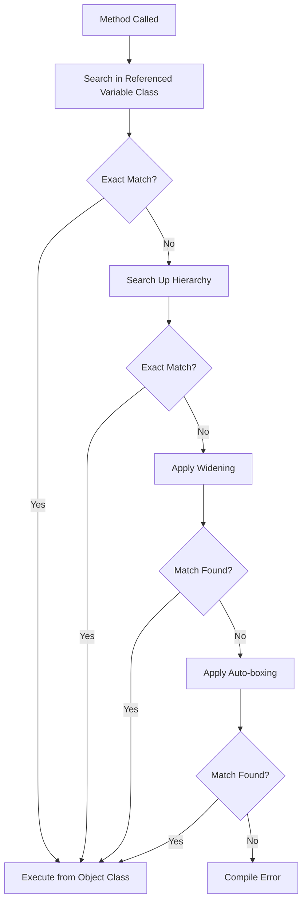

# Session 119: OOP Principles - Method Overloading

## Table of Contents
- [Session Overview](#session-overview)
- [Key Concepts/Deep Dive](#key-conceptsdeep-dive)
- [Code Examples and Test Cases](#code-examples-and-test-cases)
- [Method Execution Flow in Inheritance](#method-execution-flow-in-inheritance)
- [Homework](#homework)
- [Summary](#summary)

## Session Overview

This session covers advanced concepts in Java's method overloading, particularly when dealing with subclass objects, interfaces, and inheritance hierarchies. The focus is on resolving ambiguity errors, understanding compiler behavior with sibling parameters, and the execution flow of overloaded methods across class hierarchies. Building on previous discussions of ambiguous sets, the session explores real-world scenarios where overloading decisions affect program execution.

## Key Concepts/Deep Dive

### Method Overloading Ambiguity with Subclasses

Method overloading ambiguity occurs when the compiler cannot determine which overloaded method to invoke due to multiple matching parameter types. This becomes complex when dealing with subclass relationships.

**Key Points:**
- When passing a subclass object to an overloaded method, the compiler checks if the object's class is a subclass of multiple parameter types
- If the overloaded methods' parameters are "siblings" (related but not hierarchically superior/inferior), ambiguity arises
- Java follows the "most specific match" principle, but when equally specific matches exist, compilation fails

### Cases of Ambiguous Overloading

#### Case 1: Subclass Objects as Arguments
When a class inherits from multiple interfaces or classes that are siblings, passing its object causes ambiguity.

**Example Scenario:**
- Class `C` implements two interfaces `I1` and `I2`
- Overloaded methods take `I1` and `I2` as parameters
- Passing `C` object leads to ambiguous reference error

```java
interface I1 {}
interface I2 {}
class C implements I1, I2 {}

class Test {
    void method(I1 i1) { System.out.println("I1 param"); }
    void method(I2 i2) { System.out.println("I2 param"); }
    
    public static void main(String[] args) {
        Test t = new Test();
        C c = new C();
        t.method(c); // Ambiguous reference error
    }
}
```

#### Resolution:
Cast the object to the specific type or use variables of the desired type.

***Case 2: Null Arguments with Reference Types***
Passing `null` to overloaded methods with sibling parameters causes ambiguity.

#### Case 3: Cross-Hierarchy Ambiguity
When a class derives from one class and one interface that are siblings.

***Overloading with Object Class***
The `Object` class is implicitly the superclass of all classes. When overloading with `Object` and a specific interface:

- If a class implements an interface and is passed to overloaded methods taking `Object` and the interface, the interface method is executed
- Object is considered too general; the compiler prefers more specific types
- Interfaces are implicitly subtypes of `Object`, but the specific interface takes precedence

### Overloaded Method Execution Flow with Inheritance
Overloaded methods can exist across inheritance hierarchies. The execution follows these rules:

1. **Search Priority**: Compiler searches for the exact matching parameter type in the referenced variable class first
2. **Inheritance Search**: If not found, searches up the inheritance hierarchy in the referenced variable class
3. **Widening**: If no exact match, applies widening conversions
4. **Auto-boxing**: Then auto-boxing/unboxing for primitives
5. **Execution**: Once a match is found in the hierarchy, executes from the object's actual class

**Flow Diagram:**


### Combining Overloading and Overriding
When a subclass has both overloaded and overridden methods:

- Overloaded methods execute based on the reference variable type
- Overridden methods execute based on the object type
- Static methods can be hidden, not overridden

| Aspect | Overloading | Overriding |
|--------|-------------|------------|
| Method Signature | Same name, different parameters | Same name, same parameters |
| Inheritance Behavior | Can occur in same class or across inheritance | Must be between superclass and subclass |
| Execution | Based on reference type | Based on object type |
| Static Methods | Supported | Not supported (method hiding) |

## Code Examples and Test Cases

### Test Case 1: Interface Inheritance Ambiguity
```java
interface I1 {}
interface I2 {}
class C implements I1, I2 {}

class Test {
    void method(I1 i) {}
    void method(I2 i) {}
    
    // Ambiguous: C is subtype of both I1 and I2
    // method(new C()); // Error
}
```

### Test Case 2: Class and Interface Siblings
```java
class Alpha {}
interface Beta {}
class Gamma extends Alpha implements Beta {}

class Test {
    void method(Alpha a) {}
    void method(Beta b) {}
    
    // Ambiguous: Gamma is subtype of both Alpha and Beta
    // method(new Gamma()); // Error
}
```

### Test Case 3: Object and Interface Overloading
```java
interface I1 {}
class C implements I1 {}

class Test {
    void method(Object o) { System.out.println("Object param"); }
    void method(I1 i) { System.out.println("I1 param"); }
    
    public static void main(String[] args) {
        Test t = new Test();
        C c = new C();
        t.method(c); // Outputs: I1 param (interface method executed)
    }
}
```

### Test Case 4: Overloading with Inheritance Flow
```java
class A {
    void m1(int i) { System.out.println("A int"); }
    void m1(float f) { System.out.println("A float"); }
}

class B extends A {
    void m1(char c) { System.out.println("B char"); }
    void m1(long l) { System.out.println("B long"); }
}

class Test {
    public static void main(String[] args) {
        B b = new B();
        b.m1(10);    // Search B for int -> not found, search A for int -> executed from A: "A int"
        b.m1('a');   // Search B for char -> found, executed from B: "B char"
        b.m1(10L);   // Search B for long -> found, executed from B: "B long"
    }
}
```

## Method Execution Flow in Inheritance

> [!IMPORTANT]
> When calling overloaded methods in inheritance hierarchies:
> - **Search**: Always starts in the referenced variable's class
> - **Match Priority**: Exact match > Widening > Auto-boxing > Inheritance up the hierarchy
> - **Execution**: From the object's actual class for the matched method

**Illustration Flow:**
```diff
+ Referenced Variable Class (search starts here, inherited methods visible)
- Inheritance Hierarchy (searched upward if needed)
! Matching Algorithms: Exact Match → Widening → Auto-boxing
```

### Primitive vs Reference Type Handling
Reference types follow similar matching but with subtype considerations; primitives use standard primitive promotion rules.

## Homework

Complete the exercises on page 51 and 55 of the material. Practice all test cases involving overloaded method execution with inheritance combinations.

## Summary

### Key Takeaways
```diff
+ Method overloading resolves at compile-time based on the most specific matching parameter
+ Subclass objects cause ambiguous overloads when matching multiple sibling parameters  
+ Object class is too general; specific interfaces take precedence over Object type
+ Overloaded method execution traverses inheritance hierarchy of referenced variable class
+ Combining overloading and overriding requires careful consideration of reference vs object types
+ Interfaces are implicitly subtypes of Object, influencing overloading resolution
```

### Expert Insight

**Real-world Application**: In enterprise Java applications, method overloading with inheritance is commonly used in design patterns like Factory Method and Strategy Pattern. For example, when implementing data access objects (DAOs) that work with different entity hierarchies, overloading allows polymorphic method calls based on parameter types while maintaining type safety.

**Expert Path**: To master overloading in inheritance:
- Always trace the compiler's decision-making process: reference variable hierarchy search before parameter matching
- Understand the difference between method overriding (runtime dispatch) and overloading (compile-time resolution)
- Practice bytecode analysis with `javap -verbose` to see how method signatures are resolved
- Focus on designing APIs where overloads are unambiguous by avoiding sibling parameter types

**Common Pitfalls**
- Confusing overload resolution with override execution rules
- Expecting auto-boxing to apply before widening in mixed primitive/reference scenarios
- Forgetting that `Object` matches everything but is least preferred due to specificity
- Inadequate testing of edge cases where `null` is passed to overloaded methods
- Mixing static (hidden) methods with instance methods in inheritance, causing unexpected behavior

**Lesser Known Things About Method Overloading in Java**:
- The Java Language Specification prioritizes "most specific" methods using a complex algorithm involving subtype relationships
- Varargs methods (`...`) have lower priority than exact matches, even if more parameters are provided
- Method overloading considerations differ between Java 4 (before generics) and Java 5+ (with auto-boxing), potentially breaking legacy code during upgrades
- The compiler's ambiguity checking prevents runtime errors but can make certain valid use cases impossible without explicit casting

### Transcript Corrections Made
> [!NOTE]
> - "subass" corrected to "subclass" throughout
> - "meod" corrected to "method"
> - "param" corrected to "parameter"
> - "super class" spacing fixed to "superclass"
> - "javap hyph verbos" corrected to "javap -verbose"
> - Various grammar and punctuation corrections for clarity
