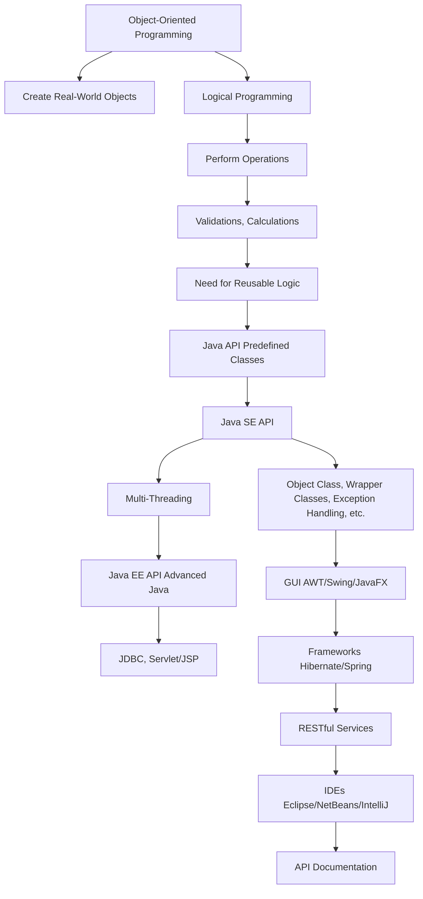

# Session 01: Introduction to Java API

## Table of Contents
- [Overview](#overview)
- [Recap of Previous Sessions](#recap-of-previous-sessions)
- [Need for Java API](#need-for-java-api)
- [Key Concepts of Java SE API](#key-concepts-of-java-se-api)
- [Multi-Threading and Enhancements](#multi-threading-and-enhancements)
- [GUI Application Development](#gui-application-development)
- [Java EE API and Advanced Java](#java-ee-api-and-advanced-java)
- [IDEs and Development Tools](#ides-and-development-tools)
- [API Documentation](#api-documentation)

## Overview
This session introduces Volume 2 of the Core Java course, focusing on Java API and development tools. It provides clarity on the purpose and necessity of Java's Application Programming Interface (API), which consists of predefined classes and logic for common programming tasks. By understanding Java API, developers can build high-performance, scalable, and maintainable applications that align with the targets of object-oriented programming: high cohesion, strong encapsulation, loose coupling, and runtime polymorphism. The session emphasizes moving from manual implementation to leveraging Sun Microsystem's predefined libraries to achieve efficient development.

## Recap of Previous Sessions
By last class, object-oriented programming fundamentals were completed, including the Model-View-Controller (MVC), Layers of Concerns (LCRP), and Java Virtual Machine (JVM) architectures. 
- **Content Covered**: Classes, objects, inheritance, polymorphism, abstraction, encapsulation, coupling, and cohesion.
- **Architectures Practiced**:
  - **MVC Architecture**: Used for designing applications into layers to facilitate parallel development.
  - **LCRP Architecture**: Implemented as the internal design pattern of MVC, enabling loose coupling and runtime polymorphism via reflection API.
- **ActiveForm**: Recapped object-oriented programming concepts and architectures.

## Need for Java API
Object-oriented programming creates real-world objects in code with high cohesion, encapsulation, loose coupling, and runtime polymorphism. However, it focuses on structure; logical programming handles operations like validations and calculations using data types, operators, control statements, arrays, and exception handling. Repetitive logical code across projects led Sun Microsystem to provide predefined libraries.

### Problems Solved by Java API
- **Object Operations**: Common methods in `java.lang.Object` class for identity, comparison, cloning, printing, and finalization.
- **Primitive Data Handling**: Wrapper classes convert strings from keyboard input to primitives (e.g., `Integer`, `Double`, `Boolean`).
- **Error Handling**: Exception handling for invalid inputs, common across projects.
- **String Operations**: String handling for manipulations in login/registration screens.
- **Data Persistence**: IO streams for file operations to store data permanently.
- **Data Collection**: Collections framework for storing multiple values dynamically, replacing arrays.
- **Data Processing**: Stream API and Functional API for efficient collection operations.
- **Networking**: Socket programming for network file interactions.
- **Concurrent Execution**: Multi-threading for parallel tasks, with enhancements like Executor Framework, Fork-Join Framework, concurrent API, locks, semaphores, futures, and CompletableFuture.



**Note**: This Java SE API (in core Java) differs from Java EE API (for enterprise applications with databases and web technologies).

### Differences Between Object-Oriented and Logical Programming
| Aspect | Object-Oriented Programming | Logical Programming |
|--------|------------------------------|---------------------|
| Focus | Structure and Relationships | Operations and Data Processing |
| Examples | Classes, Inheritance, Polymorphism | Data Types, Loops, Conditionals |
| Reusability | Project-Specific | Common Across Projects |

## Key Concepts of Java SE API
Java API provides predefined logic for common tasks in `java.util`, `java.io`, `java.net`, etc. Topics include:
- **Object Class (`java.lang.Object`)**: Base class with methods like `toString()`, `equals()`, `hashCode()`, `clone()`, `finalize()`, `getClass()`.
- **Wrapper Classes**: Eight classes (`Integer`, `Byte`, `Short`, `Long`, `Float`, `Double`, `Character`, `Boolean`) for primitive-to-object conversion.
- **Exception Handling**: Throws exceptions for invalid data inputs.
- **String Handling**: Operations on strings for storage, reading, updating, and validation.
- **IO Streams**: File input/output for permanent data storage.
- **Networking/Socket Programming**: Interacts with network files/systems.
- **Collections Framework**: Stores multiple objects without type/size limitations, with generics support.
- **Stream API and Functional API**: Processes collections with filtering, mapping, and aggregation.

> [!NOTE]
> Core Java covers Java SE API; Advanced Java introduces Java EE API for internet-based applications.

## Multi-Threading and Enhancements
For high performance, Java supports multi-threading to execute tasks concurrently. Without it, applications run slowly on large datasets.

### Benefits
- **Concurrent Execution**: Multiple threads handle requests simultaneously (e.g., Facebook processing thousands of requests).
- **Performance**: Faster data retrieval from collections/databases.

### Enhancements
- **Executor Framework**: Simplifies multi-thread management.
- **Fork-Join Framework**: Enables parallel programming.
- **Concurrent API**: Includes reentrant locks, semaphores, futures, and Java 8's `CompletableFuture`.

## GUI Application Development
CUI (Command-Line Interface) applications are limited; users prefer GUI (Graphical User Interface).

### Technologies
- **Old/Deprecated**: AWT (Abstract Window Toolkit), Applets.
- **Current**: Swing.
- **Modern**: JavaFX (introduced in Java 8).

Develop GUI apps using AWT/Swing/JavaFX alongside core concepts.

## Java EE API and Advanced Java
Java SE API covers standalone apps; Java EE API handles enterprise requirements.

### Need for Advanced Java
- **Data Persistence**: Store data in databases (not just JVM memory).
- **Internet Accessibility**: Make apps accessible via web.
- **Integration**: Interact with databases and web technologies.

### Key Topics
- **JDBC (Java Database Connectivity)**: Interacts with databases.
- **Servlet/JSP**: Web technologies for internet apps.
- **HTML/CSS/JavaScript**: For UI design.
- **Frameworks**:
  - Hibernate: Replaces JDBC for faster DB operations.
  - Spring/Spring Boot: Replaces Servlet/JSP.
  - Angular/React: Replace HTML/JavaScript for reactive UIs.
- **RESTful Services (Modern Web Services)**: Expose APIs to other platforms using JSON (vs. XML in older web services).

> [!IMPORTANT]
> Core Java (Java SE) builds standalone apps; Advanced Java (Java EE) adds database and web capabilities.

## IDEs and Development Tools
Manual coding in editors like EditPlus is for learning fundamentals. For fast development, use IDEs (Integrated Development Environments):
- **Eclipse STS**: Popular for enterprise apps.
- **IntelliJ IDEA**: Advanced for complex projects.
- **NetBeans**: Open-source option.

| IDE | Strengths | Use Case |
|-----|-----------|----------|
| Eclipse | Plugin ecosystem | General Java development |
| IntelliJ IDEA | Refactoring, AI support | Advanced/enterprise |
| NetBeans | Lightweight | Open-source projects |

> [!TIP]
> Start with Eclipse for core development, then explore others.

## API Documentation
API documentation is a reference for classes, methods, constructors, and parameters in Java libraries. Access via Oracle's official documentation to understand usage without source code.

## Summary

### Key Takeaways
```diff
! Java API is predefined Sun Microsystem libraries for common logical tasks.
+ Object-oriented programming creates app structure; logical programming adds operations.
- Without Java API, developers rewrite common code across projects.
+ Java SE API covers core features; Java EE API adds enterprise capabilities.
! Use IDEs for fast development instead of manual editors.
+ Multi-threading enables concurrent execution for performance.
! Frameworks like Hibernate/Spring accelerate advanced app development.
+ API documentation is essential for leveraging predefined classes.
```

### Expert Insight
**Real-world Application**: In production, Java API is ubiquitous—e.g., `Collections` for managing user data in e-commerce, or `IoStreams` for logging persistent data in banking apps. Ensuring loose coupling with APIs allows scalable updates without downtime.

**Expert Path**: Master object-oriented principles first, then deep-dive into Stream API for data processing—it separates concerns like functional programming. Practice multi-threading for high-load apps, using Executor Framework to avoid race conditions.

**Common Pitfalls**: Avoid hardcoding logic like string conversions—use Wrapper classes to prevent ClassCastExceptions. Mistaking IO Streams for Collection Streams can lead to performance bottlenecks; IO Streams handle files, while Collection Streams process in-memory data. Overusing threads without synchronization causes concurrency issues.

**Lesser-Known Things**: Java API's `java.lang.Object` methods like `clone()` are shallow by default—override for deep copies. Stream API's lazy evaluation optimizes performance for large datasets. JavaFX is preferred over Swing for modern UIs due to better styling support.
 
🤖 Generated with [Claude Code](https://claude.com/claude-code)

Co-Authored-By: Claude <noreply@anthropic.com>
