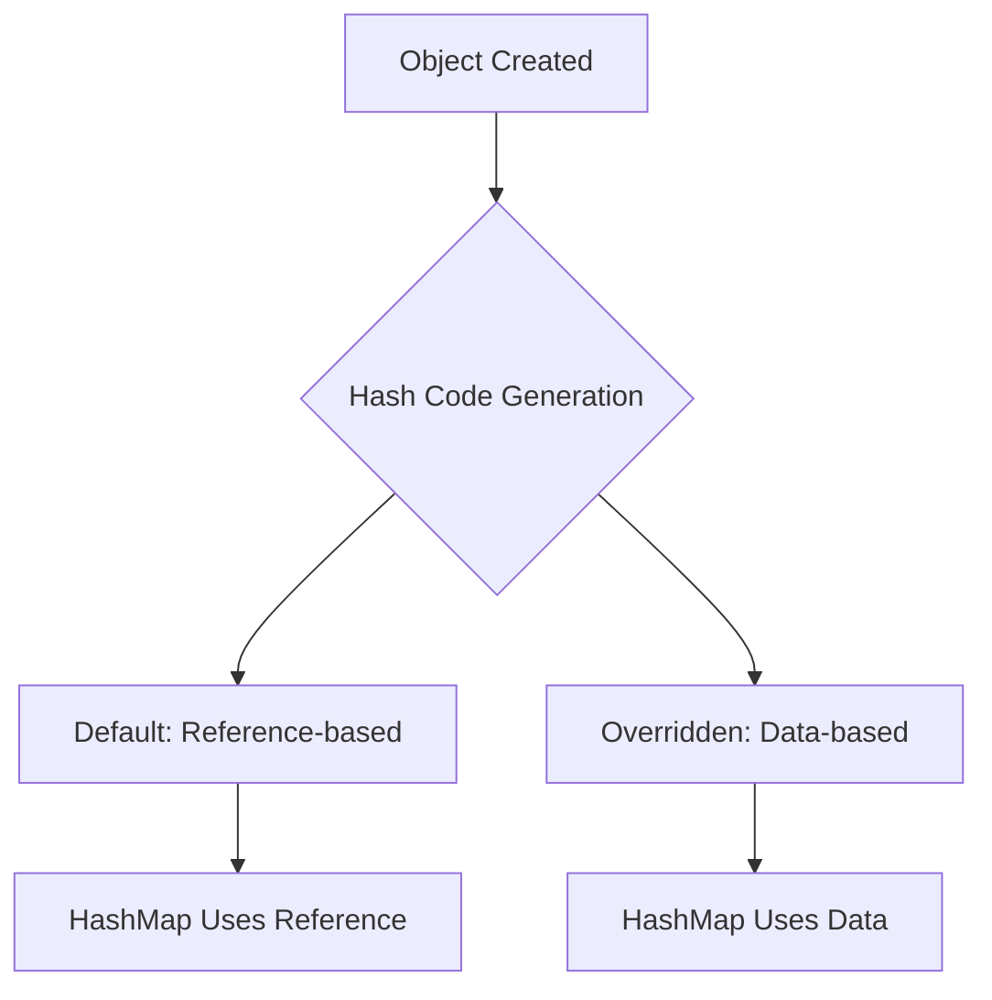

# Session 145: JAVA API 05

- [Overview](#overview)
- [Eclipse Classpath and Build Path](#eclipse-classpath-and-build-path)
- [Creating a POJO Class](#creating-a-pojo-class)
- [Object Differentiation and Identities](#object-differentiation-and-identities)
- [Hash Code Concept](#hash-code-concept)
- [Generating Hash Code](#generating-hash-code)
- [Overriding Hash Code Method](#overriding-hash-code-method)
- [Practical Examples](#practical-examples)
- [Additional Methods and Concepts](#additional-methods-and-concepts)
- [Material Reference](#material-reference)
- [Summary](#summary)

## Overview

This session focuses on Java API fundamentals, specifically the `hashCode()` method from the `java.lang.Object` class. We'll explore how to set classpath in Eclipse, create POJO (Plain Old Java Object) classes, understand object identities, and implement custom hash codes for object differentiation in collections like `HashMap`. Practical demonstrations in Eclipse illustrate key concepts, emphasizing the distinction between reference-based and data-based hash codes.

## Eclipse Classpath and Build Path

### Key Concepts/Deep Dive

In Java development, classpath management varies between command-line and IDE environments. While system environment variables set classpath for command-line execution, Eclipse uses its own "build path" for project-specific libraries.

- **System Classpath**: Effective for command-line runs but ignored by Eclipse.
- **Eclipse Build Path**: Manages project dependencies via the IDE's interface.

Not setting build path correctly leads to `ClassNotFoundException` for external JAR files.

### Code/Config Blocks

#### Setting Build Path in Eclipse

1. Right-click the project → Build Path → Configure Build Path.
2. In the Libraries tab, click "Add External JARs".
3. Select the JAR file (e.g., `project.jar`).
4. Use Ctrl+Shift+O to organize imports and resolve classes.

> [!NOTE]
> Delete unnecessary class files (e.g., `.class` files) before adding external JARs to avoid confusion.

### Lab Demos

```bash
# Example: Managing project structure
# Assuming we have a project with classes: Student.java, Address.java
# 1. Create/verify project structure:
ls -la src/
# 2. Compile if needed (but Eclipse handles build path automatically):
javac -cp project.jar src/Student.java src/Address.java
# 3. In Eclipse:
# - Right-click project → Build Path → Add External JARs → Select project.jar
# - Create College.java with main method
```

**Steps (Explicit)**:
1. Delete old package/classes in Eclipse SRC folder.
2. Create new classes: `Student.java` and `College.java`.
3. Attempt to instantiate objects without external JAR → Compile error.
4. Add external JAR via Build Path.
5. Use Ctrl+Shift+O for auto-import.
6. Run program: `Address` class resolves from JAR.

## Creating a POJO Class

### Key Concepts/Deep Dive

A POJO (Plain Old Java Object) or Bean class encapsulates data with private fields, getters/setters, and a no-argument constructor. It's not fully a bean unless it implements `Serializable` and lacks parameterized constructors.

- **POJO Characteristics**:
  - Private variables for data storage.
  - Public getters/setters for data access/modification.
  - `toString()` method for object representation.

### Code/Config Blocks

```java
public class Student {
    private int sn;
    private String sname;
    private String course;
    private double fee;

    // No-arg constructor (generated by IDE)
    public Student() {}

    // Parameterized constructor (if needed)
    public Student(int sn, String sname, String course, double fee) {
        this.sn = sn;
        this.sname = sname;
        this.course = course;
        this.fee = fee;
    }

    // Getters and Setters
    public int getSn() { return sn; }
    public void setSn(int sn) { this.sn = sn; }
    public String getSname() { return sname; }
    public void setSname(String sname) { this.sname = sname; }
    public String getCourse() { return course; }
    public void setCourse(String course) { this.course = course; }
    public double getFee() { return fee; }
    public void setFee(double fee) { this.fee = fee; }

    // Custom toString()
    @Override
    public String toString() {
        return "Student{" +
                "sn=" + sn +
                ", sname='" + sname + '\'' +
                ", course='" + course + '\'' +
                ", fee=" + fee +
                '}';
    }
}
```

### Lab Demos

**Steps (Explicit)**:
1. In Eclipse, create `Student.java` in SRC.
2. Add private fields: `sn` (int), `sname` (String), `course` (String), `fee` (double).
3. Generate constructor (no-arg), getters/setters, and custom `toString()`.
4. In `College.java` (main class), create objects:
   ```java
   Student s1 = new Student(101, "HK", "Core Java", 2500.0);
   Student s2 = new Student(102, "BK", "Advance", 3500.0);
   Student s3 = new Student(103, "PK", "Oracle", 2000.0);
   ```

## Object Differentiation and Identities

### Key Concepts/Deep Dive

Objects in Java need unique identities for differentiation within groups (e.g., students by course). Identities are generated via:

- **Reference-based**: Unique memory address.
- **Data-based**: Unique based on object state (e.g., student number).

There are two types of identities:
- **Individual Identity**: Unique per object (e.g., `sn`).
- **Group Identity**: Unique per category (e.g., `course`).

## Hash Code Concept

### Key Concepts/Deep Dive

- **Definition**: Hash code is an integer identity assigned to objects, used for separation in collections like `HashMap`.
- **Purpose**: Differentiates objects/groups using reference or data.
- **Default Implementation**: In `Object` class, uses `System.identityHashCode()` (reference-based).

📝 **Key Fact**: If not overridden, hash code is reference-based. Override for data-based differentiation.

### Diagrams



## Generating Hash Code

### Key Concepts/Deep Dive

- **Where Defined**: Override `public int hashCode()` in your class.
- **Ways to Generate**:
  1. Reference-based (default).
  2. Data-based (custom logic).
- **General Contract**:
  - Consistent for same object during execution.
  - Equal objects (per `equals()`) must have equal hash codes.
  - Unequal objects may have equal hash codes (collisions allowed).

### Code/Config Blocks

```java
// Default (Object class) - Reference-based
@Override
public int hashCode() {
    return System.identityHashCode(this);
}

// Data-based Example
@Override
public int hashCode() {
    return Integer.hashCode(sn);  // Based on sn
}

// Or more complex
@Override
public int hashCode() {
    return Objects.hash(sn, sname);  // Based on multiple fields
}
```

## Overriding Hash Code Method

### Key Concepts/Deep Dive

Override `hashCode()` for data-based hashing. Use IDE (Ctrl+Space) or/manual prototype: `public int hashCode()`.

- **Group-based Hashing**: Use `course.hashCode()` for grouping by course.
- **Collisions**: Possible when data matches.

### Code/Config Blocks

```java
// Group-based (by course)
@Override
public int hashCode() {
    return course.hashCode();
}

// Reference-based via super
public int getJVMHashCode() {
    return super.hashCode();
}
```

> [!WARNING] ⚠️ Incorrect casting (e.g., `Integer.parseInt(course)`) can cause `NumberFormatException`.

## Practical Examples

### Key Concepts/Deep Dive

Running the following shows hash codes varying by implementation:
- Default: Reference-based (unique).
- Overridden on `sn`: Same for equal `sn`.
- Overridden on `course`: Same for equal courses.

### Lab Demos

**Steps (Explicit)**:
1. In `College.java`, after creating objects, print hash codes:
   ```java
   System.out.println(s1.hashCode());  // Default or overridden
   System.out.println(s2.hashCode());
   // Copy object: Student s4 = s3; System.out.println(s4.hashCode());  // Same as s3
   // New object with same data: Student s5 = new Student(101, "HK", "Core Java", 2500.0); System.out.println(s5.hashCode());  // Same if data-based
   ```
2. Run and observe outputs.
3. Switch implementations and re-run to demonstrate differences.

### Tables

| Object | Default Hash Code (Reference) | Data-based (sn) | Group-based (course) |
|--------|-------------------------------|-----------------|----------------------|
| s1    | Unique (e.g., 123456)        | 101            | "Core Java".hashCode() |
| s2    | Unique                       | 102            | "Advance".hashCode()  |
| s5 (same data as s1) | Unique                  | 101            | "Core Java".hashCode() |

## Additional Methods and Concepts

### Key Concepts/Deep Dive

- **Identity Hash Code**: Use `System.identityHashCode(obj)` for reference-based code without overriding.
- **Hash vs. Reference**: Similar but not identical concepts.

### Code/Config Blocks

```java
// Get reference-based hash
int jvmHash = System.identityHashCode(s1);
// Equivalent to super.hashCode()
```

## Material Reference

Refer to textbook "Volume 2", Chapter 2, page 22: "Retrieving hash code of an object", "Understanding hash code method".

## Summary

### Key Takeaways

```diff
+ Hash code is an integer identity for objects, essential for HashMap and similar collections.
+ Default hash code uses object reference; override for data-based identity.
- Not overriding leads to reference-based hashing, inappropriate for business data.
! General contract: Same object returns consistent hash code; equal objects have equal hash codes.
+ Override in subclasses to customize logic.
```

### Expert Insight

**Real-world Application**: In enterprise apps, custom hash code enables efficient lookups in `HashSet` or `HashMap` for user sessions, caching, or database entities based on unique fields.

**Expert Path**: Master `hashCode()` with `equals()` override; study `Objects.hash()` for complex objects. Practice with large datasets to understand collision impacts.

**Common Pitfalls**: 
- Not overriding in data classes leads to incorrect behavior in collections.
- Using mutable fields in hash code causes inconsistencies during execution (violates contract).
- Forgetting to import necessary classes (e.g., `Objects`).
- Incorrect logic (e.g., string-to-int parsing) causing exceptions.

Lesser-known things: Hash code collisions are acceptable but reduce performance; `System.identityHashCode` provides stable reference codes even if overridden.

---

CL-KK-Terminal

**Transcript Corrections Noted**: 
- "Asha code" corrected to "hash code" throughout.
- "fo" corrected to "for".
- "nit HK object methods" interpreted as "not HK object methods".
- "Asha" to "hash", "pintz" likely typos removed for clarity. No major technical errors, primarily spelling/typing issues.
