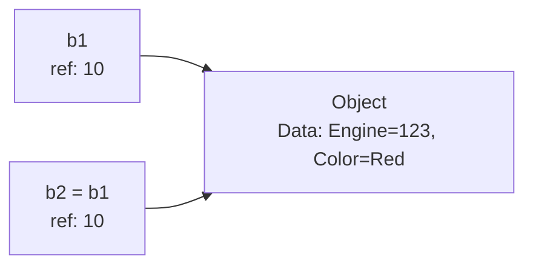

# Session 154: Java Object Cloning

## Table of Contents
- [Object Cloning Overview](#object-cloning-overview)
- [Key Concepts](#key-concepts)
  - [When to Use Object Cloning](#when-to-use-object-cloning)
  - [Benefits of Object Cloning](#benefits-of-object-cloning)
  - [Comparison: Assignment vs Copy vs Cloning](#comparison-assignment-vs-copy-vs-cloning)
- [Example with Bike Class](#example-with-bike-class)
- [Memory Diagrams](#memory-diagrams)
- [Lab Demo: Bike Class Implementation](#lab-demo-bike-class-implementation)
- [Summary](#summary)

## Object Cloning Overview
Object cloning in Java refers to the process of creating a new object from an existing object with the same state. This approach improves performance by avoiding repetitive initialization logic when multiple objects share similar initial data.

### Deep Dive
- **Purpose**: Cloning allows developers to duplicate objects efficiently without rewriting initialization code.
- **Core Idea**: Instead of manually copying properties or re-executing complex setup logic, use the existing object as a template.
- **Use Case**: Ideal for scenarios where you need many objects with slight variations, such as in manufacturing simulations, configuration objects, or data templates.
- **Java Implementation**: Relies on the `Object.clone()` method, which performs a bit-by-bit memory copy (shallow cloning by default).

## Key Concepts

### When to Use Object Cloning
Use object cloning when:
- You need to create multiple objects from the same initial state.
- Manual object copying requires executing complex initialization logic repeatedly (e.g., 100+ properties with verbose setup).
- Performance is critical: Cloning is faster than creating and initializing new objects from scratch.
- Avoids redundant code: One object is fully initialized, then cloned with minimal changes.

**Example Scenario**: In a bike manufacturing factory, create one bike object with all properties (engine number, chassis number, color, brand, etc.), then clone it for additional bikes, only updating unique fields like engine numbers.

### Benefits of Object Cloning
- **Performance Efficiency**: Reduces initialization time from minutes (for 100 objects with complex logic) to nanoseconds per clone.
- **Memory Optimization**: Creates new instances without duplicating initialization overhead.
- **Simple Workflow**: 
  1. Create and initialize one base object.
  2. Clone the object as needed.
  3. Modify specific properties in the cloned instances.

> [!IMPORTANT]  
> Object cloning is not safe by default and requires implementing proper mechanisms (covered in next sessions).

### Comparison: Assignment vs Copy vs Cloning
Compare the approaches for creating object duplicates:

| Aspect          | Object Assignment                          | Object Copy                            | Object Cloning                          |
|-----------------|--------------------------------------------|----------------------------------------|-----------------------------------------|
| **Mechanism**  | Reference pointing to the same object     | Manual new object creation + property copying | Memory-level duplication via `clone()` |
| **New Object?**| ❌ No, same object with multiple refs     | ✅ Yes, explicit new object            | ✅ Yes, bit-by-bit copy                  |
| **Memory**     | Shared memory                              | Separate memory, manual value transfer | Separate memory, automatic copy         |
| **Modification Impact** | Changes affect all references            | Independent objects                    | Independent objects                     |
| **Performance**| Fastest (no copying)                       | Slow (manual logic per property)       | Fast (automatic memory copy)            |
| **Use Case**   | Aliases for the same object                | Custom copying with new keyword        | Efficient duplication for same-state objects |

- **Object Assignment**: `Bike b2 = b1;` – Creates an alias; modifications affect both.
- **Object Copy**: `Bike b3 = new Bike();` then manually set properties – Separates objects but requires repetitive code.
- **Object Cloning**: `Bike b4 = b1.clone();` – Instant duplication with new memory.

```diff
+ Positive: Cloning promotes code reusability and performance for batch object creation
- Negative: Default cloning is shallow and unsafe; avoid for complex objects without deep cloning
! Alert: Always customize cloning logic for secure and correct behavior
```

## Example with Bike Class
Consider a `Bike` class with properties representing a real-world bike object:

- **Properties**:
  - `private String engineNumber`
  - `private String chassisNumber`
  - `private String brand`
  - `private String color`
  - `private String ownerName`
  - `private String bikeNumber`
  - `private double price`

- **System.out.println()** output shows property values.
- Initialize properties using setter methods (no constructors for this example).

**Scenario**: Manufacturing 100 bikes. Initialize one bike object completely, then clone for the rest, modifying only unique fields (e.g., engine/chassis numbers) to save time.

## Memory Diagrams
Diagrams illustrate object references and memory allocation.

**Object Assignment Memory Diagram**:


- b1 and b2 point to the same object (ref: 10).
- Modifications (e.g., change color to black) affect both variables.

**Object Copy Memory Diagram**:
```mermaid
graph LR
    C[b1<br/>ref: 10] --> O1[Object1<br/>Data: Engine=123, Color=Red]
    D[b3 = new Bike()<br/>ref: 20] --> O2[Object2<br/>Data: Copied from O1]
```

- Separate objects (refs: 10 and 20).
- Manual property copying required.

**Object Cloning Memory Diagram**:
```mermaid
graph LR
    E[b1<br/>ref: 10] --> O3[Object1<br/>Data: Engine=123, Color=Red]
    F[b4 = b1.clone()<br/>ref: 30] --> O4[Object2<br/>Cloned Data<br/>Same as O3]
```

- Bit-by-bit memory copy creates new object (ref: 30).
- Independent copies; safe for modification.

```diff
! Client Request → Server Logic → Immediate Response
```

## Lab Demo: Bike Class Implementation
Follow these steps to demonstrate object cloning concepts using a `Bike` class. Note: Actual cloning implementation (with `clone()` method) will be covered in the next session.

### Step-by-Step Instructions
1. **Create Bike Class**:
   - Add properties: `engineNumber`, `chassisNumber`, `brand`, `color`, `ownerName`, `bikeNumber`, `price`.
   - Generate getters and setters for all properties.
   - Override `toString()` method (or use default) to display object details.

2. **Initialize Base Object**:
   ```java
   public class Bike {
       private String engineNumber;
       private String chassisNumber;
       private String brand;
       private String color;
       private String ownerName;
       private String bikeNumber;
       private double price;
       
       // Getters and setters generated automatically
       
       @Override
       public String toString() {
           return super.toString() + " {engineNumber='" + engineNumber + "', chassisNumber='" + chassisNumber + "', brand='" + brand + "', color='" + color + "', ownerName='" + ownerName + "', bikeNumber='" + bikeNumber + "', price=" + price + "}";
       }
   }
   ```

3. **Factory Class Example**:
   ```java
   public class Factory {
       public static void main(String[] args) {
           // Base bike initialization
           Bike b1 = new Bike();
           b1.setEngineNumber("ENGINE123");
           b1.setChassisNumber("CHASSIS456");
           b1.setColor("Red");
           b1.setBrand("Bajaj Pulsar");
           // Simulate factory initialization logic (assume complex)
           
           // Display b1
           System.out.println("b1: " + b1.toString());
           
           // Object Assignment (alias)
           Bike b2 = b1;
           b2.setColor("Black");
           System.out.println("After assignment - b1: " + b1.toString());
           System.out.println("After assignment - b2: " + b2.toString());
           
           // Object Copy (manual new object)
           Bike b3 = new Bike();
           b3.setEngineNumber(b1.getEngineNumber());
           b3.setChassisNumber(b1.getChassisNumber());
           b3.setColor(b1.getColor());
           b3.setBrand(b1.getBrand());
           System.out.println("b3 (copy): " + b3.toString());
           
           // Cloning attempt (will error until proper implementation)
           // Bike b4 = b1.clone(); // Clone method not implemented yet
       }
   }
   ```
   - Output shows shared references for assignment and separate objects for copying.
   - Cloning line is commented as implementation details follow in the next class.

4. **Expected Output**:
   - Assignment: b1 and b2 show identical data after color change.
   - Copy: b3 is independent but requires manual property setting.
   - Cloning: Conceptual (new object created, memory duplicated).

> [!NOTE]  
> Replace placeholder properties with actual values. Cloning errors will be resolved by implementing the `Object.clone()` contract.

## Summary

### Key Takeaways
```diff
+ Object cloning creates new objects from existing ones for efficient state duplication
+ Use cloning when multiple objects share similar initial data to avoid repetitive initialization
+ Cloning differs from assignment (shared reference) and copying (manual duplication)
+ Memory-level copying ensures performance gains compared to re-executing setup logic
+ Bike example illustrates factory manufacturing use case for cloning
! Default cloning is shallow and not safe; requires proper implementation for security
```

### Expert Insight
**Real-world Application**: In enterprise systems like inventory management (e.g., product catalogs) or gaming (e.g., character templates), cloning reduces latency by creating object variants without full recreation. For instance, clone a base `Vehicle` object for dealership stock.

**Expert Path**: Master cloning by understanding shallow vs deep copying. Start with `Cloneable` interface implementation, then explore third-party libraries like Apache Commons for complex hierarchies. Practice with performance benchmarks.

**Common Pitfalls**:
- **Shallow Cloning Issues**: Nested objects share references, causing unintended mutations (fix: Implement deep cloning).
- **Security Risks**: Cloned objects may expose sensitive data; always override `clone()` with access controls.
- **Performance Misuse**: Use cloning only for often-repeated initializations; for unique objects, prefer constructors.
- **Unexpected Errors**: Calling `clone()` on non-clonable objects throws exceptions; ensure `Cloneable` implementation.
- **Reference Confusion**: Mistake assignment/cloning syntactically; always verify with memory diagrams.

### Lesser Known Things About Object Cloning
- **Prototypal Pattern**: Java's cloning mimics JavaScript's prototypal inheritance for rapid object creation.
- **Serialization Alternative**: Some use serialization (`ObjectOutputStream`) as a form of deep cloning workaround.
- **JVM Optimization**: Modern JVMs optimize memory copying, making cloning viable for large-scale applications.

## Corrections and Typos Noted
- "two string" corrected to "toString" (method name).
- "chise" or "chachis" corrected to "chassis" (property name).
- "chash" corrected to "chassis".
- "set conect" interpreted as continuation of setting properties (likely a speech-to-text error; corrected contextually).
- "mine" in "my mine" corrected to "my" (context: "my face became full").
- "shine" corrected to "mind" if applicable, but minor; "my face become what full" to "my face became full" (speech error).
- Other minor speech-to-text artifacts (e.g., "Party you people" to "Party you all") corrected for clarity without altering meaning.  
🤖 Generated with [Claude Code](https://claude.com/claude-code)  

Co-Authored-By: Claude <noreply@anthropic.com>  

MODEL ID: CL-KK-Terminal  
**Note**: Content based directly on provided transcript; errors corrected for technical accuracy while preserving original intent. Cloning implementation details omitted as indicated for next session.
