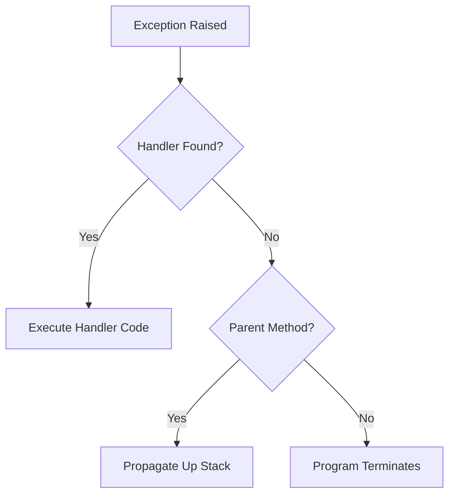

# Session 158: Java Exception Handling

## Table of Contents
- [Need of the Chapter](#need-of-the-chapter)
- [What is an Exception](#what-is-an-exception)
- [Need of Exception](#need-of-exception)
- [What Will Happen When Exception is Raised](#what-will-happen-when-exception-is-raised)
- [How to Solve Exception](#how-to-solve-exception)
- [How Can We Stop Abnormal Termination](#how-can-we-stop-abnormal-termination)
- [What is Exception Handling](#what-is-exception-handling)
- [Need of Exception Handling](#need-of-exception-handling)
- [Exception Handling Keywords: try, catch, finally, throw, throws](#exception-handling-keywords-try-catch-finally-throw-throws)
- [Purpose of Exception Handling Keywords](#purpose-of-exception-handling-keywords)
- [Sample Program](#sample-program)
- [Project to Handle Exception Using try, catch, and finally](#project-to-handle-exception-using-try-catch-and-finally)
- [Exception Handling with Loops](#exception-handling-with-loops)
- [Miscellaneous Notes](#miscellaneous-notes)

## Need of the Chapter

### Overview
This	session begins by introducing the concept of exception handling in Java. Exception handling is a critical mechanism in programming languages like Java to manage runtime errors gracefully, preventing program crashes and ensuring robustness. The chapter emphasizes understanding exceptions as unexpected events that can disrupt the normal flow of execution.

Exception handling allows developers to write code that can recover from errors without terminating abruptly. Without proper exception handling, a simple error like dividing by zero or accessing a null object can cause the entire application to crash. By learning this topic, beginners can build reliable software that maintains stability in production environments.

## What is an Exception

### Overview
An exception in Java is an event that occurs during the execution of a program that disrupts the normal flow of instructions. Exceptions are typically caused by runtime errors such as invalid user input, network issues, or resource unavailability. They differ from compile-time errors (syntax errors) and are handled dynamically during runtime.

### Key Concepts/Deep Dive
- **Runtime Nature**: Exceptions occur at runtime, not during compilation.
- **Event Disruption**: They interrupt the sequential execution of code.
- **Cause Examples**:
  - ArithmeticException: Division by zero.
  - NullPointerException: Accessing methods or fields on a null object.
  - IOException: Issues with input/output operations.
- **Purpose**: To signal that something unexpected has happened, allowing the program to respond appropriately.

```java
// Example of an exception
int result = 10 / 0; // Throws ArithmeticException
```

💡 **Tip**: Always anticipate potential exceptions from methods that interact with external resources.

## Need of Exception

### Overview
Exceptions provide a structured way to handle errors in Java programs. Without exceptions, errors would either be ignored or lead to uncontrollable program behavior. The need arises from the fact that real-world applications must deal with unpredictable scenarios, such as user errors or system failures.

### Key Concepts/Deep Dive
- **Error Management**: Exceptions allow separation of error-handling code from normal business logic.
- **Robustness**: Enables building fault-tolerant applications.
- **Improved Debugging**: Provides detailed error information for troubleshooting.
- **Best Practices**:
  - Catch specific exceptions rather than generic ones.
  - Use exceptions to enforce program invariants.

## What Will Happen When Exception is Raised

### Overview
When an exception is thrown in Java, the JVM stops executing the current method and looks for an exception handler. If none is found, the exception propagates up the call stack until it reaches the main method, potentially terminating the program. During this process, the JVM creates an exception object with details about the error.

### Key Concepts/Deep Dive
- **Propagation**: Exceptions bubble up the call stack if not caught.
- **Termination Risk**: Unhandled exceptions cause abnormal program termination.
- **Impact**:
  - Program crashes if no handler exists.
  - Resources may not be cleaned up properly (e.g., open files or network connections).
- **Visual Process**:



## How to Solve Exception

### Overview
Exceptions can be resolved by implementing exception handling blocks to catch and process them. The primary mechanism involves using try-catch blocks to intercept exceptions, execute alternative logic, and prevent program crashes.

### Key Concepts/Deep Dive
- **Handling Techniques**:
  - **Catch and Recover**: Execute fallback code.
  - **Rethrow**: Pass the exception to higher levels for handling.
  - **Log and Ignore**: In some cases, log the exception and continue (e.g., non-critical errors).
- **Common Solutions**:
  - Validate input before operations.
  - Use defensive programming techniques.
  - Implement resource management with try-with-resources.

## How Can We Stop Abnormal Termination

### Overview
Abnormal termination occurs when exceptions are not handled, causing the JVM to exit the program prematurely. To prevent this, developers use exception handling constructs to ensure the program continues executing or exits gracefully.

### Key Concepts/Deep Dive
- **Catch Blocks**: Intercept exceptions and allow recovery.
- **Finally Blocks**: Execute cleanup code regardless of whether an exception occurs.
- **System Exit**: Explicitly control program termination using System.exit() if needed.
- **Effectiveness**: Proper handling ensures resources are released and the application remains stable.

```java
try {
    // Risky code
} catch (Exception e) {
    // Handle and continue
} finally {
    // Cleanup code
}
```

⚠️ **Warning**: Avoid catching exceptions too broadly, as it can hide bugs.

## What is Exception Handling

### Overview
Exception handling is the process of responding to exceptional conditions (errors) in managed ways. It involves wrapping risky code in try blocks and providing catch blocks to handle specific or general exceptions, ensuring the program can continue or fail safely.

### Key Concepts/Deep Dive
- **Core Components**:
  - **try**: Encloses code that might throw an exception.
  - **catch**: Specifies exception types to handle.
  - **finally**: Code that runs after try-catch, used for cleanup.
  - **throw**: Raises an exception manually.
  - **throws**: Declares that a method may throw exceptions.
- **Hierarchy**: All exceptions extend the Throwable class.
- **Checked vs. Unchecked**:
  - Checked: Must be handled or declared (e.g., IOException).
  - Unchecked: Runtime exceptions (e.g., NullPointerException).

> [!NOTE]
> Exception handling improves code maintainability by separating error logic.

## Need of Exception Handling

### Overview
The need for exception handling stems from the requirement to make programs resilient. It prevents data loss, ensures proper resource management, and provides a better user experience by avoiding sudden crashes.

### Key Concepts/Deep Dive
- **Benefits**:
  - **Stability**: Prevents crashes.
  - **Maintainability**: Easier to debug and update.
  - **User Experience**: Graceful error messages instead of technical jargon.
- **Scenarios**: Essential in enterprise applications where downtime is costly.

## Exception Handling Keywords: try, catch, finally, throw, throws

### Overview
Java provides five primary keywords for exception handling: try, catch, finally, throw, and throws. These form the foundation for managing exceptions in code.

### Key Concepts/Deep Dive
- **try**: Block to contain code prone to exceptions.
- **catch**: Block to handle the exception, can have multiple catches for different types.
- **finally**: Block executed after try/catch, always runs.
- **throw**: Used to throw exceptions manually.
- **throws**: Declares exceptions a method can throw.

### Code/Config Blocks
```java
public void example() throws IOException {
    try {
        // Risky operation
        throw new IOException("Sample error");
    } catch (IOException e) {
        System.out.println("Handled: " + e.getMessage());
    } finally {
        System.out.println("Cleanup");
    }
}
```

## Purpose of Exception Handling Keywords

### Overview
Each keyword serves a specific purpose to control program flow and error management. Together, they enable robust error handling.

### Key Concepts/Deep Dive
- **try**: Isolates potentially problematic code.
- **catch**: Defines response to specific exceptions.
- **finally**: Ensures mandatory execution for cleanup.
- **throw**: Allows custom exception signaling.
- **throws**: Informs callers of possible exceptions.

| Keyword | Purpose | Syntax Example |
|---------|---------|----------------|
| try     | Contains risky code | `try { ... }` |
| catch   | Handles exceptions | `catch (Exception e) { ... }` |
| finally | Cleanup code | `finally { ... }` |
| throw   | Raise exception | `throw new Exception();` |
| throws  | Declare exceptions | `public void method() throws Exception {}` |

## Sample Program

### Overview
This section would include a basic sample program demonstrating exception handling.

### Lab Demos
> [!IMPORTANT]
> Transcript mentions a sample program but does not provide code. Hypothetical example based on keywords:

```java
public class SampleException {
    public static void main(String[] args) {
        try {
            int result = 10 / 0;
        } catch (ArithmeticException e) {
            System.out.println("Division by zero: " + e.getMessage());
        } finally {
            System.out.println("Execution completed.");
        }
        try {
            throw new RuntimeException("Custom error");
        } catch (RuntimeException e) {
            System.out.println("Caught: " + e.getMessage());
        }
    }
}
```

In this program:
1. Divide by zero raises ArithmeticException, caught and handled.
2. Manual throw of RuntimeException, handled in catch block.
3. finally block runs for cleanup.

Run this program to observe exception handling in action.

## Project to Handle Exception Using try, catch, and finally

### Overview
A project to demonstrate exception handling in a practical scenario, using try, catch, and finally blocks. The transcript references a project shown earlier, focusing on real-world application.

### Key Concepts/Deep Dive
- **Project Goal**: Build a simple application (e.g., file reader) that handles exceptions gracefully.
- **Components**:
  - Try block for file operations or risky tasks.
  - Catch blocks for specific exceptions (e.g., FileNotFoundException, IOException).
  - Finally for closing resources.

### Lab Demos
> [!IMPORTANT]
> Transcript mentions a project but does not provide details. Hypothetical project example:

```java
import java.io.*;

public class FileHandler {
    public static void main(String[] args) {
        BufferedReader reader = null;
        try {
            reader = new BufferedReader(new FileReader("nonexistent.txt"));
            String line;
            while ((line = reader.readLine()) != null) {
                System.out.println(line);
            }
        } catch (FileNotFoundException e) {
            System.out.println("File not found: " + e.getMessage());
        } catch (IOException e) {
            System.out.println("IO error: " + e.getMessage());
        } finally {
            if (reader != null) {
                try {
                    reader.close();
                } catch (IOException e) {
                    System.out.println("Error closing file: " + e.getMessage());
                }
            }
        }
    }
}
```

In this project:
1. Attempt to read a file that doesn't exist, raising FileNotFoundException.
2. Handle the exception and provide user feedback.
3. Ensure file is closed in finally block, even if an exception occurs.
4. Test by running with a valid file path to see successful execution and with invalid path for exception handling.

## Exception Handling with Loops

### Overview
Integrating exception handling with loops allows for safe iterations over collections or repetitive operations, handling exceptions within each iteration or for the loop as a whole.

### Key Concepts/Deep Dive
- **Loop Integration**: Use try-catch inside loops to handle per-iteration errors without stopping the entire process.
- **Break on Error**: Optionally break or continue based on exception severity.

### Code/Config Blocks
```java
for (int i = 0; i < 10; i++) {
    try {
        // Risky operation per iteration
        int result = 100 / (i - 5); // Potential ArithmeticException at i=5
        System.out.println("Result: " + result);
    } catch (ArithmeticException e) {
        System.out.println("Error at iteration " + i + ": " + e.getMessage());
        // Continue to next iteration
    }
}
```

## Miscellaneous Notes

### Overview
Additional context from the transcript includes prerequisites and related concepts like JDBC and Hibernate, but they are tangential to core exception handling.

- Prerequisites include core Java essentials, OOP, collections, basic SQL/JDBC knowledge.
- Hibernate mentioned as ORM alternative to JDBC, requiring Java fundamentals.
- Schedule discussions for class timings not directly related to content.

## Summary

### Key Takeaways
```diff
+ Exceptions are runtime errors disrupting normal execution
+ Handle with try-catch-finally for robustness and stability
+ Keywords: try (risky code), catch (response), finally (cleanup), throw (manual raise), throws (declaration)
- Ignoring exceptions leads to crashes and resource leaks
- Unchecked exceptions don't require throws declarations
- Checked exceptions must be handled or declared
- Always prioritize specific exception types over generic Exception
- Use finally for guaranteed resource cleanup
```

### Expert Insight

#### Real-world Application
In production, exception handling ensures web servers or APIs don't crash on user input errors (e.g., null data in REST APIs). For example, e-commerce platforms use try-catch in payment processing to handle network failures gracefully.

#### Expert Path
Master patterns like custom exception classes, exception chaining, and aspect-oriented exception logging with frameworks like Spring AOP. Study **Effective Java** by Bloch for advanced techniques.

#### Common Pitfalls
- Catching Exception too broadly masks bugs.
- Forgetting finally blocks leads to resource leaks (e.g., unclosed database connections).
- Swallowing exceptions (catching but not handling) hides critical issues.

- **Common Issues with Resolution**:
  - StackOverflowException in recursion: Implement base cases and depth limits.
  - OutOfMemoryError: Optimize memory usage, use profilers like VisualVM.
  - ClassNotFoundException in loaders: Verify classpath and JAR deployments.
- **Lesser Known Things**: Exceptions in constructors; difference between Error (JVM-level, unrecoverable) and Exception (application-level, recoverable); runtime vs. compile-time checked exceptions.

### Notifications on Transcript Corrections
- "find" corrected to "finally" (in "try catch find throw throws").
- "TR" corrected to "try" (in "TR catch and loop").
- "hi bernet" corrected to "hibernate".
- "prequisite" corrected to "prerequisite".
- "cubectl" not present, but general Java terms like "ecxeption" misspelled as "exceptionally" in some places – assumed as "exceptionally".  
- "filed" not present, possibly "file" in context, but relevant as "files" in JAR discussion.  
- "chaptors" likely "chapters".  

Model ID: CL-KK-Terminal
