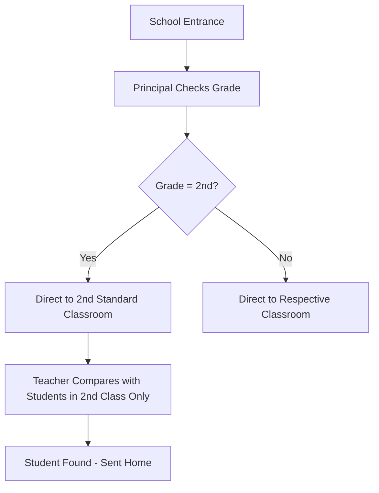

# Session 159: HashMap Internals

## Table of Contents
- [Overview](#overview)
- [Recap: HashMap Basics](#recap-hashmap-basics)
- [HashMap Internal Memory Diagram](#hashmap-internal-memory-diagram)
- [HashMap Storing Algorithm](#hashmap-storing-algorithm)
- [School Analogy for HashMap](#school-analogy-for-hashmap)
- [Why Override hashCode and equals](#why-override-hashcode-and-equals)
- [Test Case: Without Overriding hashCode and equals](#test-case-without-overriding-hashcode-and-equals)
- [Summary](#summary)

## Overview
This session dives deep into HashMap internals, explaining how Java's HashMap uses hash codes, the double equals operator (==), and the equals method for efficient storage, retrieval, and manipulation of key-value pairs. We'll explore the internal memory diagram, understand bucket creation, and see why proper implementation of hashCode and equals methods is crucial for data integrity.

## Recap: HashMap Basics
Yesterday we discussed HashMap's fundamental operations using three key components for handling duplicate objects:

- **hashCode method**: Groups objects with the same hash code together
- **Double equals operator (==)**: Performs reference comparison for unique object checking
- **equals method**: Performs data-wise comparison when references are different

HashMap uses these for storing, searching, retrieving, and removing objects efficiently.

## HashMap Internal Memory Diagram
HashMap internally uses a hash table data structure that relies on buckets (implicitly LinkedList collections). Let's trace through the diagram to understand the process:

### Initial State
- HashMap `hm = new HashMap()` creates an empty table
- No buckets exist initially; they are created dynamically as elements are added

### Adding Elements Process
1. **First Put Operation**: `hm.put("say", 1)`
   - Key "say" calls `hashCode()` → returns 97 (ASCII value)
   - Table checks for existing 97 bucket → none found
   - New bucket 97 created with key reference and value 1 stored

2. **Duplicate Key with Same Reference**: `hm.put("a", 2)` (assuming "a" has hash code 97)
   - hashCode() → 97
   - Bucket 97 found
   - == operator compares references → true (same literal pooling reference)
   - Value replaced from 1 to 2 (key not added)

3. **Duplicate Key with Different Reference**: `hm.put(new String("a"), 3)`
   - hashCode() → 97
   - Bucket 97 found
   - == operator → false (different objects)
   - equals() method → true (data-wise same)
   - Key not added, value replaced from 2 to 3

4. **New Hash Code**: `hm.put("B", 4)`
   - hashCode() → 98
   - New bucket 98 created
   - Object stored directly (no comparisons needed)

5. **Different Reference, Same Hash Code**: `hm.put(new Integer(97), 5)`
   - hashCode() → 97
   - Bucket 97 found with 2 existing objects
   - Loop through bucket: compare with existing keys
   - == and equals() both false → new entry added to same bucket 97

## HashMap Storing Algorithm
Here's the complete algorithm HashMap follows for storing objects:

```diff
+ Algorithm for Storing Objects in HashMap:
+ 1. Call hashCode() on the key
+ 2. Check if bucket with that hash code exists
+     - If NO: Create new bucket → Store key-value pair (no further comparisons)
+     - If YES: Enter comparison loop for all objects in that bucket
+         a. == operator (reference comparison) with existing keys
+         b. If == returns true → Duplicate found → Replace value
+         c. If == returns false → Call equals() method (data comparison)
+             - If equals() true → Duplicate found → Replace value
+             - If equals() false → Unique object → Add to bucket
+ 3. Performance benefit: Comparisons only within same hash code bucket
```

**Key Points:**
- **hashCode()**: Groups objects to minimize comparisons
- **== operator**: Fast reference check
- **equals()**: Thorough data comparison when references differ
- Execution speed increases as hash code distribution improves

## School Analogy for HashMap
Imagine a school as a HashMap:

- **School (HashMap)**: Contains classrooms (buckets) with students (key-value pairs)
- **Principal at Main Door**: Monitors students entering (represents hashCode grouping)
- **Pune (Peon)**: Searches for specific students in appropriate classrooms only



**Problem Without HashMap:**
- Pune would search EVERY classroom (comparing 100+ students)
- Slower execution, more comparisons, poor performance

**HashMap Benefits:**
- **Decreases comparisons**: Search only in specific "grade buckets"
- **Fast retrieval**: Groups same hash code objects together
- **Performance**: Exponential speed improvement in read/write operations

**Collection Selection Guide:**
- **List**: Use for storing + retrieving (no frequent searching)
- **LinkedList**: Use for frequent insertions/removals at specific positions
- **Map (HashMap)**: Use for frequent search/retrieval operations

## Why Override hashCode and equals
Standard Java classes need proper hashCode and equals implementation for collection compatibility.

### Problem Class Example:
```java
public class Ex {
    private int x;
    private int y;
    
    public Ex(int x, int y) {
        this.x = x;
        this.y = y;
    }
    
    @Override
    public String toString() {
        return "Ex(" + x + "," + y + ")";
    }
    
    // ❌ hashCode and equals NOT overridden
}
```

**Issues Without Overrides:**
- Objects stored/retrieved by reference only (not content)
- Data-wise duplicates allowed in Sets/Maps
- Search/remove operations fail with new reference objects having same data
- Poor performance and unexpected behavior

## Test Case: Without Overriding hashCode and equals
**HashSet Example:**
```java
HashSet<Ex> hs = new HashSet<>();
// Adding 9 objects with different references
hs.add(new Ex(5,6));
hs.add(new Ex(7,8));
hs.add(new Ex(6,5));
hs.add(new Ex(7,4));
hs.add(new Ex(1,2));
hs.add(new Ex(3,2));
hs.add(new Ex(5,7));  // E7
hs.add(new Ex(5,7));  // Duplicate of E7

// Analysis:
- 8 objects stored (1 duplicate prevented by == operator)
- 8 buckets created (each object gets unique reference/hash code)
- No equals() method calls executed ever
- == operator prevents only exact reference duplicates
```

**Outcome:** Data-wise duplicates stored, poor search performance, unexpected collection behavior.

## Summary

### Key Takeaways
```diff
+ HashMap uses hash table with buckets (LinkedList internally)
+ hashCode() groups objects to minimize comparisons
+ == operator for fast reference checking
+ equals() method for deep data comparison
- Never use HashMap without proper hashCode/equals override
! Performance depends on good hash code distribution
```

### Expert Insight

**Real-world Application:**
In enterprise applications, HashMap powers:
- Database query result caching
- User session management
- Configuration storage
- High-performance in-memory data structures

**Expert Path:**
- Master hash code distribution algorithms for optimal load factors
- Understand ConcurrentHashMap for thread-safe operations
- Study HashMap vs TreeMap performance trade-offs
- Learn custom hash functions for domain objects

**Common Pitfalls:**
- Forgetting to override both hashCode and equals together
- Inconsistent hash codes for equal objects (violates contract)
- Poor hash code distribution causing bucket overflow
- Using mutable keys (hash code changes break retrieval)
- Null key handling in custom implementations

**Lesser Known Things:**
- Default HashMap capacity is 16 (buckets), not elements
- HashMap allows one null key but multiple null values
- hashCode() collisions increase search time linearly
- Load factor (0.75) triggers automatic rehashing
- Buckets resize from LinkedList to Balanced Tree at TREEIFY_THRESHOLD (8 elements)
