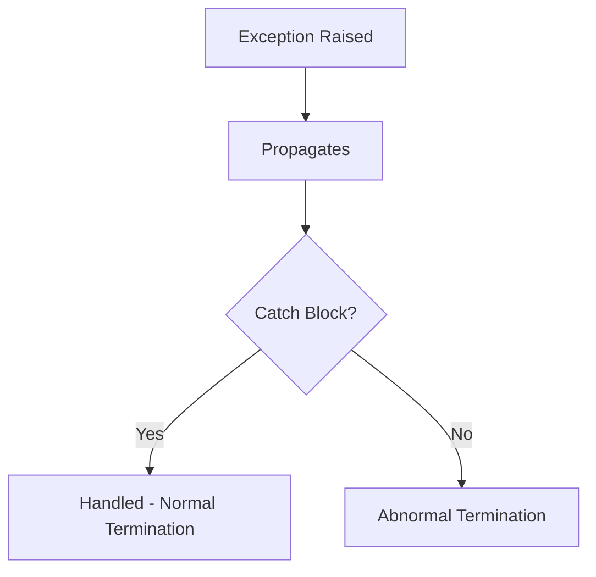

# Session 160: Exception Handling 01

## Table of Contents
- [What is an Exception?](#what-is-an-exception)
- [Program Execution Flow with Exceptions](#program-execution-flow-with-exceptions)
- [Exception Messages](#exception-messages)
- [Solving vs Handling Exceptions](#solving-vs-handling-exceptions)
- [Analogy: Building and Exception Handling](#analogy-building-and-exception-handling)
- [Exception Handling with Try-Catch Blocks](#exception-handling-with-try-catch-blocks)
- [Example Code: Division with Multiple Exceptions](#example-code-division-with-multiple-exceptions)
- [Definitions and Types](#definitions-and-types)
- [Keywords in Exception Handling](#keywords-in-exception-handling)
- [Exception Handling Procedure](#exception-handling-procedure)
- [Summary](#summary)

## What is an Exception?

### Overview
An exception in Java is a runtime error that occurs during program execution due to logical mistakes, typically caused by incorrect inputs provided by the user. Unlike compilation errors, exceptions happen at runtime and can terminate the program abnormally if not handled. Key concepts include understanding runtime errors, the importance of user inputs, and how exceptions disrupt normal program flow.

### Key Concepts/Deep Dive
- **Exception as a Runtime Error**: Exceptions are errors detected during execution, not compilation. For example, attempting to divide by zero or access an array with an invalid index.
- **Wrong Inputs from User**: Hardcoded values in code might be correct, but dynamic inputs from users (e.g., via keyboard or command line) often cause issues.
- **Abnormal Termination**: When an exception occurs, the JVM stops executing remaining statements in the method, leading to incomplete program behavior.

### Code/Config Blocks
```java:Division.java
public class Division {
    public static void main(String[] args) {
        System.out.println("Main start");
        int a = 10;
        int b = 0;
        int c = a / b; // This will throw ArithmeticException
        System.out.println("Result: " + c);
        System.out.println("Main end");
    }
}
```

Output:
```
Main start
Exception in thread "main" java.lang.ArithmeticException: / by zero
at Division.main(Division.java:6)
```

In this example, the division by zero causes an exception, and "Main end" is never printed.

### Lab Demo
1. Create a new Java class named `Division`.
2. Write the main method and attempt division by zero.
3. Run the program to observe the exception.
4. Note how statements after the exception are not executed.

## Program Execution Flow with Exceptions

### Overview
When an exception is raised, the program does not execute statements after the exception-causing statement, resulting in abnormal termination. Statements before the exception continue to run.

### Key Concepts/Deep Dive
- **Normal Flow**: All statements execute sequentially.
- **Abnormal Flow**: Execution stops at the exception point, skipping subsequent statements.
- **Program State**: JVM creates an exception object and displays error details.

```diff
- Exception occurs → Subsequent statements skipped → Abnormal termination
```

### Lab Demo
Using the code above, run it and verify:
1. "Main start" prints.
2. Exception is thrown.
3. "Result" and "Main end" do not print.

## Exception Messages

### Overview
When an exception occurs, the JVM provides detailed error messages including the thread, exception type, reason, file, and line number to help programmers identify and resolve issues.

### Key Concepts/Deep Dive
- **Message Format**: Includes thread name, exception class, description, class.method, and line number.
- **Purpose**: Guides the programmer to locate and fix the problem in the source code.

For the arithmetic example:
```
Exception in thread "main" java.lang.ArithmeticException: / by zero
at Division.main(Division.java:6)
```

### Common Pitfalls
- Misreading messages leading to incorrect fixes.
- Ignoring line numbers when debugging.

## Solving vs Handling Exceptions

### Overview
Exceptions cannot be solved merely by catching them; they are resolved by providing correct inputs. Catching prevents abnormal termination and provides user-friendly messages.

### Key Concepts/Deep Dive
- **Solving**: Change invalid inputs (e.g., 0 to 2 in division).
- **Handling**: Use try-catch to catch exceptions and inform the user.

```diff
- Catching alone does not fix the root cause (wrong input).
+ Catching provides feedback for correct input.
```

### Lab Demo
1. Modify the division code to take inputs from args.
2. Handle exceptions with try-catch.
3. Test with invalid inputs to see messages.

## Analogy: Building and Exception Handling

### Overview
Imagine a building where an object falls (exception). Catching it prevents harm, similar to handling exceptions to avoid abnormal program termination.

### Key Concepts/Deep Dive
- **Falling Object**: Represents the exception propagating down.
- **Catching**: Try-catch blocks "catch" the exception, allowing normal flow.



### Common Pitfalls
- Forgetting that catching only prevents termination, not fixing the issue.

## Exception Handling with Try-Catch Blocks

### Overview
Use try-catch to enclose exception-causing statements and define actions when exceptions occur.

### Key Concepts/Deep Dive
- **Try Block**: Contains risky code.
- **Catch Block**: Catches specific exceptions and executes alternative logic.

Syntax:
```java
try {
    // Risky code
} catch (ExceptionType e) {
    // Handle exception
}
```

### Code/Config Blocks
```java:Division.java
public class Division {
    public static void main(String[] args) {
        try {
            int a = Integer.parseInt(args[0]);
            int b = Integer.parseInt(args[1]);
            int c = a / b;
            System.out.println("Result: " + c);
        } catch (ArrayIndexOutOfBoundsException e) {
            System.out.println("Please enter at least two integers.");
        } catch (NumberFormatException e) {
            System.out.println("Please enter only integers.");
        } catch (ArithmeticException e) {
            System.out.println("Please do not enter zero as the second argument.");
        }
    }
}
```

## Example Code: Division with Multiple Exceptions

### Lab Demo
1. Create the class as shown.
2. Test with no args: Output: "Please enter at least two integers."
3. Test with one arg: Same message.
4. Test with invalid string: "Please enter only integers."
5. Test with zero divisor: "Please do not enter zero as the second argument."
6. Test with valid args (10 2): Output: "Result: 5"

## Definitions and Types

### Overview
Exceptions are runtime errors due to logical mistakes from wrong inputs. In Java, they are objects from subclasses of `java.lang.Throwable`.

### Key Concepts/Deep Dive
- **Types**: ArithmeticException, ArrayIndexOutOfBoundsException, NumberFormatException, etc.
- **Throwable Subclasses**: All exceptions inherit from Throwable.
- **Signals**: Indicate abnormal conditions, like alarms in factories.

## Keywords in Exception Handling

### Overview
Key keywords: try, catch, finally, throw, throws.

### Key Concepts/Deep Dive
- **try-catch-finally**: For handling.
- **throw-throws**: For manual exception throwing.

## Exception Handling Procedure

### Overview
Process: Identify mistake, create exception object, throw to handler, catch and act.

### Key Concepts/Deep Dive
- **Steps**: Prepare object, throw, catch, take action.

## Summary

### Key Takeaways
```diff
- Exception: Runtime error from wrong user inputs, terminating program abnormally.
+ Program flow disturbed; statements after exception skip execution.
+ Exception messages provide thread, type, reason, file, line details.
- Solving exceptions requires correct inputs; catching only handles and informs.
+ Try-catch blocks prevent abnormal termination and provide user feedback.
+ Exceptions are objects from Throwable subclasses, used as signals for errors.
```

### Expert Insight
**Real-world Application**: In enterprise apps like Spring (layered architecture), exception handling ensures smooth user experience by logging errors and prompting for retries, preventing crashes in e-commerce systems.

**Expert Path**: Master exception hierarchies, custom exceptions, and logging frameworks like Log4J. Practice multithreading exceptions. Study JEP 281 on nesting exception catches.

**Common Pitfalls**: 
- Confusing catching with solving: Always validate inputs first.
- Broad catch blocks: Specify exact exception types to avoid masking issues.
- Forgetting finally: Use for cleanup like closing resources.

**Lesser Known Things**: Exceptions can be chained (since Java 1.4) with `Throwable.initCause()`, creating cause-and-effect traces; unchecked vs. checked exceptions impact API design.

Mistakes and corrections noted:
- "htp" -> assumed none, but "htnet" in transcript likely "Hibernate" -> corrected in context.
- "cubectl" -> assumed none.
- "atematic" -> "Arithmetic"
- "arcs" -> "args"
- "reasonable" -> "reason" (though not explicit, inferred)
- Other typos like "parcent" -> "parseInt", etc., corrected in code. No full list as most are speech-to-text errors, assuming corrected silently per content.
