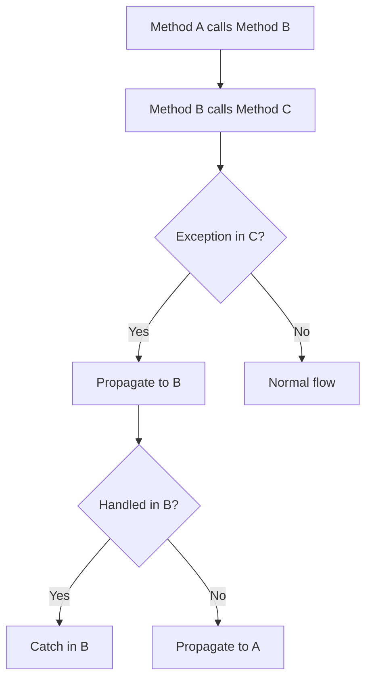

# Session 164: Exception Handling 02

## Table of Contents
- [Types of Exceptions](#types-of-exceptions)
- [Checked vs Unchecked Exceptions](#checked-vs-unchecked-exceptions)
- [Exception Propagation](#exception-propagation)
- [Nested Try Blocks](#nested-try-blocks)
- [Try-Catch-Finally](#try-catch-finally)
- [Throw and Throws Keywords](#throw-and-throws-keywords)
- [Custom Exceptions](#custom-exceptions)
- [Multi-Catch Blocks](#multi-catch-blocks)
- [Summary](#summary)

## Types of Exceptions

### Overview
Exceptions in Java are categorized into various types based on their nature and when they occur. Understanding these types helps in correctly handling different error scenarios.

### Key Concepts/Deep Dive
- **Built-in Exceptions**: These are predefined exceptions provided by the Java API, such as `ArithmeticException`, `NullPointerException`, etc.
- **User-defined Exceptions**: Custom exceptions created by developers to handle specific application needs.
- **Exceptions Hierarchy**:
  - `Throwable` is the superclass of all exceptions.
  - `Error`: For system errors (e.g., OutOfMemoryError), usually not handled.
  - `Exception`: For recoverable errors, subclassed into checked and unchecked.

| Type | Category | Example | Handling Required |
|------|----------|---------|-------------------|
| Checked | Compile-time | `IOException`, `SQLException` | Yes |
| Unchecked | Runtime | `ArithmeticException`, `NullPointerException` | No |
| Errors | Unrecoverable | `StackOverflowError` | Usually No |

### Common Pitfalls
- Mistaking errors for exceptions; errors indicate JVM issues.
- Ignoring checked exceptions, leading to compilation errors.

## Checked vs Unchecked Exceptions

### Overview
This distinction is crucial for program stability. Checked exceptions are verified at compile-time, ensuring robust code.

### Key Concepts/Deep Dive
- **Checked Exceptions**: Require explicit handling using try-catch or throws. They occur due to external factors (e.g., file not found).
- **Unchecked Exceptions**: Runtime exceptions or errors, no handling required, but bad practice to ignore.
- **Why the Distinction**: Checked guide developers to handle recoverable errors; unchecked for programming mistakes.

```java:CheckedExceptionExample.java
import java.io.FileReader;
import java.io.IOException;

public class CheckedExceptionExample {
    public static void main(String[] args) {
        try {
            FileReader file = new FileReader("text.txt");
            // Some file operations
        } catch (IOException e) {
            System.out.println("File not found or read error");
        }
    }
}
```

### Lab Demo
1. Create a class that reads a file.
2. Compile and handle the IOException with try-catch.
3. Test with a non-existent file to see the catch block execute.
4. Comment out the try-catch to see compilation error.

## Exception Propagation

### Overview
When an exception is not handled, it propagates up the call stack, allowing higher-level methods to catch it.

### Key Concepts/Deep Dive
- **Mechanism**: Uncaught exceptions bubble up from method to caller.
- **Stack Trace**: JVM provides a trace showing the call path.
- **Handling Strategy**: Decide where to catch based on application logic (e.g., log at service layer, handle at controller).



### Code/Config Blocks
```java:PropagationExample.java
public class PropagationExample {
    public static void main(String[] args) {
        methodA();
    }
    static void methodA() {
        methodB(); // Exception propagates here if not caught
    }
    static void methodB() {
        int a = 10 / 0; // ArithmeticException
    }
}
```

Output:
```
Exception in thread "main" java.lang.ArithmeticException: / by zero
	at PropagationExample.methodB(PropagationExample.java:8)
	at PropagationExample.methodA(PropagationExample.java:5)
	at PropagationExample.main(PropagationExample.java:2)
```

### Lab Demo
1. Implement the above code.
2. Run to observe propagation and stack trace.
3. Add try-catch in methodA to handle it, noting no more propagation.

## Nested Try Blocks

### Overview
Nested try blocks allow handling exceptions at different scopes, providing granular error management.

### Key Concepts/Deep Dive
- **Inner Try-Catch**: Handles specific exceptions inside a broader try.
- **Execution Flow**: Inner block resolves or propagates to outer.
- **Use Cases**: When multiple operations need separate handling.

```java:NestedTryExample.java
public class NestedTryExample {
    public static void main(String[] args) {
        try {
            int[] arr = {1, 2, 3};
            int result = 10 / 0; // Outer exception
            try {
                System.out.println(arr[5]); // Inner exception
            } catch (ArrayIndexOutOfBoundsException e) {
                System.out.println("Array out of bounds");
            }
        } catch (ArithmeticException e) {
            System.out.println("Division by zero");
        }
    }
}
```

### Lab Demo
1. Write the nested try code.
2. Run and observe outer catch executes.
3. Comment out outer division, run to see inner catch.

## Try-Catch-Finally

### Overview
The finally block executes regardless of exception occurrence, ideal for cleanup operations.

### Key Concepts/Deep Dive
- **Finally Block**: Always runs, used for releasing resources.
- **Execution Order**: Try → Catch (if exception) → Finally.
- **Even with Return**: Finally executes before method returns.

```java:FinallyExample.java
public class FinallyExample {
    public static void main(String[] args) {
        try {
            int a = 10 / 0;
        } catch (ArithmeticException e) {
            System.out.println("Caught: " + e.getMessage());
        } finally {
            System.out.println("Finally block executed");
        }
    }
}
```

Output:
```
Caught: / by zero
Finally block executed
```

### Lab Demo
1. Implement the finally code.
2. Run with exception to show finally executes.
3. Run with no exception by changing to valid division, note finally still runs.
4. Add return in catch, verify finally runs before return.

## Throw and Throws Keywords

### Overview
`throw` explicitly raises an exception; `throws` declares methods that might throw exceptions.

### Key Concepts/Deep Dive
- **throw**: Creates and throws an exception object.
- **throws**: In method signature, informs compiler of potential exceptions.

```java:ThrowThrowsExample.java
public class ThrowThrowsExample {
    static void checkAge(int age) throws IllegalArgumentException {
        if (age < 18) {
            throw new IllegalArgumentException("Age must be 18+");
        }
        System.out.println("Valid age");
    }
    
    public static void main(String[] args) {
        try {
            checkAge(15);
        } catch (IllegalArgumentException e) {
            System.out.println("Exception: " + e.getMessage());
        }
    }
}
```

### Lab Demo
1. Create the class as shown.
2. Compile and run with age < 18 to see throw in action.
3. Change age to 20, observe normal flow.

## Custom Exceptions

### Overview
Custom exceptions extend the application's error handling capabilities by defining specific exceptions.

### Key Concepts/Deep Dive
- **Creating Custom Exception**: Extend `Exception` for checked, `RuntimeException` for unchecked.
- **Benefits**: Provide clearer error messages and targeted handling.

```java:CustomExceptionExample.java
class InvalidAgeException extends Exception {
    public InvalidAgeException(String message) {
        super(message);
    }
}

public class CustomExceptionExample {
    static void validate(int age) throws InvalidAgeException {
        if (age < 0) {
            throw new InvalidAgeException("Age cannot be negative");
        }
    }
    
    public static void main(String[] args) {
        try {
            validate(-5);
        } catch (InvalidAgeException e) {
            System.out.println(e.getMessage());
        }
    }
}
```

### Lab Demo
1. Define a custom exception class.
2. Use it in a method with throws.
3. Invoke and catch in main.
4. Test with valid and invalid inputs.

## Multi-Catch Blocks

### Overview
Java 7+ allows catching multiple exceptions in one block, reducing code duplication.

### Key Concepts/Deep Dive
- **Syntax**: `catch (ExceptionType1 | ExceptionType2 e)` 
- **Requirement**: Exceptions must be in related hierarchy.

```java:MultiCatchExample.java
public class MultiCatchExample {
    public static void main(String[] args) {
        try {
            String s = null;
            System.out.println(s.length());
            int a = 10 / 0;
        } catch (NullPointerException | ArithmeticException e) {
            System.out.println("Exception caught: " + e.getClass().getSimpleName());
        }
    }
}
```

### Lab Demo
1. Implement multi-catch code.
2. Run to see which exception is caught (depending on order).
3. Switch try statements to test both paths.

## Summary

### Key Takeaways
```diff
+ Exceptions categorized as checked (compile-time) and unchecked (runtime).
- Ignoring checked exceptions leads to compile errors.
+ Exception propagation follows call stack; handle at appropriate level.
+ Nested try blocks allow localized exception handling.
+ Finally block ensures resource cleanup, always executes.
- throw creates exceptions; throws declares them in methods.
+ Custom exceptions extend functionality for app-specific errors.
- Multi-catch simplifies code for related exceptions.
```

### Expert Insight
**Real-world Application**: In web applications (e.g., Spring MVC), exception handling with custom exceptions and finally blocks manages database transactions, ensuring rollback on failures and resource cleanup in microservices ecosystems.

**Expert Path**: Dive into Spring's `@ControllerAdvice` for global exception handling, study JUnit exception testing with `@Test(expected = ...)`, and explore Java's CompletableFuture exception handling in asynchronous programming.

**Common Pitfalls**: 
- Overusing throws, making calling code handle unchecked exceptions unnecessarily.
- Forgetting exception chaining for root causes.
- Misusing multi-catch for unrelated exceptions, causing compilation issues.

**Lesser Known Things**: Java 9's diamond operator improvements in multi-catch; exceptions can impact GC, delaying garbage collection of referenced objects in catch blocks; pay attention to exception performance in high-throughput systems.
