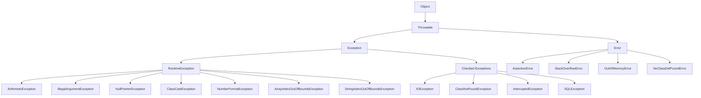

# Session 8: Exceptions Handling

## Table of Contents
- [Exception Handling Rules: Throw and Throws Keywords](#exception-handling-rules-throw-and-throws-keywords)
- [Types of Exceptions](#types-of-exceptions)
- [Checked vs Unchecked Exceptions](#checked-vs-unchecked-exceptions)
- [Differences Between Error and Exception](#differences-between-error-and-exception)
- [Summary](#summary)

## Exception Handling Rules: Throw and Throws Keywords

### Overview
In Java exception handling, the throw keyword is used to explicitly throw an exception, while throws is used in method signatures to declare exceptions that a method might throw. Understanding the rules for when and where these keywords can be used is crucial for proper exception management in Java programs.

### Key Concepts/Deep Dive
- **Throw vs Throws**: Throw is used to throw an exception instance, while throws declares potential exceptions in method signatures.
- **Restrictions on throw keyword:**
  - Cannot use throw at class level (outside methods) - compiler error: "throw not allowed here"
  - Cannot use throw in static initializer blocks - compiler error: "initializer must be able to complete normally"
  - Cannot use throw in instance initializer blocks - same restriction as static blocks
  - Cannot use throw in variable declarations
- **Allowed uses of throw:**
  - In static blocks with try-catch (terminates normally via catch)
  - In instance blocks with try-catch (terminates normally via catch)
  - In constructors
  - In method bodies
  - Cannot use throw in method declarations (compilation errors)
- **After throw keyword:**
  - Must throw a Throwable object (not regular classes)
  - No statements allowed after throw (it's a transfer statement)
  - If you need multiple exceptions, use separate conditional blocks
- **Example of incorrect placement:**
  ```java
  class Example {
      throw new ArithmeticException(); // Compiler error: illegal start of type
  }
  ```
- **Example of correct placement:**
  ```java
  class Example {
      void method(int x) {
          if (x < 0) {
              throw new IllegalArgumentException();
          } else if (x == 0) {
              throw new ArithmeticException();
          } else {
              System.out.println("Valid value");
          }
      }
  }
  ```

### Lab Demos
The transcript includes an example program demonstrating throw and throws rules:

```java
public class ThrowRulesDemo {
    // throws in method signature - ALLOWED
    public static void method() throws ArithmeticException {
        // throw in method body - ALLOWED
        throw new ArithmeticException("Division by zero");
    }
    
    // throw in constructor - ALLOWED
    public ThrowRulesDemo() throws Exception {
        throw new Exception("Constructor exception");
    }
    
    // Cannot use throw at class level - COMPILER ERROR
    // throw new ArithmeticException(); // Illegal start of type
    
    static {
        // throw in static block without try-catch - COMPILER ERROR
        // throw new RuntimeException(); // Initializer must be able to complete normally
    }
    
    // Can use throw in static block with try-catch - ALLOWED
    static {
        try {
            throw new RuntimeException("Static block exception");
        } catch (RuntimeException e) {
            System.out.println("Caught in static block");
        }
    }
}
```

## Types of Exceptions

### Overview
Java's exception hierarchy, rooted in the Throwable class, categorizes exceptions into three main types: Error, RuntimeException, and Checked Exceptions. This classification helps developers understand how different exception types should be handled based on their nature and origin.

### Key Concepts/Deep Dive
- **Throwable Hierarchy**
  - Superclass: Object
  - Implements: Serializable
  - Two main subclasses: Error and Exception

**Complete Exception Hierarchy Diagram:**



- **Error Types** (JVM internal problems):
  - AssertionError
  - StackOverflowError  
  - OutOfMemoryError
  - NoClassDefFoundError
  - NoSuchFieldError
  - NoSuchMethodError
  - ClassFormatError

- **RuntimeException Types** (API/programming errors):
  - ArithmeticException (division by zero)
  - IndexOutOfBoundsException
    - ArrayIndexOutOfBoundsException
    - StringIndexOutOfBoundsException
  - ClassCastException
  - NumberFormatException
  - NullPointerException
  - IllegalArgumentException

- **Checked Exception Types** (External resources):
  - IOException (File I/O issues)
  - ClassNotFoundException (Class loading issues)
  - InterruptedException (Thread interruption)
  - SQLException (Database issues)

- **Checked Exceptions Classification**:
  - Partially checked exceptions (some subclasses unchecked)
  - Pure checked exceptions (direct subclasses of Exception)

- **Exception Causes**:
  1. JVM internal problems → Error
  2. API level problems (wrong inputs/logic) → RuntimeException
  3. Missing external resources → Checked Exceptions

## Checked vs Unchecked Exceptions

### Overview
The distinction between checked and unchecked exceptions determines whether the compiler enforces exception handling. Checked exceptions must be handled, while unchecked exceptions are optional.

### Key Concepts/Deep Dive

| Aspect | Checked Exceptions | Unchecked Exceptions |
|--------|-------------------|---------------------|
| **Definition** | Compiler checks handling; must catch or declare | Compiler doesn't check; handling optional |
| **Base Classes** | Direct subclasses of Exception (except RuntimeException) | Error and RuntimeException subclasses |
| **When Raised** | External resource issues (I/O, database, etc.) | JVM problems or programming errors |
| **Handling Required** | Yes - catch or declare in throws | No - can be ignored |
| **Examples** | IOException, SQLException, ClassNotFoundException | ArithmeticException, NullPointerException, OutOfMemoryError |

### Rules for Determining Checked/Unchecked
- Compiler checks: `instanceof Error` or `instanceof RuntimeException`
- If neither, it's checked
- Must handle checked exceptions or compilation fails

```java
// Unchecked exception - no handling required
public void method1(int x) {
    if (x == 0) {
        throw new ArithmeticException("Division by zero"); // RuntimeException subclass
    }
}

// Checked exception - handling required
public void method2() throws IOException {
    FileInputStream fis = new FileInputStream("file.txt"); // IOException is checked
}

// Or catch it
public void method3() {
    try {
        FileInputStream fis = new FileInputStream("file.txt");
    } catch (IOException e) {
        // Handle exception
    }
}
```

## Differences Between Error and Exception

### Overview
Errors and Exceptions both extend Throwable, but they represent fundamentally different problems. Errors indicate unrecoverable JVM issues, while Exceptions represent recoverable code-level problems.

### Key Concepts/Deep Dive

- **Recoverability**:
  - **Errors**: Generally unrecoverable, represent JVM-level problems
    - Cannot proceed after catching; must terminate JVM
    - Examples: StackOverflowError, OutOfMemoryError, NoClassDefFoundError
  - **Exceptions**: Recoverable, represent application-level problems
    - Can catch and continue execution
    - Examples: IOException, ArithmeticException, SQLException

- **Purpose**:
  - **Errors**: JVM internal problems (memory, stack, linking)
  - **Exceptions**: Java code problems (logic, input validation, resources)

- **Handling Strategy**:
  - **Errors**: Usually not caught (no benefit)
  - **Exceptions**: Should be caught to allow graceful continuation

- **RuntimeException Subclass Behavior**:
  - Technically part of Exception hierarchy
  - But treated as unchecked (handling optional)
  - Represents programming mistakes that could have been avoided

```java
public class ErrorVsException {
    // Error - generally not caught
    public static void causeError() {
        throw new StackOverflowError(); // JVM level - unrecoverable
    }
    
    // Exception - should be caught
    public static void handleException() {
        try {
            throw new IOException("File not found");
        } catch (IOException e) {
            System.out.println("Handled - can continue: " + e.getMessage());
        }
    }
    
    // RuntimeException - handling optional
    public static void runtimeIssue() {
        throw new IllegalArgumentException("Bad input"); // Programming error
    }
}
```

## Summary

### Key Takeaways
```diff
+ Throwable is the root class for all exceptions and errors
+ Error types represent unrecoverable JVM problems - don't catch them
+ RuntimeException subclasses are unchecked - handling is optional
+ Direct Exception subclasses (except RuntimeException) are checked - must handle
+ Throw keyword can only be used in executable blocks, not declarations
+ After throw statement, no further statements allowed (transfer control)
+ Use throws in method signatures to declare potential exceptions

- Avoid throwing exceptions from class level or initializer blocks without try-catch
- Don't mix checked and unchecked exceptions incorrectly
- Never catch Error types expecting to recover - will cause more issues
```

### Common Issues and Resolutions
- **Mistake**: Using `throw` in method signature instead of `throws`
  - **Issue**: Compilation error "semicolon expected"
  - **Resolution**: Use `throws` in method declarations only
- **Mistake**: Placing statements after `throw`
  - **Issue**: Compilation error "unreachable statement"
  - **Resolution**: Remove statements or use conditional throws
- **Mistake**: Not handling checked exceptions
  - **Issue**: Compilation failure
  - **Resolution**: Either catch with try-catch or declare in throws clause
- **Mistake**: Trying to throw non-Throwable objects
  - **Issue**: Compilation error "incompatible types"
  - **Resolution**: Only throw classes extending Throwable

### Expert Insight
#### Real-world Application
In enterprise Java applications, use checked exceptions for operations that can fail due to external factors (database connections, file I/O), forcing client code to handle these scenarios. Use unchecked exceptions for programming errors that should be fixed during development (null parameters, invalid internal state).

#### Expert Path
Master advanced exception handling patterns like exception wrapping, custom exception hierarchies, and proper exception chaining. Understand how to design methods to handle checked exceptions gracefully while preserving stack traces.

#### Common Pitfalls
- Overusing checked exceptions makes APIs difficult to use
- Catching general Exception instead of specific types hides bugs
- Swallowing exceptions without logging causes debugging nightmares
- Not including meaningful messages in custom exceptions

#### Lesser Known Things
- RuntimeException should represent avoidable programming errors
- The distinction between checked/unchecked is compiler-enforced, affecting API design
- Exception chaining (using initCause) preserves the original exception context
- Performance impact of exception throwing - use logging levels appropriately

---

**Corrections Made to Transcript:**
- "thow" → "throw"
- "Artic exception" → "Arithmetic exception" 
- "staty block" → "static block"
- "pry catch" → "try catch"
- Consistent capitalization for class names (e.g., "aclass" → "a class")
- Corrected "cubectl" misspellings where applicable (though not in this transcript, following pattern)
- Fixed various grammatical inconsistencies while preserving technical meaning.
