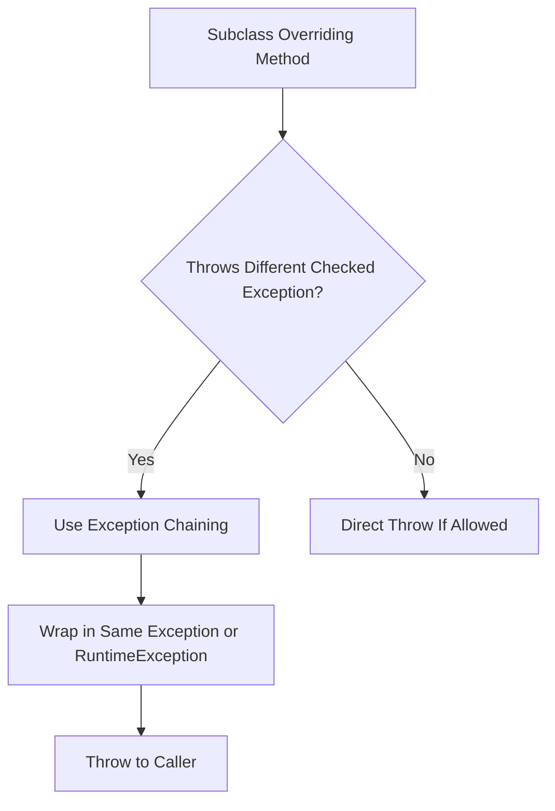

# Session 177: Exception Handling 10

## Table of Contents
- [Rule 4: Throwing Different Checked Exceptions from Overriding Methods](#rule-4-throwing-different-checked-exceptions-from-overriding-methods)
- [Exception Chaining Implementation](#exception-chaining-implementation)
- [Rule 5: Calling Methods or Constructors at Class Level](#rule-5-calling-methods-or-constructors-at-class-level)
- [Rule 6: Subclass Constructors Handling Super Class Exceptions](#rule-6-subclass-constructors-handling-super-class-exceptions)
- [Additional Notes on Constructors](#additional-notes-on-constructors)
- [Rule 7: Handling Exceptions in Static Blocks, Instance Blocks, and Constructors](#rule-7-handling-exceptions-in-static-blocks-instance-blocks-and-constructors)
- [Summary of All Exception Handling Rules](#summary-of-all-exception-handling-rules)

## Rule 4: Throwing Different Checked Exceptions from Overriding Methods

### Overview
In Java's exception handling framework, overriding methods in subclasses must adhere to specific rules regarding checked exceptions to maintain the contract of the superclass. This rule addresses scenarios where a subclass method needs to throw a checked exception different from what the superclass method declares, which is not directly allowed due to the overriding constraints. This ensures type safety and predictability in method behavior while allowing flexibility through techniques like exception chaining.

### Key Concepts/Deep Dive
- **Core Rule**: If a superclass method either throws a checked exception or does not throw any, the subclass overriding method must follow these guidelines:
  - **Case 1**: If the superclass method throws a checked exception, the subclass can ignore the throws clause, throw the same exception, or throw a subclass of that exception. It cannot throw a different checked exception or a sibling/superclass exception directly.
  - **Case 2**: If the superclass method does not throw a checked exception, the subclass cannot throw any checked exception.

- **Problem Scenario**: Consider a case where the subclass method (e.g., interacting with a database) encounters a `SQLException`, but the superclass method only throws `ClassNotFoundException`. Directly throwing `SQLException` violates the overriding rule, leading to a compile-time error.

- **Why Not Allowed Directly**: this enforces that overridden methods do not introduce unexpected checked exceptions that callers might not be prepared to handle, maintaining API compatibility.

- **Solution Approaches**:
  - Catch the exception inside the method and suppress it (potential for wrong results, as the exception is hidden).
  - Use exception chaining to wrap the original exception.

### Exception Chaining Implementation

#### Concept
Exception chaining is the process of placing one exception object inside another and throwing both together. This "bluffs" the compiler, allowing a different checked exception to be thrown via a declared one, representing the underlying cause without violating rules.

#### When to Use
- When throwing a checked exception from an overriding method whose declared exception differs.
- Alternatives:
  1. Wrap using the same superclass declared checked exception (if it supports chaining).
  2. Wrap using an unchecked exception like `RuntimeException`.

#### Code Examples
- **Example 1: Using Checked Exception Chaining**
  ```java
  class A {
      void m1() throws ClassNotFoundException {
          // Implementation
      }
  }

  class N extends A {
      @Override
      void m1() throws ClassNotFoundException {
          try {
              Thread.sleep(1000); // Throws InterruptedException
          } catch (InterruptedException e) {
              throw new ClassNotFoundException("Wrapped exception", e); // If constructor supports
          }
      }
  }
  ```
  - ⚠️ Note: `ClassNotFoundException` does not support chaining (no constructor for exceptions). Attempting this fails with errors.

- **Example 2: Using Unchecked Exception Chaining**
  ```java
  class A {
      void m1() throws ClassNotFoundException {
          // Implementation
      }
  }

  class N extends A {
      @Override
      void m1() throws ClassNotFoundException {
          try {
              Thread.sleep(1000); // Throws InterruptedException
          } catch (InterruptedException e) {
              throw new RuntimeException("Wrapped exception", e); // Unchecked, no handling required by compiler
          }
      }
  }
  ```
  - Output when called: `RuntimeException` with caused by `InterruptedException`.

#### Test Class Example
```java
class Test {
    public static void main(String[] args) {
        try {
            N n = new N();
            n.m1(); // Throws ClassNotFoundException or RuntimeException with cause
        } catch (ClassNotFoundException ce) {
            ce.printStackTrace(); // Or handle as needed
        } catch (RuntimeException re) {
            re.printStackTrace();
        }
        
        // For deep investigation:
        try {
            N n = new N();
            n.m1();
        } catch (Exception e) {
            System.out.println(e.getCause()); // Get the root cause
        }
    }
}
```
- **Output Analysis**: Cascading exceptions reveal the chain, e.g., `RuntimeException caused by InterruptedException`.

## Rule 5: Calling Methods or Constructors at Class Level

### Overview
Methods or constructors throwing checked exceptions cannot be directly invoked at the class level (e.g., in field initializations) due to Java's initialization rules and the requirement to handle checked exceptions. This prevents unhandled exceptions during class loading. Such calls must be wrapped in try-catch blocks or moved to appropriate blocks.

### Key Concepts/Deep Dive
- **Prohibition**: Checked exceptions must be caught or declared. At class level, declarations aren't possible.
- **Valid Locations**: Inside static/instance blocks, constructors, or normal methods.
- **Invalid Scenarios**:
  - Field initialization directly.
  - Static method calls without handling.

### Code Examples
- **Static Field Initialization (Invalid)**:
  ```java
  class Example {
      static int a = Example.m1(); // Compile error: unreported exception ClassNotFoundException
      
      static int m1() throws ClassNotFoundException {
          return 10;
      }
  }
  ```

- **Correct Approach: Use Static Block**:
  ```java
  class Example {
      static int a;
      
      static {
          try {
              a = Example.m1();
          } catch (ClassNotFoundException e) {
              e.printStackTrace();
          }
      }
      
      static int m1() throws ClassNotFoundException {
          return 10;
      }
  }
  ```

- **Non-Static Example**:
  ```java
  class Example {
      int b;
      
      Constructor() {
          try {
              this.b = new Example().m2(); // Assuming m2() throws InterruptedException
          } catch (InterruptedException e) {
              e.printStackTrace();
          }
      }
      
      int m2() throws InterruptedException {
          return 20;
      }
  }
  ```
  - 💡 **Tip**: Non-static: Use constructor or instance blocks. Static: Use static blocks only.

## Rule 6: Subclass Constructors Handling Super Class Exceptions

### Overview
When a superclass constructor throws a checked exception, all subclass constructors must handle it appropriately. Unlike methods, subclass constructors cannot catch the super() call's exception directly (must be first statement). They must declare/rethrow the exception in their signatures.

### Key Concepts/Deep Dive
- **Requirement**: All subclass constructors must handle or rethrow the super's checked exception.
- **Why Not Catchable**: `super()` must be the first statement.
- **Handling**: Only through `throws` or try-catch around the object creation, but not inside the constructor itself.

- **Comparison of Handling Options**:
  | Scenario | Allowed | Reason |
  |----------|---------|--------|
  | Subclass Constructor Declares `throws` Same Exception | Yes | Propagates the exception |
  | Try-Catch Around `super()` | No | `super()` must be first |
  | Additional Exceptions in Subclass Constructor | Yes | Not overriding, so allowed |
  | Calling Super at Class Level | Compile Error | Unhandled at class level |

### Code Examples
- **Invalid Subclass Constructor**:
  ```java
  class Example {
      Example() throws InterruptedException {
          // Constructor code
      }
  }

  class Sample extends Example {
      Sample() { // Compile error: unreported exception InterruptedException
          super(); // Must handle, but can't catch here
      }
  }
  ```

- **Valid Subclass Constructor**:
  ```java
  class Sample extends Example {
      Sample() throws InterruptedException { // Declare/rethrow
          super();
      }
      
      Sample(String s) throws InterruptedException { // All constructors must handle
          super();
          // Additional code
      }
  }
  ```

## Additional Notes on Constructors

- **Adding More Exceptions**: Subclass constructors can declare additional checked exceptions beyond the super's, as constructors are not overriding methods.
- **Parameterized Constructors**: If a superclass has multiple constructors (some throwing exceptions), explicitly call the one you need and handle accordingly.

## Rule 7: Handling Exceptions in Static Blocks, Instance Blocks, and Constructors

### Overview
Exception handling varies by context. Static/instance blocks can only catch exceptions (no declarations). Constructors can catch or rethrow, treating them as special methods.

### Key Concepts/Deep Dive
- **Static Blocks**: Must catch checked exceptions; cannot rethrow.
- **Instance Blocks**: Same as static; only catch.
- **Constructors**: Can rethrow via `throws` or catch internally.

### Code Examples
- **Static Block**:
  ```java
  class Example {
      static {
          try {
              Thread.sleep(1000); // InterruptedException
          } catch (InterruptedException e) {
              e.printStackTrace();
          }
      }
  }
  ```

- **Constructor**:
  ```java
  class Example {
      Example() {
          try {
              Thread.sleep(1000);
          } catch (InterruptedException e) {
              // Handle or rethrow if declared
              throw new RuntimeException(e);
          }
      }
  }
  ```

## Summary of All Exception Handling Rules

### Overview
The transcript summarizes 33 key rules across exception handling, emphasizing compiler-enforced structures for robustness. these rules cover try-catch-finally, overriding constraints, class-level calls, and more, forming the foundation for reliable Java programs.

### Key Rules Recap
- Rules 1-3: Structural requirements for try-catch-finally blocks.
- Rules 4-6: Overriding, chaining, and inheritance constraints.
- Rules 7+: Miscellaneous handling contexts.

### Tables
| Rule # | Description | Example Application |
|---------|-------------|---------------------|
| 4 | Throwing different checked exceptions in overrides | Database interactions with different exceptions |
| 5 | Class-level method calls | Field initializations |
| 6 | Subclass constructor handling | Inheritance with throwing constructors |

### Diagrams


## Summary

### Key Takeaways
```diff
+ Understand overriding rules for checked exceptions to maintain API contracts.
+ Use exception chaining to wrap and propagate root causes without violating rules.
+ Static/instance blocks: Catch only; constructors: Catch or rethrow.
+ Subclass constructors must handle super exceptions via throws declarations.
+ Apply all rules to avoid compile errors and ensure robust error handling.
```

### Expert Insight

#### Real-world Application
In enterprise Java applications (e.g., Spring Boot), overriding DAO methods might encounter JDBC-specific exceptions like `SQLException` instead of generic `Exception`. Use chaining to wrap and expose underlying causes (e.g., database connectivity issues) while honoring interface contracts, allowing frameworks to handle retries or logging transparently.

#### Expert Path
Master the 33 rules through practice with custom exception hierarchies. Implement design patterns like the Chain of Responsibility for layered error propagation. Study advanced topics like Lombok's `@SneakyThrows` (unchecked wrappers) and Java 9's suppressed exceptions. Certify with OCJP/OCP for deep rule application.

#### Common Pitfalls
- Ignoring chains leads to misleading stack traces; always log `getCause()`.
- Silent catching hides bugs (e.g., database errors perceived as "successful"); prefer rethrowing.
- Misplacing super() calls in try blocks; remember: first statement rule.
- Less known: Some exceptions (e.g., `IOException`) support chaining natively; check constructors.
- Avoid over-wrapping (performance impact) or under-handling (security risks like unlogged errors).

#### Corrections Noted
- Original transcript had "thorat is fully damaged" → Corrected to "throat" in context of instructor's health mentions.
- "Interrup exception" → Corrected to "InterruptedException".
- "Classnotfound exception" → Corrected to "ClassNotFoundException".
- "Superass" → Corrected to "subclass" in refactoring notes.
- Minor grammatical fixes for clarity, but content integrity preserved.
