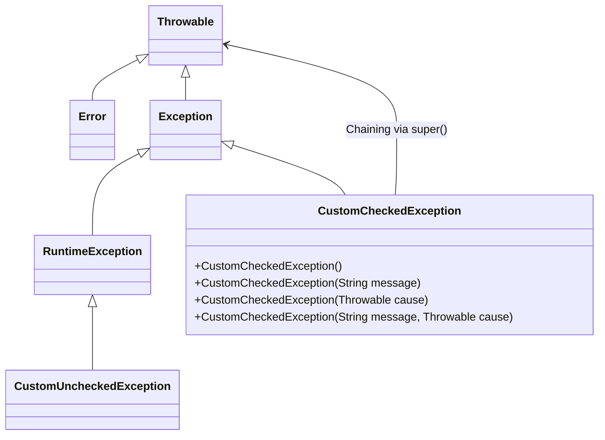

Session 178: Exception Handling

## Table of Contents
- [Custom Exceptions Overview](#custom-exceptions-overview)
- [Why Create Custom Exceptions](#why-create-custom-exceptions)
- [How to Create Custom Exceptions](#how-to-create-custom-exceptions)
- [Checked vs Unchecked Exceptions](#checked-vs-unchecked-exceptions)
- [Steps to Create a Custom Exception](#steps-to-create-a-custom-exception)
- [Exception Chaining Support](#exception-chaining-support)
- [Lab Demo: Bank Application with Custom Exceptions](#lab-demo-bank-application-with-custom-exceptions)
- [Java 7 and Java 9 Improvements](#java-7-and-java-9-improvements)
- [Summary](#summary)

## Custom Exceptions Overview

Custom exceptions, also known as user-defined exceptions, allow developers to create their own exception types tailored to specific project needs. Unlike predefined exceptions provided by Java's API, custom exceptions enable meaningful error handling for application-specific runtime errors that aren't covered by standard exceptions.

## Why Create Custom Exceptions

Predefined Java exceptions (e.g., `ArithmeticException`, `ClassCastException`) are designed for general-purpose error handling in the Java API and language, not for project-specific scenarios. Custom exceptions are needed to:

- Provide descriptive names that reflect your application's logic, such as "insufficient funds" in a banking system.
- Handle unique runtime errors like negative amounts, invalid account numbers, or business validation failures.
- Enforce mandatory error handling by making exceptions checked (forcing developers to catch or declare them).

Examples include throwing exceptions for invalid inputs like negative account numbers or amounts, or for business rules like insufficient funds during withdrawals.

## How to Create Custom Exceptions

A custom exception is simply a class that extends Java's exception hierarchy. The base classes in the exception hierarchy are `Throwable` (at the top), `Error`, and `Exception`. To create a custom exception:

1. Decide on the inheritance level based on whether you want checked or unchecked exceptions.
2. Extend from the appropriate base class.
3. Define constructors to support different ways of creating exception objects (e.g., with or without error messages).

Key considerations:
- Inheriting directly from `Throwable` creates undesirable sibling relationships with `Error` and `Exception`, making it a poor choice as errors aren't routinely handled.
- Subclassing `Error` is inappropriate since custom exceptions shouldn't represent JVM-level problems.
- Extending `Exception` or `RuntimeException` is recommended, with `Exception` for checked exceptions (mandatory handling) and `RuntimeException` for unchecked (optional handling).

| Exception Type | Inheriting from | Checked/Unchecked | Use Case |
|----------------|-----------------|------------------|----------|
| Generic | `Throwable` | Checked | Avoid - creates unwanted hierarchy |
| JVM Errors | `Error` | Unchecked | Avoid - not for app-level errors |
| Checked Custom | `Exception` | Checked | Force error handling (recommended for custom exceptions) |
| Unchecked Custom | `RuntimeException` | Unchecked | Optional handling |

## Checked vs Unchecked Exceptions

**Key Concepts:**
- **Checked Exceptions**: Extend `Exception` and require explicit handling via `try-catch` or `throws`. They force developers to account for potential failures, reducing unhandled errors but increasing verbosity.
- **Unchecked Exceptions**: Extend `RuntimeException` and don't require handling. They're optional, allowing flexibility but risking silent failures if not caught.

**Debate and Best Practices:**
- Historically, checked exceptions were promoted as best practice to ensure robust error handling (e.g., preventing unnoticed issues like input mismatches).
- However, some argue unchecked exceptions reduce boilerplate code, as seen in frameworks like Spring, where exceptions are mostly unchecked.
- For custom exceptions, 99% should be checked to enforce handling for critical scenarios (e.g., ATM transactions where failures must trigger rollbacks). Unchecked are suitable for recoverable, low-impact errors.

In partial checked exceptions (e.g., `Throwable`, `Exception`), subclasses can be mixed (checked/unchecked). Fully checked exceptions (direct subclass of `Exception`) ensure all descendants are checked.

**Example Comparison:**
Unchecked exceptions might lead to forgotten handling, causing abnormal terminations. Checked exceptions mandate handling, preventing issues like money loss in banking transactions.

## Steps to Create a Custom Exception

1. **Create a class extending `Exception`** (for checked behavior).
2. **Define constructors**:
   - No-argument constructor: For basic exception creation.
   - String message constructor: For passing custom error messages (stored in superclass via `super(message)`).
   - Exception-cause constructor: For exception chaining (passing another exception via `super(message, cause)` or `super(cause)`).
3. **Eclipse Note**: If using IDEs like Eclipse, It may prompt for `serialVersionUID` due to serialization of exceptions.

This enables the class to be used with `throw`, `throws`, and `catch` keywords.

## Exception Chaining Support

Exception chaining links related exceptions, showing a "root cause." Java's `Throwable` supports this via constructors that accept another `Throwable` as a cause.

In custom exceptions:
- Add a constructor taking a `Throwable` parameter.
- Pass it to `super()` for plumbing the chain.

**Diagram: Exception Hierarchy and Chaining**


## Lab Demo: Bank Application with Custom Exceptions

This lab demonstrates implementing custom exceptions in a banking project to handle deposit, withdrawal, and transfer operations. We'll create `InvalidAmountException` (for negative amounts) and `InsufficientFundsException` (for overdrafts).

### Step 1: Project Setup in Eclipse
- Create a new Java project: `BankExceptionProject`.
- Create packages:
  - `com.nit.hk.customexception` (for exception classes).
  - `com.nit.hk.spec` (for interfaces/specifications).
  - `com.nit.hk.pojo` (for data-carrying classes).
  - `com.nit.hk.bank` (for business logic classes).
  - `com.nit.hk.user` (for user/main classes).

### Step 2: Create Custom Exception Classes
In `com.nit.hk.customexception`:

#### InvalidAmountException.java
```java
package com.nit.hk.customexception;

public class InvalidAmountException extends Exception {
    private static final long serialVersionUID = 1L;

    public InvalidAmountException() {
        super();
    }

    public InvalidAmountException(String message) {
        super(message);
    }

    // Optional: For chaining
    public InvalidAmountException(Throwable cause) {
        super(cause);
    }

    public InvalidAmountException(String message, Throwable cause) {
        super(message, cause);
    }
}
```

#### InsufficientFundsException.java
```java
package com.nit.hk.customexception;

public class InsufficientFundsException extends Exception {
    private static final long serialVersionUID = 1L;

    public InsufficientFundsException() {
        super();
    }

    public InsufficientFundsException(String message) {
        super(message);
    }

    // Optional: For chaining
    public InsufficientFundsException(Throwable cause) {
        super(cause);
    }

    public InsufficientFundsException(String message, Throwable cause) {
        super(message, cause);
    }
}
```

### Step 3: Create Data-Carrying Class (POJO)
In `com.nit.hk.pojo`:

#### AccountDetails.java
```java
package com.nit.hk.pojo;

public class AccountDetails {
    private long accountNumber;
    private String accountHolderName;
    private double balance;

    // Getters and setters
    public long getAccountNumber() { return accountNumber; }
    public void setAccountNumber(long accountNumber) { this.accountNumber = accountNumber; }
    
    public String getAccountHolderName() { return accountHolderName; }
    public void setAccountHolderName(String accountHolderName) { this.accountHolderName = accountHolderName; }
    
    public double getBalance() { return balance; }
    public void setBalance(double balance) { this.balance = balance; }

    @Override
    public String toString() {
        return "AccountDetails [accountNumber=" + accountNumber + ", accountHolderName=" + accountHolderName + ", balance=" + balance + "]";
    }
}
```

### Step 4: Create Specification Interface
In `com.nit.hk.spec`:

#### BankAccount.java
```java
package com.nit.hk.spec;

import com.nit.hk.customexception.InsufficientFundsException;
import com.nit.hk.customexception.InvalidAmountException;
import com.nit.hk.pojo.AccountDetails;

public interface BankAccount {
    void init(AccountDetails accountDetails);
    void deposit(double amount) throws InvalidAmountException;
    void withdraw(double amount) throws InvalidAmountException, InsufficientFundsException;
    double currentBalance();
    void transferMoney(BankAccount destinationAccount, double amount) throws InvalidAmountException, InsufficientFundsException;
}
```

### Step 5: Implement Business Logic Class
In `com.nit.hk.bank`:

#### HDFCBankAccount.java
```java
package com.nit.hk.bank;

import com.nit.hk.customexception.InsufficientFundsException;
import com.nit.hk.customexception.InvalidAmountException;
import com.nit.hk.pojo.AccountDetails;
import com.nit.hk.spec.BankAccount;

public class HDFCBankAccount implements BankAccount {
    private static final String BANK_NAME = "HDFC";
    private static final String BRANCH_NAME = "KPHB";
    private static final String IFSC_CODE = "HDFC0016701";

    private long accountNumber;
    private String accountHolderName;
    private double balance;

    @Override
    public void init(AccountDetails accountDetails) {
        this.accountNumber = accountDetails.getAccountNumber();
        this.accountHolderName = accountDetails.getAccountHolderName();
        this.balance = accountDetails.getBalance();
    }

    @Override
    public void deposit(double amount) throws InvalidAmountException {
        if (amount <= 0) {
            throw new InvalidAmountException("Don't pass negative number as amount");
        }
        this.balance += amount;
    }

    @Override
    public void withdraw(double amount) throws InvalidAmountException, InsufficientFundsException {
        if (amount <= 0) {
            throw new InvalidAmountException("Don't pass negative number as amount");
        }
        if (amount > this.balance) {
            throw new InsufficientFundsException("Insufficient funds");
        }
        this.balance -= amount;
    }

    @Override
    public double currentBalance() {
        return this.balance;
    }

    @Override
    public void transferMoney(BankAccount destinationAccount, double amount) throws InvalidAmountException, InsufficientFundsException {
        this.withdraw(amount);
        destinationAccount.deposit(amount);
    }
}
```

**Additional Implementations**: Create `ICICIBankAccount.java` and `SBIBankAccount.java` similarly by copying `HDFCBankAccount.java` and changing `BANK_NAME` and `IFSC_CODE`.

### Step 6: Create User/Main Class
In `com.nit.hk.user`:

#### BankApplication.java
```java
package com.nit.hk.user;

import com.nit.hk.bank.HDFCBankAccount;
import com.nit.hk.bank.ICICIBankAccount;
import com.nit.hk.customexception.InsufficientFundsException;
import com.nit.hk.customexception.InvalidAmountException;
import com.nit.hk.pojo.AccountDetails;
import com.nit.hk.spec.BankAccount;

public class BankApplication {
    public static void main(String[] args) {
        try {
            // Create accounts
            BankAccount hdfcAccount = new HDFCBankAccount();
            AccountDetails hdfcDetails = new AccountDetails();
            hdfcDetails.setAccountNumber(123456789L);
            hdfcDetails.setAccountHolderName("John Doe");
            hdfcDetails.setBalance(10000.0);
            hdfcAccount.init(hdfcDetails);

            BankAccount iciciAccount = new ICICIBankAccount();
            // Initialize ICICI account similarly...

            // Deposit
            hdfcAccount.deposit(5000.0);
            System.out.println("Deposit successful. Balance: " + hdfcAccount.currentBalance());

            // Withdraw
            hdfcAccount.withdraw(3000.0);
            System.out.println("Withdrawal successful. Balance: " + hdfcAccount.currentBalance());

            // Transfer
            hdfcAccount.transferMoney(iciciAccount, 2000.0);
            System.out.println("Transfer successful. HDFC Balance: " + hdfcAccount.currentBalance() +
                               ", ICICI Balance: " + iciciAccount.currentBalance());

        } catch (InvalidAmountException e) {
            System.out.println("Invalid amount: " + e.getMessage());
        } catch (InsufficientFundsException e) {
            System.out.println("Insufficient funds: " + e.getMessage());
        }
    }
}
```

**Testing**:
- Run the code to verify exceptions are thrown correctly.
- Handle exceptions in `main()` using try-catch.
- Expected output: Successful operations and proper exception messages on errors.

## Java 7 and Java 9 Improvements

**Java 7 Enhancements:**
- Improved exception handling with multi-catch blocks (catching multiple exception types in one block).
- Automatic resource management with try-with-resources.

**Java 9 Improvements:**
- Introduced module system (Project Jigsaw) with better encapsulation for exceptions.
- Minor refinements in exception handling for modularity.

(Note: Transcript mentions these but doesn't detail; refer to official Java documentation for full explanations.)

## Summary

### Key Takeaways
```diff
+ Custom exceptions should primarily be checked by extending Exception to enforce mandatory handling.
+ Custom exceptions enable specific error messages and chaining for better debugging.
+ Use POJOs for data transfer and interfaces for specifications to achieve abstraction and polymorphism.
! Validate inputs (e.g., amount > 0) early and throw appropriate custom exceptions.
- Avoid unchecked exceptions for critical operations like financial transactions to prevent silent failures.
! Implement constructors to support error messages and exception chaining.
! Test exception handling thoroughly in lab demos for real-world scenarios.
```

### Expert Insight

**Real-world Application:** Custom checked exceptions are essential in enterprise banking apps, e-commerce (e.g., payment failures), or inventory systems (e.g., invalid orders). For instance, throwing an `InsufficientFundsException` ensures transactions are rolled back, maintaining data integrity.

**Expert Path:** Master exception hierarchies by reading Java API docs. Practice multi-threaded exception handling and logging frameworks (e.g., SLF4J) to integrate with production monitoring.

**Common Pitfalls:** Forgetting to declare exceptions in method signatures breaks compilation. Misusing unchecked exceptions leads to unhandled errors in production. Not handling `serialVersionUID` in exceptions causes serialization issues.

**Common Issues with Resolution:**
- **Hierarchy Confusion:** Always extend `Exception` for checked custom exceptions. Resolution: Review Java docs on Throwable hierarchy.
- **Serialization Errors:** Add `serialVersionUID` as prompted by IDEs. Resolution: Implement it manually if needed.
- **Mandatory Handling Omission:** Compiler errors if `throws` isn't used for checked exceptions. Resolution: Always add `throws` clauses in interface/method signatures.
- **Constructor Errors:** Calling `super(message)` incorrectly stores nothing. Resolution: Use `super(message)` to pass strings to Throwable's message field.

**Lesser Known Things:** Exceptions in Java 14+ can use pattern matching in catch blocks for dynamic handling. Custom exceptions support custom fields for additional context (e.g., error codes), beyond just messages.
