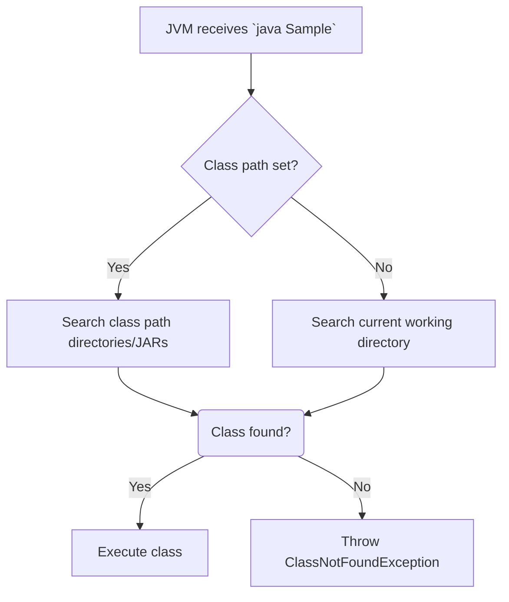

# Session 18: Core Java Interview Ques 2 + concepts

- [Overview](#overview)
- [Key Concepts and Deep Dive](#key-concepts-and-deep-dive)
- [Lab Demos](#lab-demos)
- [Summary](#summary)

## Overview

Session 18 continues the discussion on Core Java Interview Questions, focusing on Class Path and Source File concepts. Building upon previous sessions covering compiler and JVM entry questions, this session delves into how Java's compiler and JVM locate and execute class files, the importance of organizing class files in separate directories, and various mechanisms for configuring the class path. Key topics include temporary and permanent class path settings, command-line options for Java tools, and practical demonstrations of class file management. The session emphasizes best practices for project organization and troubleshooting common class resolution issues to prepare learners for advanced Java development and interview scenarios.

## Key Concepts and Deep Dive

### Organizing Class Files

- **Separate Directories for Class Files**: In production or larger projects, save `.class` files in a dedicated directory rather than mixing them with `.java` files. This practice enhances maintainability and prevents accidental deletion.
- **Compiler's Role in Saving Class Files**: Use the `-d` option with `javac` to specify a destination directory for generated class files. For example, `javac -d C:\test sample.java` saves the `.class` file in `C:\test`.
- **Version-Specific Behavior**: In Java 9 and later, if the destination directory does not exist, the compiler creates it implicitly. In Java 8 and earlier, the directory must be created manually.
- **Benefits**: Avoids clutter in source directories and simplifies project management over time.

### Class Path Basics

- **Purpose of Class Path**: Class path informs the JVM and compiler where to find `.class` files. It is a system or user-level environment variable used by Java-related tools to locate libraries or user-defined classes.
- **Difference from Path Variable**: Path is for locating executable binaries (e.g., `javac.exe`), while class path is for locating class files and JARs.
- **JVM Search Algorithm**: 
  - First, check for class path variable.
  - If set, search only within specified directories or JARs.
  - If not set, default to current working directory (where the command is executed).
- **Compiler Search Algorithm**: Mirrors JVM behavior: prioritizes class path folders; falls back to current working directory if unset.

### Setting Class Path

#### Temporary Settings
- **Using `set classpath` Command**: Applicable for the current command prompt session.
  - Example: `set classpath=C:\test`
  - Scope: Entire prompt window; resets on closing or opening a new window.
- **Command-Line Options with `java` or `javac`**:
  - `-cp` or `--class-path`: Specify directories or JAR files inline.
  - Limited to the single command line.
  - Example: `java -cp C:\test sample`
  - Multiple paths: Use semicolon (`;`) as separator (Windows).
  - Full syntax: `javac -cp path1;path2 source.java`

#### Permanent Settings
- **Environment Variables**: 
  - System Variables > New > Variable Name: `classpath` (case-insensitive in Windows, case-sensitive in Linux).
  - Variable Value: Paths separated by semicolons (e.g., `. ; C:\test`).
  - Apply changes and restart command prompts to take effect.
- **Importance of Dot (`.`) in Class Path**:
  - Represents the current working directory.
  - Always place `.` at the beginning (e.g., `.; C:\test`) to access classes in the directory where you run commands.
  - Without dot, classes in the current directory are ignored, even if class path points elsewhere.
  - Dynamic nature: Dot adapts to the directory from which the command is executed.

### Java Command Options

- **Compilation Options**:
  - `-d`: Specifies output directory for `.class` files.
  - `-source`: Compiles using features of a specific Java version (e.g., `javac -source 1.8 sample.java` uses Java 8 syntax, even on Java 14 JDK).
  - Useful when targeting compatibility with older runtimes.
- **Execution Options**:
  - `-cp`, `-classpath`, `--class-path`: Set class path for the JVM.
  - Other modes: Direct class, JAR file via `-jar`, module via `-m`, or source file (Java 11+).

- **Version Compatibility**:
  - Class files compiled with higher versions (e.g., Java 14) cannot run on lower versions (e.g., Java 1.8 JVM), due to unsupported bytecode.
  - Reverse is possible: Files compiled for lower versions run on higher JVMs.

### Environment Variables Best Practices

- **Case Sensitivity**: On Windows, case-insensitive; on Linux, must be lowercase (`classpath`).
- **Scope**: User variables affect individual accounts; system variables affect all users.
- **Verification**: Use `echo %classpath%` (Windows) or `echo $CLASSPATH` (Linux) to check values.
- **Path vs. Class Path**: Path includes JDK `bin` folders for executables; class path focuses on JARs and directories for classes.

### Troubleshooting Class Resolution

- **Common Error**: `java.lang.ClassNotFoundException` often indicates class path issues.
- **Steps to Resolve**:
  1. Verify `.class` file existence and location.
  2. Check class path value.
  3. Ensure dot (`.`) is included if accessing current directory classes.
  4. Confirm correct directory changes before running commands.
- **Extension Issues**: Save files with correct extensions (e.g., `.java`), not `.txt`. Enable file name extensions in Windows Explorer to verify.

### Predicting Behavior Tables

| Scenario                          | Behavior                                                                 |
|-----------------------------------|-----------------------------------------------------------------------|
| Class path set, current directory has class | JVM prioritizes class path directories over current directory.        |
| Class path unset, current directory has class | JVM searches current directory as default class path.                 |
| Multiple paths in class path      | JVM searches left-to-right (first match wins).                        |
| Dot in class path                 | References execution directory at runtime.                            |
| Missing class with set class path | Throws `ClassNotFoundException`, ignores current directory if unset. |

### Diagramming Class Loading



## Lab Demos

### Demo 1: Compiling and Saving Class Files in Separate Directories

1. Create a directory structure: `C:\coreJava\JavaBasics` for `.java` files and `C:\test` for `.class` files.
2. Write `sample.java` in `JavaBasics`:
   ```java
   public class sample {
       public static void main(String[] args) {
           System.out.println("Hello");
       }
   }
   ```
3. Open command prompt and change to `D:\01\coreJava\JavaBasics`.
4. Compile with destination: `javac -d C:\test sample.java`.
   - Verify `sample.class` in `C:\test`.
5. Attempt execution: `java sample` (fails due to class path).
6. Set class path: `set classpath=C:\test`.
7. Execute: `java sample` (succeeds, outputs "Hello").

### Demo 2: Using Command-Line Class Path Options

1. Remove any permanent class path.
2. From `JavaBasics`, run: `java -cp C:\test sample`.
3. Note: Succeeds for this command but not subsequent runs without repeating options.
4. Test multiple directories: `java -cp C:\test;D:\01\coreJava\JavaBasics sample`.

### Demo 3: Permanent Class Path Setup

1. Right-click "This PC" > Properties > Advanced system settings > Environment Variables.
2. Under System Variables, add new:
   - Name: `classpath`
   - Value: `.;C:\test`
3. Open new command prompt anywhere: `java sample` succeeds.
4. Change to another drive (e.g., `E:`): `java sample` still works; other classes fail unless present.

### Demo 4: Compiling with Version-Specific Options

1. Install or use a higher JDK (e.g., 14).
2. Compile with older syntax: `javac -source 1.8 sample.java`.
3. Attempt to run on lower JVM: Fails if bytecode uses unsupported features.
4. Verify version: `javac -version` or inspect bytecode.

## Summary

### Key Takeaways
```diff
+ Class files should be stored separately from source files for maintainability.
+ Class path prioritizes specified directories over current working directory.
+ Dot (.) in class path enables dynamic access to execution directory.
+ Temporary settings via `set classpath` or `-cp` are command/event-bound; permanent via environment variables.
+ JVM/compiler search: Class path first, then current directory if unset.
+ Options like `-d`, `-source`, `-cp` enhance compilation and execution flexibility.
- Forgetting dot leads to `ClassNotFoundException` even with classes present locally.
- Mixing path and class path concepts causes confusion in setups.
- Version mismatches (high compile, low run) result in runtime errors.
```

### Expert Insight
**Real-world Application**: In enterprise Java projects (e.g., microservices with Spring Boot), class paths manage dependencies via JARs and Ensure modular builds with Gradle/Maven. Dynamic class paths via dots handle multiple modules without hardcoding paths.

**Expert Path**: 
- Master classpath configurations in IDEs (Eclipse/IntelliJ) for seamless development.
- Study JAR manifests and module info to advance to modular Java (Java 9+).
- Practice with Dockerized apps, setting runtime class paths in containers.
- Explore classpath scanning in frameworks like Hibernate for ORM mappings.

**Common Pitfalls**: 
- Omitting dot in classpath, leading to overlooked local classes during debugging.
- Case sensitivity errors on Linux-based deployments (e.g., `CLASSPATH` vs. `classpath`).
- Over-relying on permanent settings, causing unexpected behavior in shared environments.
- Forgetting semicolons in multi-path Windows class paths, resulting in invalid paths.

**Lesser Known Things**: 
- Class path supports wildcards in Java 6+ (e.g., `lib/*` for all JARs), simplifying dependency management.
- JVM ignores duplicate entries in class path, but order matters for overrides.
- Tools like `jdeps` analyze class path dependencies for optimization, underutilized in basic training.
- Class path can reference remote files (e.g., via URLs), though rarely used outside enterprise policies. The model for this session is CL-KK-Terminal.
