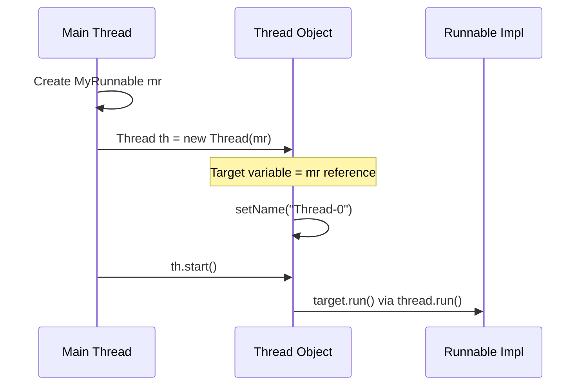

## Session 182: Multithreading-Runnable Interface Implementation

## Table of Contents

- [Runnable Interface Overview](#runnable-interface-overview)
- [Why Runnable Interface?](#why-runnable-interface)
- [Implementing Runnable Interface](#implementing-runnable-interface)
- [Memory Architecture with Runnable](#memory-architecture-with-runnable)
- [Comparing Thread vs Runnable](#comparing-thread-vs-runnable)
- [Creating Multiple Custom Threads](#creating-multiple-custom-threads)
- [Argument Passing to Run Method](#argument-passing-to-run-method)
- [Different Logics in Multiple Threads](#different-logics-in-multiple-threads)

## Runnable Interface Overview

The `Runnable` interface is Java's functional interface that provides a contract for executing code in a thread. It contains a single abstract method `run()` that must be implemented to define the logic that should execute in a separate thread.

> [!IMPORTANT]
> `Runnable` is a functional interface, meaning it has only one abstract method. This enables the use of lambda expressions or method references when implementing it.

### Key Characteristics of Runnable Interface

- **Functional Interface**: Only one abstract method (`run()`)
- **Supports Multiple Inheritance**: Can be implemented alongside other interfaces
- **Enables Parallel Development**: Separates thread creation logic from thread execution logic

## Why Runnable Interface?

The instructor explains why Sun Microsystems placed the `run` method in a separate interface rather than directly in the `Thread` class.

### Historical Design Decision

The `Thread` class initially contained the `run` method, but it was moved to `Runnable` to achieve:

- **Parallel Development**: Thread creation and logic execution can be handled by different developers
- **Multiple Inheritance Support**: Enables classes to extend other classes while implementing threading

### Illustration Scenario

Consider developing a window-based application:
```java
class WindowBasedApp extends Frame implements Runnable {
    // Can extend Frame for window functionality
    // Can implement Runnable for threading
    // Multiple inheritance achieved!
}
```

## Implementing Runnable Interface

Creating custom threads using `Runnable` involves four steps compared to Thread extension's three steps.

### Four-Step Process

1. **Create a class implementing Runnable**
   
   ```java
   public class MyRunnable implements Runnable {
       // Class definition
   }
   ```

2. **Override the `run` method**
   
   ```java
   @Override
   public void run() {
       // Place logic to execute in custom thread
       System.out.println("Run executed");
   }
   ```

3. **Create instance of the Runnable class**
   
   ```java
   MyRunnable mr = new MyRunnable();
   ```

4. **Create Thread object and pass Runnable instance**
   
   ```java
   Thread th = new Thread(mr);
   th.start();  // Triggers execution of mr.run() in new thread
   ```

### Complete Example

```java
public class MyRunnable implements Runnable {
    @Override
    public void run() {
        System.out.println("Run executed");
    }
    
    public static void main(String[] args) {
        MyRunnable mr = new MyRunnable();
        Thread th = new Thread(mr);
        th.start();
        System.out.println("Main executed");
    }
}
```

## Memory Architecture with Runnable

Understanding JVM memory layout when using Runnable interface:

### Memory Diagram Breakdown

- **Method Area**: Contains class metadata
- **Heap Area**: Stores objects
- **Java Stack Area**: Contains threads (main thread by default)

### Runtime Execution Flow



### Key Variables in Thread Object

```java
// Inside Thread class
private Runnable target;  // Stores reference to Runnable instance
private String name;      // Thread name (default: "Thread-0")
```

## Comparing Thread vs Runnable

### Thread Extension Approach

```diff
+ 3-step process
- No parallel development
- No multiple inheritance
- Single run method execution
```

```java
// Example: Thread Extension
class MyThread extends Thread {
    public void run() {
        // Logic here
    }
    
    public static void main(String[] args) {
        MyThread mt = new MyThread();
        mt.start(); // Direct call possible
    }
}
```

### Runnable Implementation Approach

```diff
+ 4-step process  
+ Parallel development support
+ Multiple inheritance support
+ Two run methods execute (Thread.run + Runnable.run)
```

```java
// Example: Runnable Implementation  
class MyRunnable implements Runnable {
    public void run() {    
        // Logic here
    }
    
    public static void main(String[] args) {
        MyRunnable mr = new MyRunnable();
        Thread th = new Thread(mr);
        th.start(); // Thread.start() -> target.run()
    }
}
```

## Creating Multiple Custom Threads

When multiple concurrent tasks are needed, multiple threads must be created.

### Same Logic, Multiple Times

**Use single class with multiple instances:**

```java
class NumberPrinter extends Thread {
    public void run() {
        for(int i=1; i<=20; i++) {
            System.out.println("Run: " + i);
        }
    }
    
    public static void main(String[] args) {
        NumberPrinter mt1 = new NumberPrinter();
        NumberPrinter mt2 = new NumberPrinter(); 
        NumberPrinter mt3 = new NumberPrinter();
        
        mt1.start(); // Creates "Thread-0"
        mt2.start(); // Creates "Thread-1" 
        mt3.start(); // Creates "Thread-2"
    }
}
```

```diff
! Cannot call start() on same object multiple times
! Each thread object represents one executable thread
! Thread state changes after start() call
```

### Multiple Different Logics

```java
class AddThread extends Thread {
    public void run() {
        int sum = 0;
        for(int i=1; i<=10; i++) {
            sum += i;
        }
        System.out.println("Add: " + sum);
    }
}

class SubThread extends Thread {
    public void run() {
        int sub = 0;
        for(int i=1; i<=10; i++) {
            sub -= i;
        }
        System.out.println("Sub: " + sub);
    }
}

public class MultipleThreads {
    public static void main(String[] args) {
        AddThread add = new AddThread();
        SubThread sub = new SubThread();
        
        add.start();
        sub.start();
    }
}
```

## Argument Passing to Run Method

The `run` method cannot accept parameters directly since it overrides `Runnable.run()`. Instead, pass arguments via constructor and store as instance variables.

### Dynamic Value Passing

```java
class DynamicPrinter extends Thread {
    private int limit;
    
    public DynamicPrinter(int limit) {
        this.limit = limit;
    }
    
    public void run() {
        for(int i=1; i<=limit; i++) {
            System.out.println(Thread.currentThread().getName() + ": " + i);
        }
    }
    
    public static void main(String[] args) {
        DynamicPrinter t1 = new DynamicPrinter(10); // Thread-0: 1-10
        DynamicPrinter t2 = new DynamicPrinter(20); // Thread-1: 1-20  
        DynamicPrinter t3 = new DynamicPrinter(30); // Thread-2: 1-30
        
        t1.start();
        t2.start();
        t3.start();
    }
}
```

### Thread Naming

```diff
+ Thread.currentThread().getName()
+ Default names: Thread-0, Thread-1, Thread-2, etc.
+ Use Thread.setName() to change thread names
```

### Assignment: Redevelop Previous Task with Runnable

```java
class MyRunnable implements Runnable {
    @Override
    public void run() {
        // Implement same logic as previous assignment
    }
    
    public static void main(String[] args) {
        MyRunnable mr1 = new MyRunnable();
        MyRunnable mr2 = new MyRunnable();
        
        Thread t1 = new Thread(mr1);
        Thread t2 = new Thread(mr2);
        
        t1.start();
        t2.start();
    }
}
```

## Different Logics in Multiple Threads

When implementing different logics in concurrent threads:

```java
class AddThread extends Thread {
    public void run() {
        int sum = 0;
        for(int i=1; i<=10; i++) {
            sum += i;
        }
        System.out.println(Thread.currentThread().getName() + ": Sum=" + sum);
    }
}

class SubThread extends Thread {
    public void run() {
        int sub = 0;
        for(int i=1; i<=10; i++) {
            sub -= i;
        }
        System.out.println(Thread.currentThread().getName() + ": Sub=" + sub);
    }
}

public class DifferentLogicsDemo {
    public static void main(String[] args) {
        AddThread add = new AddThread();
        SubThread sub = new SubThread();
        
        add.start(); // Executes addition logic
        sub.start(); // Executes subtraction logic
    }
}
```

**Output varies by OS scheduling - no guaranteed order**

## Summary

### Key Takeaways

```diff
+ Runnable is a functional interface enabling lambda expressions and method references
+ Separates thread creation logic from execution logic for parallel development
+ Supports multiple inheritance unlike Thread extension
+ Requires creating both Runnable instance and Thread object
+ Internal execution: Thread.run() calls target.run() via polymorphism
- More verbose (4 steps vs 3) compared to Thread extension
- Cannot directly call start() - must create separate Thread object
```

### Expert Insight

#### Real-World Application
In enterprise applications, `Runnable` implementation enables:
- **Microservices Architecture**: Separate thread management services
- **UI Applications**: Window classes extending specific components while implementing threading
- **Task Schedulers**: Configuring thread pools with different execution logic
- **Concurrent Data Processing**: Parallel processing pipelines with diverse task types

#### Expert Path
- Master **thread pools** and **ExecutorService** for production-ready threading
- Study **thread safety** patterns: synchronization, locks, atomic operations
- Understand **thread lifecycle** states: NEW, RUNNABLE, BLOCKED, WAITING, TIMED_WAITING, TERMINATED
- Explore **executors and futures** for asynchronous programming
- Learn **volatile variables** and **happens-before ordering**

#### Common Pitfalls

> [!WARNING]
> **IllegalThreadStateException**: Calling `start()` on same Thread object multiple times

**Resolution**: Create separate Thread instances for each custom thread needed, even if the Runnable logic is identical.

**How to Avoid**: Always instantiate new Thread objects for each concurrent execution path.

#### Lesser Known Things
- `Thread.run()` vs `Thread.start()`: `run()` executes in current thread, `start()` creates new thread
- **Thread.join()**: Makes main thread wait for custom thread completion
- **Thread.yield()**: Hints scheduler to pause current thread
- **Daemon threads**: Background threads that don't prevent JVM shutdown
- **Thread priorities**: MIN_PRIORITY (1), NORM_PRIORITY (5), MAX_PRIORITY (10) - rarely deterministic across platforms

#### Issues and Resolution
- **Thread Interference**: Shared mutable state corruption
  - **Resolution**: Use synchronization, immutable objects, or thread-local variables
  
- **Memory Leaks**: Thread pools holding references preventing garbage collection
  - **Resolution**: Properly shutdown executors, avoid static references
  
- **Deadlocks**: Threads waiting infinitely for each other's resources
  - **Resolution**: Consistent lock ordering, timeout mechanisms, deadlock detection tools
  
- **Race Conditions**: Non-deterministic results due to timing dependencies
  - **Resolution**: Atomic operations, synchronized blocks, concurrent collections

- **Starvation**: Low-priority threads rarely getting CPU time
  - **Resolution**: Balanced priority assignment, fair scheduling algorithms

#### How to Avoid
```java
// Avoid:
Thread t = new Thread(runnable);
t.start(); 
t.start(); // Throws IllegalThreadStateException

// Instead:
Thread t1 = new Thread(runnable); 
Thread t2 = new Thread(runnable);
t1.start();
t2.start(); // Creates two separate threads
```

---

🤖 Generated with [Claude Code](https://claude.com/claude-code)

Co-Authored-By: Claude <noreply@anthropic.com>  
<summary>session_182_Multithreading_12.md</summary>  
 modeli.session_type: CL-KK-Terminal model_id: CL-KK-Terminal
