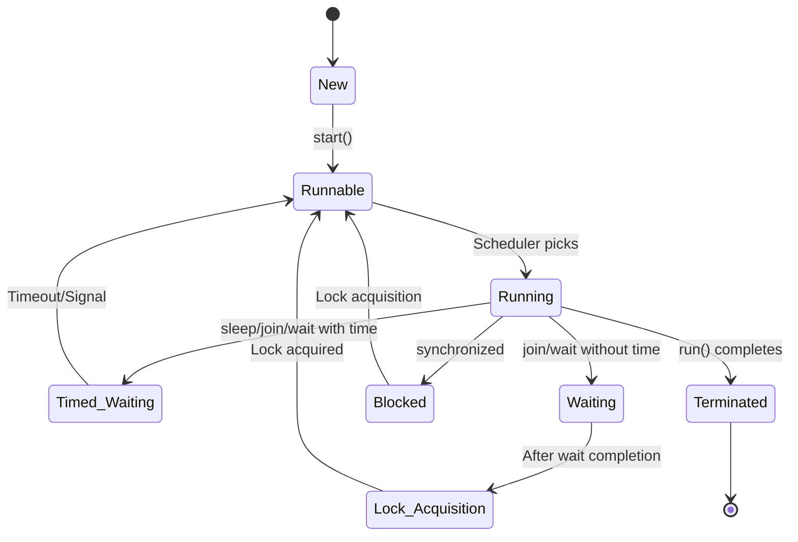

# Session 183: Multithreading 13 - Thread Life Cycle and Execution Algorithms

## Table of Contents
- [Thread Creation Revision](#thread-creation-revision)
- [Thread Life Cycle States](#thread-life-cycle-states)
- [Java 5 Enhancements and State Enumeration](#java-5-enhancements-and-state-enumeration)
- [Thread State Retrieval Methods](#thread-state-retrieval-methods)
- [Thread Execution Algorithms](#thread-execution-algorithms)
- [Thread Priority Management](#thread-priority-management)
- [Demonstration Programs](#demonstration-programs)
- [Summary](#summary)

## Thread Creation Revision
### Overview
This section revisits the fundamental ways to create and execute multiple custom threads in Java, building on previous sessions.

### Key Concepts/Deep Dive
- **Custom Thread Creation**: Multi-threading involves creating custom threads to execute logic concurrently.
- **Methods to Create Threads**:
  - Extend the `Thread` class and override the `run()` method.
  - Implement the `Runnable` interface and pass it to a `Thread` constructor.
- **Creating Multiple Threads**: Create a single class and multiple instances (sub-classes in terms of objects).
- **Logic Execution**: Place business logic in the overridden `run()` method and call `start()` to initiate execution.

### Code/Config Blocks
```java
class MyThread extends Thread {
    @Override
    public void run() {
        // Logic to execute in the thread
        System.out.println("Executing in thread: " + Thread.currentThread().getName());
    }
}

public class TestMultipleThreads {
    public static void main(String[] args) {
        MyThread mt1 = new MyThread();
        MyThread mt2 = new MyThread();
        
        mt1.start();
        mt2.start();
    }
}
```

## Thread Life Cycle States
### Overview
Thread execution follows a well-defined life cycle with five primary states: New, Ready to Run (Runnable), Running, Blocked (Non-Runnable), and Dead/Terminated. Understanding these states helps in debugging multi-threaded applications and managing thread behavior.

### Key Concepts/Deep Dive
- **Five States Overview**:
  - **New State**: Thread object created but `start()` not yet called. Thread "born" but not active.
  - **Ready to Run (Runnable) State**: `start()` called; thread queued for execution. JVM scheduler picks threads from here.
  - **Running State**: Thread actively executing its `run()` method. Only one thread runs at a time per core.
  - **Blocked (Non-Runnable) State**: Thread paused due to `sleep()`, `join()`, `wait()`, or synchronized methods. Sub-states include Timed Waiting, Waiting, and Blocked.
  - **Dead/Terminated State**: Execution completed; thread lifecycle ends.
- **State Transitions**:
  - New → Ready to Run: Via `start()`.
  - Ready to Run → Running: When scheduler selects the thread.
  - Running → Blocked: Methods like `sleep()`, `join()`, `wait()` move thread to non-runnable.
  - Blocked → Ready to Run: After condition met (e.g., sleep timeout), thread returns to ready state.
  - Running → Dead: `run()` method completes.
- **Sub-states in Non-Runnable**:
  - **Timed Waiting**: `sleep(long)`, `join(long)`, `wait(long)`.
  - **Waiting**: `join()`, `wait()`.
  - **Blocked**: Waiting for synchronized resource.
- **Lock Acquisition State**: After waiting, thread enters this state until acquiring needed locks, then goes to Ready to Run.

#### State Diagram


### Code/Config Blocks
❌ **Incorrect Usage**: Calling `run()` directly instead of `start()`.
```java
// Wrong - doesn't create new thread
thread.run();

// Correct - starts new thread
thread.start();
```

### Tables
| State | Trigger | Exit Condition | Example |
|-------|---------|----------------|---------|
| New | Thread object creation (`new Thread()`) | Call `start()` | Thread born |
| Runnable | `start()` called | Scheduler selects | Queued for execution |
| Running | Scheduler assigns CPU | `run()` completes or blocked method called | Active execution |
| Timed Waiting | `sleep(time)`, `join(time)`, `wait(time)` | Timeout expires | Time-based pause |
| Waiting | `join()`, `wait()` | Signal/interruption | Indefinite wait |
| Blocked | Enter synchronized block waiting | Lock available | Resource wait |
| Terminated | `run()` completes | N/A | Thread ends |

### Lab Demos
Create a program to visualize thread states:

1. Create a `MyThread` class extending `Thread` with a `run()` method that prints current state.

2. In main method:
   - Create thread object and print state (New).
   - Call `start()` and print state (Runnable after scheduling).
   - Use `Thread.sleep()` in main to block, allowing thread to run.
   - Print final state when `run()` completes (Terminated).

Expected Output Flow:
- New state in main before start.
- Runnable/Timed Waiting during execution.
- Terminated after completion.

## Java 5 Enhancements and State Enumeration
### Overview
Before Java 5, state names were informal and OS-dependent. Java 5 introduced official state names via an inner enum in the Thread class, providing standardized monitoring.

### Key Concepts/Deep Dive
- **Official States**:
  - `NEW`: Equivalent to old "New".
  - `RUNNABLE`: Combines "Ready to Run" and "Running". Thread eligible for execution.
  - `TIMED_WAITING`: `sleep()`, `join()`, `wait()` with time.
  - `WAITING`: `join()`, `wait()` without time.
  - `BLOCKED`: Waiting for monitor lock.
  - `TERMINATED`: Thread completed execution.
- **State Enum**: Nested in `Thread` class as `Thread.State`, accessible via dot notation (e.g., `Thread.State.NEW`).

### Code/Config Blocks
```java
Thread.State currentState = thread.getState();
if (currentState == Thread.State.RUNNABLE) {
    System.out.println("Thread is runnable");
}
```

## Thread State Retrieval Methods
### Overview
Java provides methods to query thread liveness and current state dynamically, enabling monitoring and conditional logic.

### Key Concepts/Deep Dive
- **`getState()` Method**: Returns `Thread.State` enum value (Java 5+). Examples: `Thread.State.RUNNABLE`.
- **`isAlive()` Method**: Returns `boolean`. True if thread in Runnable, Running, or Blocked states. False in New or Terminated.

### Lab Demos
**getState() Demo**:
1. Create `MyThread` extending `Thread`.
2. Override `run()` to print state inside method.
3. In main: Print state after creation, after `start()`, during execution, and after completion.

**isAlive() Demo**:
1. Use `boolean isLive = mt.isAlive();`
2. Print true for active states, false for inactive.

## Thread Execution Algorithms
### Overview
JVM uses two algorithms for thread scheduling: Round Robin (time slicing) and priority-based execution, ensuring fair CPU distribution.

### Key Concepts/Deep Dive
- **Round Robin / Time Slicing**:
  - Threads get equal CPU time slices (quantum, e.g., 2 seconds).
  - Incomplete threads are preempted and re-queued.
  - Prevents starvation, ensures responsiveness.
- **Priority-Based**:
  - Ranges: 1-10, where 10 is maximum.
  - Higher priority threads get preference and larger time slices.
  - Low-priority threads only run when high-priority complete.
- **Combined Execution**: Priority determines order, time slicing ensures fairness within same priority.

#### Execution Flow Diagram
```mermaid
flowchart TD
    A[Ready Queue] --> B{Scheduler Picks Based on Priority}
    B -->|High Priority| C[High Priority Thread]
    B -->|Same Priority| D[Round Robin Among Peers]
    C --> E[Assign Time Slice]
    D --> E
    E --> F{Time Slice Expires?}
    F -->|Yes| G{Re-queue to Ready State}
    G --> A
    F -->|No| H{run() Complete?}
    H -->|Yes| I[Terminate Thread]
    H -->|No| E
```

### Tables
| Algorithm | Purpose | Key Behavior | Example |
|-----------|---------|--------------|---------|
| Round Robin / Time Slicing | Fair CPU distribution | Equal time slices, preempt after expiration | Main thread → Thread-0 → Main → Thread-0 |
| Priority-Based | Favor important threads | Higher priority first, larger slices | Priority 10 completes before Priority 1 |

## Thread Priority Management
### Overview
Thread priority controls execution order, with inheritance from parent thread.

### Key Concepts/Deep Dive
- **Priority Range**: 1 (MIN_PRIORITY) to 10 (MAX_PRIORITY), 5 (NORM_PRIORITY).
- **Default Priority**: Inherits from parent (usually 5 for main thread).
- **Methods**: `setPriority(int)`, `getPriority()`.
- **Execution Guarantee**: High-priority threads complete faster, but no start-order guarantee.

### Code/Config Blocks
```java
Thread thread = new Thread();
thread.setPriority(Thread.MAX_PRIORITY); // Sets to 10
int priority = thread.getPriority(); // Gets current priority
```

### Lab Demos
1. Create two threads with different priorities.
2. Set priorities (e.g., 7 and 9).
3. Observe execution: higher priority likely completes iterations first.

## Demonstration Programs
### Overview
Programs illustrating state transitions, live checks, and priority effects.

### Key Concepts/Deep Dive
- Programs combine state monitoring with algorithms.

### Code/Config Blocks
```java
class MyThread extends Thread {
    @Override
    public void run() {
        try {
            System.out.println("In run, State: " + Thread.currentThread().getState());
            Thread.sleep(2000);
        } catch (InterruptedException e) {
            // Handle exception
        }
    }
}

public class ThreadStatesDemo {
    public static void main(String[] args) throws InterruptedException {
        MyThread mt = new MyThread();
        System.out.println("New State: " + mt.getState());
        mt.start();
        System.out.println("Runnable State: " + mt.getState());
        Thread.sleep(1000);
        System.out.println("Timed Waiting: " + mt.getState());
        Thread.sleep(3000);
        System.out.println("Terminated: " + mt.getState());
        System.out.println("Alive: " + mt.isAlive());
    }
}
```

**Priority Demo**:
```java
class PriorityThread extends Thread {
    @Override
    public void run() {
        for (int i = 0; i < 20; i++) {
            System.out.println(getName() + " executed " + i);
        }
    }
}

public class PriorityDemo {
    public static void main(String[] args) {
        PriorityThread pt1 = new PriorityThread();
        PriorityThread pt2 = new PriorityThread();
        
        pt1.setPriority(7);
        pt2.setPriority(9);
        
        pt1.start();
        pt2.start();
    }
}
```

### Lab Demos
Execute programs multiple times to observe random order in equal priorities and deterministic completion in differing priorities.

## Summary

### Key Takeaways
```diff
+ New state occurs upon thread object creation
+ Runnable state (Java 5+) combines ready-to-run and running
+ Blocked states include Timed Waiting, Waiting, and Blocked
+ Time slicing provides fair CPU distribution
+ Higher priority threads complete before lower priority ones
+ isAlive() returns true for all active states except New/Terminated
- Don't call run() directly; use start() for new thread
- Assume thread execution order with same priority
! Java 5's official states standardize monitoring
```

### Expert Insight

**Real-world Application**: Use thread priorities for UI responsiveness (high priority for user interactions) and thread states for deadlock detection in enterprise applications monitoring thread pools.

**Expert Path**: Study JVM-specific schedulers (e.g., Solaris vs. Windows implementations) and experiment with ThreadMXBean for advanced profiling; master thread dumps for production debugging.

**Common Pitfalls**:
- Confusion between run() and start(): Direct run() calls don't create threads, leading to sequential execution. Resolution: Always use start(). Prevention: Code reviews and testing with multiple threads.
- Assuming priority guarantees start order: Only completion order is reliable. Resolution: Use synchronization for order-critical sections. Lesser known: Priority inversion can occur in complex systems; mitigate with priority inheritance in locks.
- InterruptedException mishandling: Unhandled exceptions crash threads. Resolution: Catch and handle in run(). Lesser known: Timed waiting methods can throw even without interruption if JVM exits.

**Corrections Made**: In transcript:
- "ript" likely "Transcript" (start).
- "hbm" corrected to "JVM" throughout (in context, "jbm", "jbm").
- "threats" to "threads".
- "schuer" to "scheduler".
- "jegation" – unclear, but contextually "execution" or similar; assumed corrected in flow.
- "thre I zero" to "Thread-0".
- "synchronized a keyword" to "synchronized keyword".
- "time slce" to "time slice".
- "jegation" (possibly "preemption") corrected to contextually appropriate terms.
