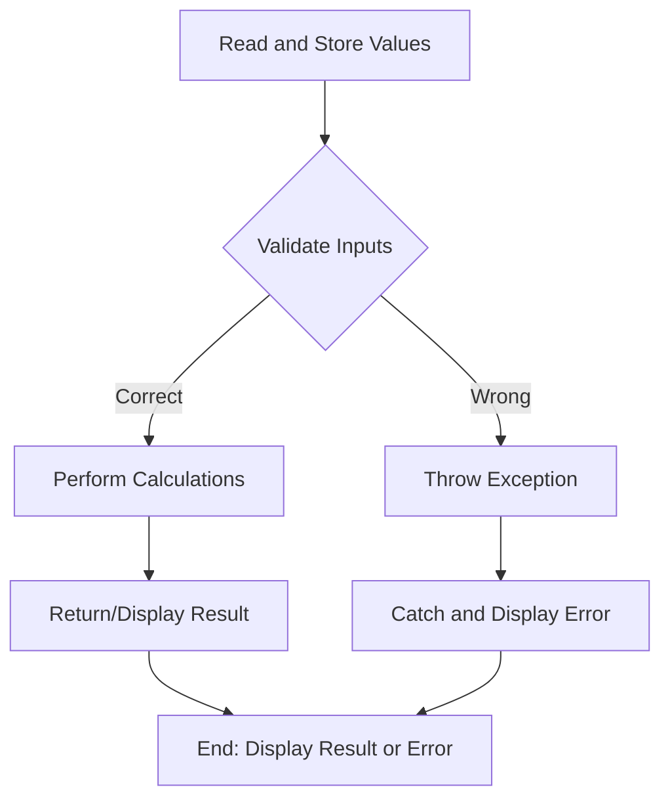

# Session 38: Language Fundamentals and Building Logic

## Table of Contents
- [Introduction and Recap](#introduction-and-recap)
- [Need for Programming Languages and Programs](#need-for-programming-languages-and-programs)
- [Manual vs. Programmatic Operations](#manual-vs-programmatic-operations)
- [Activities in Performing an Operation](#activities-in-performing-an-operation)
- [Language Fundamentals](#language-fundamentals)
- [Flowchart for Program Execution](#flowchart-for-program-execution)
- [Sample Program Development](#sample-program-development)

## Introduction and Recap

### Overview
This session recaps previous topics on Java file structures (packages, imports, classes, variables, blocks, constructors, methods, inner classes) and explains the necessity of programming languages and programs, differentiating manual and automated operations. It emphasizes the five key activities in performing operations and introduces the four language fundamentals essential for building logic in Java.

### Key Concepts/Deep Dive
After covering Java file elements and accessibility modifiers, the instructor clarifies that understanding variables is prerequisite for grasping classes, blocks, constructors, methods, and inner classes. The session transitions to discussing why programs are created for automated, secure, and efficient operations.

```diff
+ Programming languages enable automated, fast, and accurate operations with benefits like 24/7 availability, good customer relations, security, and reduced fraud.
- Manual operations have limitations like time constraints, human errors, and inconvenience.
```

## Need for Programming Languages and Programs

### Overview
A programming language is used to develop programs that communicate with computers to perform operations in an automated way, offering benefits over manual processes such as continuous service, better security, and reduced errors.

### Key Concepts/Deep Dive
- **Programming Language**: Tool for creating programs to automate operations.
- **Program**: Set of instructions for automated operation execution.
- **Automation Benefits**:
  - 24/7/365 availability.
  - Improved customer relations (no mood-dependent responses).
  - Enhanced security (harder to cheat systems).
  - Fast, accurate, and fraud-resistant transactions.

```diff
+ Automates operations for efficiency and reliability: Reduces manual errors and provides consistent service.
- Manual processes are time-consuming, error-prone, and limited by human factors like availability and mood.
```

## Manual vs. Programmatic Operations

### Overview
Using a mobile recharge example, the session contrasts manual recharge (going to shops, dealing with time delays and varying service quality) with automated apps (instant, reliable, and friendly service via servers).

### Key Concepts/Deep Dive
- **Manual Operation Drawbacks**:
  - Time-consuming shop visits.
  - Queue delays and poor service.
  - Human-related issues like irritability.
  - No 24/7 availability.
- **Automated Operation Advantages**:
  - Instant results with minimal effort.
  - Consistent, predefined responses.
  - Fraud and error reduction.

```diff
+ Programmatic operations eliminate human variability, ensuring 24/7 access and reduced errors.
- Manual processes depend on external factors, leading to inconsistencies and inconveniences.
```

## Activities in Performing an Operation

### Overview
Performing any operation (e.g., addition) involves five activities: reading inputs, validating them, performing calculations, controlling flow, and handling exceptions. These form the basis for program logic.

### Key Concepts/Deep Dive
1. **Read and Store Inputs**: Collect data into program memory.
2. **Validate Inputs**: Check for correctness (e.g., positive numbers).
3. **Perform Calculations**: Execute logic if inputs valid.
4. **Control Flow**: Decide which code blocks execute based on conditions.
5. **Throw Exceptions**: Handle invalid inputs by signaling errors.

```diff
+ These five activities ensure robust, error-handled program execution, regardless of operation type (e.g., addition, mobile recharge).
- Skipping any activity risks incomplete or incorrect results.
```

## Language Fundamentals

### Overview
Java's four language fundamentals—data types, operators, control flow statements, and exception handling—support the five activities in operations. They enable memory allocation, validations/calculations, flow control, and error management.

### Key Concepts/Deep Dive
- **Data Types**: Allocate memory for storing values.
  - Examples: `int`, `String`, user-defined classes like `IllegalArgumentException`.
  - Used for variables like `int result` or object references.

- **Operators**: Perform validations and calculations.
  - Validation: `<`, `>`, `||` for conditions.
  - Calculation: `+`, `-` for arithmetic.
  - Concatenation: `+` for string joining.

- **Control Flow Statements**: Direct execution paths.
  - `if-else`: Decide based on conditions (e.g., if negative, throw exception; else calculate).
  - Ensures only valid logic executes.

- **Exception Handling Statements**: Manage errors.
  - Keywords: `throw`, `throws`, `try`, `catch`, `finally`.
  - `throw`: Signal errors (e.g., `throw new IllegalArgumentException("Do not pass negative numbers")`).
  - `throws`: Report exceptions to caller.
  - `try-catch`: Catch and handle thrown exceptions.

```diff
+ Each fundamental maps to operation activities: Data types for storage, operators for validation/calculation, control flow for decisions, exceptions for error signaling.
- Misusing fundamentals leads to insecure or inefficient code.
```

## Flowchart for Program Execution

### Overview
The execution flow includes reading/storing values, validating inputs, performing calculations or throwing exceptions, and displaying results.

### Key Concepts/Deep Dive
- **Flow Steps**:
  1. Read and store values.
  2. Validate: If correct, perform calculations and return/display result; if wrong, throw exception.
  3. Handle output: Display result or error message.



## Sample Program Development

### Overview
Develop a program to add two positive numbers; throw exception for negatives. Demonstrates all fundamentals in action.

### Key Concepts/Deep Dive
- **Class Structure**: 
  - `Calculator.java`: Main class with `main` method for execution.
  - `Addition.java`: Static method `add(int a, int b)` for logic.

### Lab Demos

1. **Create Calculator Class**:
   - Declare result variable.
   - Use try-catch to handle exceptions.
   - Call `Addition.add(5, 6)` for positive inputs.

2. **Create Addition Class**:
   - `add` method: Validate inputs, throw `IllegalArgumentException` if negative, else return sum.

**Calculator.java**
```java
class Calculator {
    public static void main(String[] args) {
        try {
            int result = Addition.add(5, 6);
            System.out.println("Result: " + result);
        } catch (IllegalArgumentException e) {
            System.out.println("Error: " + e.getMessage());
        }
    }
}
```

**Addition.java**
```java
class Addition {
    public static int add(int a, int b) throws IllegalArgumentException {
        if (a < 0 || b < 0) {
            throw new IllegalArgumentException("Do not pass negative numbers");
        } else {
            int c = a + b;
            return c;
        }
    }
}
```

### Execution Flow
- **Positive Case**: Inputs (5,6) → Validate (pass) → Add → Return 11 → Display "Result: 11"
- **Negative Case**: Inputs (-5,6) → Validate (fail) → Throw Exception → Catch → Display "Error: Do not pass negative numbers"

## Summary

### Key Takeaways
```diff
+ Language fundamentals are the building blocks for Java programs, mapping directly to operation activities.
+ Automation via programs solves manual limitations with scalability, security, and efficiency.
+ Five core activities: Input reading, validation, calculation, flow control, exception handling.
- Overlooking validation or flow control leads to runtime errors and poor user experience.
! Exception handling ensures graceful error management without abnormal termination.
```

### Expert Insight
- **Real-world Application**: Used in apps like e-commerce checkouts or banking systems to validate inputs (e.g., positive amounts) and prevent fraud.
- **Expert Path**: Master operators for efficient validations, combine control flow with exceptions for resilient code, and practice flowchart design for complex logic.
- **Common Pitfalls**:
  - Forgetting to validate inputs leads to incorrect calculations (e.g., negative additions in financial apps).
  - Misusing `throw` without `try-catch` causes unhandled exceptions.
  - Concatenating mixed types incorrectly (e.g., strings vs. ints).
