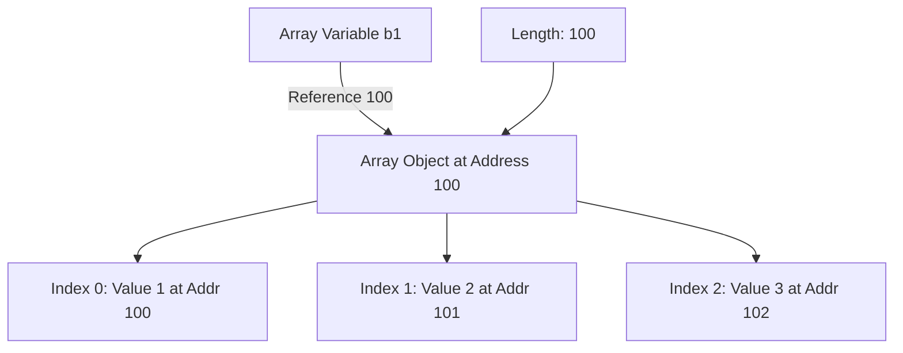

# Session 42: Data Types 4: Limitations of Variables and Introduction to Arrays

| Section | Description |
|---------|-------------|
| [Floating-Point and Decimal Numbers](#floating-point-and-decimal-numbers) | Understanding data formats for fractional values |
| [Variable Limitations](#variable-limitations) | Why single variables cannot handle multiple values efficiently |
| [Introduction to Arrays](#introduction-to-arrays) | Arrays as a solution for storing multiple values |
| [Creating Arrays](#creating-arrays) | Syntax and steps for array creation |
| [Array Memory Structure](#array-memory-structure) | Visualizing how arrays store data in memory |
| [Reading and Modifying Arrays](#reading-and-modifying-arrays) | Accessing and changing array elements |
| [Array Advantages](#array-advantages) | Solving variable limitations with arrays |
| [Summary](#summary) | Key takeaways and expert insights |

## Floating-Point and Decimal Numbers

### Overview
This session explores how Java handles numeric data types, particularly focusing on decimal and floating-point numbers. We differentiate between integers, decimals, and floating-point representations, building toward understanding why we need arrays for managing multiple values.

### Key Concepts/Deep Dive
- **Decimal Numbers**: Values with fractional parts, written with a decimal point (e.g., 10.5). In Java, these are represented using `float` or `double` data types.
- **Floating-Point Numbers**: Numbers that can represent very large or very small values with fractional parts. Example: `1.234f` (float) or `1.234` (double by default).
- **Key Terms**:
  - Integer portion: The whole number part before the decimal point (e.g., 10 in 10.5).
  - Fractional portion: The part after the decimal point (e.g., 0.5 in 10.5).
- **Java Representation**:
  - `int` or `long`: For integer numbers without decimals.
  - `float`: For single-precision floating-point numbers (suffix with `f`, e.g., `5.88f`).
  - `double`: For double-precision floating-point numbers (default for decimals).

```java
int integerValue = 10;          // Integer
double decimalValue = 1.234;    // Decimal (double)
float floatingValue = 1.234f;    // Floating-point (float)
```

### Common Mistakes in Transcript
- "cript" in the beginning appears to be a typographical error, likely intended as "script" referring to the Java script or code context.

## Variable Limitations

### Overview
Variables in Java can hold only one value at a time. This creates challenges when storing, reading, or passing multiple related values. We explore this limitation through practical examples and introduce arrays as the solution.

### Key Concepts/Deep Dive
- **Single Value Storage**: A variable like `byte b1 = 1;` stores only one value. Assigning a new value (e.g., `b1 = 2;`) overwrites the original.
- **Problems with Multiple Variables**:
  - Reading inefficiency: Values scattered in non-contiguous memory locations require searching.
  - Static program nature: Methods must have fixed parameter counts, making dynamic value handling impossible.
- **Example Limitation**:

```java
byte b1 = 1;  // Stores 1
b1 = 2;       // Overwrites to 2; original value lost
```

- **Memory Impact**: Multiple variables (e.g., b1, b2, b3) created in different memory locations lead to slow access and wasted space.
- **Parameter Passing Issue**: Methods with fixed parameters (e.g., `add(byte b1, byte b2)`) cannot handle varying argument counts.

```java
// Static method - cannot handle 3 arguments without code modification
public static void add(byte b1, byte b2) {
    System.out.println(b1 + b2);
}
// add(1, 2, 3); // Error: Too many arguments
```

- **Return Value Limitation**: A method can return only one value, not multiples (e.g., both addition and subtraction results).

```java
// Cannot return multiple values
public static int add(int a, int b) {
    return a + b;  // Only one return value
    // return a - b; // Unreachable, compilation error
}
```

### Code/Config Blocks
- **Problem Demonstration**:

```java
// Multiple variables approach
byte b1 = 1;
byte b2 = 2;
byte b3 = 3;
// This creates scattered memory and requires many variables
```

- **Method Limitation**:

```java
public static int addMultiple(int a, int b, int c) {
    return a + b + c;  // Only sum returned, not individual results
}
```

## Introduction to Arrays

### Overview
Arrays provide a way to store multiple values of the same type in a single group with one name. They solve variable limitations by enabling efficient storage, reading, and passing of multiple values.

### Key Concepts/Deep Dive
- **Array Definition**: A reference data type for creating a group of multiple values with a single name.
- **Reference Data Type**: Unlike primitive types (e.g., `int`), arrays store references to memory locations containing the actual values.
- **Group Storage**: Arrays treat multiple values as one entity, unlike separate variables.
- **Single Name Referencing**: An array variable points to the entire group of values.

### Tables

| Feature | Variable | Array |
|---------|----------|-------|
| Stores | One value | Multiple values |
| Memory | Scattered if multiple | Contiguous memory locations |
| Parameter Passing | One value per parameter | Entire array as one parameter |
| Return Values | One value | Multiple through array reference |
| Static Nature | Requires fixed code | Dynamic sizing allowed |

## Creating Arrays

### Overview
Creating an array involves defining its data type, variable name, and initializing it with values using specific syntax. We distinguish between array variables and array objects.

### Key Concepts/Deep Dive
- **Syntax Basics**:
  - **Array Variable**: `dataType[] variableName;` (e.g., `int[] ia;`)
  - **Array Object**: `dataType[] variableName = {value1, value2, value3};` or `new dataType[size]`
- **Key Components**:
  - Data type: Must match all elements (e.g., `byte`, `int`).
  - Square brackets `[]`: Indicate array type.
  - Curly braces `{}`: Initialize with values.
- **Reference Creation**: Arrays are reference types, so the variable holds a memory address (reference) to the array object.

### Code/Config Blocks
- **Array Creation Example**:

```java
// Array variable declaration (byte[] is byte array, not byte)
byte[] b1;  // Array variable, no array object yet

// Array object creation with values
byte[] b1 = {1, 2, 3, 4, 5};  // Creates array with 5 byte values

// Alternative syntax with 'new'
int[] ia = new int[100];  // Creates int array of size 100 (all zeros by default)
```

- **Memory Creation**: Each `new dataType[size]` allocates contiguous memory for 'size' elements.

## Array Memory Structure

### Overview
Arrays store elements in contiguous memory locations, unlike scattered variables. This structure enables efficient access using indexes and a single reference.

### Key Concepts/Deep Dive
- **Memory Layout**:
  - Array variable: Holds the memory address (reference) of the first element.
  - Array object: Circle of connected memory boxes for each element.
- **Index System**: Elements accessed by zero-based index (0, 1, 2, ...).
- **Contiguous Storage**: Values stored in sequential memory locations for fast access.
- **Length Variable**: Arrays have a built-in `length` property indicating total elements.

### Lab Demos
1. **Visualizing Array Memory**:
   - Imagine an apartment building:
     - Main gate: Reference to the array.
     - Floors/Flats: Index-based access to elements.
   - Memory diagram: Variable points to first element's address.

2. **Practical Creation**:
   - Write code: `byte[] b1 = new byte[0];  // Zero-size array`
   - Add elements: `byte[] b1 = {1, 2, 3, 4, 5};`
   - Access: First element at index 0, last at index (length-1).

### Diagrams


- This diagram shows the variable pointing to the array's starting address, with contiguous element storage.

## Reading and Modifying Arrays

### Overview
Array elements are accessed using the array variable name followed by square brackets containing the index. Values can be read or modified individually.

### Key Concepts/Deep Dive
- **Reading Elements**: `arrayName[index]` retrieves the value at that position.
- **Modifying Elements**: `arrayName[index] = newValue;` writes a new value.
- **Index Rules**: Starts from 0, goes up to (length - 1).
- **Iterative Access**: Use loops (e.g., for loop) for reading all elements efficiently.

### Code/Config Blocks
- **Reading Example**:

```java
byte[] b1 = {1, 2, 3, 4, 5};
System.out.println(b1[0]);  // Prints: 1
System.out.println(b1[4]);  // Prints: 5
```

- **Modifying Example**:

```java
byte[] b1 = {1, 2, 3, 4, 5};
b1[2] = 15;  // Change index 2 from 3 to 15
b1[3] = (byte) (b1[0] + b1[1]);  // Modify using calculations
```

- **Note**: Length can be accessed via `b1.length` (returns 5 in this case).

### Lab Demos
1. **Step-by-Step Reading**:
   - Declare: `int[] data = {10, 20, 30};`
   - Read: `System.out.println(data[0]);` → 10
   - Modify: `data[1] = 50;` → Now {10, 50, 30}
   - Calculate: `data[2] = data[0] + data[1];` → Sum of first two elements

2. **Runtime Modification**:
   - Create array object.
   - Access via index.
   - Verify changes with print statements.

## Array Advantages

### Overview
Arrays overcome variable limitations by enabling efficient storage, dynamic parameter handling, and multiple return values.

### Key Concepts/Deep Dive
- **Multiple Value Storage**: Single name for a group of values.
- **Contiguous Memory**: Faster reading than scattered variables.
- **Dynamic Methods**: Pass varying numbers of arguments without changing method signatures.
- **Multiple Returns**: Return arrays containing multiple results.
- **Parameter Flexibility**: Array as argument accepts any number of values.

### Code/Config Blocks
- **Dynamic Method with Arrays**:

```java
public static void add(byte[] values) {
    // Method body can handle any number of values
    for (int i = 0; i < values.length; i++) {
        System.out.println(values[i]);
    }
}

// Usage:
byte[] arr1 = {1, 2};
byte[] arr2 = {1, 2, 3, 4};
add(arr1);  // Works with 2 values
add(arr2);  // Works with 4 values
```

- **Multiple Return Values**:

```java
public static int[] addSub(int a, int b) {
    int[] result = {a + b, a - b};
    return result;  // Returns array with both addition and subtraction
}
```

### Tables

| Limitation Solved | Variable Approach | Array Solution |
|-------------------|-------------------|----------------|
| Multiple Storage | Many variables, scattered memory | One array, contiguous memory |
| Parameter Passing | Fixed parameters per method | Single array parameter handles varying counts |
| Return Values | One value only | Return array for multiple values |
| Dynamic Code | Requires code changes for different inputs | Code remains static, data drives logic |

## Summary

### Key Takeaways
```diff
+ Arrays solve variable limitations by storing multiple values in contiguous memory with a single name.
+ Floating-point numbers (e.g., float, double) handle decimal values like 1.234 or 5.88f.
+ Variables can hold only one value; arrays enable groups of values with dynamic access via indexes.
+ Array creation requires data type[], curly braces for initialization, and references for memory management.
+ Reading: arrayName[index]; Modifying: arrayName[index] = newValue.
- Avoid treating arrays like primitive variables; they are reference types requiring memory allocation.
- Do not exceed array bounds (indexes beyond length - 1) to prevent runtime errors.
! Arrays enable dynamic methods and multiple returns, making programs more flexible than static variable-based approaches.
```

### Expert Insight

#### Real-world Application
Arrays are fundamental in enterprise applications for handling data sets like user lists, sensor readings, or financial transactions. For example, in a banking app, an array of `double` values could store monthly balances, processed efficiently without individual variables. This scales for thousands of records, unlike variable cascades.

#### Expert Path
Master arrays by practicing loop-based traversal and multi-dimensional arrays. Understand `ArrayList` for dynamic sizing in advanced Java (Collections Framework). Avoid common pitfalls by always checking bounds and preferring `Arrays.sort()` for performance. Build expertise through projects like sorting algorithms or data processors. 💡

#### Common Pitfalls
- **Confusing Variables and Objects**: Forgetting `new` for array objects leads to null reference errors. Always initialize arrays properly.
- **Index Out-of-Bounds**: Accessing `array[length]` causes exceptions; use length-based loops.
- **Primitive Confusion**: Arrays like `int[] arr` don't store primitives directly; they store references to primitive-holding memory.
- **Memory Misunderstandings**: Assuming contiguous memory means instant access—real-time applications require profiling for large arrays.

#### Lesser Known Things About Arrays
- **Hidden Length Variable**: The `length` property is final (unchangeable), saving space calculation overhead in loops.
- **Default Values**: Uninitialized array elements get default values (e.g., 0 for int, null for objects).
- **Covariance Issues**: Array subtyping (e.g., `String[]` as `Object[]`) can cause ClassCastException in real operations.
- **Immutable References**: Once created, array size is fixed; resizing requires new arrays or collections. 🔧
