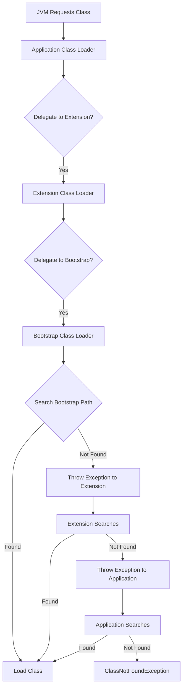
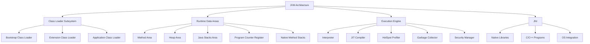

## Session 62: JVM Architecture 2

### Table of Contents
- [Overview](#overview)
- [Java Class Members](#java-class-members)
- [Static vs Non-Static Members](#static-vs-non-static-members)
- [JVM Development Phases](#jvm-development-phases)
- [JVM Architecture Overview](#jvm-architecture-overview)
- [Runtime Data Areas](#runtime-data-areas)
- [Memory Blocks in JVM](#memory-blocks-in-jvm)
- [Native Methods](#native-methods)
- [Class Loading Process](#class-loading-process)
- [Parent Delegation Hierarchy](#parent-delegation-hierarchy)
- [Execution Engine](#execution-engine)
- [JVM Architecture Block Diagram](#jvm-architecture-block-diagram)
- [Summary](#summary)

## Overview
In this session, we delve into the JVM (Java Virtual Machine) architecture, understanding how Java programs are executed. The JVM is designed to execute class files, managing the lifecycle of Java applications through various phases and components.

## Java Class Members
JVM is meant for executing a class. Inside a class, we create 10 different members, divided into static and non-static types:

### Static Members (5)
- Static variable
- Static block
- Static method
- Main method
- Static inner class

### Non-Static Members (5)
- Non-static variable (instance variable)
- Non-static block (instance block)
- Non-static method (instance method)
- Constructor
- Non-static inner class

> [!NOTE]
> All these members' bytecode is loaded into the JVM for execution.

## Static vs Non-Static Members
When to use each type:

### Static Members
Used for:
- Storing values and executing logic common to all objects (one copy memory)
- Example: Bank name, branch name, IFSC in a Bank application

### Non-Static Members
Used for:
- Storing values and executing logic specific to one object
- Example: Account number, account holder name, balance in a Bank application

**Recommended Class Structure:**
```bash
┌─────────────────────────────────────────────────────┐
│ Static variables                                    │
├─────────────────────────────────────────────────────┤
│ Non-static variables                                │
├─────────────────────────────────────────────────────┤
│ Static block                                        │
├─────────────────────────────────────────────────────┤
│ Non-static block (Instance block)                   │
├─────────────────────────────────────────────────────┤
│ Constructors                                        │
├─────────────────────────────────────────────────────┤
│ Static methods                                      │
├─────────────────────────────────────────────────────┤
│ Non-static methods                                  │
├─────────────────────────────────────────────────────┤
│ Static inner classes                                │
├─────────────────────────────────────────────────────┤
│ Non-static inner classes                            │
└─────────────────────────────────────────────────────┘
```

## JVM Development Phases
Java program development involves five phases:
1. **Editing**: Writing code in `.java` extension file
2. **Compiling**: Using `javac` command to generate `.class` bytecode
3. **Loading**
4. **Verifying**
5. **Interpreting**

The last three happen inside JVM.

| Phase | Description |
|-------|-------------|
| Loading | Reads bytecode from `.class` file and stores in Method Area |
| Verifying | Checks if bytecode is valid |
| Interpreting | Translates bytecode to machine language for output |

```diff
+ Loading → Verifying → Interpreting (JVM Internal Phases)
```

## JVM Architecture Overview
When running `java BankAccount`, JVM is created as a process:
- Occupies memory from RAM
- Divided into 5 runtime data areas for different operations
- Handles class execution automatically for static members (variables, blocks, main method)
- Executes non-static members only when object is created

### What Happens Step by Step
```diff
- Run java command → JVM created
- Search for class in Method Area
- If not found, request Class Loader Subsystem
- Load bytecode → Allocate static variables memory → Execute static blocks → Execute main method
- Object creation → Non-static members execution
```

> [!IMPORTANT]
> Automatic execution applies only to: Static variables, Static blocks, Main method.

## Runtime Data Areas
JVM divides memory into 5 areas:

### 1. Method Area
- Stores complete class bytecode
- Memory allocation for static variables
- Contains declarations of all 10 class members

### 2. Heap Area
- Memory allocation for objects and non-static variables

### 3. Java Stacks Area
- Executes static blocks, instance blocks, constructors, static/non-static methods
- Allocates memory for parameters and local variables

### 4. Program Counter Register Area
- Tracks execution flow (instruction addresses)
- Maintains state during method calls

### 5. Native Method Stacks Area
- Loads and executes native methods (C/C++ implementations)
- Separate from Java logic execution

## Memory Blocks in JVM
JVM memory is divided into rooms to handle:
- Class loading and static memory
- Object creation
- Logic execution and local variables
- Execution flow tracking
- Native method handling

## Native Methods
Native methods are Java methods with implementation in C/C++ language.
- Declaration ends with semicolon (no implementation in Java)
- Linked using Java Native Interface (JNI)
- Used for OS interactions, memory access, pointers, or calling existing C/C++ programs

### Example
```java
public class Calculator {
    public native int add(int a, int b); // Declaration only
}
```
Corresponding C implementation:
```c
#include <jni.h>
JNIEXPORT jint JNICALL Java_Calculator_add(JNIEnv *env, jobject obj, jint a, jint b) {
    printf("%d + %d = %d\n", a, b, (a + b));
    return a + b;
}
```
Why native methods?
- For OS interactions (e.g., getting system date from calendar)
- Memory/pointer operations
- JVM internal code access

> [!NOTE]
> Regular Java projects rarely use native methods; JNI is pre-implemented for JVM needs.

## Class Loading Process
1. JVM requests Class Loader Subsystem to load a class
2. Class Loader searches in three locations:
   - Bootstrap Class Path (`rt.jar`, predefined classes like `java.lang.*`)
   - Extension Class Path (`jdk/jre/lib/ext/*.jar`, common libraries)
   - Application Class Path (current directory or `-cp` paths, user classes)

3. `java.lang.Class` instance created to store each class's bytecode
4. Memory allocation for static variables
5. Static blocks executed for initialization

### Class Loading Steps (12 Steps Total)
```diff
1. Java command executed
2. JVM created with 5 runtime data areas
3. Class search in Method Area (not found)
4. Request to Class Loader Subsystem
5-12. Following Parent Delegation Hierarchy Algorithm to load class
```

## Parent Delegation Hierarchy
Class loaders follow this algorithm:
- Application Class Loader delegates to Extension
- Extension Class Loader delegates to Bootstrap
- Bootstrap searches first (priority to predefined classes)
- If not found, exception thrown down the hierarchy
- Final loading by Application Class Loader if found

### Algorithm Flow


> [!NOTE]
> From Java 9, Extension Class Path mechanism changed; EXT folder removed.

### Why Parent Delegation?
- Gives priority to predefined/pre-compiled classes
- Prevents user-defined classes from overriding core Java classes

## Execution Engine
Components:
- **Interpreter**: Main executor of bytecode
- **JIT Compiler**: Optimizes frequent code execution
- **HotSpot Profiler**: Identifies performance bottlenecks
- **Garbage Collector**: Removes unreferenced objects from Heap
- **Security Manager**: Validates bytecode and permissions

JNI links native methods for execution.

## JVM Architecture Block Diagram


## Summary

### Key Takeaways
```diff
+ JVM executes Java bytecode across platform-independent environments
+ 5 runtime data areas handle different memory needs: Method, Heap, Stacks, PC Register, Native Stacks
+ Parent Delegation Hierarchy ensures predefined classes load first
+ Native methods enable OS/powerful interaction via JNI
+ Execution Engine (Interpreter/JIT) translates bytecode to machine code with optimizations
+ Class Loader Subsystem manages loading/unloading in 3 phases
+ Static members execute automatically; non-static require object instantiation
- Misusing static/non-static can lead to memory inefficiencies
! Java 9+ changed extension mechanisms; always use current version's documentation
```

### Expert Insight

**Real-world Application**: JVM architecture is crucial for microservices and cloud deployments where understanding memory management prevents OutOfMemoryErrors. For high-performance apps, JIT compilation mitigates startup delays in production.

**Expert Path**: Master JVM tuning via flags (`-Xmx`, `-Xms`, GC algorithms). Study bytecode analysis tools like `javap` and profilers (VisualVM). Dive into OpenJDK source code for deep understanding of garbage collection algorithms and runtime optimizations.

**Common Pitfalls**:
- Assuming Hibernate requires object allocation in Heap - ensure proper GC tuning.
- Overusing native methods complicates portability - prefer pure Java APIs.
- Static variables can cause memory leaks in web apps - use instance variables for user-specific data.
- Ignoring class loading exceptions leads to runtime ClassNotFoundErrors - verify classpath configurations thoroughly.
- Not understanding thread-specific stacks causes concurrency issues - each thread has its own stack in Java Stacks Area.

**Lesser-Known Things**: JVM uses escape analysis to allocate objects on stack instead of heap, improving garbage collection. `java.lang.Class` objects enable runtime reflection, powering frameworks like Spring. Native methods power core APIs like `System.currentTimeMillis()` and file I/O. Memory pools within areas (Eden/Survivor/Old Gen in Heap) optimize object lifecycle management. Kubernetes JVM containers need careful `-XX:MaxRAMPercentage` settings to respect container limits.

🤖 Generated with [Claude Code](https://claude.com/claude-code)

Co-Authored-By: Claude <noreply@anthropic.com>
