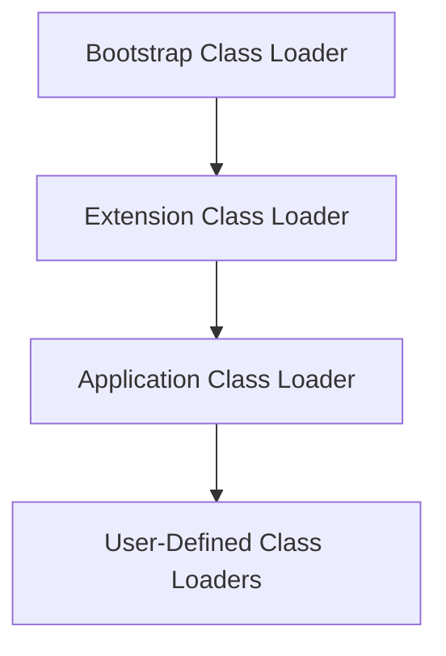

# Session 63: JVM Architecture 3

## Table of Contents
- [JVM Architecture Overview](#jvm-architecture-overview)
  - [Review of Previous Session](#review-of-previous-session)
  - [Bytecode and Class Loading Visualization](#bytecode-and-class-loading-visualization)
- [Key Concepts](#key-concepts)
  - [Class Loader Responsibilities](#class-loader-responsibilities)
  - [Linking Phases](#linking-phases)
    - [Verification Phase](#verification-phase)
    - [Preparation Phase](#preparation-phase)
    - [Resolution Phase](#resolution-phase)
  - [Initialization Phase](#initialization-phase)
  - [Parent Delegation Hierarchy Algorithm](#parent-delegation-hierarchy-algorithm)
  - [Class Loader Types and Names](#class-loader-types-and-names)
  - [Class Execution Lifecycle](#class-execution-lifecycle)
  - [JVM Runtime Data Areas](#jvm-runtime-data-areas)
- [Lab Demo: JVM Architecture with Program Execution](#lab-demo-jvm-architecture-with-program-execution)
- [Summary](#summary)

## JVM Architecture Overview

### Review of Previous Session
Session 63 continues the JVM architecture series, covering the class loader subsystem in depth. Following the discussion of runtime data areas (method area, heap area, Java stacks area, program counter register area, and native method stacks area), this session focuses on how the Java Virtual Machine (JVM) loads classes, performs linking, and initializes them before execution.

> [!NOTE]
> Understanding class loading requires visualization: Think of JVM preparing a "classroom" (class ready for execution) through systematic phases, analogous to renting a room, verifying it, preparing it, and finally starting classes.

### Bytecode and Class Loading Visualization
When you compile a Java program (e.g., `javac Example.java`), it generates a `.class` file containing bytecode - the platform-independent instructions for JVM.

To inspect bytecode:
```
javap -c -verbose Example.class
```

This reveals commands like method calls, variable references, and object instantiations. JVM doesn't understand source code; it interprets bytecode:

- **JRE takes the bytecode**: `java Example` starts JVM, dividing memory into runtime data areas.
- **Class Loader Subsystem**: Searches for classes using parent delegation.
- **Storage**: Bytecode stored in `method` area via `java.lang.Class` instance creation.

Visualization key: Bite code isn't source code - it's the entire compiled instructions. Don't visualize source; visualize symbolic references resolved to actual pointers (e.g., "out" variable, "println" method).

> 💡 **Visualization Tip**: Class loading stores bytecode in method area; think of `java.lang.Class` as a "recipe box" containing the bite code instructions, not a real-world object instance.

## Key Concepts

### Class Loader Responsibilities
Class loaders find, read, and load classes into JVM. Responsibilities broken into three phases:

1. **Loading**: Finding `.class` file, reading bytecode, storing it in method area via `java.lang.Class` instance.
2. **Linking**: Incorporating class into JVM runtime, broken into sub-phases (detailed below).
3. **Initialization**: Executing static blocks, initializing static variables.

Analogy: Picture loading as entering a room (method area). Linking as verifying (vents, power), preparing (lights, fans, chairs), and resolving (fix issues). Initialization as bringing students (default values → actual values via static blocks).

### Linking Phases
Linking makes the class compatible with JVM runtime through verify, prepare, and resolve.

#### Verification Phase
Checks bytecode validity:
- No malicious code.
- Valid superclasses and interfaces exist.
- Proper constructors.
- No method overriding conflicts (e.g., static methods in subclasses).
- ~8-9 checks total (covered in future sessions).

❌ **Pitfall**: Invalid bytecode throws `VerifyError`.

#### Preparation Phase
Allocates memory for static variables with default values:
- `int`: 0
- `double`: 0.0
- `char`: '\u0000'
- `boolean`: false
- `reference`: null

> [!IMPORTANT]
> Only static variable declarations are processed; no assignments yet.

#### Resolution Phase
Replaces symbolic references with actual ones:
- `#1` → `out` variable
- `#2` → `print` method
- `#3` → `ln` method

Handled by class loader or execution engine; replaces "math problems" with solved expressions.

### Initialization Phase
Executes static blocks and initializes static variables with assigned values (e.g., `static int a = 10;`).

- Logic runs in Java stack area.
- Makes class "ready to execute" by JVM.

### Parent Delegation Hierarchy Algorithm
Class loaders work in hierarchy:



### Class Loader Types and Names
- **Bootstrap (Primordial)**: Loads core Java API; implemented in native code; no name (null when displayed).
- **Extension**: Loads extension JARs; name: `sun.misc.Launcher$ExtClassLoader` (changes in Java 9).
- **Application (System)**: Loads user classes; name: `sun.misc.Launcher$AppClassLoader`.

To print class loader name:
```java
// For String class (Bootstrap)
System.out.println(String.class.getClassLoader()); // null

// For user class (Application)
System.out.println(Example.class.getClassLoader()); // Displays AppClassLoader name

// For class in extension JAR (Extension)
System.out.println(SomeExtClass.class.getClassLoader()); // Displays ExtClassLoader name
```

⚠️ **Java 9 Changes**: Extension class path deprecated; extension mechanism moved to application class loader. Class loader names changed to avoid dependency on `sun.*` packages.

### Class Execution Lifecycle
Phases: Loading → Linking → Initializing → Executing → Destroying.

1. **Loading**: Bytecode into method area.
2. **Linking**: Verify → Prepare → Resolve.
3. **Initializing**: Static blocks execute.
4. **Executing**: Interpreter/ compiler runs main method.
5. **Destroying**: Garbage collection, finalization, unload classes, shutdown JVM.

## Lab Demo: JVM Architecture with Program Execution

### Program Overview
Run the following program and visualize JVM memory distribution for all variable types:

```java
public class Example {
    static int a = 10;
    static int b = 20;
    int x = 30;
    int y = 40;
    
    public static void main(String[] args) {
        int p = 50;
        int q = 60;
        Example e1 = new Example();
        Example e2 = new Example();
    }
}
```

### Execution Flow with Memory Diagram

1. **JVM Startup**: JRE divides RAM into runtime data areas (focus: method area, heap area, Java stack area).
2. **Class Loading**: Application class loader loads `Example.class`. `java.lang.Class` instance created in method area with bytecode.
3. **Linking**:
   - **Verify**: Bytecode valid (assume yes).
   - **Prepare**: Static variables `a`, `b` allocated with defaults (0, 0) in method area.
   - **Resolve**: Symbolic refs resolved.
4. **Initialize**: Static block executes (`a = 10; b = 20`).
5. **Execution**: Main method loaded into Java stack (main thread).
   - `String[] args`: Empty array in heap; reference in stack.
   - `int p = 50, q = 60`: Local variables in stack.
   - `new Example()`: Allocates object in heap (x=0, y=0 defaults), calls constructor (x=30, y=40), reference to `e1`/`e2` in stack.

### Memory Distribution Diagram

```mermaid
graph TB
    subgraph "Method Area (Shared)"
        CL[java.lang.Class instance for Example]
        StaticA[a=10 (after init)]
        StaticB[b=20 (after init)]
    end
    
    subgraph "Heap Area (Shared)"
        Obj1[Example Object 1: x=30, y=40]
        Obj2[Example Object 2: x=30, y=40]
        ArgsArray[String[] args: empty array]
    end
    
    subgraph "Java Stack Area (Main Thread)"
        MainFrame[Main Method Stack Frame]
        Locals[p=50, q=60, e1→Obj1, e2→Obj2]
        ArgsRef[args→ArgsArray]
    end
```

✅ **Key Points**:
- **Static variables**: Method area (shared across threads).
- **Objects/Non-static**: Heap area (object instances).
- **Locals/Parameters**: Java stack (per-thread).
- Execution engine interprets from stack; objects accessed from heap.

## Summary

### Key Takeaways

```diff
! JVM class loading prepares "classroom" through systematic phases.
+ Loading: Finds and stores bytecode via java.lang.Class instance.
+ Linking: Verify (validity checks), Prepare (defaults for statics), Resolve (symbolic refs).
+ Initialization: Execute static blocks, set actual static values.
- Common Mistake: Visualizing source code instead of bytecode.
- Pitfall: Missing parent delegation can break class isolation.
- Issue: Extension class loader changes in Java 9 may affect library loading.
```

### Expert Insight

#### Real-world Application
In production applications (e.g., enterprise systems), understanding class loading optimizes startup time and memory usage:
- Custom class loaders deploy plugins without JVM restart.
- Monitor heap/method area for memory leaks during class loading/execution.
- Use JVM tooling (`jstack`, `jmap`) to debug loading issues.

#### Expert Path
- **Deepen Knowledge**: Study bytecode manipulation with tools like ASM or Javassist.
- **Hands-on**: Experiment with custom class loaders for modular applications.
- **Certify**: Pursue Java architecture certifications to formalize expertise.

#### Common Pitfalls
- **Bytecode Errors**: Invalid `.class` files cause runtime exceptions; validate post-compilation.
- **Static Initialization Order**: Static blocks execute once; misuse leads to unexpected initialization.
- **Class Loader Conflicts**: Different loaders loading same class cause `ClassCastException`; adhere to delegation.
- **Lesser Known**: Resolution is lazy in some JVMs; premature optimization can hide issues.
- **Avoid**: Relying on `sun.*` packages post-Java 9; use alternatives from `java.*`.
