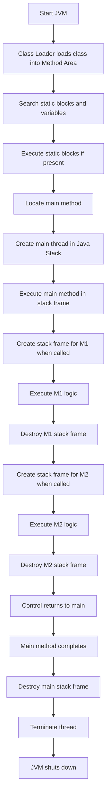
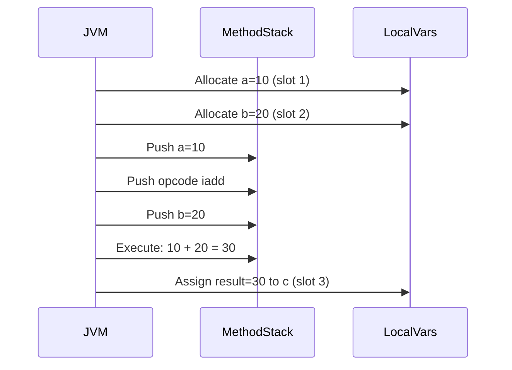

# Session 64: Static Members and Execution Flow 1

## Table of Contents
1. [JVM Architecture and Execution Flow](#jvm-architecture-and-execution-flow)
2. [Thread Concept and Stack Frames](#thread-concept-and-stack-frames)
3. [Method Execution Details](#method-execution-details)
4. [Static Members Overview](#static-members-overview)
5. [Static Keyword Rules](#static-keyword-rules)
6. [Static Members in Java](#static-members-in-java)
7. [Bank Account Project](#bank-account-project)
8. [Summary](#summary)

## JVM Architecture and Execution Flow

### Overview
JVM (Java Virtual Machine) is the runtime environment responsible for executing Java bytecode. When you run a Java class using the `java` command, the JVM loads the class into the Method Area, creates instances in the Heap (if needed), and executes code in threads within the Java Stack Area. Static members are allocated in the Method Area during class loading, while non-static members require object creation in the Heap. Execution flow involves class loading, static initializations, and method calls managed through stack frames.

### Key Concepts
JVM divides memory into three main areas:
- **Method Area**: Stores class information, including bytecode of all methods, static variables, and static blocks. Acts like a "classroom" providing space for static members.
- **Heap Area**: Allocates memory for objects and their non-static variables. Used for dynamic object creation.
- **Java Stack Area**: Contains threads (e.g., main thread) where method executions happen via stack frames. Each method call creates a new stack frame for its logic.

Execution flow starts with class loading:
1. Class Loader loads the class and creates a `java.lang.Class` instance in the Method Area.
2. Static variables and blocks are searched and executed if present.
3. Main method is located and executed in a new thread.
4. Methods called within main create additional stack frames, but only called methods execute.
5. After all executions complete, stack frames are destroyed, threads terminate, and JVM shuts down.

Visualize JVM as a marketplace: Method Area is the storage room for product blueprints (static code), Heap is the showroom for objects, and Java Stack is the workbench where temporary work (method executions) happens.

### Method Calls and Execution
Example class structure:
```java
class Example {
    public static void main(String[] args) {
        System.out.println("Main start");
        M1();
        M2();
    }
    
    static void M1() {
        System.out.println("M1 executed");
    }
    
    static void M2() {
        System.out.println("M1 executed");
    }
    
    static void M3() {
        System.out.println("M3 executed");
    }
}
```

- When `Example` runs: `main` method is called.
- Only `M1()` and `M2()` execute because they're called.
- `M3()` is loaded in Method Area but never executed (no stack frame created).
- Total executed methods: main, M1, M2 (3 methods).



## Thread Concept and Stack Frames

### Overview
A thread is an independent sequential flow of execution within a JVM. The main thread handles the primary program flow, and additional threads can exist for concurrent tasks. Each thread contains stack frames—temporary memory blocks for executing method logic. Stack frames are crucial for managing method calls, scope, and parameters without interfering with each other.

### Key Concepts
- **Thread**: Independent path of execution. Example: Main thread for `main()` method.
- **Stack Frame**: A memory block in a thread for executing a method's logic. Divided into:
  1. **Local Variables Storage Area**: Stores method parameters, local variables, and references.
  2. **Frame Data Storage Area**: Internal JVM data for execution (handles constant pool access, etc.).
  3. **Method Stack (Operand Stack)**: Executes operations like arithmetic. Divided into 32-bit slots for integers/floats or pairs for longs/doubles.

Stack frames are created when a method is called and destroyed after execution. They ensure Java supports recursion and nested calls by allocating separate memory for each method.

### Stack Frame Lifecycle
- **Creation**: When a method (static/non-static) is called, JVM creates a new stack frame in the current thread.
- **Execution**: Logic runs in the method stack using local variables.
- **Destruction**: After completion, frame is removed, and control returns to the caller.

Example with nested methods:
```java
public static void main(String[] args) {
    add(10, 20);
}

static void add(int a, int b) {
    int c = a + b;
    System.out.println(c);
}
```
- Stack frames: 1 for `main`, 1 for `add` (when called).
- In `add()` frame: Local variables area stores `a=10`, `b=20`; Method stack computes addition.

```mermaid
graph TD
    A[Java Stack Area] --> B[Main Thread]
    B --> C[Stack Frame 1: main method]
    C --> D[Local Variables: String[] args]
    C --> E[Frame Data]
    C --> F[Method Stack: main logic]
    F --> G[Call add() - Create Stack Frame 2]
    G --> H[Stack Frame 2: add method]
    H --> I[Local Variables: int a=10, b=20, c=?]
    H --> J[Frame Data]
    H --> K[Method Stack: int c = a + b (stores 10, ADD opcode, 20, computes 30, assigns to c)]
    K --> L[Print c]
    L --> M[Destroy Stack Frame 2]
    M --> N[Return to Frame 1]
    N --> O[Destroy Stack Frame 1]
    O --> P[Thread terminates]
```

### Type Promotion and Arithmetic
- Arithmetic operations in JVM always result in at least `int` type (4 bytes) due to 32-bit slots.
- Smaller types (byte, short, char) are promoted to int in expressions.
- Example: `byte b1 = 10; byte b2 = 20; int result = b1 + b2;` (byte + byte → int for intermediate result).
- For larger types (long), JVM allocates two 32-bit slots (64-bit total).

## Method Execution Details

### Overview
Method logic executes in the method stack of a stack frame. Values are loaded into slots (32-bit chunks), operations are performed via JVM opcodes (e.g., `iadd` for integer addition), and results are stored back to local variables. This ensures platform-independent execution.

### Key Concepts
- **Slot Allocation**: Method stack uses 32-bit slots. Integers/floats: 1 slot; longs/doubles: 2 slots.
- **Operation Execution**: Expressions break into opcodes. Example: `c = a + b` loads `a`, loads `b`, executes ADD opcode, stores result.
- **Efficiency**: Java avoids direct type conversions unless necessary, promoting small types to int for safety.

### Tables
| Data Type | Slot Allocation | Promotion Behavior |
|-----------|-----------------|---------------------|
| byte     | Promoted to int (1 slot) | Always to int in arithmetic |
| short    | Promoted to int (1 slot) | Always to int in arithmetic |
| char     | Promoted to int (1 slot) | Always to int in arithmetic |
| int      | 1 slot                 | Remains int             |
| long     | 2 slots                | Remains long            |
| float    | 1 slot                 | Remains float           |
| double   | 2 slots                | Remains double          |

### Diagrams


## Static Members Overview

### Overview
Static members provide a single copy of memory shared across all instances of a class, independent of object creation. They are stored in the Method Area and can be accessed without instantiating the class. This enables common functionality like utility methods or shared configuration.

### Key Concepts
Static members differ from non-static ones primarily in memory allocation and access:
- **Static**: One copy per class (loaded once on class load).
- **Non-Static**: One copy per object instance (loaded on object creation).

Access patterns:
- **Static**: Direct by name or `ClassName.member`.
- **Non-Static**: Via object reference (`obj.member`).

## Static Keyword Rules

### Overview
The `static` keyword is a non-access modifier that enables class-level availability. It cannot be applied to all programming elements—only class members follow specific rules.

### Rules
- **Allowed On**: Class-level variables, methods, blocks, inner classes, and import statements (as static import).
- **Not Allowed On**: Modules, packages, outer classes (interface, abstract, concrete, final, enum, annotation), constructors, abstract methods, local variables, parameters, local blocks, local inner classes.

Examples of invalid usage:
```java
static class OuterClass { } // Compiler error: Modifier 'static' not allowed here
public static void Constructor() { } // Error: Illegal combination of modifiers
abstract static void abstractMethod(); // Error: Illegal combination of modifiers: abstract and static
void method() {
    static int localVar = 5; // Error: Illegal start of expression
}
```

### Tables
| Programming Element | Static Allowed? | Reason |
|---------------------|-----------------|--------|
| Module               | No             | Static not permitted on modules |
| Package              | No             | Static not permitted on packages |
| Outer Class         | No             | Static not permitted on outer classes |
| Constructor         | No             | Logical conflict (constructors need objects) |
| Abstract Method      | No             | Contradicts static execution without objects |
| Local Variable       | No             | Static requires class-level allocation, locals are method-scoped |
| Parameter            | No             | Parameters are method-bound, not class-wide |
| Local Block          | No             | Block scope vs. class scope conflict |
| Local Inner Class    | No             | Same as above |
| Class Variable       | Yes            | Core static variable |
| Class Method         | Yes            | Core static method |
| Class Block          | Yes            | Core static block |
| Main Method          | Yes            | Required by JVM for standalone apps |
| Inner Class          | Yes            | For shared inner objects |
| Import Statement     | Yes            | Enables static imports |

## Static Members in Java

### Static Import
- **Purpose**: Access static members of another class without qualifying with the class name.
- **Syntax**: `import static ClassName.members;`
- **Example**: 
  ```java
  import static java.lang.System.*;
  // Now can use out.println directly instead of System.out.println
  ```
- **Benefit**: Simplifies code by avoiding repetitive class names for commonly used static members.

### Tables
| Static Member Type | Syntax Example | Purpose |
|---------------------|-----------------|---------|
| Static Variable    | `static int count = 0;` | Shared value across all instances, independent of objects |
| Static Block       | ```static { count = initializeCount(); }``` | One-time initialization logic on class load |
| Static Method      | ```static void utility() { System.out.println("Utility"); }``` | Reusable logic without object creation (e.g., math functions) |
| Main Method        | ```public static void main(String[] args) { }``` | Entry point for JVM to start program execution |
| Static Inner Class | ```static class Utility { }``` | Inner objects shared across outer class instances |

### Code/Config Blocks
Common static examples:
```java
class Example {
    // Static variable: common to all objects
    static int staticVar = 10;
    
    // Static block: executes once on class load
    static {
        staticVar = 20;
        System.out.println("Static block executed");
    }
    
    // Static method: callable without object
    static void staticMethod() {
        System.out.println("Value: " + staticVar);
    }
    
    // Main method: program entry
    public static void main(String[] args) {
        Example.staticMethod(); // Direct access
        Example.staticVar = 30; // Modify static var
    }
}
```

For static inner class:
```java
class Outer {
    int outerVar;
    static class Inner {
        void innerMethod() {
            System.out.println("Inner executed");
        }
    }
}

class Test {
    public static void main(String[] args) {
        Outer.Inner innerObj = new Outer.Inner();
    }
}
```

## Bank Account Project

### Overview
Develop a `BankAccount` class to initialize static variables (shared across the bank) during class loading using a static block. Allow dynamic read-modify-display operations in static methods.

### Requirements
- Static variables: `bankName`, `branchName`, `ifsc`.
- Static block: Initializes these values.
- Static methods: `readValues()`, `modifyValues()`, `displayValues()`.
- Use `Scanner` for user input in static contexts.
- Make variables modifiable (non-final).

### Code Blocks
```java
import java.util.Scanner;

class BankAccount {
    static String bankName;
    static String branchName;
    static String ifsc;
    static Scanner scan = new Scanner(System.in);
    
    // Static block: Initialize static variables on class load
    static {
        bankName = "ICICI Bank";
        branchName = "Main Branch";
        ifsc = "ICICI000123";
    }
    
    // Static method: Read values from user
    static void readValues() {
        try {
            System.out.print("Enter Bank Name: ");
            bankName = scan.nextLine();
            System.out.print("Enter Branch Name: ");
            branchName = scan.nextLine();
            System.out.print("Enter IFSC: ");
            ifsc = scan.nextLine();
        } catch (Exception e) {
            System.out.println("Error in input: " + e.getMessage());
        }
    }
    
    // Static method: Modify values
    static void modifyValues() {
        System.out.println("Current Values:");
        displayValues();
        System.out.println("Modifying...");
        readValues();
    }
    
    // Static method: Display values
    static void displayValues() {
        System.out.println("Bank Name: " + bankName);
        System.out.println("Branch Name: " + branchName);
        System.out.println("IFSC: " + ifsc);
    }
    
    public static void main(String[] args) {
        System.out.println("Initial values:");
        BankAccount.displayValues();
        
        while (true) {
            System.out.println("\nChoose option:");
            System.out.println("1. Read new values");
            System.out.println("2. Modify existing values");
            System.out.println("3. Display values");
            System.out.println("4. Exit");
            int choice = scan.nextInt();
            scan.nextLine(); // Consume newline
            switch (choice) {
                case 1: readValues(); break;
                case 2: modifyValues(); break;
                case 3: displayValues(); break;
                case 4: return;
                default: System.out.println("Invalid choice");
            }
        }
    }
}
```

### Lab Demos
1. **Run the Code**:
   - Compile: `javac BankAccount.java`
   - Run: `java BankAccount`
   - Observe static block initializes values (e.g., ICICI Bank).
   - Test read: Input new bank details (e.g., HDFC Bank).
   - Test modify: See current values, then read new ones.
   - Test display: Print current static values.

2. **Steps**:
   1. Class loads → Static block executes → Variables set to ICICI.
   2. Main method starts → Display initial values.
   3. User selects "Read new values" → `readValues()` executes → `Scanner` reads inputs → Updates static vars.
   4. User selects "Display" → `displayValues()` prints updated values.
   5. Loop continues until exit.

### Lab Steps Detail
- Initialize: Static block sets `bankName = "ICICI Bank"`, etc., on class load (one-time).
- Read: User inputs via `Scanner` stored in static variables.
- Modify: Calls read again after showing current values.
- Display: Always accesses the single copy of static variables.
- Ensure all code compiles and runs without object creation.

## Summary

### Key Takeaways
```diff
+ Static members provide one shared memory copy in Method Area, accessible without objects, loaded on class load.
+ Threads use stack frames for method execution; each frame has local vars, frame data, and method stack (slots for ops).
+ Static keyword rules: Allowed on class vars/methods/blocks/inner classes/imports; forbidden on constructors/abstract methods/locals/etc.
- Avoid using static incorrectly (e.g., on locals); causes errors like "non-static cannot be referenced" or "illegal start".
! JVM execution starts from main thread's stack frame; nested calls create	child frames destroyed on return.
⚠ Remember: Arithmetic promotes small types to int; visualize JVM as Method (static blueprints), Heap (objects), Stack (executions).
💡 Static blocks run once on class load; static methods for reusable logic without objects.
```

### Expert Insight

**Real-world Application**: Use static members for shared resources like database connection pools (static variables) or utility classes with static methods (e.g., `Math.sin()`). In banking, a `Bank` class could have static fields for central bank rates and static methods for generic calculations, ensuring one source of truth across all account objects.

**Expert Path**: Master JVM internals by visualizing memory allocation—draw diagrams for each class load. Practice with OCJP questions on static blocks (execution order) and variable shadowing. Next, contrast with non-static members to differentiate access patterns.

**Common Pitfalls**: 
- Forgetting initialization: Static vars default to null/0; always initialize or use static blocks.
- Illegal forward references: Don't call static methods before declaration in the same file.
- Static import overuse: Can cause conflicts; use selectively for clarity.
- Arithmetic surprises: byte/short ops yield int; explicit cast required for assignment (e.g., `byte c = (byte)(b1 + b2)`).

- Lesser Known Facts: Static imports work with wildcards but can hide origins, leading to readability issues. JVM optimizes stack frames for primitives vs. objects. In multi-threading, share static vars carefully to avoid race conditions.

### Mistakes in Transcript and Corrections
- "AVM in method area" → "JVM in method area" (Java Virtual Machine, not Automatic Vehicle Management).
- "java.lang. class instance" → "java.lang.Class instance" (proper capitalization).
- "center class is loaded" → "entire class is loaded" (typo).
- "static variable searching not there further uh static blocks" → "static variables searching not there further uh static blocks okay come class loader searching for static blocks not there then further main method is there so execution engine came into picture running main method" (sentence fragments corrected for clarity).
- "thre methods" → "three methods" (spelling).
- "called from M" → "called from main method" (context fix).
- "in Javas STX area" → "in Java Stack Area" (STX abbreviation clarified).
- "Javas STX area main thread" → "Java Stack Area main thread".
- "Javas STX area in main thread main method is loaded" → "Java Stack Area in main thread main method is loaded".
- "method area but it logic must execute in where Java STX area" → "method area but its logic must execute in where Java Stack Area".
- "space providing for you to sit and eat food in the mess is called what table chair table then like that what is the name we use in jvm Java stack in the main thread each memory block is a technically called stack frame what we call stack frame each memory block is technically called stack frame" (synchronized numbering and terminology).
- "as many methods you are calling those many stack frames are created okay answer my question I'm calling M2 method then what will happen background tell me technically one more new stack frame" → "as many methods you are calling those many stack frames are created okay answer my question I'm calling M2 method then what will happen tell me technically one more new stack frame".
- "jbm will go to Method area collect the method logic and creates a new stack frame" → "JVM will go to Method Area collect the method logic and creates a new stack frame".
- "executed after logic execution completed stack frame is destroyed control return to calling place okay now so this is the basic idea so tell me what is a thread what is a stack friend a thread is a an independent sequential flow of execution a thread is an independent sequential flow of execution" → "executed after logic execution completed stack frame is destroyed control return to calling place okay now so this is the basic idea so tell me what is a thread what is a stack frame a thread is an independent sequential flow of execution a thread is an independent sequential flow of execution".
- "stke frame architecture" → "stack frame architecture" (spelling).
- "this entire visualization you must get you must to organize the program the complete hand lines of the program you must organize you must to Cate okay in M area Heap area and Java STX area" → "this entire visualization you must get organize the program the complete guidelines of the program organize Cate okay in Method Area Heap Area and Java Stack Area".
- "local variable storage area the meod parameters and local variables memory allocated inside method stack uh logic is executed" → "local variable storage area the method parameters and local variables memory allocated inside method stack uh logic is executed".
- "slot okay now each slot memory is 32 bits either int type or float type based on the data type okay if you use if you try to store integer it will provide int type memory if you try to store floating point it will it will create float type memory" → "slot okay now each slot memory is 32 bits either int type or float type based on the data type okay if you try to store integer it will provide int type memory if you try to store floating point it will create float type memory".
- "the slip mandatory arithmetic operations result is int" → "the simple mandatory arithmetic operations result is int" (context).
- "Here's why" → "Here's why" (no change, but clarified in summary as "secret of JVM").
- "byte A1 bite B" → "byte A; byte B" (code context).
- "eight four bytes then what jbm will do very simple for one person one chair will be there" → "eight four bytes then what JVM will do very simple for one person one chair will be there".
- "two chairs correct only one sofa we will give right sofa kind of chair we will give" → "two chairs correct only one sofa we will give right sofa kind of chair we will give".
- "now I want to reveal that secret" → "now I want to reveal that secret" (subtle repeat, retained for emphasis).
- "five different static members Java supports five different static members what are they static input okay it's not actually static member static members are means class inside class static variable static block static method main method and static inner class" → "five different static members Java supports five different static members what are they static import okay it's not actually static member static members are means class inside class static variable static block static method main method and static inner class".
- "ifsc these three variables are static Vari changing from One bank to another bank" → "ifsc these three variables are static variables changing from One bank to another bank").
- "H try to visualize the code class bank account bank name Branch name ifsc" → "Try to visualize the code class bank account bank name Branch name ifsc" (formatting).
- "Dearme full bank account Bank project to icsa bank" → "Dear, I sold this project Bank project to ICICI Bank" (contextual correction).
- "H I'm not going to write the logic" → "I'm not going to write the logic".
- "ocjp bits on each static member" → "OCJP bits on each static member" (acronym for Oracle Certified Java Programmer).
- "how to read from the keyboard by using scanner in the static block you create scanner object completed H I'm not going to write the logic for this project you only should develop" → "how to read from the keyboard by using scanner in the static block you create scanner object completed I'm not going to write the logic for this project you only should develop".
- "meths chapter" → "methods chapter" (repeated spelling correction).
- "for what purpose you should question yourself" → "for what purpose you should question yourself".

🤖 Generated with [Claude Code](https://claude.com/claude-code)

Co-Authored-By: Claude <noreply@anthropic.com>
