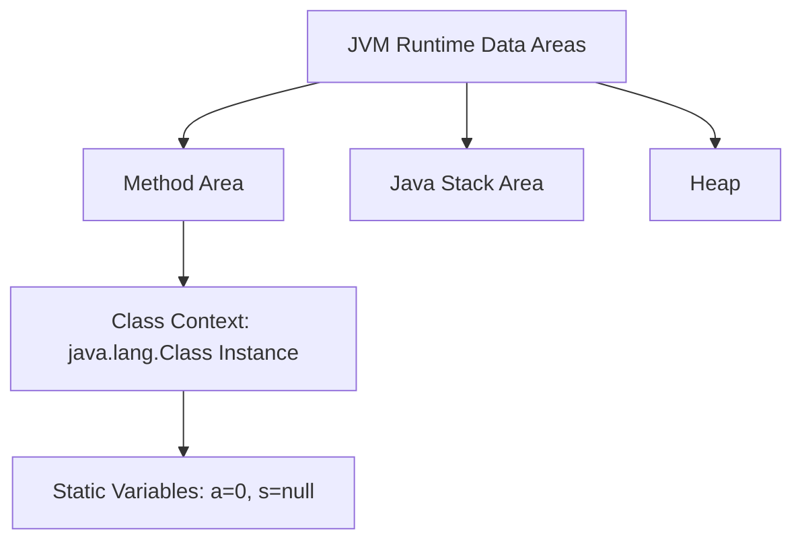

# Session 65: Static Members and Execution Flow 2

## Table of Contents

1. [What is a Static Variable?](#what-is-a-static-variable)
2. [Static Variable Creation and Syntax](#static-variable-creation-and-syntax)
3. [Static Variable Memory Allocation](#static-variable-memory-allocation)
4. [Static Variable Initialization](#static-variable-initialization)
5. [Reading Static Variable Values](#reading-static-variable-values)
6. [Modifying Static Variables](#modifying-static-variables)
7. [Static Variable Memory Sharing](#static-variable-memory-sharing)
8. [Test Cases and Examples](#test-cases-and-examples)
9. [Execution Flow with Multiple Static Variables](#execution-flow-with-multiple-static-variables)
10. [Compiler Modifications for Efficiency](#compiler-modifications-for-efficiency)
11. [Java Program Execution Phases](#java-program-execution-phases)

## What is a Static Variable?

### Overview
A static variable is a type of variable in Java that belongs to the class rather than any instance of the class. It is used to store values that are common to all objects of the class or shared across all methods within the class and even across different classes loaded in the same JVM.

### Key Concepts
- **Purpose**: Provides one copy of memory for storing values common to all objects and all methods of the current class.
- **Syntax**: Declared using the keyword `static` followed by the data type and variable name.
- **Declaration Location**: Must be declared inside a class, outside of all methods (class level).
- **Memory Allocation**: Memory is allocated by the JVM when the class is loaded into the Method Area.
- **Initialization**: Can be initialized at declaration or in static blocks.
- **Access**: Can be accessed directly by name within the same class or using the class name from other classes.

### Code/Config Blocks
```java
class Example {
    static int a = 10;  // Static variable declaration and initialization
    static int b;       // Static variable declaration without initialization
}
```

### Deep Dive Points
- Static variables are initialized to default values (e.g., 0 for int) if not explicitly initialized.
- They are not tied to any instance, hence accessible without creating objects.
- Useful for constants or shared data like counters, configuration values, etc.

## Static Variable Creation and Syntax

### Overview
To create a static variable, use the `static` keyword before the data type and variable name. It must be placed outside of any method in the class.

### Key Concepts
- **Syntax Example**:
  ```java
  static int variableName;
  static int variableName = value;
  ```
- **Static Member Declaration**: Static members include variables, blocks, and methods created inside the class with the keyword `static`.

### Code/Config Blocks
```java
public class Example {
    static int a;  // Correct: Static variable
    static int b = 20;  // Correct: Static variable with initialization

    public static void main(String[] args) {
        System.out.println(a);  // 0 (default value)
        System.out.println(b);  // 20
    }
}
```

## Static Variable Memory Allocation

### Overview
Static variables are allocated memory by the JVM in the Method Area when the class is loaded.

### Key Concepts
- **Memory Location**: Stored in the Method Area (part of JVM runtime data areas), not in the heap or stack.
- **Timing**: Memory is provided during the class loading phase, specifically in the linking phase (preparation sub-phase).
- **Defaults**: Initialized to default values based on data type (e.g., 0 for int, null for objects).

### Code/Config Blocks
```java
public class Example {
    static int a;  // Memory allocated in Method Area, initialized to 0
    static String s;  // Initialized to null

    public static void main(String[] args) {
        System.out.println(a);  // Outputs: 0
    }
}
```

### JVM Architecture Visualization


## Static Variable Initialization

### Overview
Static variables can be initialized at declaration or through static blocks. JVM executes static blocks during the initialization phase.

### Key Concepts
- **Declaration Initialization**: Direct assignment at variable declaration.
- **Static Blocks**: Used for complex initialization logic; executed automatically when the class is loaded.
- **Execution Order**: Static blocks and initializations are executed in the order they appear in the code after memory allocation with defaults.

### Code/Config Blocks
```java
public class Example {
    static int a = 10;  // Initialization at declaration

    static {
        a = 20;  // Static block initialization (overwrites 10)
    }

    public static void main(String[] args) {
        System.out.println(a);  // Outputs: 20
    }
}
```

### Deep Dive Points
- If both declaration and static block modify the same variable, the static block executes last.
- Static blocks are useful for initializing static variables with complex logic, like database connections or computations.

## Reading Static Variable Values

### Overview
Static variables can be read directly by their name within the same class or using the class name from other classes. No object instantiation is required.

### Key Concepts
- **Direct Access**: Within the class, access by variable name.
- **Cross-Class Access**: Use `ClassName.variableName`.
- **Performance**: Since memory is already allocated, reading is immediate without dynamic allocation.

### Code/Config Blocks
```java
public class Example {
    static int a = 10;

    public static void main(String[] args) {
        System.out.println(a);  // Direct access
        System.out.println(Example.a);  // Using class name
    }
}

// From another class
public class Test {
    public static void main(String[] args) {
        int value = Example.a;  // Accessing from another class
        System.out.println(value);
    }
}
```

## Modifying Static Variables

### Overview
Static variables can be modified like any other variable. Modifying a static variable affects the single copy of memory, impacting all accesses across the JVM.

### Key Concepts
- **Modification Impact**: Changes are visible across all methods and classes using the variable.
- **Local vs. Class-Level**: Ensure modifications are to static variables, not local ones.

### Code/Config Blocks
```java
public class Example {
    static int a = 10;

    public static void main(String[] args) {
        a = 20;  // Modification within main
        System.out.println(a);  // Outputs: 20
    }
}

public class Test {
    public static void main(String[] args) {
        Example.a = 30;  // Modification from another class
        System.out.println(Example.a);  // Outputs: 30
    }
}
```

### Example with Modification in Methods
```java
public class Example {
    static int a = 10;

    public static void m1() {
        a = 50;  // Modifies static variable
        System.out.println(a);
    }

    public static void m2() {
        System.out.println(a);  // Reads modified value
    }

    public static void main(String[] args) {
        m2();  // Outputs: 10 (if m1 not called yet)
        m1();  // Modifies and outputs: 50
    }
}
```

## Static Variable Memory Sharing

### Overview
Static variables have one copy of memory shared across all methods of the current class and all classes in the same JVM. Modifications in one place affect all accesses.

### Key Concepts
- **Shared within Class**: All methods (static and non-static) access the same memory.
- **Shared across Classes**: Other classes can access and modify, affecting all instances.
- **Thread Safety**: Sharing across threads can lead to concurrency issues; use synchronization if needed.

### Code/Config Blocks
```java
public class Example {
    static int a = 10;

    public static void m1() {
        a = 50;
    }

    public static void main(String[] args) {
        System.out.println(a);  // 10
        Example.m1();  // Changes a to 50
        System.out.println(a);  // 50
    }
}

// From Test class
public class Test {
    public static void main(String[] args) {
        Example.a = 60;
        System.out.println(Example.a);  // 60
    }
}
```

## Test Cases and Examples

### Overview
Test cases involve different calling orders of methods to observe how static variable modifications behave.

### Key Concepts
- **Calling Order Dependency**: Output depends on the sequence of method calls that modify the variable.
- **JVM Visualization**: Use JVM architecture diagrams to trace execution.

### Code/Config Blocks
```java
public class Example {
    static int a = 10;

    public static void m1() {
        a = 50;
        System.out.println(a);
    }

    public static void m2() {
        System.out.println(a);
    }

    public static void main(String[] args) {
        Example.m2();  // Outputs: 10
        Example.m1();  // Modifies to 50, outputs: 50
    }
}
```

### Tables for Comparisons
Testing different calling sequences results in varying outputs.

| Calling Sequence | Example.m2() Output | Example.m1() Output | Reason |
|------------------|---------------------|---------------------|--------|
| M2 before M1   | 10                  | 50                  | Modification affects subsequent reads |
| M1 before M2   | 50                  | 50                  | Current modified value read immediately |

## Execution Flow with Multiple Static Variables

### Overview
JVM handles multiple static variables by allocating memory to all declarations first (top to bottom), then initializing from top to bottom again.

### Key Concepts
- **Phases**:
  1. Allocate memory with defaults (top to bottom).
  2. Initialize variables from top to bottom (including static blocks).
  3. Execute main method.
- **Declaration anywhere**: Variables can be declared anywhere; compiler rearranges logic.

### Code/Config Blocks
```java
public class Test {
    static int a = 10;  // Step: Allocation then initialization during phase 2
    static int b = 20;

    public static void main(String[] args) {
        System.out.println(a + " " + b);  // Outputs: 10 20
    }
}
```

```mermaid
flowchart TD
    A[JVM Class Loading] --> B[Allocate Memory: a=0, b=0]
    B --> C[Initialize Top-Down: a=10, b=20]
    C --> D[Execute main()]
    D --> E[Output: 10 20]
```

## Compiler Modifications for Efficiency

### Overview
The compiler rearranges code to optimize execution, moving static variable initializations into a static block and placing main method logically for faster JVM processing.

### Key Concepts
- **Rearrangement**: Variables and initializations are moved to end of class in a static block.
- **Performance**: No runtime searching; direct execution of combined static block.
- **Bytecode Changes**: Use `javap` to verify rearrangements.

### Code/Config Blocks
Original code:
```java
public class Test {
    static int a = 10;
    static int b = 20;
    public static void main(String[] args) {
        System.out.println(a + " " + b);
    }
}
```

Compiler-modified (simulated):
```java
public class Test {
    static int a;
    static int b;
    static {
        a = 10;
        b = 20;
    }
    public static void main(String[] args) {
        System.out.println(a + " " + b);
    }
}
```

### Execution Flow Diagram
```mermaid
flowchart LR
    A[Class Loading: Allocate a=0, b=0] --> B[Execute Static Block: a=10, b=20]
    B --> C[Execute main()]
    C --> D[Output: 10 20]
```

## Java Program Execution Phases

### Overview
Java program execution is divided into Identification Phase (done by compiler) and Execution Phase (done by JVM).

### Key Concepts
- **Identification Phase**: Compiler rearranges and optimizes code.
- **Execution Phase**: JVM loads, links (prepares and initializes), and runs.
- **Benefits**: Ensures fast execution by pre-processing rearrangements.

### Code/Config Blocks
No specific code; refers to overall compilation and runtime process.

## Summary

### Key Takeaways
```diff
+ Static variables provide shared memory across all class methods and JVM classes.
+ Memory is allocated by JVM during loading, initialized via declarations or static blocks.
+ Modifications affect all accesses due to single copy memory.
+ Compiler optimizes by rearranging initializations for efficiency.
- Calling order of methods modifying static variables changes output.
- Variables can be declared anywhere; no restriction like in C.
! Visualize JVM architecture for deep understanding.
```

### Expert Insight

**Real-world Application**: Use static variables for application-wide constants (e.g., database connection pools) or counters in multi-threaded web applications to ensure shared state.

**Expert Path**: Master static members by practicing JVM visualization; read Java specification on class loading and linking phases. Experiment with concurrency to handle shared memory safely.

**Common Pitfalls**: Forgetting that modifications affect globally—leads to unexpected bugs in multi-threaded code. Avoiding object-level variables when shared data is needed.

Lesser-known things: Static blocks execute only once per class load, useful for one-time resource initialization like loading native libraries. Static variables persist until JVM shutdown, differing from instance variables reclaimed on object GC.
