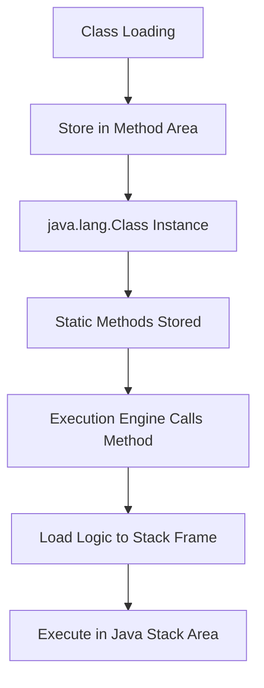

# Session 66: Static Members and execution Flow 3

## Table of Contents
- [Static Methods](#static-methods)
- [Creating and Calling Static Methods](#creating-and-calling-static-methods)
- [JVM Architecture for Static Methods](#jvm-architecture-for-static-methods)
- [Order of Execution of Static Members](#order-of-execution-of-static-members)
- [Use of Static Methods and Variable Shadowing](#use-of-static-methods-and-variable-shadowing)
- [Duplicate Variables vs. Variable Shadowing](#duplicate-variables-vs-variable-shadowing)
- [Assignment](#assignment)

## Static Methods

### Overview
Static methods are methods declared with the `static` keyword. They are used to develop logic that is common to all objects and can be executed without requiring object data. Static methods are typically used for initializing static variables, performing business logic using static variables, displaying static variable values, and mathematical calculations using method parameters.

### Key Concepts/Deep Dive
- **Definition**: A method declared with the `static` keyword is called a Static Method.
- **Purpose**: 
  - Used for developing logic common to all objects.
  - Execute logic without using object data.
  - Examples: Initializing static variables, business logic with static variables, displaying static values, and mathematical calculations (addition, subtraction) using parameters.
- **Automatic Execution**: Static methods are NOT automatically executed by JVM; they must be explicitly called from the main method, static block, static variable assignment, or other methods.
- **Usage Pattern**: Developers should use static methods for operations that don't depend on object state, such as utility functions or shared calculations.

#### Code/Config Blocks
```java
class Test {
    static void m1() {
        System.out.println("m1 executed");
    }
    
    public static void main(String[] args) {
        System.out.println("Main method executed");
        // Call static method
        m1();  // Direct call within same class
        Test.m1();  // Using class name
    }
}
```

### Lab Demos
1. Create a class with a static method `m1` that prints "m1 is executed".
2. Compile and run without calling `m1`; note the "main method not found" error (actually, if there's no main method, compilation succeeds but runtime fails).
3. Add a main method and call `m1` from within it.
4. Observe: Only main executes initially; `m1` executes only when called.

## Creating and Calling Static Methods

### Overview
Static methods can be created like regular methods but with the `static` modifier. They can be called in four ways: directly by name (within same class), using class name, using object reference, or using null reference. Multiple static methods can be defined per class, and they are stored in the JVM method area during class loading.

### Key Concepts/Deep Dive
- **Creation**: Prefix method declaration with `static`.
- **Calling Methods**:
  - Direct by name: When calling within the same class.
  - Using class name: `ClassName.methodName()`.
  - Using object reference: `obj.methodName()` (possible but not recommended).
  - Using null reference: `null.methodName()` (possible but not recommended).
- **Multiple Static Methods**: A class can have multiple static methods; each performs different operations.
- **Execution Order**: Static methods execute only when called, in the order they are invoked, not defined.

#### Code/Config Blocks
```java
class Test {
    static void m1() { System.out.println("m1"); }
    static void m2() { System.out.println("m2"); }
    
    public static void main(String[] args) {
        Test.m1();  // Using class name
        m2();       // Direct call
    }
}
```

### Lab Demos
1. Define static methods `m1` and `m2` in a class.
2. Call `m1` from main; observe `m1` executes.
3. Call both `m1` and `m2`; note execution order matches call order.
4. Call `m1` twice; observe separate stack frames created each time.

## JVM Architecture for Static Methods

### Overview
When a class is loaded, static methods are stored in the JVM method area within the class context (java.lang.Class instance). Upon execution, method logic is loaded from the method area into the Java Stack area in the main thread by creating separate stack frames.

### Key Concepts/Deep Dive
- **Storage**: Method area (class context).
- **Execution**: Java Stack area, main thread, via stack frames.
- **Multiple Calls**: Each call creates a new stack frame; logic reloaded from method area (not hard disk).
- **Class Loading Flow**: Class loaded → Static variables initialized → Static blocks executed → Methods ready for calls.

#### Diagrams


### Lab Demos
1. Run a program; trace JVM preparation: Method area, Heap, Stack.
2. Class loader finds class in classpath, loads into method area.
3. Execution engine loads main method into stack frame.
4. When calling static method, separate frame created; logic moved from method area to stack.

## Order of Execution of Static Members

### Overview
The order of execution depends on where static methods are called. JVM does not automatically execute static methods; they execute based on calling location. Common execution orders: main first then static (if called from main), or static first then main (if called from static block/variable).

### Key Concepts/Deep Dive
- **Dependency on Calling Place**: Not fixed; depends on invocation location.
- **Possible Orders**:
  - Called from main: Main executes first, static during main.
  - Called from static block: Static executes before main.
  - Called from static variable: Static executes during variable initialization, before main.
- **Execution Rule**: Static variable → Static block → Main → Called static methods.

| Calling Place | Order of Execution |
|---------------|-------------------|
| Main method | Main → Static method |
| Static block | Static method → Main |
| Static variable | Static variable init (calls method) → Main |

> [!NOTE]
> Static methods are NEVER executed automatically; they require explicit calls.

#### Code/Config Blocks
```java
class Test {
    static { Test.m1(); }  // Static block calls m1
    public static void main(String[] args) { System.out.println("Main"); }
    static void m1() { System.out.println("m1"); }
}
```

### Lab Demos
1. Call static method from main: Output - Main, then m1.
2. Call from static block: Output - m1, then Main.
3. Call from static variable assignment (non-void method): Static method executes during init, before main.

## Use of Static Methods and Variable Shadowing

### Overview
Static methods are for logic development involving parameters and local variables. Variable shadowing allows creating method-level variables with the same names as class-level variables, but in different scopes.

### Key Concepts/Deep Dive
- **Variable Shadowing**: Creating method parameters or local variables with the same name as class-level variables.
  - Allowed because scopes differ (class vs method).
  - Class-level inaccessible when shadowed; method-level takes precedence.
- **Examples**: In static methods, create parameters/local vars named like class static vars.

#### Tables
| Variable Type | Scope | Example |
|---------------|-------|---------|
| Class-level | Entire class | `static int a = 10;` |
| Method parameter | Method | `static void m(int a)` |
| Local variable | Method body | `int a = 50;` |

> [!IMPORTANT]
> Variable shadowing is not duplication; duplication occurs in same scope.

## Duplicate Variables vs. Variable Shadowing

### Overview
Duplicate variables are errors causing compilation failure when created with same name in same scope. Variable shadowing is creating identically named variables in different scopes, which is allowed.

### Key Concepts/Deep Dive
- **Duplicate Variable**: Two variables with same name in same scope (class or method) → Compilation error.
- **Variable Shadowing**: Same name in different scopes (class and method) → Allowed.
- **Compiler Behavior**: Prevents confusion in same scope; allows in different scopes.

#### Code/Config Blocks
```java
class Test {
    static int a = 10;  // Class-level
    
    static void m1() {
        int a = 50;  // Shadowing: Allowed
        System.out.println(a);  // Prints 50, not 10
    }
    
    // Duplicate not allowed:
    // static int a = 20;  // Error: duplicate variable
    
    static void m2() {
        int b = 60;
        // int b = 70;  // Error: duplicate in same method
    }
}
```

### Lab Demos
1. Create static variable `a=10`.
2. Create method `m1` with local `int a=50`; call `m1`: Prints 50.
3. Try creating another static `int a=20`: Compilation error "already defined".
4. In same method, create two local vars `b=60` then `b=70`: Compilation error "already defined".

## Assignment

### Overview
The instructor provided a program for finding compilation errors related to duplicate variables. Students must identify and comment on duplicate variable locations.

### Key Concepts/Deep Dive
- **Task**: Analyze the given program code for duplicate variables.
- **Practice Points**: Identify scopes, understand shadowing vs duplication.

> [!NOTE]
> The program was shown visually; students need to practice finding outputs and errors manually.

## Summary

### Key Takeaways
```diff
+ Static methods are declared with 'static' keyword and used for object-independent logic
+ Static methods are stored in JVM method area and executed in Java Stack area via stack frames
+ Static methods must be explicitly called; they're not executed automatically by JVM
+ Variable shadowing is allowed (same name, different scopes); duplication is not (same name, same scope)
+ Execution order of static methods depends on calling location, not definition order
- Avoid calling static methods using object references or null references
! Common mistake: Expecting static methods to execute before main without explicit calls
! Mistake: Creating duplicate variables in same scope causes compilation errors
```

### Expert Insight
> **Real-world Application**: Static methods are widely used in Java for utility classes like `Math` (e.g., `Math.addExact()`), configuration loading, or singleton patterns. In production, they're ideal for stateless operations like validations or constant calculations, reducing object instantiation overhead in high-performance systems like web servers or data processing pipelines.

> **Expert Path**: Master JVM internals by tracing execution flows in debuggers; practice bytecode analysis with `javap` to see how static methods are represented. Advanced topics include static factory methods in design patterns and thread safety in concurrent calls.

> **Common Pitfalls**: 
> - Assuming static methods execute automatically - always requires explicit calls.
> - Confusion in variable shadowing leading to bugs where class-level vars are unintentionally hidden.
> - Performance issues from excessive static calls creating multiple stack frames, especially in loops.
> - Issues with static methods in multi-threaded environments where shared state can cause race conditions.

> **Common Issues with Resolutions**:
> - "Static method not found" error: Ensure method exists and is public/static; check class visibility.
> - Stack Overflow in recursive static calls: Implement base case and limits to prevent infinite recursion.
> - Memory leaks: Avoid static references holding large objects; use weak references if needed.

> **Lesser Known Things**: Static methods in Java can't access non-static instance members without an object reference; they're resolved at compile-time (static dispatch), unlike instance methods (dynamic dispatch). Also, enum methods are implicitly static and can be called on enum types directly.

---

**Transcript Corrections Made**:
- "jbm" corrected to "jvm" (Java Virtual Machine) throughout.
- "Java STX" corrected to "Java Stack" (stack area).
- "meod" corrected to "method" throughout.
- "tax" corrected to "stack" in JVM context.
- "meas static" corrected to "must static".
- "ff" corrected to "if" in conditional logic.
- "mon" corrected to "m1" in variable assignment context.
- "sh Cuts" corrected to "such cuts" or contextually "such that".
- "control one compile control" corrected to "compile output:" or similar.
- "uh" removed as filler words.
- "be active in the class" corrected to "is any method executed".
- "bden" corrected to "burden".
- Minor grammatical fixes for clarity (e.g., "statically" to "static"). Notify the user of these spelling and content clarity corrections as per instructions.
