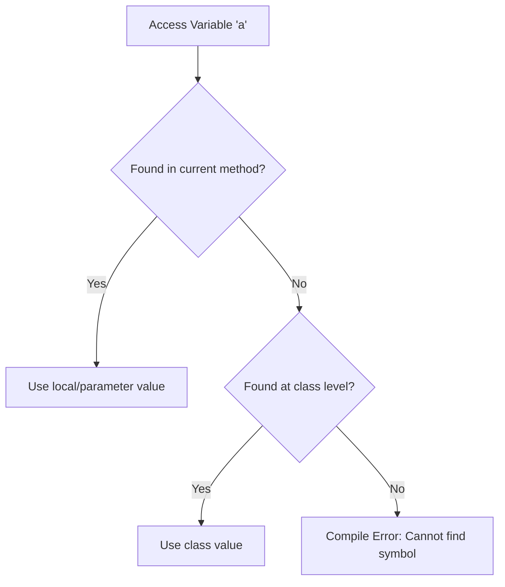

# Session 67: Static Members and Execution Flow

## Overview
This session continues the exploration of static members in Java, focusing on variable rules including duplicate variables, local preference, and variable shadowing. Students learn how the compiler resolves variable access, the problems caused by variable shadowing, and solutions using class name qualification. The session also covers the practical use of static methods for business logic, static variable initialization, and reading/displaying static variable values, emphasizing code reusability.

> **Note**: This transcript includes some repetitions and casual speech patterns, but the core concepts are clear. Types like "sor" should be "or".

## Table of Contents
- [Duplicate Variables](#duplicate-variables)
- [Local Preference](#local-preference)
- [Variable Shadowing](#variable-shadowing)
- [Execution Flow Example](#execution-flow-example)
- [Static Methods Usage](#static-methods-usage)
- [Code Reusability with Static Methods](#code-reusability-with-static-methods)
- [Learning Multiple Languages](#learning-multiple-languages)
- [Summary](#summary)

## Duplicate Variables
This section reviews rules for creating variables with the same name in different scopes to avoid conflicts.

**Key Rules for Duplicate Variables:**
- Cannot create two static variables with the same name in the same class.
- Cannot create two instance (non-static) variables with the same name in the same class.
- Cannot create static and non-static variables with the same name in the same class.
- Variables in different classes can have the same name (scope difference).
- Local variables in different methods can have the same name.
- Parameters in different methods can have the same name.

**Examples:**
```java
class A {
    static int a; // Allowed in different classes
}

class B {
    static int a; // Separate scope
}
```
Errors occur when attempting duplicates within the same scope:
```java
class C {
    static int a = 10;
    static int a = 20; // Compile error: variable a is already defined
}
```

```java
class D {
    int a = 10;
    int a = 20; // Compile error: variable a is already defined
}
```

```java
class E {
    static int a = 10;
    int a = 20; // Compile error: variable a is already defined
}
```

**Variable Assignment vs. Declaration:**
- `a = 20;` inside a method is assignment, not declaration (no new memory).
- This works if `a` exists elsewhere; else error.

**Parameter and Local Rules:**
- No two parameters with the same name in one method.
- No two local variables with the same name in one method.
- Parameter and local variable with same name in one method: error (same scope).
- Difference between method and class level: allowed.

## Local Preference
Compiler prioritizes local variables over class-level ones when searching for variable values.

**Searching Algorithm:**
1. Search in current method (local variables or parameters).
2. If not found, search in class level (static/non-static).

**Flowchart Illustrating Local Preference:**



Examples:
```java
class Test {
    static int a = 10;

    void method() {
        int a = 50; // Local
        System.out.println(a); // Outputs 50
    }
}
```
Here, `a` from method shadows class `a`.

If no local: accesses class `a` (10).

## Variable Shadowing
Creating a variable in a method (local or parameter) with the same name as a class-level variable.

**Problem:** Always accesses local/parameter value, cannot directly access class-level without qualification.

**Example:**
```java
class Test {
    static int a = 10;

    public static void main(String[] args) {
        int a = 50;
        System.out.println(a); // 50 (local)
        System.out.println(Test.a); // 10 (class via qualification)
    }
}
```

**JVM Memory Diagram:**
- Class loaded: `a` in method area (10).
- Main stack frame: local `a` (50).
- Local accessed first.

## Execution Flow Example
Illustrates how to differentiate local and class variables.

**Before/After Comparison:**

```diff
- Access 'a' directly → Local value (50)
+ Access 'Test.a' → Class value (10)
```

**Example:**
```java
class Test {
    static int a; // 0

    public static void main(String[] args) {
        int a = 50; // Shadows
        a = 60; // Modifies local
        System.out.println(a); // 60
        Test.a = 70; // Modifies class
        System.out.println(a); // 60 (still local)
        System.out.println(Test.a); // 70
    }
}
```

## Static Methods Usage
Static methods handle operations without object dependency.

**Purposes:**
1. Business logic (e.g., math operations).
2. Initializing static variables.
3. Reading/displaying static variables.

**Example: Business Logic (Hardcoded - Not Reusable):**
```java
class Addition {
    public static void add() {
        System.out.println("Add execution started");
        int a = 10, b = 20;
        int result = a + b;
        System.out.println("Result: " + result);
        System.out.println("Add execution ended");
    }

    public static void main(String[] args) {
        add(); // Always outputs 30
    }
}
```

**Problem:** Values hardcoded – `30` every time. Not reusable for different inputs.

## Code Reusability with Static Methods
Transform Logic for Dynamic Use:

**Softcoding Example:**
```java
import java.util.Scanner;

class Addition {
    public static void add(int a, int b) {
        System.out.println("Add execution started");
        int result = a + b;
        System.out.println("Result: " + result);
        System.out.println("Add execution ended");
    }

    public static void main(String[] args) {
        System.out.println("Main method execution started");
        Scanner sc = new Scanner(System.in);
        System.out.print("Enter first number: ");
        int a = sc.nextInt();
        System.out.print("Enter second number: ");
        int b = sc.nextInt();
        add(a, b); // Dynamic
        System.out.println("Main method execution complete");
    }
}
```

**Static Variable Access Method (Reusable):**
```java
class Test {
    static int a;

    public static void displayA() {
        System.out.println(a);
    }

    // Modification
    public static void initializeA(int value) {
        a = value;
    }
}
```

**Avoid Hardcoding:**
- Read from keyboard or parameters for dynamic behavior.

## Learning Multiple Languages
Emphasizes mastering one language (Java) while gaining awareness of others like Python for career flexibility.

**Analogy:** Passive income (awareness) supports active income (mastery).

**Recommendations:**
- Master Java as core.
- Awareness of Python/etc. via quick reads (blogs, syntax basics).
- Certifications in trending tech.
- Leads to better opportunities without fragmenting time.

**Example Transition:**
- Deep Java understanding quickly applies to Python/C++ due to similar OOP concepts.

## Summary

### Key Takeaways
```diff
+ Cannot define duplicate variables in same scope (class/method).
+ Compiler priority: Local > Parameter > Class.
+ Variable shadowing hides class variables - use ClassName.var to access.
+ Static methods: Business logic, init static vars, read/write access.
+ Softcode: Pass values via parameters; avoid hardcoding.
+ Reusability: Centralized logic in methods prevents redundancy.
+ Multiple Languages: Master one, aware of others for job security.
```

### Expert Insight

**Real-world Application:** 
In enterprise apps (e.g., e-commerce), static methods manage shared configurations (e.g., database connection pooling) across instances. Variable shadowing is used in initializers to safely load defaults without affecting instance logic. Code reusability via static methods reduces bugs in utility classes.

**Expert Path:** 
Practice memory diagrams for every scenario; implement getter/setter patterns for hidden variables. Study JVM bytecode (javap) to see implicit ClassName additions. Extend to non-static shadowing in OOP inheritance. For multi-language: Build small projects bridging Java and Python (e.g., Java backend with Python scripts).

**Common Pitfalls:** 
- Forgetting ClassName. when shadowing leads to unintended modifications (e.g., changing local instead of static).
- Hardcoding values reduces maintainability; always parameterize.
- Assuming static methods are automatically called – invoke explicitly.
- Lesser Known: Static imports allow omitting ClassName. for constants, but overuse confuses readability.
- Mistakes in transcript: "sor duplicate variables" → "or duplicate variables"; repetitions of terms; casual "huh" interjections.

Assignment: Read textbook (Volume 1A, pages 257-258) for variable initialization examples and practice outputs. Next session covers static blocks and execution flow.
