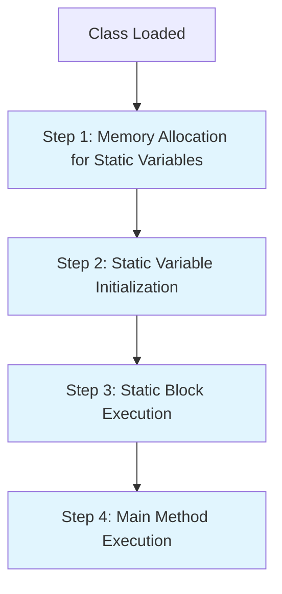

# Session 69: Static Members and Execution Flow 6

## Table of Contents
- [Recap of Main Method Questions](#recap-of-main-method-questions)
- [Execution Flow in Single and Multiple Classes](#execution-flow-in-single-and-multiple-classes)
- [Order of Static Variable Memory Allocation](#order-of-static-variable-memory-allocation)
- [Proving Execution Order with Method Calls](#proving-execution-order-with-method-calls)
- [Execution with Multiple Static Variables](#execution-with-multiple-static-variables)
- [Execution with Multiple Static Blocks](#execution-with-multiple-static-blocks)
- [Combined Static Members (Variables, Blocks, Main Method)](#combined-static-members-variables-blocks-main-method)
- [Four Steps of Static Member Execution](#four-steps-of-static-member-execution)
- [Order of Execution: Declaration vs. Initialization](#order-of-execution-declaration-vs-initialization)
- [Memory Diagrams and Execution Flow](#memory-diagrams-and-execution-flow)
- [Compiler Rearrangements for Performance](#compiler-rearrangements-for-performance)
- [Multiple Classes Execution Flow](#multiple-classes-execution-flow)
- [Lab Demo: Analyzing Complex Programs](#lab-demo-analyzing-complex-programs)
- [Summary](#summary)

## Recap of Main Method Questions
### Overview
This section recaps the key concepts related to the `main` method that were previously covered in the training. The focus is on ensuring learners have a clear understanding of `main` method rules, entry points, and common interview-style questions before progressing to execution flow topics.

### Key Concepts/Deep Dive
- **Main Method as Entry Point**: The `main` method serves as the starting point for JVM execution in a Java class. It must adhere to specific rules including public access modifier, static keyword, void return type, and String[] args parameter.
- **Execution Trigger**: JVM automatically invokes the `main` method when a class is run, unlike other static methods that require explicit calls.
- **Interview Questions Covered**:
  - Method signature requirements
  - Access modifiers and their implications
  - Overloading possibilities
  - Exception handling in main method

All main method related points have been thoroughly discussed, and learners are encouraged to review the material independently.

⚠️ **Note**: Ensure complete understanding before proceeding, as execution flow builds directly upon these fundamentals.

## Execution Flow in Single and Multiple Classes
### Overview
Execution flow refers to the sequence in which static members (variables, blocks, and methods) are processed by the JVM when a Java class is loaded and executed. This includes the order of memory allocation, initialization, and execution across single or multiple classes. Understanding this flow is crucial for debugging initialization issues and optimizing application startup performance.

### Key Concepts/Deep Dive
- **Static Members in Focus**: Execution flow applies primarily to static variables, static blocks, and the main method, as these are processed at class loading time.
- **Single Class Flow**: When a class with static members is loaded, JVM follows a systematic approach to ensure proper initialization before execution begins.
- **Multiple Classes Flow**: In scenarios involving multiple interconnected classes, execution may cascade across classes when static members reference other classes.

The next sections will detail the specific order and mechanisms involved.

## Order of Static Variable Memory Allocation
### Overview
The first phase of static member execution involves allocating memory for all static variables declared in a class. This happens immediately after the class is loaded into the JVM, before any initialization code runs.

### Key Concepts/Deep Dive
- **Automatic Memory Allocation**: JVM automatically allocates memory for each static variable in the order they are declared from top to bottom.
- **Default Values**: Memory is initialized with Java's default values (0 for numeric primitives, false for boolean, null for objects) during this phase.
- **No Initialization Yet**: This is purely memory creation - no assignment expressions or initialization logic executes here.

**Memory Allocation Order for Static Variables:**
1. Declaration order from top to bottom
2. Default value assignment occurs automatically

```java
class Example {
    static int a;      // Memory allocated first (default 0)
    static int b;      // Memory allocated second (default 0)
    static int c;      // Memory allocated third (default 0)
}
```

## Proving Execution Order with Method Calls
### Overview
To demonstrate and prove the exact timing of static variable initialization relative to main method execution, method calls can be used in variable assignments. This provides visible proof of execution order through console output.

### Key Concepts/Deep Dive
- **Method Call in Assignment**: By assigning a method call result to a static variable during declaration, the method executes during variable initialization, before main method runs.
- **Timing Verification**: This technique helps visualize that static variables initialize before main method execution.

**Example Program:**
```java
class Example {
    static int a = m1();  // Method call happens during static variable initialization
    
    static int m1() {
        System.out.println("Static variable is executed");
        return 10;
    }
    
    public static void main(String[] args) {
        System.out.println("Main execution start");
        System.out.println("a value: " + a);  // Just reading the value
        System.out.println("Main execution end");
    }
}
```

**Output:**
```
Static variable is executed
Main execution start
a value: 10
Main execution end
```

**Key Point**: Accessing `a` in main method only reads the value from memory, not re-executes the assignment.

## Execution with Multiple Static Variables
### Overview
When multiple static variables exist in a class, memory allocation follows declaration order, and initialization occurs in the order of appearance, not declaration sequence alone.

### Key Concepts/Deep Dive
- **Two-Phase Process**: First, memory is allocated in declaration order. Then, assignments are executed in declaration order.
- **Order of Operations**:
  1. Memory allocation for all variables (top to bottom)
  2. Value assignment/initialization (top to bottom)
  3. Main method execution

**Example with Multiple Variables:**
```java
class Example {
    static int a = 10;  // Declaration and assignment combined
    static int b = 20;
    
    public static void main(String[] args) {
        System.out.println("Main execution start");
        System.out.println("a value: " + a);
        System.out.println("b value: " + b);
        System.out.println("Main execution end");
    }
}
```

**Output:**
```
Main execution start
a value: 10
b value: 20
Main execution end
```

## Execution with Multiple Static Blocks
### Overview
Static blocks contain initialization logic that executes automatically when a class is loaded. Multiple static blocks are executed in declaration order before the main method.

### Key Concepts/Deep Dive
- **Automatic Execution**: Static blocks run automatically without explicit calls, unlike regular methods.
- **Order of Execution**: All static blocks execute from top to bottom, followed by main method.
- **Placement Flexibility**: Static blocks execute regardless of their position relative to main method in the source code.

**Example with Multiple Static Blocks:**
```java
class Example {
    static {
        System.out.println("Static block 1 executed");
    }
    
    public static void main(String[] args) {
        System.out.println("Main method executed");
    }
    
    static {
        System.out.println("Static block 2 executed");
    }
}
```

**Output:**
```
Static block 1 executed
Static block 2 executed
Main method executed
```

💡 **Pro Tip**: Multiple static blocks in source code get merged into a single static block in the compiled .class file, executed as one unit by the JVM.

## Combined Static Members (Variables, Blocks, Main Method)
### Overview
When all three static member types coexist in a class, the execution follows a precise order that combines allocation, initialization, and execution phases.

### Key Concepts/Deep Dive
- **Execution Sequence**:
  1. Static variable memory allocation with defaults
  2. Static variable assignments and static blocks (interleaved in declaration order)
  3. Main method execution

**Complete Example:**
```java
class Example {
    static int a = 10;
    
    static {
        System.out.println("Static block executed");
    }
    
    public static void main(String[] args) {
        System.out.println("Main method executed");
        System.out.println("a value: " + a);
    }
}
```

**Output:**
```
Static block executed
Main method executed
a value: 10
```

**Memory Visualization**:
```
After class loading:
- a: 0 (allocated with default)

After initialization:
- a: 10 (assignment executed)
- Static block logic executed

Then main method runs
```

## Four Steps of Static Member Execution
### Overview
The complete static member execution process can be broken down into four distinct phases that occur automatically when a class is loaded, providing a structured approach to understanding the JVM's behavior.

### Key Concepts/Deep Dive
The four steps when a class is loaded into JVM:

1. **Memory Allocation**: All static variables allocated memory with default values in declaration order
2. **Variable Initialization**: Static variable assignments executed in declaration order  
3. **Static Block Execution**: Static blocks run in declaration order
4. **Main Method Invocation**: JVM calls main method automatically

**Priority and Order Rules**:
- Variables and blocks with same priority execute in defined order (top to bottom)
- Same priority means they follow the order of appearance in the code



## Order of Execution: Declaration vs. Initialization
### Overview
A critical distinction exists between static variable declaration (memory allocation) and initialization (value assignment), which executes in declaration order rather than alphabetical or other sequences.

### Key Concepts/Deep Dive
- **Declaration Order Rule**: Both memory allocation and initialization follow source code declaration sequence from top to bottom
- **Common Misunderstanding**: Students often assume execution follows alphabetical order (a, b, c) or some other pattern instead of declaration order
- **Proof Technique**: Use method calls in assignments to demonstrate actual execution timing

**Example Demonstrating Order:**
```java
class TestOrder {
    static int a = m("a");  // Executes first assignment
    static int b = m("b");  // Executes second assignment
    static int c = m("c");  // Executes third assignment
    
    static int m(String var) {
        System.out.println(var + " variable initialized");
        return 10;
    }
    
    public static void main(String[] args) {
        System.out.println("Main executed");
    }
}
```

**Output:**
```
a variable initialized
b variable initialized  
c variable initialized
Main executed
```

This proves initialization respects declaration order, not any other sequence.

## Memory Diagrams and Execution Flow
### Overview
Visualizing execution through memory diagrams helps clarify the timing and order of static member processing, making abstract concepts concrete.

### Key Concepts/Deep Dive
**Step-by-Step Memory Evolution:**
```
Initial Class Loading:
+---------------------+
| Static Variables    |
+---------------------+
| a: 0 (default)     |
| b: 0 (default)     |
+---------------------+

After Initialization:
+---------------------+
| Static Variables    |
+---------------------+
| a: 10              |
| b: 20              |
+---------------------+
Static blocks execute here

Then Main Method:
- Accessing a returns 10
- Accessing b returns 20
```

The memory state changes only during the initialization phase; main method merely reads pre-computed values.

## Compiler Rearrangements for Performance
### Overview
For performance optimization in large codebases, the Java compiler performs intelligent rearrangements to avoid multiple top-to-bottom traversals during runtime. This transforms source code structure into an optimized execution model.

### Key Concepts/Deep Dive
- **Performance Issue**: Scanning 100,000+ line classes multiple times (for variables, initialization, main) would be inefficient
- **Compiler Optimization**: Compiler restructures the .class file for O(1) access rather than O(n) scanning
- **Transformation Process**:
  1. Collect all static variable declarations in declaration order
  2. Merge all static variable assignments and static blocks into a single static block in declaration order
  3. Place this combined static block at class end
  4. Position main method appropriately

**Source Code → Compiler Output Comparison:**

```
Original Source          │   Compiler Generated .class
─────────────────────────┼─────────────────────────────
static int a;            │   static int a, b, c;
static int b = m1();     │   Main method
static int c;            │   Other methods
                         │   static {  // Combined block
static {                 │     a = m1();
  // logic            │     // static block logic
}                        │     b = m2();
                         │     c = m3();
                         │   }
Main method              │   
Other methods            │   
static {                 │   
  // more logic       │   
}                        │   
```

- **JVM Execution**: Three simple steps instead of multiple scans:
  1. Allocate memory for all static variables with defaults
  2. Execute single comprehensive static block
  3. Run main method

> [!IMPORTANT]
> Always answer interview questions using the "compiler + JVM" combined model. Mention individual scans only when specifically proving concepts - never for performance analysis.

## Multiple Classes Execution Flow
### Overview
When multiple classes interact through static members, execution can cascade across classes. Only the directly invoked class's static members execute automatically; referenced classes require explicit triggering.

### Key Concepts/Deep Dive
- **Entry Class Execution**: JVM executes only the run class's static members (internal flow)
- **Cross-Class Execution**: Static members from other classes execute only when accessed (creating instances, calling methods, or referencing variables)
- **Lazy Execution**: Referenced classes don't automatically initialize unless their static code is actually used

**Example with Two Classes:**
```java
class Example {
    static int a = 10;
    static {
        System.out.println("Example class static block executed");
    }
}

class Sample {
    static int b = 20;
    static {
        System.out.println("Sample class static block executed");
    }
    
    public static void main(String[] args) {
        System.out.println("Sample main executed");
        System.out.println("Example.a: " + Example.a);  // Triggers Example execution
    }
}
```

**Output when running Sample:**
```
Sample class static block executed
Sample main executed
Example class static block executed
Example.a: 10
```

The key insight is that `Example.a` access triggers Example's static initialization.

## Lab Demo: Analyzing Complex Programs
### Overview
This lab demonstrates execution flow analysis through a complex program requiring careful application of all four execution steps across multiple static members.

### Key Concepts/Deep Dive
**Lab Program:**
```java
class LabDemo {
    static int a = m1();      // Step 2: Variable initialization
    static int b = m2();      // Step 3: After a initialization
    static int c;             // Memory allocated in Step 1
    
    static int m1() {
        System.out.println("M1 executed, a = 10");
        return 10;
    }
    
    static int m2() {
        System.out.println("M2 executed, b = 20");
        return 20;
    }
    
    static {                   // Step 3: Static block execution
        System.out.println("Static block executed");
        c = 30;               // Static block initializes c
    }
    
    public static void main(String[] args) {  // Step 4: Main execution
        System.out.println("Main executed");
        System.out.println("a = " + a + ", b = " + b + ", c = " + c);
    }
}
```

**Execution Steps Analysis:**
1. **Step 1: Memory Allocation** - JVM allocates memory: a=0, b=0, c=0
2. **Step 2: Variable Initialization** - a = m1() executes → "M1 executed, a = 10" → a=10
3. **Step 3: Static Block Execution** - Static block runs → "Static block executed" → c=30, then b = m2() executes → "M2 executed, b = 20" → b=20
4. **Step 4: Main Method** - Main executes → "Main executed" → prints values

**Expected Output:**
```
M1 executed, a = 10
Static block executed
M2 executed, b = 20
Main executed
a = 10, b = 20, c = 30
```

### Lab Steps
1. **Compile the Program**: Use `javac LabDemo.java` to compile
2. **Execute**: Run with `java LabDemo` and observe output
3. **Manual Analysis**: Before running, predict the output step by step using the four execution phases
4. **Verification**: Compare your prediction with actual output to validate understanding

**Practice Exercise**: Modify the program by reordering declarations and observe if execution order changes. Attempt this on your system and note observations.

## Summary

### Key Takeaways
```diff
+ Four execution steps guarantee predictable initialization order
+ Compiler optimizations ensure efficient large-class handling
+ Static members execute in declaration order, not alphabetical
+ Method calls in assignments prove initialization timing
+ Multiple classes require explicit triggering for execution
+ Static blocks merge into single block in compiled code
+ Memory allocation precedes all initialization
+ Main method always executes last among static members
```

### Expert Insight

#### "Real-world Application"
In enterprise Java applications, understanding static member execution flow is crucial for proper initialization of connection pools, configuration loading, and singleton patterns. For instance, database connection managers often use static blocks to establish connections when the class loads, ensuring database access is ready before the main application logic begins.

#### "Expert Path"
Master the JVM bytecode view using tools like `javap` to see how compiler rearrangements manifest in the actual class file. Study the JVM specification sections on class loading and initialization for deeper understanding. Practice implementing custom class loaders to control when and how static initialization occurs.

#### "Common Pitfalls"
- **Memory Reading Confusion**: Don't mistake reading a static variable value for re-executing its assignment - assignments happen once during class loading
- **Order Assumption**: Never assume alphanumeric or logical ordering; always follow declaration order in source code
- **Performance Misunderstanding**: Avoid claiming JVM scans code multiple times for performance reasons - use the compiler rearrangement explanation
- **Cross-Class Lazy Loading**: Remember that referenced classes don't automatically initialize unless their specific static members are accessed

#### "Common Issues and Prevention"
**Issue 1**: Static initialization exceptions get swallowed silently
**Resolution**: Always log initialization failures and use try-catch in static blocks
**Prevention**: Add comprehensive logging and error handling to all static initialization code

**Issue 2**: Circular dependency between classes causes initialization deadlock
**Resolution**: Identify and break circular dependencies through careful design
**Prevention**: Audit class dependency diagrams and avoid static references creating cycles

**Lesser Known Facts**
- Static blocks can throw exceptions and abort class loading entirely
- JVM maintains a registry of all initialized classes to prevent re-initialization
- Static enum constants initialize during class loading and maintain singleton guarantees

**Corrections Applied**: 
- "straty block" corrected to "static block" throughout
- "meod" corrected to "method" 
- "stattic" corrected to "static"
- "iner" corrected to "inner"
- "FL" corrected to "Flow"
- Various other typographical errors in technical terms like "jvm", "exe", etc. have been standardized to proper capitalization and terminology
