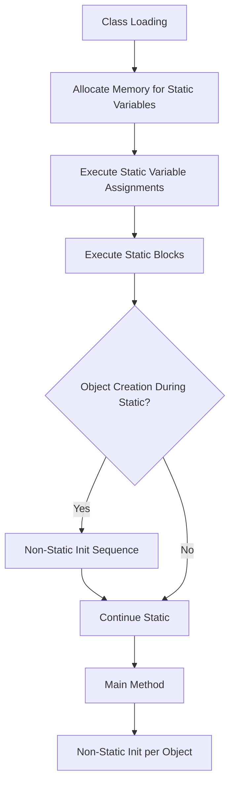

# Session 85: Non Static Members and Execution Flow 5

- [Non-Static Members Execution Flow (Single Class)](#non-static-members-execution-flow-single-class)
- [Non-Static Members Execution Flow (Multiple Classes)](#non-static-members-execution-flow-multiple-classes)
- [Compiler Optimizations](#compiler-optimizations)
- [Static and Non-Static Members Combination Execution Flow](#static-and-non-static-members-combination-execution-flow)
- [Object Creation Locations](#object-creation-locations)
- [Stack Overflow Error](#stack-overflow-error)
- [Illegal Forward Reference](#illegal-forward-reference)
- [Practice Assignments](#practice-assignments)
- [Summary](#summary)

## Non-Static Members Execution Flow (Single Class)

### Overview
This section explains the execution order of non-static members in Java when an object is created in a single class. Non-static members (variables, blocks, methods, and constructors) are initialized and executed only when an object is instantiated, unlike static members that execute at class loading time.

### Key Concepts/Deep Dive

Non-static members execution begins when an object is created using the `new` keyword. The JVM follows a specific sequence to ensure proper initialization and execution order from top to bottom within the class.

#### Execution Steps:
1. **Memory Allocation**: The `new` keyword allocates memory for all non-static variables with default values (e.g., 0 for integers, null for objects) in the order they are declared from top to bottom.

```java
class Example {
    int x;  // Memory allocated with default 0
    int y;  // Memory allocated with default 0
}
```

2. **Constructor Invocation**: The `new` keyword invokes the constructor, which handles the initialization logic.

3. **Initialization Order in Constructor**:
   - Non-static variable assignments and non-static blocks are executed in declaration order from top to bottom.
   - Constructor logic is executed last.

```java
class Example {
    int x = 10;  // Variable assignment executes first
    { System.out.println("Non-static block 1"); }  // Non-static block executes next
    int y = 20;  // Variable assignment executes third
    { System.out.println("Non-static block 2"); }  // Non-static block executes fourth
    
    Example() {
        System.out.println("Constructor executed");  // Constructor logic last
    }
}
```

Non-static methods are executed only if explicitly called during object creation; JVM does not execute them automatically.

#### Example Program Execution:
```java
public class Example {
    int x;
    int y;
    int z;
    
    // Non-static variable assignments and blocks
    int x = 10;
    { System.out.println("nb1"); }
    { System.out.println("nb2"); }
    int y = 20;
    { System.out.println("nb3"); }
    
    Example() {
        System.out.println("NPC");
    }
    
    public static void main(String[] args) {
        Example e1 = new Example();  // Object creation triggers sequence
    }
}
```

Output:

nb1  
nb2  
nb3  
NPC

For multiple objects:

```java
Example e1 = new Example();
Example e2 = new Example();
```

Each object creation repeats the sequence separately, with all non-static members executing again for each new instance.

> [!NOTE]
> Constructor logic always executes after non-static blocks, ensuring all variable initializations are complete.

## Non-Static Members Execution Flow (Multiple Classes)

### Overview
Execution flow remains consistent when objects are created across multiple classes. Non-static members execute within their own class scope, and inheritance or composition does not alter the basic initialization sequence.

### Key Concepts/Deep Dive

When creating objects of a class within another class (e.g., in `main` method of a different class), the flow follows the same steps as in a single class. However, `main` method static members execute first, then object creation triggers non-static member initialization.

#### Example with Multiple Objects:
A class can create multiple objects, each initializing independently:

```java
class Example {
    static int ns1 = 10;
    { System.out.println("nsb1"); }
    int nsv1;
    static int ns2 = 20;
    { System.out.println("nsb2"); }
    int nsv2;
    int nsv3;
    { System.out.println("nb3"); }
    
    Example() {
        System.out.println("PC");
    }
    
    Example(String s) {
        System.out.println("SPC");
    }
}

class MainClass {
    public static void main(String[] args) {
        Example e1 = new Example();
        Example e2 = new Example("param");
    }
}
```

Output:

nsb1  
nsb2  
nb3  
PC  
nsb1  
nsb2  
nb3  
SPC

Each constructor (default or parameterized) executes the full sequence of variable initializations and blocks before its own logic.

### Compiler Optimizations

#### Overview
The compiler optimizes class files to improve runtime performance by rearranging code for efficient execution, eliminating top-to-bottom searching during runtime.

#### Key Concepts/Deep Dive

JVM executes optimized class files, not the original source code. Compiler reorders non-static member initializations into constructors for faster execution.

In the class file, after `super()` call, non-static variable assignments and blocks are compiled into constructors in declaration order, followed by constructor logic. This creates a single optimized constructor block, reducing runtime overhead.

For example, original code transforms into:

```java
Example() {
    super();
    this.x = 10;  // Moved from variable assignment
    System.out.println("nb1");  // Moved from block
    // ... all initializations in order
    // Original constructor logic
    System.out.println("NPC");
}
```

⚠ This optimization means developers think in terms of declaration order, but JVM sees optimized linear execution. Always write code considering declaration order, not runtime scanning.

## Static and Non-Static Members Combination Execution Flow

### Overview
Combining static and non-static members requires understanding their interleaved execution. Static members execute at class loading, while non-static members execute per object creation.

### Key Concepts/Deep Dive

When a class contains both static and non-static members:

1. **Class Loading**: JVM executes static members first:
   - Allocates memory for static variables in declaration order.
   - Initializes static variables and executes static blocks in order.

2. **Object Creation Within Static Execution**: If object creation occurs during static initialization (e.g., in static block or main), non-static members execute at that point, interleaving with static flow.

#### Example:
```java
class Example {
    static {
        System.out.println("Static block");
    }
    
    static int a = 10;
    
    static Example e1 = new Example();  // Object creation during static init
    
    int x = 20;
    { System.out.println("Non-static block"); }
    
    Example() {
        System.out.println("Constructor");
    }
    
    static int b = 30;
    
    public static void main(String[] args) {
        Example e2 = new Example();
    }
}
```

Output:

Static block  
Non-static block  
Constructor  
Static var b init (30)  
Non-static block  
Constructor  

Objects can be created in various locations:
- Class level (static/non-static reference variables)
- Static blocks/methods/constructors
- Non-static blocks/methods/constructors

Multiple object creations execute non-static members multiple times accordingly.



## Simple Workflows

+ Static members execute upon class loading.
- Object creation interrupts static flow when encountered.

## Stack Overflow Error

### Overview
Stack overflow error occurs when recursive method or constructor calls exhaust the JVM stack memory, creating infinite nested stack frames without destruction.

### Key Concepts/Deep Dive

Stack overflow arises from:
- Recursive method calls (method calls itself indefinitely).
- Recursive constructor calls (constructor calls itself or causes cyclic constructor calls).

#### Examples:

**Recursive Method Call:**
```java
public class StackDemo {
    static void m1() {
        System.out.println("m1 start");
        m1();  // Recursion without base case
    }
    
    public static void main(String[] args) {
        m1();
    }
}
```
Output: (up to JVM limit)
```
m1 start
m1 start
...
java.lang.StackOverflowError
```

**Recursive Constructor Call:**
```java
class RecursiveConstr {
    RecursiveConstr() {
        new RecursiveConstr();  // Calls itself every time
    }
}
```
Creating an object: `new RecursiveConstr()` leads to stack overflow.

Avoid by adding base conditions in recursion.

#### Memory Impact:
Each call creates a stack frame containing:
- Local variables
- Method parameters
- Return address

Without frames being popped (via method returns), stack fills up, causing `StackOverflowError`.

## Illegal Forward Reference

### Overview
Illegal forward reference error occurs when trying to access a variable or block before its declaration and initialization in the same class scope.

### Key Concepts/Deep Dive

In non-static context:
- Variables/blocks must be used after their declaration.
- Cannot reference later-declared variables in initializations.

```java
class IllegalRef {
    int x = y;  // Error: forward reference to y
    int y = 20; // Declared after x's init
    
    { x = y; }  // Same error in block
}
```

**Solutions:**
- Rearrange declaration order.
- Use `this` keyword for accessing instance variables.

```java
class FixedRef {
    int y = 20;
    int x = y;  // Now works
    
    { x = this.y; }  // Explicit access
}
```

Applies to non-static variables and blocks; static scope follows similar rules but uses class name instead of `this`.

## Practice Assignments

Focus on implementing and running programs to solidify understandings. Practice object creation in different contexts to observe execution flows.

1. **Create Objects in Static Context**: Implement class-level object creation using static reference variables and observe interleaved static/non-static execution.

2. **Object Creation in Non-Static Methods**: Create objects within instance methods and note how many times non-static initializations occur.

3. **Recursive Scenarios**: Practice adding base conditions to prevent stack overflow in methods.

4. **Forward Reference Fixes**: Correct illegal forward reference errors using proper declaration order and `this` keyword.

Recommended practice: Step through each assignment one at a time, drawing memory diagrams and predicting output before running.

## Summary

### Key Takeaways
```diff
+ Static members execute at class loading time, initializing static variables and blocks in declaration order.
+ Non-static members execute when objects are created, allocating memory for variables with defaults, then initializing assignments/blocks/constructors in order.
+ Compiler optimizes class files by compiling non-static initializations into constructors for efficient runtime execution.
+ Static and non-static executions can interleave when object creation occurs during static initialization.
+ Stack overflow occurs from infinite recursion in methods/constructors, exhausting JVM stack frames.
- Forward references in non-static contexts cause compile-time errors; use declaration order and `this` keyword to resolve.
```

### Expert Insight

#### Real-world Application
In production Java applications, understanding execution flow is crucial for initialization-sensitive code. For example, in enterprise apps, improper static initialization can cause memory leaks or incorrect shared state loading. Non-static flow ensures each object instance is correctly set up, vital for multi-threaded environments where objects are created dynamically.

#### Expert Path
Master execution flow by practicing with complex inheritance hierarchies and dependency injection frameworks. Study JVM bytecode using tools like `javap` to visualize compiler optimizations. Focus on reducing static blocks for faster class loading in large applications.

#### Common Pitfalls
- Assuming static blocks execute before all object creations—object creation during static init interrupts the flow.
- Forgetting non-static methods aren't automatically called during object creation—explicit calling is required.
- Recursive calls without base cases leading to stack overflow in production code.

#### Lesser Known Things
JVM spec allows some flexibility in static initialization order optimization, potentially varying slightly between JVM implementations. In extremely large classes, consider separating static and non-static initializations into factory methods for better maintenance.
