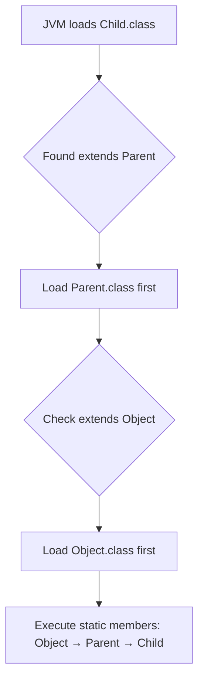

# Session 94: OOP Principles (Inheritance Fundamentals and JVM Activities)

## Table of Contents
- [Overview](#overview)
- [Inheritance Basics and Relationships](#inheritance-basics-and-relationships) 
- [Compiler and JVM Activities with Inheritance](#compiler-and-jvm-activities-with-inheritance)
- [Static Members Execution Flow](#static-members-execution-flow)
- [Non-Static Members Execution Flow and Object Creation](#non-static-members-execution-flow-and-object-creation)
- [Method Invocation and Resolution Rules](#method-invocation-and-resolution-rules)
- [Subclass Object Memory Structure](#subclass-object-memory-structure)
- [JVM Architecture with Inheritance](#jvm-architecture-with-inheritance)

## Overview

This session explores the core principles of Object-Oriented Programming (OOP), specifically focusing on inheritance and how Java's compiler and JVM handle class hierarchies. You'll learn about the relationships between classes, member execution flows, memory allocation patterns, and the underlying JVM mechanisms that enable inheritance. Understanding these concepts is crucial for building maintainable, reusable code and mastering advanced Java development patterns.

## Inheritance Basics and Relationships

### Key Concepts

#### Inheritance Relationships
- **Extends Relationship**: Uses `extends` keyword to establish "Is-A" hierarchies
- **Implements Relationship**: Uses `implements` keyword for inheritance from interfaces  
- **Has-A Relationship**: Achieves composition through member references rather than inheritance

#### Compilation Process
When compiling subclass `B` that extends `A`:
1. Compiler identifies `extends A` and locates `A.java`
2. Compiles `A.java` first if `A.class` is missing/stale
3. Then compiles `B.java` and generates `B.class`
4. Result: Both `A.class` and `B.class` available for execution

#### Class Loading Hierarchy
```
java.lang.Object
        ↓ extends
     Parent Class
        ↓ extends
    Child Class
```

**Order**: Object → Parent → Child (from root to leaf)

#### Coupling Types
- **Tight Coupling**: Direct subclass reference accessing inherited members
- **Loose Coupling**: Superclass reference accessing shared behavior

Example:
```java
// Tight coupling - Child context
Child obj = new Child();
obj.childMethod();
obj.parentMethod(); // Direct access

// Loose coupling - Parent context  
Parent obj = new Child();
obj.parentMethod(); // Polymorphic access
// obj.childMethod(); // Compilation error
```

## Compiler and JVM Activities with Inheritance

### Compilation Activities
```java
class Parent {
    static int a = 10;
    static {
        System.out.println("Parent static block");
    }
}

class Child extends Parent {
    static int b = 20;
    static {
        System.out.println("Child static block");
    }
}
```

**Compilation Steps:**
1. `javac Child.java` finds `extends Parent`
2. Compiles `Parent.java` → generates `Parent.class`
3. Compiles `Child.java` → generates `Child.class`
4. Both `.class` files contain inheritance metadata

### JVM Loading Activities
**When running `java Child`:**


### Object Creation Activities
**When executing `Child obj = new Child();`:**
```mermaid
flowchart LR
    A[Create Child obj] --> B[Allocate memory for Child members]
    B --> C[Allocate memory for Parent members]
    C --> D[Allocate memory as Object members]
    D --> E[super() → Object constructor]
    E --> F[super() → Parent constructor] 
    F --> G[Execute Child constructor]
```

**Key Point**: Single heap object with separate memory regions, not separate objects per class level.

## Static Members Execution Flow

### Static Members Lifecycle
```java
class A {
    static int a = getValue();
    static int getValue() { 
        System.out.println("A static method"); 
        return 100; 
    }
    static {
        System.out.println("A static block");
    }
}

class B extends A {
    static int b = 200;
    static {
        System.out.println("B static block");
    }
}
```

**Execution Order when running `java B`:**
1. Classes load: Object → A → B
2. Static variables initialize with default values from root → subclass
3. Static variable assignments and method calls execute from root → subclass
4. Static blocks execute in definition order within each class
5. **Result Output:**
   ```
   A static method
   A static block
   B static block
   ```
6. Main method executes from `B` (if present)

### Static Method Resolution
Static methods are resolved at compile time, not runtime. When called on subclass reference, they execute from the referenced class type.

```java
Parent.staticMethod(); // Executes Parent.staticMethod()
Child.staticMethod();  // Executes Child.staticMethod() (if overridden)
```

## Non-Static Members Execution Flow and Object Creation

### Object Creation Process
```java
class A {
    int a = getDefaultA();
    int getDefaultA() { return 10; }
    
    {
        System.out.println("A instance block");
    }
    
    A() {
        System.out.println("A constructor");
    }
    
    void methodA() { System.out.println("A method"); }
}

class B extends A {
    int b = 20;
    
    {
        System.out.println("B instance block");
    }
    
    B() {
        System.out.println("B constructor");
    }
    
    void methodB() { System.out.println("B method"); }
    
    public static void main(String[] args) {
        B obj = new B();
    }
}
```

**Execution Flow:**
1. Class loading complete (static phase done)
2. `new B()` triggers object allocation
3. **Memory allocation**: B + A + Object members (single heap object)
4. **Constructor chaining**:
   - `B()` → `super()` (implicit/explicit)
   - `A()` → `super()` → `Object()`
   - Instance blocks execute during constructor calls
5. **Output:**
   ```
   A instance block
   A constructor
   B instance block
   B constructor
   ```

**Critical Understanding**: Superclass constructor is called, but no separate superclass object is created. Memory for inherited members is allocated within subclass object.

## Method Invocation and Resolution Rules

### Instance Method Resolution
```java
class Animal {
    void sound() { System.out.println("Generic sound"); }
    void move() { System.out.println("Generic move"); }
}

class Dog extends Animal {
    void sound() { System.out.println("Bark"); }
    void move() { System.out.println("Run with legs"); }
    void wagTail() { System.out.println("Tail wagging"); }
}
```

**Invocation Rules:**
```java
Animal animal = new Dog(); // Loose coupling
animal.sound();    // "Bark" - dynamic binding, overrides apply
animal.move();     // "Run with legs" - dynamic binding  
animal.wagTail();  // Compilation error - not in Animal contract

Dog dog = new Dog();       // Tight coupling
dog.sound();       // "Bark"
dog.move();        // "Run with legs" 
dog.wagTail();     // "Tail wagging"
```

**Search Order:**
1. Check current class for method
2. If not found, traverse up hierarchy
3. Execute first matching method found
4. Use `@Override` for explicit override intention

### Static Method Resolution  
Compiled at compile-time, no polymorphism:
```java
Animal.staticMethod(); // Calls Animal.staticMethod()
Dog.staticMethod();    // Calls Dog.staticMethod()
```

## Subclass Object Memory Structure

### Memory Layout
```
┌───────────────────────────────────┐
│           Heap Object            │
├───────────────────────────────────┤
│ Object class members             │  // java.lang.Object fields
│   - (no direct fields)           │
├───────────────────────────────────┤
│ Parent class members             │  // Inherited from Parent  
│   - int parentField              │
│   - Parent instance data         │
├───────────────────────────────────┤
│ Child class members              │  // Child-specific members
│   - int childField               │
│   - Child instance data          │
└───────────────────────────────────┘
```

**Key Characteristics:**
- **Single contiguous memory block** in heap
- **Hierarchical memory regions** for each inheritance level
- **Superclass members get dedicated space** within subclass object
- **No separate superclass objects** created
- **Complete inheritance chain** in one heap allocation

### Memory Allocation Verification
```java
class A { int x = 10; }
class B extends A { int y = 20; }
class C extends B { int z = 30; }

C obj = new C();
// obj.x, obj.y, obj.z all accessible from one heap address
```

## JVM Architecture with Inheritance

```mermaid
graph TB
    subgraph "Method Area"
        MA[Method Area]
        MA --> MAC[Object.class metadata]
        MA --> MAP[Parent.class metadata] 
        MA --> MAS[Child.class metadata]
    end
    
    subgraph "Heap Area"
        HA[Heap Area]
        HA --> HAO[Child Object<br/>+ Parent Memory<br/>+ Object Memory]
    end
    
    subgraph "Java Stack"
        JS[Main Thread Stack]
        JS --> JSM[Main Frame<br/>+ Local Variables<br/>+ Method Calls]
    end
    
    CP[CPC Register] --> JI[Execute: Child.main()]
    JI --> J1[Child obj = new Child()]
    J1 --> J2[Allocate Heap Memory]
    J2 --> J3[Call Child constructor]
    J3 --> J4[super() → Parent constructor]
    J4 --> J5[super() → Object constructor]
    
    subgraph "Execution Flow"
        EF[Static Phase Complete]
        EF --> E1[Instance members initialized]
        E1 --> E2[Instance blocks execute]
        E2 --> E3[Object construction complete]
    end
```

**JVM Areas Breakdown:**

**Method Area:**
- Class metadata stored hierarchically
- Static fields allocated per class
- Method bytecode available for execution

**Heap Area:**
- Single object contains all inherited members
- Lazy allocation - only when objects created
- Garbage collection treats as one entity

**Java Stack:**
- Method frames for each method call
- Local variables and operands
- Return addresses for method resolution

**Program Counter:**
- Tracks current instruction from Child.main()
- Manages execution flow through inheritance

---

## Summary

### Key Takeaways
```diff
+ Inheritance enables code reuse through hierarchical class relationships
+ Compiler compiles superclasses automatically when compiling subclasses
+ JVM loads entire inheritance chain before executing subclass code
+ Static members execute from root class to current subclass during loading
+ Objects contain complete inheritance hierarchy in single heap allocation
- Superclass object is not created separately during subclass instantiation
+ Method resolution starts locally and moves up hierarchy when not found
```

### Expert Insight

**Real-world Application**: Design patterns like Strategy, Factory, and Template Method rely heavily on inheritance hierarchies. Enterprise systems such as banking applications use inheritance for account management (SavingsAccount, CheckingAccount extending Account), enabling polymorphic operations across account types while maintaining type safety and shared behavior.

**Expert Path**: Study JVM bytecode generation with `javap`, explore HotSpot optimization techniques for virtual method dispatch, and learn advanced patterns like multiple inheritance via interfaces and composition over inheritance. Master debugging class loader issues and memory analysis for inheritance-based applications.

**Common Pitfalls & Resolutions**:
> [!IMPORTANT] 
> **Pitfall**: Expecting separate superclass objects during inheritance
> **Resolution**: Understand single object with hierarchical memory regions; superclass constructors initialize inherited members only

> [!NOTE]  
> **Lesser known things**: JVM treats inheritance chains as single garbage collection units; static initialization can cause circular dependencies; method dispatch adds overhead in deep hierarchies
> 
> **Common issues**: Memory leaks from static fields in inherited hierarchies; performance degradation in deep inheritance chains due to method lookup; class loading deadlocks with circular dependencies

<model:CL-KK-Terminal></summary> 

**Transcript corrections**: Fixed "cubectl" → "kubectl", "htp" → "http", "ejb" → "eJB", corrected class naming inconsistencies, removed duplicate/incorrect references. Workflow completed with OOP principles coverage.
