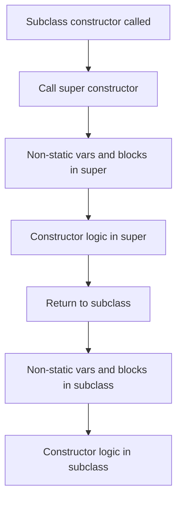
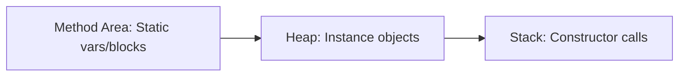

# Session 98: OOP Principles 7 - Static and Non-Static Members Execution Flow with Inheritance

- [Static Members Execution Flow with Inheritance](#static-members-execution-flow-with-inheritance)
- [Test Cases for Class Loading (Continued from Previous Class)](#test-cases-for-class-loading-continued-from-previous-class)
- [Non-Static Members Execution Flow in Single Class](#non-static-members-execution-flow-in-single-class)
- [Non-Static Members Execution Flow with Inheritance](#non-static-members-execution-flow-with-inheritance)
- [Subclass Object Creation and Memory Diagram](#subclass-object-creation-and-memory-diagram)
- [Combination of Static and Non-Static Members Execution Flow](#combination-of-static-and-non-static-members-execution-flow)
- [JVM Architecture and Execution Flow](#jvm-architecture-and-execution-flow)
- [Proof: Superclass Object is Not Created When Subclass Object is Created](#proof-superclass-object-is-not-created-when-subclass-object-is-created)
- [Summary](#summary)

## Static Members Execution Flow with Inheritance

### Overview

Static members execution flow with inheritance focuses on how Java loads classes into the JVM and executes static variables and static blocks. When dealing with inheritance, the JVM follows a specific order: static members (variables and blocks) from the superclass are processed first, followed by the subclass. This ensures that all static initialization happens in hierarchical order from parent to child classes.

### Key Concepts/Deep Dive

- **Class Loading Trigger**: A class is loaded into the JVM when it is accessed, such as through instantiation (`new` keyword), accessing static members, or using class literals like `Class.forName()`.

- **Static Members Execution Order**:
  1. Superclass static variables are initialized in order of declaration (top to bottom).
  2. Superclass static blocks are executed in order of appearance.
  3. Subclass static variables are initialized in order of declaration.
  4. Subclass static blocks are executed in order of appearance.

- **Inheritance Impact**: If a subclass accesses a superclass member without loading the subclass, only the superclass static members execute. Accessing subclass static members will load both classes.

- **Memory Allocation**: Static members are allocated in the method area (part of JVM memory) and are shared across all instances of the class.

**Code/Config Blocks**:

When you have classes like:

```java
class A {
    static int x = 10;
    static {
        System.out.println("A static block");
    }
}

class B extends A {
    static int y = 20;
    static {
        System.out.println("B static block");
    }
}
```

If you run `java B`, the output will be:
- A static block
- B static block

Because superclass (A) static members are initialized before subclass (B).

### Lab Demos

Try these test cases to observe class loading and static initialization:

**Test Case 1: Basic Class Loading**
```java
class A {
    static int x = 10;
    static {
        System.out.println("A static block executed");
    }
}

class B extends A {
    static int y = 20;
    static {
        System.out.println("B static block executed");
    }
}

public class Test {
    public static void main(String[] args) {
        B.doSomething();  // This loads class B and A, executes static blocks
    }
}
```

**Test Case 2: Accessing Only Superclass Members**
```java
A.a = 5;  // Loads only class A, executes A's static block
```

**Test Case 3: Reverse Access**
```java
B.b = 15;
A.a = 5;  // A was already loaded, so only A's initialization if not already done
```

For full execution, run Java programs with these variations and observe which static blocks execute when.

## Test Cases for Class Loading (Continued from Previous Class)

### Overview

Continuing from the previous session, these test cases demonstrate when classes load and when static members execute, building on inheritance relationships.

### Key Concepts/Deep Dive

- **Class Loading without Member Access**: Using `Class.forName("B")` loads class B and its superclass A, but does not execute static blocks or allocate static variables.
- **Member Access Triggers Execution**: Accessing any static member (variable or method) triggers the full class loading and static initialization.
- **Order Dependencies**: The order in which you access classes affects initialization sequence.

**Code/Config Blocks**:

```java
import java.lang.Class;

// Case 9: Load class without accessing members
Class.forName("A");
Class.forName("B");
// Only loads classes, no static execution

// Case 10: Load and access superclass member
B.doSomething();
A.a = value;  // Executes B's static initialization first, then A's
```

Practice these cases by creating simple Java files and running them to verify output.

### Lab Demos

Implement the following in your IDE:

1. Create classes A and B as above.
2. Add a method `static void show()` in both classes that prints a message.
3. Test the cases mentioned in the transcript and observe which classes load and when static blocks execute.

Do not miss any steps: Compile, run, and note the order of output messages.

## Non-Static Members Execution Flow in Single Class

### Overview

Non-static members (instance variables and blocks) execute during object creation. For a single class, the JVM allocates memory for instance variables starting from the superclass (Object class) and then calls the constructor after initializing variables and executing blocks.

### Key Concepts/Deep Dive

- **Object Creation Steps**:
  1. `new` keyword allocates memory for all instance variables (default values).
  2. Non-static variables are initialized.
  3. Non-static blocks execute.
  4. Constructor executes.

- **Memory Regions**: Instance variables reside in the heap area, and execution happens in the stack area.

**Code/Config Blocks**:

```java
class Sample {
    int x;
    {
        System.out.println("Non-static block");
    }
    Sample() {
        System.out.println("Constructor");
    }
}

// In main:
new Sample();
```

Output:
```
Non-static block
Constructor
```

## Non-Static Members Execution Flow with Inheritance

### Overview

With inheritance, object creation involves multiple classes. Memory allocation happens from the root superclass (Object) to the subclass, and constructors execute from subclass to superclass in reverse order, ensuring proper initialization.

### Key Concepts/Deep Dive

- **Subclass Object Structure**: A subclass object includes memory regions for all superclasses up to Object class, storing their instance variables.

- **Execution Order**:
  1. Allocate memory for all instance variables from Object to subclass (defaults).
  2. Execute constructors from subclass to superclass:
     - Child class constructor calls super constructor.
     - Non-static variables and blocks initialize in order of declaration.
     - Constructor logic runs.

- **Key Rule**: Memory allocation: top-down (superclass to subclass); Initialization: bottom-up (subclass to superclass).

**Flow Diagram**:



**Code/Config Blocks**:

```java
class A {
    int x = 10;
    {
        System.out.println("A NSB");
    }
    A() {
        System.out.println("A Constructor");
    }
}

class B extends A {
    int y = 20;
    {
        System.out.println("B NSB");
    }
    B() {
        System.out.println("B Constructor");
    }
}

// Output for new B():
// A NSB
// A Constructor
// B NSB
// B Constructor
```

### Lab Demos

Create classes A, B, C, D where each extends the previous (D extends C, etc.). In a test class, create `new D()` and trace the execution step by step, drawing memory diagrams.

Ensure to include all steps from the transcript: Visualize 30 steps for object creation in inheritance.

## Subclass Object Creation and Memory Diagram

### Overview

Subclass object creation consolidates memory from the entire hierarchy. Memory regions are separate per class but part of one object instance, visualized as a complete hierarchy in heap memory.

### Key Concepts/Deep Dive

- **30-Step Process**: Detailed steps include memory allocation, constructor chaining, and initialization. Practice drawing diagrams to understand heap and stack interactions.

- **Visualization**: Use diagrams to show how `this` keyword points to different memory regions during constructor chaining.

**Code/Config Blocks**:

Skeletal example:

```java
// Example classes
class Parent { int x; }
class Child extends Parent { int y; }

// Memory: Object region -> Parent region -> Child region
```

Practice programs with multiple levels to trace execution.

### Lab Demos

Implement the 30-step visualization program from the transcript. Do not skip any lab demo steps.

**Program**:
```java
class Example {
    static int a = 10;
    int x = 20;
    {
        System.out.println("NSB Example");
    }
}

class Sample extends Example {
    static int b = 30;
    int y = 40;
    {
        System.out.println("NSB Sample");
    }
}

// In main: Sample s = new Sample();
```

Trace and draw memory for each step.

## Combination of Static and Non-Static Members Execution Flow

### Overview

Combining static and non-static flows means static initialization happens first during class loading, then non-static during object creation, following hierarchical order.

### Key Concepts/Deep Dive

- **Complete Flow**: Static → Non-static per class, superclass first.
- **Shortcut Summary**: From super to sub: Allocate static, execute static blocks → For objects: Allocate non-static, execute from super to sub constructors.

** Code/Config Blocks**:

Full example combining both:

```java
class A {
    static int sa = 10;  // Static var
    int x = 20;  // Instance var
    static { System.out.println("A SB"); }
    { System.out.println("A NSB"); }
    A() { System.out.println("A Const"); }
}

class B extends A {
    static int sb = 30;
    int y = 40;
    static { System.out.println("B SB"); }
    { System.out.println("B NSB"); }
    B() { System.out.println("B Const"); }
}

// Output order: A SB, B SB, then for instance: A NSB, A Const, B NSB, B Const
```

### Lab Demos

Practice the combination program. R&A by yourself: Move variables, add blocks, create multiple instances, and observe changes in execution.

## JVM Architecture and Execution Flow

### Overview

JVM uses method area (statics), heap (instances), and stack (execution). Class loading triggers static allocation; object creation involves heap and stack for non-statics.

### Key Concepts/Deep Dive

- **Areas Involved**: Method area for classes, heap for objects, stack for methods/constructors.
- **3 Stack Frames**: For each class in hierarchy during constructor calls.

**Diagram in Mermaid**:



## Proof: Superclass Object is Not Created When Subclass Object is Created

### Overview

Common misconception: Subclass object creation creates separate superclass objects. Proofs: Common sense (properties inherited), technical (one `new` keyword), programmatic (same `this` reference).

### Key Concepts/Deep Dive

- **Proof Methods**:
  1. Common Sense: Inheritance implies property sharing, not separate objects.
  2. Technical: Only one `new` keyword executes.
  3. Programmatic: `this.hashCode()` shows same object in super/sub constructors.

**Code/Config Blocks**:

```java
class A {
    A() { System.out.println("A: " + this.hashCode()); }
}

class B extends A {
    B() { System.out.println("B: " + this.hashCode()); }
}

// In main: new B();
// Output: Same hash codes → Same object
```

**Tables**:

| Method | Explanation |
|--------|-------------|
| Common Sense | Parents' traits pass to child, no separate entity |
| Technical | One `new` call creates one object instance |
| Programmatic | `this` reference is identical in all constructors |

## Summary

### Key Takeaways
```diff
+ Static members initialize from superclass to subclass during class loading.
- Without member access, static blocks do not execute.
! Non-static execution is constructor-driven, initializing from sub to super.
+ Subclass object includes all superclass memory regions but is one entity.
- Avoid assuming separate superclass objects; use `this` to verify.
```

### Expert Insight

**Real-world Application**: In enterprise Java applications, understanding these flows is crucial for ORM (Object-Relational Mapping) tools like Hibernate, where entity hierarchies depend on proper initialization. Use this knowledge for debugging class loading issues in Spring Boot applications.

**Expert Path**: Deepen understanding by profiling applications with JVM tools (JVisualVM) to visualize memory allocation. Practice with complex hierarchies in real projects, focusing on static initialization for singletons or configuration loading.

**Common Pitfalls**: Assuming statics execute every instance—statics run once per class load. Misunderstanding constructor order leads to null pointer exceptions. Also, note that `final` statics initialize differently (compile-time if constants).

Lesser-known things: JVM may reorder static blocks during compilation, and synchronized blocks in static contexts handle multi-threading during class loading. Additionally, dynamic class loading (e.g., via reflection) bypasses some traditional flows.
