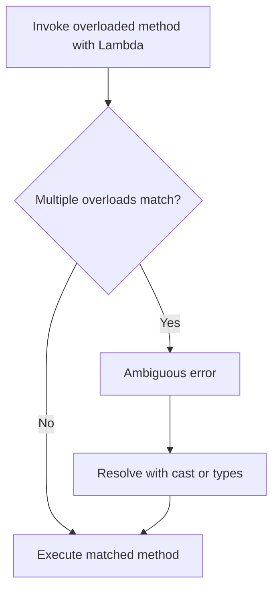

# Session 99: Java 8 New Features 04

## Table of Contents
- [Lambda Expression Rules (Continued)](#lambda-expression-rules-continued)
  - [Overview](#overview)
  - [Key Concepts/Deep Dive](#key-conceptsdeep-dive)
    - [Rule 15: Local Variables and Parameters Scope](#rule-15-local-variables-and-parameters-scope)
    - [Rule 16: Modifying Enclosing Method Local Variables](#rule-16-modifying-enclosing-method-local-variables)
    - [Rule 17: This and Super Keywords in Lambda Expressions](#rule-17-this-and-super-keywords-in-lambda-expressions)
    - [Rule 18: Exceptions in Lambda Expressions](#rule-18-exceptions-in-lambda-expressions)
    - [Generics in Functional Interfaces](#generics-in-functional-interfaces)
    - [Overloading Methods with Functional Interfaces](#overloading-methods-with-functional-interfaces)
    - [Ambiguous Error Resolution](#ambiguous-error-resolution)
  - [Code/Config Blocks](#codeconfig-blocks)
  - [Lab Demos](#lab-demos)
- [Summary](#summary)
  - [Key Takeaways](#key-takeaways)
  - [Expert Insight](#expert-insight)

## Lambda Expression Rules (Continued)

### Overview
This session continues the Lambda expression rules from Java 8, building on the previous 14 rules by focusing on advanced scoping, variable modification constraints, keyword behavior (this and super), exception handling mechanics, and integration with generics in functional interfaces. It also covers how Lambda expressions resolve overloaded methods and strategies to handle ambiguous errors. Lambda expressions serve as concise implementations of functional interfaces, eliminating the verbosity of anonymous inner classes while preserving Java's type safety and scoping rules. They are stateless and executed as method bodies within the enclosing class context.

### Key Concepts/Deep Dive
The continued rules (15-18) ensure Lambda expressions behave predictably in complex Java environments, with extensions to generics for type flexibility and overloading for method dispatch. These rules address compilation errors and runtime integrity common in functional programming.

#### Rule 15: Local Variables and Parameters Scope
Lambda expression parameters or local variables cannot shadow (reuse names of) enclosing method parameters or local variables. The Lambda body is scoped as a local block within the enclosing method, preventing variable name collisions that could lead to ambiguity or errors.

- Attempting to declare a variable with the same name as an enclosing scope variable results in a compiler error: "variable <name> is already defined."

#### Rule 16: Modifying Enclosing Method Local Variables
Lambda expressions can access enclosing method parameters and local variables for reading but cannot modify them. Variables must be "effectively final" (not reassigned after initialization). This promotes immutability and thread-safety.

- Modification attempts trigger: "local variable referenced from a Lambda expression must be final or effectively final."

#### Rule 17: This and Super Keywords in Lambda Expressions
In Lambda expressions, `this` and `super` refer to the enclosing class instance, not the Lambda itself (Lambdas have no state). This differs from anonymous inner classes, where `this` refers to the inner class object.

- Use `OuterClass.this` or similar for disambiguation in nested contexts.
- Unlike anonymous inner classes, Lambdas cannot have instance variables.

#### Rule 18: Exceptions in Lambda Expressions
Exception handling adheres to overriding principles:
- If the functional interface method declares checked exceptions, Lambdas can throw those exceptions or none.
- Unchecked exceptions can be thrown regardless.
- Different checked exceptions cause compilation errors unless caught internally.

**Table: Exception Handling in Lambdas**

| Functional Interface Declaration | Lambda Behavior | Checked/Unchecked |
|----------------------------------|---------------|-------------------|
| Throws checked exception (e.g., `InterruptedException`) | Can throw same checked exception or none | Checked |
| Throws unchecked exception (e.g., `RuntimeException`) | Can throw | Unchecked |
| No exceptions declared | Only unchecked exceptions allowed; checked exceptions error | Mixed |

Generics enhance functional interfaces by allowing type parameterization (e.g., `<T>`), enabling reusable, type-safe Lambda implementations. Primitive types autobox to wrappers.

#### Generics in Functional Interfaces
Generics allow specification of parameter and return types at instantiation, improving flexibility.

**Rules**:
- E.g., `interface Func<T> { T apply(T t); }` → `Func<Integer> f = n -> n * 2;`
- Bounds: `<T extends A>` restricts types to `A` or subclasses.
- Auto-conversion: Primitives to wrappers; incompatible wrappers error.

#### Overloading Methods with Functional Interfaces
When methods are overloaded with functional interface parameters, Java resolves based on Lambda signature matching. Ambiguities arise if interfaces have identical parameter/return types.

- Matching occurs by implicit Lambda types (parameters, return).
- Resolution fails silently or with errors if multiple matches possible.

#### Ambiguous Error Resolution
Ambiguous errors in overloaded methods with functional interfaces occur when Lambda types match multiple overloads. Resolve by:
- Explicit casting: `(Func<A>) (() -> {...})`.
- Explicit parameter types in Lambda: `(A x) -> {...}`.
- If parameter/return combinations differ (e.g., different return types), resolution may succeed automatically.

**Diagram: Lambda Resolution Flow**



### Code/Config Blocks
#### Rule 15 Example: Variable Shadowing
```java
class Test {
    public static void main(String[] args) {
        int p = 60;  // Enclosing local
        Func f = () -> {
            // int p = 70;  // Error: p already defined
            System.out.println(p);  // Ok: reads enclosing p
        };
    }
}
```

#### Rule 16 Example: Modification Restriction
```java
class Test {
    public static void main(String[] args) {
        int p = 10;  // Effectively final
        Func f = () -> {
            // p = 30;  // Error: cannot modify
            System.out.println(p);  // Ok: reads p
        };
    }
}
```

#### Rule 17 Example: This and Super
```java
class A { int a = 10; }
class B extends A {
    int b = 20;
    void m() {
        Func f = () -> {
            System.out.println(this.b);  // 20: enclosing object
            System.out.println(super.a);  // 10: superclass of enclosing
        };
        // Anonymous inner: this refers to inner object
    }
}
```

#### Rule 18 Example: Exceptions
```java
interface Func {
    void m() throws InterruptedException;  // Declares checked exception
}

// Ok: throws declared exception
Func f1 = () -> { throw new InterruptedException(); };

// Ok: no throw
Func f2 = () -> { System.out.println("No exception"); };

// Error: different checked exception
// Func f3 = () -> { throw new ClassNotFoundException(); };  // Uncomment to see error
```

#### Generics Example
```java
interface Addition<T> {
    T add(T a, T b);
}
Addition<Integer> addInt = (a, b) -> a + b;  // a, b: Integer
```

#### Overloading and Ambiguity
```java
class Example {
    static void m(Func0 f) { System.out.println("No param"); }
    static void m(Func1 f) { System.out.println("Int param"); }

    public static void main(String[] args) {
        // Ok: matches Func1
        m((int x) -> System.out.println(x));

        // Ambiguous: cast to resolve
        m((Func0) (() -> {}));
    }
}
```

### Lab Demos
1. **Scope Demo**: Create a class with enclosing local `int p = 10;`. Implement a Lambda attempting to declare `int p = 20;`. Run compilation to observe: "variable p is already defined."
   
   Steps:
   - `javac Test.java` → Error.
   - Comment out the inner `int p` → Successful compile/run, prints 10.

2. **Local Variable Modification Demo**: Modify enclosing local `int p = 10;` inside Lambda. Observe compilation failure: "local variable must be final or effectively final."
   
   Steps:
   - Add `p = 20;` in Lambda body.
   - `javac Test.java` → Error.
   - Remove assignment → Prints 10.

3. **This/Super Demo**: In class `B` extending `A`, call `this` and `super` in Lambda. Compare with anonymous inner class.
   
   Steps:
   - Run: `javac B.java && java B` → Lambda: b=20; Super: a=10.
   - Change to anonymous inner: `this` refers to anonymous object (adjust println).

4. **Exception Handling Demo**: Implement interface throwing `InterruptedException`. Try throwing wrong checked exception.
   
   Steps:
   - `javac FuncImpl.java` for correct → Ok.
   - Change to throw `ClassNotFoundException` Comment out: ~Unreported exception~.
   - Wrap in try-catch → Compiles.

5. **Generics Demo**: Create generic `Addition<T, R>`, implement with `Integer` and `String` returns.
   
   Steps:
   - Instantiate `Addition<Integer, Integer>`.
   - Run: `System.out.println(add.add(5, 10));` → 15.
   - Change to `String`: Adjust Lambda to `String.valueOf(a + b)`.

6. **Overloading Demo**: Overload method with `Func<Void>` and `Func<Integer>`. Call with Lambda and resolve ambiguity.
   
   Steps:
   - Call without types → Ambiguous error.
   - Cast `(Func<Void>) (() -> {})` → Prints "Void param".

7. **Ambiguous Resolution Demo**: Replicate and fix ambiguous overload with types/casts.
   
   Steps:
   - Cause error: "reference to m is ambiguous."
   - Fix: `m((Integer x) -> x)` → Executes int param method.

## Summary

### Key Takeaways
```diff
+ Rules 15-18 enforce scoping and mutability restrictions for functional safety.
+ Exception rules follow inheritance: match declared checked exceptions in overrides.
+ Generics enable type-safe, reusable functional interfaces.
+ Overloading resolution uses Lambda signatures; ambiguous cases need explicit resolution.
+ This/super in Lambdas point to enclosing class, unlike stateful inner classes.
```

### Expert Insight

#### Real-world Application
In microservices (e.g., Spring Boot), use these rules for event-driven pipelines, ensuring Lambdas don't mutate shared state in concurrent threads. Generics support type-safe API integrations, like mapping entities in `Stream.map()`. Exception handling prevents silent failures in async operations.

#### Expert Path
Advance to Java 9+ features complementing Lambdas (e.g., `var` in parameters). Study JVM bytecode for Lambdas via `javap`. Practice with functional libraries like Guava/Vavr for advanced patterns. Target OCP Java 8/11 certification modules on Lambdas.

#### Common Pitfalls
- Variable shadowing: Collision leads to "already defined" error. Resolution: Rename Lambda variables; log enclosing scopes.
- Modification attempts: Forgets "effectively final." Resolution: Refactor to final/bloc variables; use debugging tools.
- This keyword misuse: Expects Lambda `this` as object-like. Resolution: Prefix with class name for outer access; test with `System.identityHashCode(this)`.
- Exception mismatches: Throws undeclared checked. Resolution: Declare in interface or catch; use try-catch in Lambda.
- Ambiguous overloading: Multiple matches. Resolution: Cast Lambda or use `var` explicitly; review overload signatures.
- Generic bounds: Ignores extends clause. Resolution: Enforce bounds upfront; error messages guide corrections.
- State assumptions: Treats Lambda as class. Resolution: Remember stateless nature; use fields in interfaces.

#### Lesser Known Things
- JVM represents Lambdas as `invokedynamic` bytecode, enabling dynamic dispatch without anonymous class overhead.
- "Effectively final" variables can be shared across enclosing scopes in multi-thread contexts without closures.
- Lambdas support default methods in interfaces (Java 8+), allowing mixin behaviors.
- Variable shadowing rules prevent "lexical scoping confusion" in nested Lambdas.
- Overloading resolution can leverage return types only if parameter signatures differ marginally.</parameter>
