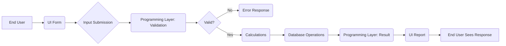

# Session 01: Core Java and Full Stack Java Introduction

## Table of Contents
- [Understanding Full Stack Java Development](#understanding-full-stack-java-development)
- [Advantages of Full Stack Development](#advantages-of-full-stack-development)
- [Project Architecture](#project-architecture)
- [Roles in Development](#roles-in-development)

## Understanding Full Stack Java Development

### Overview
Full stack development refers to the comprehensive process of building a complete software application end-to-end, encompassing all layers from the user interface to backend databases. This approach ensures developers can handle every aspect of a project, making them more versatile and valuable in the job market. In contrast to specialized roles that focus on a single layer, full stack developers master multiple technologies, enabling them to create holistic solutions without dependency on separate teams for different project components.

The concept emerged prominently post-pandemic due to economic pressures that favored efficient, multitask developers over siloed teams. Full stack training, particularly in languages like Java, Python, .NET, or Node.js, equips learners with a complete toolkit for modern software development.

### Key Concepts/Deep Dive
#### Core Components of Full Stack Development
Every software project is fundamentally divided into three interconnected layers:

**1. User Interface (UI)**
- **Definition**: The visible part of an application that users interact with, serving as the entry point for data input and result display.
- **Subcomponents**:
  - **Forms**: Collect user inputs (e.g., login credentials, registration data) and submit them to backend processing.
  - **Reports**: Display processed results, responses, or data visualizations (e.g., homepage, dashboard views).
- **Purpose**: Acts as the "front end" where end users provide requests and receive outputs.
- **Examples**: In a banking app, the login screen (form) and transaction history page (report) are UI elements.

**2. Programming Layer**
- **Definition**: The business logic engine that processes validations and computations.
- **Operations**:
  - **Validations**: Check input data for correctness (e.g., verifying account balance before a transfer). If invalid, return errors.
  - **Calculations**: Perform mathematical operations (addition, subtraction, multiplication, division) to generate results.
- **Purpose**: Acts as middleware connecting UI inputs to database operations, ensuring secure and accurate data handling.
- **Examples**: In an e-commerce platform, validating coupon codes or calculating discounted prices.

**3. Database Layer**
- **Definition**: Persistent storage for application data, organized in tables (rows and columns).
- **CRUD Operations**:
  - **Create (Insert)**: Add new records (e.g., new user registration).
  - **Read (Select)**: Retrieve existing data (e.g., user login verification).
  - **Update**: Modify records (e.g., changing password).
  - **Delete**: Remove records (e.g., account deactivation).
- **Purpose**: Ensures data integrity and permanent storage for future retrieval or modifications.
- **Examples**: Storing customer orders or product inventories in relational tables.

#### Project Architecture Flow
A typical request-response cycle follows this sequential process:



- **End-to-End Explanation**:
  - User submits data via a form (e.g., entering login details).
  - Programming layer validates inputs in real-time (e.g., checking valid email format).
  - Valid data triggers calculations (e.g., computing order totals).
  - Results are stored/retrieved from the database.
  - A report displays the outcome to the user, completing the cycle.

This flow ensures no layer operates in isolation, emphasizing the need for full stack proficiency.

### Tables
**Comparison of Development Roles**

| Aspect          | Specialized Developer (e.g., Java Developer) | Full Stack Developer          |
|-----------------|---------------------------------------------|-------------------------------|
| Scope           | Handles only one layer (e.g., backend logic) | Covers all layers (UI, logic, database) |
| Dependencies    | Requires separate teams for other layers     | Self-sufficient for entire project |
| Job Market      | High availability but project-specific      | Highly demanded, versatile roles |
| Example         | Fixes bugs in server-side code only         | Builds complete app from scratch |

**Common Input Validation Scenarios**

| Scenario                | Validation Type | Example Outcome                |
|-------------------------|-----------------|---------------------------------|
| Insufficient Balance    | Numeric Limit  | "Insufficient funds" error      |
| Invalid Email Format    | Pattern Check  | "Invalid email" message         |
| Duplicate Username      | Uniqueness     | "Username already exists"       |
| Age Restriction         | Range Check    | "Must be 18+ years" alert       |

## Advantages of Full Stack Development

### Overview
The rising demand for full stack skills stems from market dynamics favoring comprehensive developers capable of handling complete project lifecycles. This trend accelerated after the pandemic, when companies consolidated teams to reduce costs and improve efficiency. Full stack developers resemble all-rounders in sports, offering broader utility than specialists like pure batsmen or bowlers.

### Key Concepts/Deep Dive
#### Why Full Stack is Trending and Demanding
- **Complete Project Ownership**: Enables developers to build, maintain, and debug entire applications without inter-team dependencies.
- **Versatility in Technologies**: Knowledge of UI, programming, and database ensures adaptability across frameworks and languages, making skill transfer easy (e.g., similar patterns in Java, Python).
- **Job Security and Ease**: Full stack expertise opens more opportunities; companies prefer candidates who can contribute across layers.
- **Cost-Effective Delivery**: Mimics "ready-made" framework benefits over manual coding, akin to using bootstrap libraries versus writing CSS from scratch.

#### Comparison with Other Paradigms
Specialized roles risk obsolescence if a project lacks their specific expertise, while full stack developers remain relevant across diverse projects.

## Roles in Development

### Overview
Full stack development encompasses various flavored approaches, each named after the dominant programming language. These roles emphasize mastery in one language while building basic-to-intermediate skills in complementary areas.

### Key Concepts/Deep Dive
#### Full Stack Development Variants
- **Full Stack Java Developer**: Core expertise in Java (both core and advanced), with knowledge of UI frameworks (HTML/CSS/JavaScript) and databases (SQL/PL-SQL).
- **Full Stack Python Developer**: Strong Python focus, UI basics, database familiarity.
- **Full Stack .NET Developer**: Deep .NET knowledge, UI/database integration.
- **Full Stack Node.js Developer**: JavaScript-centric (server-side via Node.js), full-stack capabilities.

#### Recommended Learning Path
- **Priority**: Master the chosen core language (e.g., Java) and gain working knowledge in others for interviews and portability.
- **Minimum Requirement**: Knowledge of at least two languages (e.g., Java master + Python basics).
- **Full Stack vs. Core**: Full stack extends beyond core language training to include UI/database integration.

## Summary

### Key Takeaways
```diff
+ Full stack development builds complete, end-to-end projects across UI, programming, and database layers.
+ Project architecture follows a logical flow: UI → Programming (Validations/Calculations) → Database → Response.
+ Full stack Java focuses on Java as the core language, ensuring comprehensive application development skills.
- Specialized roles are limited to one layer; full stack offers broader job opportunities and adaptability.
+ Frameworks (e.g., Bootstrap, jQuery, React) accelerate development over manual coding.
! Mastering multiple languages enhances interview success and technology switching.
```

### Expert Insight

#### Real-world Application
In production environments, full stack developers design e-commerce platforms where UI forms handle customer orders, programming layers validate payments and calculate taxes, and databases store transaction histories. For instance, a ride-sharing app requires seamless integration across user booking interfaces, route optimization algorithms, and driver database records—skills a full stack developer provides independently.

#### Expert Path
To master full stack Java, start with core Java fundamentals, then layer on UI basics (HTML/CSS/JS) and database operations (SQL). Practice by building simple projects (e.g., a todo app with form submissions and data persistence). Regularly review documentation and contribute to open-source projects for hands-on experience. Target Oracle certifications to validate expertise.

#### Common Pitfalls
Avoid over-specializing in one layer, as this limits job prospects in full stack roles where holistic understanding is key. Common issues include misunderstanding project flows, leading to inefficient database queries or insecure form validations—learn to trace data lifecycles to prevent these. Never underestimate foundational skills like integer mathematics for calculations, as many bugs stem from basic logic errors.

#### Lesser Known Things About This Topic
Many full stack variants include "serverless" computing where databases are abstracted (e.g., using AWS Lambda), reducing coding but requiring cloud knowledge. The pandemic shift favored full stack due to remote collaboration, as complete projects could be managed by smaller teams. Trends like low-code platforms are emerging, but coding proficiency remains essential for customization and debugging.
