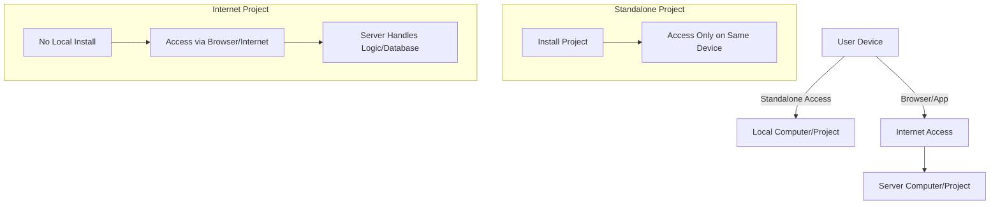
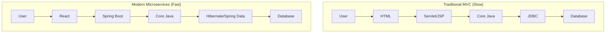
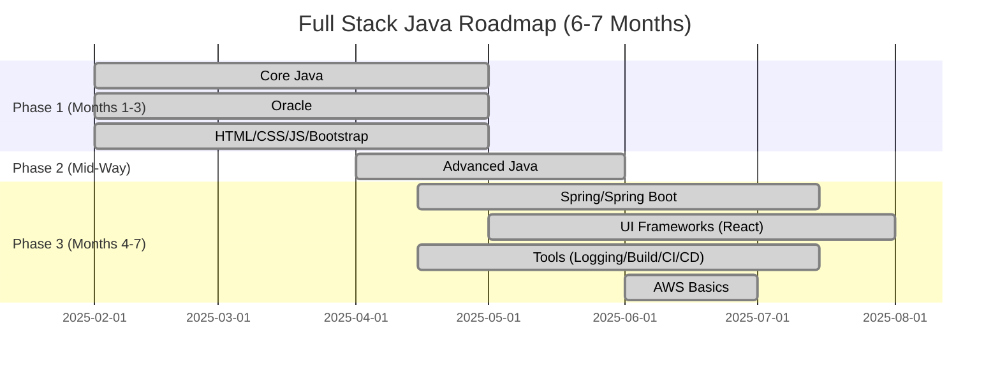

# Session 2: Core Java and Full Stack Java

## Table of Contents
- [Recap of Previous Session](#recap-of-previous-session)
- [Full Stack Java Overview](#full-stack-java-overview)
- [Types of Projects (Standalone vs. Web/Internet Projects)](#types-of-projects-standalone-vs-webinternet-projects)
- [Courses and Modules in Full Stack Java](#courses-and-modules-in-full-stack-java)
- [Project Architecture](#project-architecture)
- [Learning Roadmap and Duration](#learning-roadmap-and-duration)
- [Preparation and Expectations](#preparation-and-expectations)
- [Administrative Details](#administrative-details)

## Recap of Previous Session
### Overview
This section reviews key points from the previous class on Full Stack Java, ensuring continuity and addressing any missed content. The instructor confirms that recorded videos of previous sessions are available for reference, eliminating concerns about absences.

### Key Concepts/Deep Dive
**Full Stack Development Basics**:
- **Full Stack**: Complete end-to-end project development, encompassing UI, programming, and database layers.
- **Project Layers**: Three layers – UI (Front End), Programming (Business Logic), Database (Back End).
- **UI Layer Operations**: Developing forms and reports using languages like HTML, CSS, JavaScript, and Bootstrap.
- **Programming Layer Operations**: Performing validations and calculations, primarily in Core Java.
- **Database Layer Operations**: CRUD operations (Create, Read, Update, Delete) using SQL and PL/SQL.
- **Most Important Layer**: Programming layer, as it handles core logic.
- **Full Stack Java Meaning**: End-to-end project development using Java as the core programming language.
- **Comparisons to Other Stacks**:
  - Full Stack Python: Uses Python.
  - Full Stack .NET: Uses .NET.
  - Full Stack UI: Focuses on UI technologies independently.

> [!NOTE]
> For students who missed the previous session, video recordings provide full coverage, so no foundational knowledge gaps exist.

## Full Stack Java Overview
### Overview
Full Stack Java development involves mastering multiple courses to build complete projects. Unlike independent full stack streams (e.g., Python, .NET, UI), Java-based full stack integrates Java across programming components, treating it as four or five courses (depending on organization) under a single "Java module."

### Key Concepts/Deep Dive
**Distinctions in Full Stack**:
- Full stack refers to multiple integrated courses, not a single course.
- Purpose: Enable end-to-end project development including UI, programming, and database.
- Front End: UI (e.g., Forms, Reports).
- Back End: Programming + Database.

**Example Workflow**:
1. UI collects user input.
2. Core Java performs validations and calculations.
3. Data is stored/retrieved from database (e.g., Oracle).

> [!IMPORTANT]
> Full Stack Java requires connections between layers (via Advanced Java for traditional approaches or frameworks like Spring Boot for modern ones). Without these, projects remain standalone rather than accessible via internet.

## Types of Projects (Standalone vs. Web/Internet Projects)
### Overview
Projects are categorized based on accessibility. Standalone projects are locally accessible only, while internet projects are web-based and remotely accessible. This distinction is critical for market viability, as modern clients demand global reach.

### Key Concepts/Deep Dive
**Standalone Applications**:
- **Definition**: Projects installed on a local computer, accessible only from that device. Examples include offline games, calculators, or local antivirus software.
- **Installation-Based**: Requires local installation; no network browsing needed.
- **Limitations**: No remote access; not scalable for global clients.
- **Examples**:
  - Desktop games.
  - Calculator apps accessible only on one device.
  - Antivirus software not sharing data across networks.
- **Real-World Analogy**: Like owning a personal diary – others can't read it unless physically handled.

**Internet/Web Applications**:
- **Definition**: Projects installed on server computers, accessible via browsers or apps over the internet.
- **Accessibility**: Remote access possible; examples include Flipkart, GPay, HDFC Bank apps/websites.
- **App vs. Project Distinction**:
  - Apps (e.g., Instagram, WhatsApp): Standalone installation on mobile/computer, connecting to internet-based back-end projects.
  - Examples: WhatsApp app is standalone; WhatsApp project is internet-based.
- **Front End vs. Back End**:
  - Front End (UI): Standalone interface (e.g., game UI) that connects to back-end if needed.
  - Back End: Internet-based; handles data processing and storage.
- **Real-World Analogy**: Like a bank – the app is your wallet (standalone), but the bank server (internet) processes transactions.

**Confusions and Clarifications**:
- Browsers are standalone (installed locally) but access internet projects.
- Apps like PhonePe are standalone front-ends accessing internet back-ends.
- Internet apps use Wi-Fi/data for back-end operations (e.g., message sending); without data, only local features work.

**Diagrams**:


**Comparisons Table**:

| Aspect                  | Standalone Application | Internet Application |
|-------------------------|-------------------------|----------------------|
| Installation             | Required on device     | Not required; server-based |
| Accessibility           | Local only             | Remote via internet |
| Examples                | Calculator, Offline Games | Amazon, Instagram Project |
| Scalability             | Low (single device)    | High (global)       |
| Client Needs            | Limited to local users | Global reach preferred |

## Courses and Modules in Full Stack Java
### Overview
Full Stack Java comprises five modules, ensuring comprehensive skill coverage. Each module has specific courses, chosen for market relevance (e.g., Oracle for Java developers, SQL/PL-SQL for database operations, React over Angular for UI).

### Key Concepts/Deep Dive
**Modules Overview**:
1. **Programming/Java Module**: Core to projects; 5 courses (Core Java, Advanced Java, Spring, Spring Boot, Microservices).
2. **Database Module**: 1 main course (Oracle – SQL, PL/SQL); others covered in integrations.
3. **UI Module**: 5+ courses/technologies (HTML, CSS, JavaScript, Bootstrap, React).
4. **DevSecOps Tools Module**: Selected tools for development, security, and operations (e.g., Logging, Build, CI/CD, Monitoring).
5. **AWS Basics Module**: Cloud essentials for project hosting.

**Detailed Courses**:
- **Programming/Java Module**:
  - Core Java: Programming fundamentals, validations, calculations.
  - Advanced Java: Connections (Servlet, JSP, JDBC) for traditional projects.
  - Spring: Manual framework (now less common).
  - Spring Boot: Automated version of Spring (+Hibernate alternatives).
  - Microservices: Modern architecture replacing MVC.
- **Database Module**:
  - Oracle (SQL, PL/SQL): Mandatory; SQL and PL/SQL (Procedural Language extensions to SQL) for operations.
  - Integrations: Connections to MySQL, PostgreSQL, MongoDB shown in Spring Boot.
- **UI Module**:
  - HTML, CSS, JavaScript, Bootstrap: Base UI technologies.
  - React: Primary framework (vs. Angular for simplicity and power).
- **Tools Module**:
  - Logging: SLF4J, Log4J.
  - Build: Maven, Gradle.
  - CI/CD: Jenkins, Docker.
  - Testing: JUnit, Mockito.
  - Quality: SonarQube.
  - Monitoring: ELK, DataDog.
  - Others: JIRA, Chef, Hioku.
- **AWS Module**: Basics for cloud deployment (not full course).

> [!TIP]
> Advanced Java (Servlet, JSP, JDBC) enables standalone-to-internet transitions; lacking it results in standalone apps only.

## Project Architecture
### Overview
Project architecture outlines system flow and technologies. Traditional (MVC-based) uses manual layers; modern (microservices) uses frameworks for efficiency, reducing development time while retaining core principles.

### Key Concepts/Deep Dive
**Traditional Architecture (MVC)**:
- **Model**: Database (e.g., Oracle tables).
- **View**: UI (HTML).
- **Controller**: Programming (Core Java + Advanced Java).
- **Flow**: User → HTML → Servlet/JSP → Core Java → JDBC → Database.
- **Issue**: Slow development due to manual coding.

**Modern Architecture (Microservices)**:
- **Replacement**: Advanced Java → Spring Boot (with Hibernate/Spring Data).
- **UI Layer**: HTML/React.
- **Flow**: User → React → Spring Boot → Core Java → Hibernate/Spring Data → Database.
- **Benefits**: Faster development, scalable, less transaction load.
- **Frameworks Choice**: Spring Boot over Hibernet for ease; Spring Data for minimal DB connections.

**Diagrams**:


**Key Changes**:
- Core Java, HTML, Database remain constant.
- Advanced Java → Spring Boot for automation.

> [!WARNING]
> Without Advanced Java or Spring Boot, projects are standalone only – non-viable commercially.

## Learning Roadmap and Duration
### Overview
Structured learning spans 6-7 months, emphasizing parallel course study (3 courses simultaneously) and hands-on practice to avoid prolonged timelines. Core Java is the first deep dive.

### Key Concepts/Deep Dive
**Parallel Learning Strategy**:
- **Phase 1 (3 Months)**: Core Java, Oracle (SQL/PL/SQL), HTML (with CSS/JS/Bootstrap). Spaced sessions (6 hours/day: 2 hours per course).
- **Phase 2 (Mid-Point Integration)**: After 45 days (core OOP concepts in Java, SQL basics, HTML basics), start Advanced Java (45 days-2 months).
- **Phase 3**: Spring/Spring Boot during Advanced Java (3-4 months total for frameworks).
- **Total Duration**: 6-7 months; includes DevSecOps tools and AWS alongside.

**Tools Integration**:
- Covered concurrently with programming modules by dedicated faculty.
- Examples: Logging (Log4J/SLF4J), Build (Maven/Gradle), CI/CD (Jenkins/Docker).

**Roadmap Diagram** (Sequential Overlap):


**Preparation Advice**:
- Practice 8 hours/day: 6 hours classes + 2 hours lab.
- Use notebooks for notes; practice daily.
- Lab access: Offline (Reliance Fresh Building, Hyderabad); Online (links provided).

> [!NOTE]
> Avoid rushing modules individually (takes 2+ years); parallel learning compresses timeline.

## Preparation and Expectations
### Overview
Success demands discipline: hands-on practice, self-study, and proactive doubt-clearing. Faculty guides batches; administrative contacts ensure smooth progress.

### Key Concepts/Deep Dive
**Expectations**:
- Take seriously; no time-pass mentality.
- Use notebooks; attend sessions actively.
- Resolve doubts via chat (online) or direct faculty contact.
- Practice: 2 hours/day lab recommended; own laptops preferred.

**Administrative Support**:
- Offline Admin: Venugopal (mobile numbers provided for contact).
- Online Admin: Satish (mobile/whatsApp details shared).
- Faculty Contact: Hari Krishna (9010454584 / WhatsApp Channel "HK Fullstack Java Development 9 AM").
- WhatsApp Channel: Link provided for updates, materials, and community.

**Corrections in Transcript**:
- "Rude operations" → "CRUD operations" (Create, Read, Update, Delete).
- "SESQL" → "PL/SQL" (Procedural Language/SQL extensions).
- "serlet" → "Servlet" (Java technology name).
- "jaman" → "jamna" or "era" (referring to time periods, but likely "Jamana" as slang for "age/era").
- "mortam" → "mottam" (likely "mottam" or similar slang, possibly "motti" meaning catchy highlights).

> [!IMPORTANT]
> Do not raise hands in online sessions; use chat for questions.

## Summary
### Key Takeaways
```diff
+ Full Stack Java integrates UI (HTML/React), Programming (Core Java/Spring Boot), Database (Oracle), Tools, and Cloud (AWS) for end-to-end web projects.
+ Standalone apps are local-only; internet apps require connections (Advanced Java/Spring Boot) for scalability.
+ Learning roadmap: 3 courses parallel (6-7 months total); prioritize Core Java as project core.
+ MVC (traditional) vs. Microservices (modern): Frameworks like Spring Boot enable faster development.
- Skipping Advanced Java/Spring Boot results in standalone (non-marketable) projects.
! Market demand drives Java-specific choices: Oracle over MySQL, React over Angular.
- Cellular service consulted for PL/SQL confirmation (actual search recommended for accuracy).
```

### Expert Insight
- **Real-world Application**: In e-commerce apps (e.g., custom Amazon clone), UI collects orders, Spring Boot handles business logic (Core Java), and Oracle stores inventory. Ensures global access vs. standalone POS systems.
- **Expert Path**: Master Core Java first (6-8 months), then specialize in Spring Boot/microservices. Certify in Oracle SQL/PL-SQL; contribute to open-source projects using React/Spring Boot for portfolio.
- **Common Pitfalls**: Assuming browsers/apps are internet projects (they're standalone access points); neglecting parallel learning (leads to delays); chasing quick fixes without full practice (results in interview failures).
- **Lesser Known Things**: PL/SQL is procedural, not just "programming"; Spring Boot automates Spring (e.g., auto-config); Tools like Docker enable "containerized" deployments for easy scaling; Gym ownership analogies show business-IT integration needs.
