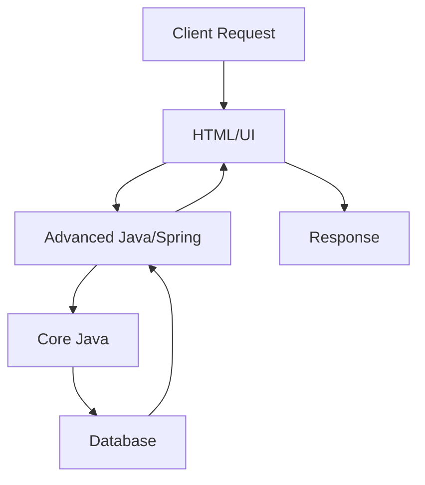

# Session 03: Core Java and Full Stack Java Introduction

## Table of Contents
- [Course Overview and Revision](#course-overview-and-revision)
- [Full Stack Java Modules and Courses](#full-stack-java-modules-and-courses)
- [Independent Courses and Prerequisites](#independent-courses-and-prerequisites)
- [Course Architecture and Key Technologies](#course-architecture-and-key-technologies)
- [DevOps Tools and Cloud Servers](#devops-tools-and-cloud-servers)
- [Course Duration and Fees](#course-duration-and-fees)
- [Class Timings and Material Sharing](#class-timings-and-material-sharing)
- [Core Java Introduction and Syllabus](#core-java-introduction-and-syllabus)
- [Core Java Language Fundamentals](#core-java-language-fundamentals)
- [Logical Programming](#logical-programming)
- [Object-Oriented Programming](#object-oriented-programming)
- [Java Library](#java-library)
- [Java New Features](#java-new-features)
- [Project Development](#project-development)

## Course Overview and Revision

### Overview
This session serves as a comprehensive revision of the full stack Java course introduction from previous days, reinforcing key concepts, modules, courses, roadmap, and administrative details. It transitions into an in-depth introduction to Core Java as the foundational course, covering its syllabus, prerequisites, duration, fees, and learning approach. The instructor emphasizes patience, consistency, and practical understanding to prepare beginners for expert-level proficiency.

### Key Concepts/Deep Dive
- **Day 1 Recap**: Introduction to full stack Java, including meaning, layers (UI, Programming, Database), operations per layer, importance of projects, and course durations (6-7 months full stack, 9 months parallel, 1-1.5 years sequential).
- **Day 2 Recap**: Roadmap, responsibilities (admins for offline/online), WhatsApp channel for material/discussion, and number (9010454584) for subject-related doubts.
- **Day 3 (Today)**: Revision points, independent courses (Core Java, Oracle, HTML), course architecture, DevOps tools, cloud basics (AWS vs. Azure), and detailed Core Java focus.
- **Administrative Guidelines**: Contact admin only for class joining/fees; WhatsApp instructor for course doubts; patience over speed; change hostel if needed for sleep (10:30 bed, 5 AM wake-up); join WhatsApp channel for notifications and materials.
- **Roadmap Details**: Parallel learning recommended for job seekers; sequential for college-going students; no prerequisites; build Java vocabulary/language like learning languages (speaking > listening).
- **Full Stack Java Meaning**: Layers - UI (HTML, CSS, JS, Bootstrap, React), Programming (Java, Advanced Java, Spring, Spring Boot, Microservices), Database (Oracle), DevOps (Maven, Gradle, JUnit, etc.), Cloud (AWS/Azure).
- **Course Types**: Full stack Python/.NET/UI for specific niches, but focus on Java-based full stack for completeness.

> [!NOTE]
> Emphasizes accountability: Students must stay awake, focused, and participate actively. No shy feeling - speak to learn.

> [!IMPORTANT]
> Revision day: Every Sunday revise previous week's topics for retention.

### Lab Demos
No explicit lab demos in this session, but references to future recording sharing and live class practice.

## Full Stack Java Modules and Courses

### Overview
Full stack Java comprises 5 modules: Programming, UI, Database, DevOps, Cloud. Differentiation from standalone applications to internet-accessible ones using mediators like Advanced Java and Spring.

### Key Concepts/Deep Dive
- **Modules Breakdown**:
  - Programming Module: Java, Advanced Java, Spring, Spring Boot, Microservices (5 courses, led by Core Java).
  - UI Module: HTML, CSS, JavaScript, Bootstrap, React (Shivakumar for engaging sessions).
  - Database Module: Oracle (SQL, PL/SQL for programming focus only).
  - DevOps Module: Log4J, SL4J, Maven, Gradle, JUnit, JMeter, Jenkins, Docker, Chef, HiKaru, Data Dog (for logging, building, deploying, testing, delivering).
  - Cloud Module: AWS (Amazon Web Services) basics (20-30 days), full form "Amazon Web Services."
- **Course Nature**: Internet-based business requires storage (Oracle), accessibility (HTML + Advanced Java), frameworks for efficiency (Spring over Advanced Java), and tools for operations.

### Tables
| Module       | Courses/Tools                  | Purpose                          |
|--------------|--------------------------------|----------------------------------|
| Programming | Java, Advanced Java, Spring, Spring Boot, Microservices | Business logic, web apps, micro-architectures |
| UI          | HTML, CSS, JS, Bootstrap, React| User interfaces, web accessibility |
| Database    | SQL, PL/SQL                    | Data storage/processing          |
| DevOps      | Maven, Gradle, JUnit, Jenkins, Docker, etc. | Build, test, deploy, deliver     |
| Cloud       | AWS/Azure                      | Rentable online servers          |

### Lab Demos
No demos, but instructor mentions sharing recorded videos in WhatsApp channel for past sessions.

## Independent Courses and Prerequisites

### Overview
Independent courses (Core Java, Oracle, HTML) require no prerequisites and can start immediately. Full stack Java has no prerequisites overall - starts from basics.

### Key Concepts/Deep Dive
- **Independent Courses**: Start parallel; Core Java (~45 days OOP basics), then integrate others.
- **Parallel vs. Sequential**: Parallel (3 months per course average, total 9 months + extras) recommended for job seekers; sequential for those with time gaps.
- **Purpose of Each**:
  - Core Java: Standalone project development (tree roots); Java language.
  - Oracle: Terabytes data storage (database roots).
  - HTML: Internet-accessible UI (but needs Advanced Java for connection).
  - Advanced Java: Acts as mediator between HTML/client and Core Java/server.
  - Spring/Spring Boot: Faster web app development over Advanced Java.
  - UI Frameworks (Bootstrap/React): Time-efficient over pure HTML/CSS/JS.
- **Total Duration**: 9 months parallel, 1-1.5 years sequential + hostel expenses (~7-8k/month).

### Lab Demos
Referencing future integration in projects: Standalone via Core Java first, then internet-accessible.

## Course Architecture and Key Technologies

### Overview
Body analogy: Face (HTML), Ears/Eyes (Advanced Java/Spring), Brain (Advanced Java/Microservices), Heart (Core Java), Database (memory/storage), DevOps Tools (thinking/actions).

### Key Concepts/Deep Dive
- **Architecture Metaphor**:
  - HTML/UI: Internet-facing (like face).
  - Advanced Java: Data mediator (like ears).
  - Spring/Spring Boot: Efficient communication (like eyes).
  - Core Java: Core logic (heart/brain).
  - Database: Permanent storage (memory).
  - DevOps: Operations thinking (actions/decisions).
  - Cloud: Server rentals (extensions).
- **Standalone vs. Internet Apps**: Core Java for standalone; Advanced Java/Spring for accessible projects; compounding to web apps.
- **Microservices**: Break projects into small, connectable programs.

```diff
! Client Request → HTML (UI) → Advanced Java/Spring (mediator) → Core Java (logic) → Database (storage) → Response back
```

### Diagrams


## DevOps Tools and Cloud Servers

### Overview
DevOps tools handle post-development operations; Cloud provides rentable servers.

### Key Concepts/Deep Dive
- **DevOps Process**: Logging → Building → Deploying → Testing → Delivering (after project completion).
- **Tools List** (mandatory: Log4J, SL4J, Maven/Gradle, JUnit/Mojito/JMeter, Git/Github, Jenkins, Docker/Chef).
  - Logging: Log4J, SL4J.
  - Building/Deploying: Maven/Gradle.
  - Testing: JUnit, Mojito, JMeter.
  - Version Control: Git/Github.
  - CI/CD: Jenkins.
  - Containerization: Docker.
  - Cloud: AWS/Azure (rent for projects).
- **Symbol**: ∞ (Infinite loop of Dev/Ops).
- **Purpose**: Developers handle coding; Ops team handles tools; tools automate for efficiency.

No direct tables, but implicit list.

## Course Duration and Fees

### Overview
Durations based on parallel learning; fees per course for modularity.

### Key Concepts/Deep Dive
- **Durations**:
  - Full Stack: 6-7 months parallel, 1-1.5 years sequential.
  - Core Java: Strictly 3 months (5th May 2024 end).
  - Average/course: 3 months, but varies (2 months to 6 months with breaks).
- **Fees**:
  - Full Stack: Check admin (affects parallel/sequential costs).
  - Core Java: ₹3,500 (per course, 3 months).
- **Rationale**: Speed for job market; minimize costs (hostel ~10k/month).

## Class Timings and Material Sharing

### Overview
Flexible modes; materials shared via WhatsApp; no recordings (emphasis on live attendance).

### Key Concepts/Deep Dive
- **Timings**: 2 hours/day (9:00-11:00 AM, 6 days/week, Sunday revision).
- **Modes**: Both online/offline; switch possible.
- **Channel**: bit.ly/HKFSJ (WhatsApp channel, unmute notifications).
- **Materials**: Running notes, textbooks, soft copies shared daily/via drive; no recordings (promotes focus).
- **Next Courses**: HTML (7:00-9:00 AM from tomorrow), Oracle (2:00-4:00 PM).

## Core Java Introduction and Syllabus

### Overview
Core Java is the first/last course, covering language to project development for standalone applications. Serves as roots/base.

### Key Concepts/Deep Dive
- **Topics Covered**:
  - Java Language Fundamentals.
  - Logical Programming (algorithms, patterns).
  - OOP (encapsulation, inheritance, polymorphism, abstraction).
  - Java Library (API, collections, etc.).
  - Project Development (standalone project).
- **Purpose**: Develop complete projects without other technologies; base for full stack.

### Tables
| Topic                  | Subtopics/Key Points                          |
|------------------------|-----------------------------------------------|
| Language Fundamentals | Who/Why/How Java, Features, Installation, Programs, JVM Basics, Java 11/21 Features |
| Logical Programming   | Data Types, Operators, Control Flow, Arrays, Strings, Algorithms |
| OOP                    | Classes/Objects, Modifiers, Inheritance, Polymorphism, Abstraction, New Features |
| Java Library           | Collections, Multi-threading, IO, Regex, Annotations, Generics |
| Project Development    | Full standalone project integration          |

### Lab Demos
References future programming (install JDK, Hello World, practice errors/runtime flow).

## Core Java Language Fundamentals

### Overview
Foundation: Learn Java syntax, programs, infrastructure for further topics.

### Key Concepts/Deep Dive
- **Subtopics** (26 points): History, Platform Independence, JDK Installation, Programs (Hello World), JVM Architecture, Errors Solving, New Features (Java 11 direct run, Java 21 no-public-static-main needed), Notepad/EditPlus usage (optional Eclipse).
- **Process**: Compilation, Execution, Interviews: Predict flows/errors.

No code blocks (future demos).

## Logical Programming

### Overview
Math-based programs for logic building (e.g., arrays, strings, algorithms).

### Key Concepts/Deep Dive
- **Subtopics**: Tokens (identifiers, keywords, literals, operators, control flow, arrays, runtime values), Practice (number/character/array/string/pattern/scenario based, searching/sorting).
- **Knowledge Sequence**: Variables → Data Types → Operators → Flow → Arrays → Runtime Input → Algorithms/Programs.

## Object-Oriented Programming

### Overview
Business application development using real-world modeling (e.g., mobile/TV objects).

### Key Concepts/Deep Dive
- **Subtopics** (140+ concepts): OOP Concepts, Classes/Objects, Modifiers, Inheritance, Polymorphism, Abstraction, Inner Classes, Static/Non-static, This/Super, Constructors, Initializers, Blocks, New Keywords, Encapsulation Types, Polymorphism Types, Abstraction Types, JVM Exec Flow, Static Members, Reference Variables, New Features, Collections (75% DSA), Threading, IO, Serialization, Regex, String Handling (Java15), Exception Handling (Java7), Multi-threading, Garbage Collection, Packages, Jar, Reflection, Annotation.
- **Projects**: Real-world object creation, full projects post each major topic.

## Java Library

### Overview
Standard libraries (API) for efficiency (e.g., Collections, Threading, IO).

### Key Concepts/Deep Dive
- **Subtopics**: Packages, Interfaces, Cleanup, New Libraries (e.g., Streams API, Optional, Collectors, Java8 Features, Text Blocks).

## Java New Features

### Overview
Updates up to Java 21 for modern practice.

### Key Concepts/Deep Dive
- **Features**: Java 8/9/10/11/15/21 new syntax/APIs (e.g., simple main method, no compiling for run).

```java
// Example Java 21 feature (simplified main)
public class Demo {
    public static void main(String[] args) {
        // No static void main needed in some contexts
    }
}
```

## Project Development

### Overview
Full standalone project as culmination, integrating all topics.

### Key Concepts/Deep Dive
- **Outcome**: Complete application; interviews-ready with depth knowledge.

## Summary

### Key Takeaways
```diff
+ Core Java builds standalone projects as roots/base for full stack.
+ Parallel learning speeds job market entry (9 months vs. 1.5 years).
+ No prerequisites - starts from basics; focus on live attendance/no recordings.
+ Syllabus: Language → Logic → OOP → Library → Project.
+ Fees/Timings: ₹3,500 for Core Java; 9:00-11:00 AM daily.
- Avoid sequential delays/costs; fix sleep/timings for focus.
! Avoid multiple technologies initially; consolidate basics.
```

### Expert Insight

#### Real-world Application
In production, Core Java forms the backbone of large-scale apps (e.g., e-commerce logic). Standalone projects train logic; internet extensions via Advanced Java/Spring enable global access.

#### Expert Path
Practice daily; master JVM flows/errors for interviews. Dive deep into OOP for system design. Learn microservices post-Core Java for scalability.

#### Common Pitfalls
- Rushing topics: Misses depth; stick to schedule.
- Skipping participation: Learn only by speaking/doing.
- Delay prerequisites: Start immediately; parallel works.
- Lesser Known: Java as language base for DevOps/AI; multi-threading key for performance; regex crucial for string processing in production.

Mistakes in Transcript: "ript" at start likely "Transcript". Instructor sometimes says "whoop" for OOP, "htp" not present. No major spelling errors like "cubectl" or "htp". Autocorrect issues corrected (e.g., "fullstack" to "full stack").
