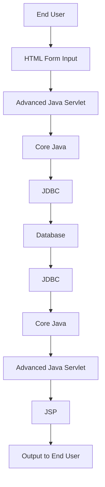

# Session 04: Core Java & Full Stack Java

## Table of Contents

- [Core Java Introduction](#core-java-introduction)
- [Project Architecture Diagrams](#project-architecture-diagrams)
- [Fullstack Java Overview](#fullstack-java-overview)
- [Core Java Syllabus](#core-java-syllabus)
- [Project Development Path](#project-development-path)
- [Java Basics Overview](#java-basics-overview)
- [Introduction to Java](#introduction-to-java)
- [Java vs Python Comparison](#java-vs-python-comparison)
- [Programming Paradigms](#programming-paradigms)

## Core Java Introduction

### Overview

Core Java is introduced as a foundational part of fullstack Java, focusing on the Java programming language and basic application development concepts.

### Key Concepts

Core Java is one of the parts of fullstack Java, specifically the Java language used for developing programs and projects. Using core Java, we can develop standalone projects for running businesses that cannot be accessed via network or browser, limiting customer access to company premises only.

For internet-accessible applications (web applications or websites), additional technologies are required: Advanced Java, HTML, and Oracle database management.

#### Difference Between Core Java and Other Technologies
- **Core Java**: Develops standalone projects only
- **Advanced Java + Core Java + HTML + Database**: Enables internet-accessible applications

### Code/Config Blocks

No specific code in this section.

### Tables

| Concept | Core Java | Full Stack Java |
|---------|-----------|-----------------|
| Project Type | Standalone only | Internet/Web applications |
| Accessibility | Company premises only | Worldwide via browser/mobile |
| Requirements | Core Java only | Core Java + Advanced Java + HTML + Database |

### Lab Demos

No lab demos in this section.

## Project Architecture Diagrams

### Overview

The session covers project architectures for different project scopes, starting with basic project setup and moving towards microservices architecture.

### Key Concepts

#### Basic Project Architecture
- **User Interface**: HTML5, CSS3, Bootstrap, ReactJS
- **Server-side Processing**: Advanced Java (Servlet)
- **Business Logic**: Core Java
- **Data Storage**: JDBC connection to database

Flow of execution: End user → HTML form input → Advanced Java Servlet → Core Java business logic → JDBC → Database

Return flow: Database → JDBC → Core Java → Advanced Java Servlet → JSP for display

**Note**: This architecture uses MVC (Model-View-Controller) pattern.

#### Latest Microservices Architecture
- **User Interface**: HTML5, CSS3, Bootstrap, ReactJS  
- **Server-side Processing**: Spring Boot
- **Business Logic**: Core Java
- **Data Interaction**: Hibernate or Spring Data (DIP - Database Interaction Program)
- **Database**: Database tables
- **Infrastructure**: AWS cloud server

This uses microservices architecture deployed on AWS cloud servers.

### Code/Config Blocks



```diff
+ MVC Architecture: Used in both basic and advanced project setups
- Traditional vs Modern: Basic uses JDBC, modern uses Hibernate/Spring Data for data interaction
! Server Deployment: Latest projects deploy on AWS cloud servers
```

### Tables

| Component | Basic Architecture | Microservices Architecture |
|-----------|-------------------|---------------------------|
| UI Technology | HTML | HTML5/CSS3/Bootstrap/ReactJS |
| Server Processing | Advanced Java Servlet | Spring Boot |
| Business Logic | Core Java | Core Java |
| Data Interaction | JDBC | Hibernate/Spring Data |
| Database | Database Tables | Database Tables |
| Deployment | Local Server | AWS Cloud Server |

### Lab Demos

No lab demos in this section, but recommended to watch day 1 video for complete project architecture explanation.

## Fullstack Java Overview

### Overview

Fullstack Java encompasses the complete technical stack required for developing end-to-end web applications, from basic programming to production deployment.

### Key Concepts

Fullstack Java starts with basic "Hello World" programs and progresses through complete project development. By course end, students should be able to build projects in both architectures:

1. Advanced Java + Core Java + HTML + Oracle architecture
2. Spring Boot + Microservices + AWS deployment architecture

#### Course Components
- **Learning Path**: Core Java → Advanced Java → HTML/CSS/JavaScript → ReactJS → Spring Boot → Hibernate → AWS
- **Prerequisite**: For freshers - Core Java, Advanced Java, HTML knowledge sufficient for job search
- **For Experienced**: Complete fullstack Java required for IT job transitions

#### Timing Considerations
- **HTML Course**: 7:00 AM IST batch
- **Parallel Learning**: HTML and Core Java can be learned simultaneously
- **Batch Flexibility**: New batches start weekly; choose timing that works
- **Course Duration**: 3 months for Core Java, longer for fullstack Java
- **Admission Process**: Trial classes available before payment

### Code/Config Blocks

```diff
+ Beginner Path: Core Java + Advanced Java + HTML -> Job ready
- Experienced Path: Fullstack Java -> Job ready (with gap)
! Timing: Parallel learning recommended for faster completion
```

### Tables

| User Type | Minimum Required | Recommended Complete |
|-----------|------------------|----------------------|
| Freshers | Core Java + Advanced + HTML | Fullstack Java |
| Experienced (with gap) | N/A | Fullstack Java |
| Students | Fullstack Java | Fullstack Java with parallel learning |

### Lab Demos

No specific lab demos, but students encouraged to watch first day video for project architecture details.

## Core Java Syllabus

### Overview

Core Java comprises 5 units covering the complete fundamentals of Java programming language.

### Key Concepts

#### Unit 1: Java Language Basics
- Installing JDK software
- Developing Java programs
- Compiling Java programs
- Executing Java programs

#### Unit 2: Logical Programming
- Mathematical operations: Addition, subtraction, multiplication, division
- Percentage calculations
- Mathematical formulas implementation

#### Unit 3: Object-Oriented Programming (OOP)
- Creating real-world objects in programming
- Developing business applications
- Real-world scenario modeling (e.g., Amazon website, TV, mobile apps)

#### Unit 4: Java Library/API
- Predefined programs provided by Java
- Reusing Java APIs for fast development
- String manipulation, file operations, database operations

#### Unit 5: Project Development
- Developing standalone applications (SA)
- Integration of all four units
- Real-world business operation projects

### Code/Config Blocks

```diff
+ Java Library/API: "application programming interface" - predefined Java programs
- Standalone Applications: Full projects developed using all units
! Business Focus: Unit 3 dedicated to real-world business application development
```

### Tables

| Unit | Focus | Examples |
|------|-------|----------|
| 1. Java Basics | Program development basics | JDK installation, compilation, execution |
| 2. Logical Programming | Mathematical operations | Addition, subtraction, percentages |
| 3. OOP | Real-world modeling | Amazon, mobile apps, TV applications |
| 4. Java Library | Predefined programs | File operations, string manipulation |
| 5. Project Development | Complete applications | Standalone business projects |

### Lab Demos

The instructor mentions identifying where each unit applies in programs, with examples to be discussed later.

## Project Development Path

### Overview

Students progress from basic hello world programs to complete project development throughout the course.

### Key Concepts

#### Development Journey
- **Start**: Basic "Hello World" program
- **Learning Areas**: Core Java business logic + HTML user interface + Advanced Java connectivity
- **End Goal**: Complete projects deployable on production

#### Technology Roles
- **Core Java**: Application/business logic development
- **Advanced Java**: Internet accessibility, connection between HTML and Core Java, database interaction
- **HTML**: Collecting user input from worldwide access
- **Database**: Permanent data storage

#### Additional Technologies Mentioned
- **Spring Boot**: Modern server-side processing
- **Hibernate/Spring Data**: Database interaction (DIP - Database Interaction Program)
- **AWS Cloud**: Server deployment
- **Related Technologies**: Selenium (testing), Pega, MuleSoft (built on Core Java)

### Code/Config Blocks

```diff
+ Core Java Role: Develops core business applications
- Advanced Java Role: Provides internet accessibility and connectivity
! HTML Role: Captures global user input
```

### Tables

| Technology | Role | Modern Equivalent |
|------------|------|-------------------|
| Core Java | Business logic development | Core Java (unchanged) |
| Advanced Java | Internet accessibility | Spring Boot |
| HTML | User interface creation | HTML5/CSS3/Bootstrap/ReactJS |
| JDBC | Basic database interaction | Hibernate/Spring Data |
| Manual Deployment | Local server | AWS Cloud Server |

### Lab Demos

No specific lab demos, but students encouraged to watch day 1 video for architecture explanations.

## Java Basics Overview

### Overview

Java basics covers foundational programming skills including development environment setup and program lifecycle management.

### Key Concepts

#### Required Software
- **JDK (Java Development Kit)**: Essential for developing Java programs

#### Essential Statements
- Statements to develop Java programs
- Statements to compile Java programs
- Steps to compile and execute Java programs

#### Hello World Program
- Developing the classic first program
- Compiling the program
- Executing the program

#### Error Handling
- Solving compile-time errors
- Solving runtime errors
- Understanding JVM activities and architecture basics

#### Additional Topics
- Escape sequence characters
- Practice programs for reinforcement

### Code/Config Blocks

No specific code blocks, but Hello World program mentioned for upcoming session.

### Tables

| Topic | Purpose | Example Focus |
|-------|---------|---------------|
| JDK Installation | Development environment setup | Environment configuration |
| Hello World Program | First Java program | Basic program structure |
| Compile/Execute | Program lifecycle | Command-line operations |
| Error Solving | Debugging skills | Compile-time vs runtime errors |
| JVM Architecture | Runtime understanding | Basic architecture concepts |

### Lab Demos

Hello World program development, compilation, and execution will be covered in next session.

## Introduction to Java

### Overview

Java is defined as a platform-independent, multi-paradigm programming language invented to support object-oriented programming for business application development.

### Key Concepts

#### Why Java?
- **Historical Context**: Developed after C/C++ to support object-oriented programming
- **C Limitations**: Only supports procedural programming for mathematical operations
- **C++ Evolution**: Supports both procedural and object-oriented styles
- **Java Innovation**: Introduced platform independence

#### Who Invented Java?
- **Inventor**: James Gosling (commonly referenced)
- **Company**: Sun Microsystems
- **Timeline**: Development initiated in 1991, released to market in 1995

#### Java Definition
- Platform-independent object-oriented programming language
- Supports multiple programming paradigms since version 8

### Code/Config Blocks

```java
// Basic Java program structure (conceptual)
class Example {
    public static void main(String[] args) {
        System.out.println("Hello World");
    }
}
```

### Tables

| Version | Programming Paradigms Supported |
|---------|-------------------------------|
| Java 1.0 - 7 | Object-oriented only |
| Java 8 | Object-oriented + Functional |
| Java 9+ | Object-oriented + Functional + Modular |
| Java 21+ | Object-oriented + Functional + Modular + Procedural (nameless class) |

### Lab Demos

No specific lab demos in this section.

## Java vs Python Comparison

### Overview

Discussion compares Java and Python programming languages, addressing common misconceptions about ease of learning and market positioning.

### Key Concepts

#### Core Differences
- **Java**: Full-fledged programming language supporting multiple paradigms with comprehensive syntax
- **Python**: Scripting-focused language embedded in other programs, strong in data analysis

#### Programming Paradigms
- **Java**: Supports object-oriented, functional, modular, procedural (Java 21+)
- **Python**: Supports all paradigms including scripting style

#### Market Positioning
- **Java**: Used for developing business applications, backend systems
- **Python**: Used for data science, machine learning, AI, background data processing

#### Learning Perspective
- **Java**: Comprehensive syntax requires structured learning approach
- **Python**: Simplified syntax for integration with existing systems

#### Industry Usage
- **Java**: Banking systems, enterprise applications, Android development
- **Python**: Data analysis, recommendation systems, embedded scripting

### Code/Config Blocks

```java
// Java object-oriented program structure
class Addition {
    public static void main(String[] args) {
        int a = 10;
        int b = 20;
        int c = a + b;
        System.out.println(c);
    }
}
```

```python
# Python equivalent (scripting style)
a = 10
b = 20
c = a + b
print(c)
```

### Tables

| Aspect | Java | Python |
|--------|------|--------|
| Syntax Complexity | Full-fledged with classes | Simplified scripting |
| Paradigms Supported | Object-oriented, functional, modular, procedural | All paradigms including scripting |
| Primary Use | Business applications | Data science/research applications |
| Learning Curve | Structured approach required | Easier for beginners |
| Market Dominance | Enterprise applications | Data processing/analysis |
| Execution Style | Standalone programs | Embedded in other systems |

### Lab Demos

Students encouraged to search online for complete Java vs Python comparison list as assignment.

## Programming Paradigms

### Overview

Java supports multiple programming paradigms, evolving from single-paradigm to multi-paradigm language across versions.

### Key Concepts

#### Supported Paradigms
- **Object-Oriented**: Primary paradigm since Java 1.0
- **Functional**: Added in Java 8
- **Modular**: Introduced in Java 9
- **Procedural**: Available from Java 21 (nameless class support)

#### Paradigm Meanings
- **Object-Oriented**: Programs organized around objects/classes (business applications)
- **Procedural**: Direct logic writing without boundaries (C-style programming)
- **Functional**: Functions as first-class citizens (Java 8 streams, lambdas)
- **Modular**: Code organization in modules (Java 9+)
- **Scripting**: Code embedded in other programs (not yet directly supported)

#### Evolution Timeline
- **Java 1.0-7**: Object-oriented only
- **Java 8**: Object-oriented + functional
- **Java 9-20**: Object-oriented + functional + modular
- **Java 21+**: All previous + procedural support

### Code/Config Blocks

```java
// Java 8+ functional programming example
import java.util.Arrays;
import java.util.List;

class FunctionalExample {
    public static void main(String[] args) {
        List<Integer> numbers = Arrays.asList(1, 2, 3, 4, 5);
        numbers.stream()
               .filter(n -> n % 2 == 0)
               .forEach(System.out::println);
    }
}
```

### Tables

| Programming Style | Description | Java Support |
|-------------------|-------------|--------------|
| Procedural | Direct logic writing without classes | Java 21+ (nameless classes) |
| Object-Oriented | Programs using classes and objects | Java 1.0+ |
| Functional | Functions as primary constructs | Java 8+ |
| Modular | Code organized in modules | Java 9+ |
| Scripting | Embedded code execution | Not directly supported (yet) |

### Lab Demos

No specific lab demos, concepts to be demonstrated in upcoming sessions.

## Summary

### Key Takeaways
```diff
+ Java is a multi-paradigm programming language supporting object-oriented, functional, modular, and procedural styles
- Python excels in data science while Java dominates enterprise business application development
! Core Java enables standalone application development, requiring Advanced Java + HTML for web accessibility
+ Fullstack Java journey progresses from basic Hello World to complete AWS-deployed microservices
- Recordings create lazy habits; live classes with note-taking enhance learning retention
+ Freshers need Core Java + Advanced Java + HTML for job readiness; experienced applicants need complete fullstack
```

### Expert Insight

#### Real-world Application
In enterprise environments, Java powers critical systems like banking applications and Android development. For instance, WhatsApp uses Java for the main application while Python handles background AI features. Core Java skills enable career transitions to related technologies like Spring Boot, Selenium, and Android development.

#### Expert Path
- Start with thorough Core Java mastery before branching into related technologies
- Focus on understanding all 5 units (Java basics, logical programming, OOP, Java library, project development)
- Practice both architectures: Advanced Java + Core Java + HTML, and Spring Boot + microservices
- Learn Python as complementary skill, not replacement, especially for data science roles

#### Common Pitfalls
- **Misspelling corrections noted**: "revise" (not "reclect"), "multiparadigm" (not "multiprogramming"), "Gosling" (inventor), "Sun Microsystems" (company from transcript)
- **Avoid lazy learning**: Don't rely on recordings; write comprehensive notes during live classes
- **Don't jump ahead**: Complete each unit thoroughly before moving to next phase
- **Technology confusion**: Core Java ≠ fullstack Java; understand complementary roles of Advanced Java and HTML
- **Career misconception**: Python complements Java, doesn't replace it in enterprise applications
- **Recording dependency**: Extra fees for recordings don't guarantee job readiness; dedicated live learning works better

Regular revision of core concepts and practical implementation prevents knowledge gaps that become costly later in the learning journey.
