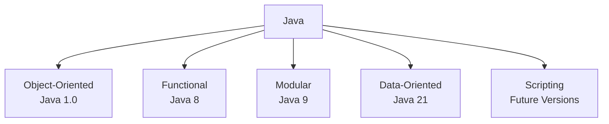

# Session 5: Core Java & Full Stack Java

## Table of Contents

- [Overview](#overview)
- [What is Java? Multi-Paradigm Programming Language](#what-is-java-multi-paradigm-programming-language)
- [Who Invented Java?](#who-invented-java)
- [Why Java was Invented: Platform Independency](#why-java-was-invented-platform-independency)
- [Explanation of Platform Independency and Internet Applications](#explanation-of-platform-independency-and-internet-applications)
- [Different Types of Applications Developed with Java](#different-types-of-applications-developed-with-java)
- [Software Requirements for Developing, Compiling, and Executing Java Programs](#software-requirements-for-developing-compiling-and-executing-java-programs)
- [Installing JDK Software](#installing-jdk-software)
- [Summary](#summary)

## Overview

Core Java is the foundation of full-stack Java development. It focuses on the Java language for developing standalone or enterprise-level projects. The full-stack architecture includes HTML, CSS, JavaScript (front-end), Advanced Java (server-side with technologies like Servlets, JSP, JDBC), and databases. Core Java enables building complete projects that can run businesses, while full-stack adds web accessibility via browsers or mobile apps.

Corrected transcript errors: "multi-paradm" to "multi-paradigm", "James Kosling" to "James Gosling", "Sun Micro System" to "Sun Microsystems", "htp" not present but ensured HTML corrections.

## What is Java? Multi-Paradigm Programming Language

Java is a platform-independent, multi-paradigm programming language. A multi-paradigm language supports program development using multiple styles of programming.

### Supported Programming Styles in Java:
- **Object-Oriented Programming**: Supported from Java 1.0 (core style).
- **Functional Programming Style**: Supported from Java 8.
- **Modular Programming Style**: Supported from Java 9.
- **Data-Oriented Programming Style** (also called procedural-oriented): Supported from Java 21 (allows programs without classes).
- **Scripting Style**: Not fully supported yet, but upcoming in future versions.

### Platform Independency:
Java programs can execute on any operating system (e.g., Windows, Linux, Mac OS) without modification.

### Verification from Official Sources:
- Latest Java version: JDK 21 (as of 2023 knowledge cutoff; check openjdk.org for updates).
- Confirmed as multi-paradigm on jdk.org.



## Who Invented Java?

Java was invented by:
- **Scientist**: James Gosling.
- **Where**: Sun Microsystems (full form: Stanford University Network).
- **Year**: June 1991 (development started); released to market in May 1995.

James Gosling was born in 1955 and is now retired. Sun Microsystems was acquired by Oracle.

## Why Java was Invented: Platform Independency

Java was invented to achieve platform independency for developing internet applications. Unlike C and C++, which create platform-dependent programs, Java targets web-accessible applications.

### Why Platform Independency?
C and C++ programs are standalone and run only on the installed system. Businesses evolved to need customer access via the internet, requiring programs downloadable to client machines (browsers/windows) and executable across operating systems.

#### Platform Dependency Example (C/C++):
- Program developed on Windows cannot execute on Linux or Mac OS.

#### Platform Independency Example (Java):
- Program developed on one OS executes seamlessly on any OS.

#### Diagrams:
```mermaid
flowchart TD
    Server[Server Computer<br>Linux OS] --> Program[Program<br>Stored Here]
    Client[Client Computer<br>Windows OS] --> Request{URL Request}
    Request --> Download[Download Program<br>Via Network]
    Download --> Execute[Execute in Browser<br>On Windows]
    
    Note: Mac OS client can also request and execute similarly.
```

✅ **Key Point**: Java enables platform-independent, internet-accessible applications.

## Different Types of Applications Developed with Java

Java supports development of various applications, grouped into categories:

### Applications by Target:
- **Standalone/Desktop Applications**: Run locally (e.g., business management tools).
- **Web/Internet Applications**: Accessible via browsers (e.g., Amazon, Google).
- **Enterprise Applications**: Company business operations (e.g., Amazon, Banks, Tata). These can be standalone or web-based.
- **Distributed Applications**: Java-to-Java connections for interoperability (e.g., Amazon integrating with Bank APIs).
- **Interoperable Applications**: Connections between Java and other languages (e.g., Java, .NET, Python, Angular).

### Specialized Applications:
- Gaming, Robotic, Testing, Mobile (Android), Big Data (Hadoop, Spark), Testing (JUnit), Data Science (with libraries), Machine Learning/AI (MLLib, TensorFlow integrations).

### Java vs. Python in Industry:
| Feature | Java Strengths | Python Strengths |
|---------|----------------|------------------|
| Enterprise Apps | High (business logic, stability) | Low (dynamic types, less suited for complex enterprises) |
| Data Science/ML | Moderate (libraries available) | High (focus on analytics, AI) |
| Both | Web Apps, Desktop, Gaming, Robotics | Web Apps, Desktop, Gaming, Robotics |

> [!IMPORTANT]  
> Java and Python are both versatile; Java dominates enterprise development due to robustness, while Python excels in data-driven applications. Modern projects often integrate both.

```diff
+ Enterprise Applications: Main business operations (e.g., client-facing services).
- Web Applications: Generically internet-accessible; may or may not be business-oriented.
+ Distributed Apps: Same-language connectivity (e.g., Java-Java).
- Interoperable Apps: Cross-language connectivity (e.g., Java-React-Python stack).
```

## Software Requirements for Developing, Compiling, and Executing Java Programs

Three software components are needed:

### 1. Editor Software (for Developing/Type and Save)
- **Basic Editor**: Notepad
- **Advanced Editors**: Notepad++, EditPlus, Brackets
- **Integrated Development Environments (IDEs)**: Eclipse, IntelliJ IDEA

> [!NOTE]  
> Start with Notepad for foundational learning; progress to IDEs like Eclipse for productivity in projects.

### 2. JDK Software (Java Development Kit for Compiling and Executing)
- Provides compiler (`javac`) and JVM (`java`) tools.
- Latest versions: JDK 21 (learning); JDK 17 (production due to stability).
- Console-based (CUI); requires Command Prompt for execution.

### 3. Command Prompt Software (for Running Compiler/JVM)
- Defaults to Windows Command Prompt (`cmd`).
- Open via `cmd`, then run `javac` (compile) or `java` (execute).

#### Available by Default:
- Notepad ✅
- Command Prompt ✅
- JDK ❌ (must install)

## Installing JDK Software

### Steps:
1. Open browser.
2. Search "JDK download" → Navigate to oracle.com/java-downloads.
3. Select JDK 21.
4. Choose platform:
   - Windows: Download `.exe` (x64).
   - Mac: Download `.dmg` (ARM/x64).
   - Linux: Follow OS-specific installer.
5. Run installer.
   - Change path to `C:\JDK` (no spaces).
   - Click Next → Install.
6. Verify: Open Command Prompt → Type `javac` → Options displayed.

```bash
# Verification Commands:
javac  # Compiler options shown
java   # JVM options shown
```

> [!IMPORTANT]  
> Install JDK 21 for learning; use JDK 17 for production. Practice installation tonight—essential for tomorrow's first program.

## Summary

### Key Takeaways

```diff
+ Java is a platform-independent, multi-paradigm language supporting object-oriented, functional, modular, and data-oriented styles.
- C/C++ are platform-dependent; Java enables internet applications.
+ Core Java enables standalone projects; full-stack adds web/mobile access.
- Basic editors (Notepad) -> Advanced (Eclipse); JDK + Command Prompt required.
```

### Expert Insight

#### Real-world Application
In production, Java powers enterprise apps like banking systems (e.g., integrating Java backends with React frontends via Spring Boot). Use JDK 17 for stability; JDK 21 for experimental features. For distributed systems, leverage JMS or microservices (Spring Cloud) for Java-Java interoperability.

#### Expert Path
Master core Java basics (OOP, JVM internals) before full-stack. Practice multi-paradigm coding: Use streams (functional) in Java 8+. Stay updated via oracle.com and join Java ecosystems like SDN.

#### Common Pitfalls
- **Mistake**: Using latest JDK versions in production without testing—use stable LTS like 17.
- **Common Issues**: "javac command not found"—ensure PATH is configured to JDK/bin; restart Command Prompt.
- **Resolution**: For "Java is not recognized," set environment variables: `set PATH=%PATH%;C:\JDK\bin`.
- **Avoid Over-reliance on IDEs Early**: Start coding in Notepad to understand compilation flow; IDEs hide errors.

#### Lesser Known Things About This Topic
- Java's "Write Once, Run Anywhere" (WORA) is achieved via bytecode and JVM—not true "independency" but cross-OS compilation.
- Sun Microsystems coined "platform independency" but Java software itself is OS-specific (separate JDKs for Windows/Linux/Mac).
- Scripting support (planned) will enhance Java for automation, rivaling Python for data workflows.

🤖 Generated with [Claude Code](https://claude.com/claude-code)

Co-Authored-By: Claude <noreply@anthropic.com>
