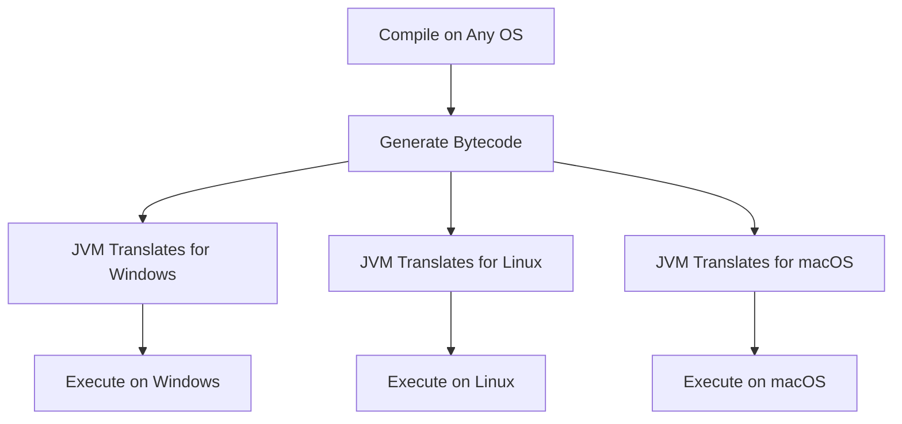
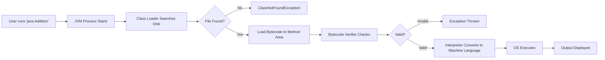

# Session 10: Core Java & Full Stack Java

## Table of Contents
- [Overview](#overview)
- [Key Concepts and Deep Dive](#key-concepts-and-deep-dive)
  - [Introduction to Java](#introduction-to-java)
  - [JVM and Platform Independence](#jvm-and-platform-independence)
  - [JVM Architecture Basics](#jvm-architecture-basics)
  - [Java Program Execution Process](#java-program-execution-process)
  - [Translators in Java](#translators-in-java)
  - [Key Programs Inside JVM](#key-programs-inside-jvm)

## Overview

This session explores the fundamentals of Java technology, focusing on its core principles and execution model. It begins by defining Java, its purpose, and why it was created, emphasizing its role as a programming language that revolutionized software development. The discussion covers essential concepts such as compilation errors versus runtime errors from previous sessions, extending to new topics in this installment. Learners are guided through the reasons for Java's design, its platform-independent nature, and the underlying architecture that enables "write once, run anywhere." The session emphasizes practical understanding through analogies, such as comparing Java's translation process to language interpretation in different countries, to help beginners grasp complex ideas. It promotes becoming an independent learner by practicing error handling and visualizing JVM processes, preparing students for real-world application development in core Java.

## Key Concepts and Deep Dive

### Introduction to Java

Java is a high-level, object-oriented programming language designed to be platform-independent. Created by James Gosling at Sun Microsystems (now part of Oracle), Java emerged in 1995 with the goal of simplifying programming for various applications, from desktop software to internet-based systems. The name "Java" was chosen because it resembles "Oak," an earlier project, but was changed for legal reasons. Java supports multiple paradigms, including procedural and object-oriented programming.

Key aspects of Java include:
- **Platform Independence**: Unlike languages like C++, Java programs run on any operating system without modification, achieved through bytecode and the Java Virtual Machine (JVM).
- **Robust Security**: Built-in mechanisms prevent malicious code execution.
- **Automatic Memory Management**: Garbage collection handles memory allocation and deallocation.

Software requirements for developing Java include:
- Java Development Kit (JDK): Contains the compiler (javac) and runtime environment.
- Text Editor or IDE (e.g., Eclipse, IntelliJ): For writing and editing code.
- Command Prompt or Terminal: For compilation and execution.

To develop a Java program:
1. Write source code in a `.java` file using a text editor.
2. Compile with `javac` to generate bytecode (`.class` file).
3. Execute with `java` to run on the JVM.

Escape sequences used in Java include:
- `\n`: New line
- `\t`: Tab
- `\\`: Backslash
- `\"`: Double quote
- `\'`: Single quote

### JVM and Platform Independence

The JVM (Java Virtual Machine) is a platform-independent execution environment that runs Java bytecode, making Java programs runnable on any operating system (Windows, Linux, macOS). Unlike C and C++, where code is compiled directly into machine-specific language, Java uses an intermediate representation (bytecode) that the JVM translates to native machine code at runtime.

> [!IMPORTANT]
> Java achieves platform independence through bytecode as a common intermediary language and JVM as the translator for each OS.

Analogous to language translation:
- Native language (e.g., Telugu) → English (common language) → Target language (e.g., Japanese via translator).
- In Java: Source code → Bytecode (common) → Machine language (via JVM specific to OS).

Diagrams illustrating this:



**Table: Java vs. C/C++ Compilation**

| Aspect          | Java                          | C/C++                        |
|-----------------|-------------------------------|------------------------------|
| Compilation Target | Bytecode (Platform Independent) | Machine Language (OS-Specific) |
| Runtime Execution | JVM Required                | Direct OS Execution          |
| Platform Independence | Yes                         | No                          |
| Translation Type | Interpreter-Based            | Direct Compilation           |

### JVM Architecture Basics

JVM is a virtual computer within your system, simulated via software. Defined as a Java platform or runtime environment for executing Java bytecode with OS assistance. It's essential because OSs don't understand bytecode directly; JVM acts as a mediator.

Purpose of JVM:
- Execute bytecode by converting it to machine language.
- Enable platform independence by providing OS-specific JVMs.

JVM existence varies per OS (e.g., Windows JVM, Linux JVM), each with identical functionality despite platform differences.

> [!NOTE]
> JVM simulates a machine where Java programs run, acting like a virtual computer for bytecode execution.

### Java Program Execution Process

Java program execution has five main phases: Editing (Typing), Compiling, Executing (which includes Loading, Verifying, Interpreting).

**Detailed Steps (7-Step Breakdown):**
1. JVM starts as a process, occupying RAM.
2. JVM searches for the `.class` file (e.g., `Addition.class`) in the hard disk.
3. If found, Class Loader loads bytecode into JVM method area.
4. Bytecode Verifier checks for malicious or invalid code; throws runtime errors (exceptions) if issues found.
5. If valid, Interpreter converts bytecode to machine language line-by-line.
6. OS executes the machine language.
7. Output is produced and displayed.

Compilation vs. Runtime Errors:
- **Compile-Time Errors**: Syntax issues (e.g., missing semicolons), caught by compiler.
- **Runtime Errors**: Logical or execution issues (e.g., division by zero), result in exceptions.

Visualization of Execution Flow:



**Table: Errors in Java**

| Error Type       | When Detected         | Example                           | Handling |
|------------------|-----------------------|-----------------------------------|----------|
| Compile-Time Error | During Compilation   | Missing semicolon                | Fix syntax before running |
| Runtime Error (Exception) | During Execution    | ClassNotFoundException in JVM   | Handle via try-catch blocks |

### Translators in Java

Java uses two translators:
1. **Compiler**: Transforms source code to bytecode and saves it (e.g., `javac` tool).
2. **Interpreter**: Converts bytecode to machine language line-by-line at runtime (no saving).

JIT (Just-In-Time) Compiler assists the interpreter for performance by caching translated code.

### Key Programs Inside JVM

JVM consists of multiple components:
- **Class Loader**: Loads bytecode into method area.
- **Bytecode Verifier**: Ensures security and validity.
- **Interpreter**: Translates and executes bytecode.
- **JIT Compiler**: Optimizes execution speed.
- **Security Manager**: Manages access permissions.

Java is secure due to rigorous bytecode verification, preventing viral or corrupted code execution.

## Summary

### Key Takeaways
```diff
+ Java is platform-independent due to bytecode and JVM as a translation intermediary.
+ JVM executes programs in phases: Loading, Verifying, Interpreting for security and performance.
+ "Write once, run anywhere" is achieved through OS-specific JVMs that handle the same bytecode.
- Common pitfalls include misspellings like "bite code" (correct: bytecode) or "JVME" (correct: JVM); always verify syntax to avoid compile-time errors.
+ Experience comes from facing and resolving errors, making you a better developer.
! Platform independence analogy: Translate once to bytecode, then JVM adapts to any OS like a universal translator.
```

### Expert Insight
**Real-world Application**: In production, Java's platform independence allows deploying web services on AWS, Azure, or on-premises servers without recoding. For example, a financial app's bytecode runs identically on Windows servers and Linux containers in Docker, ensuring scalability in microservices architectures.

**Expert Path**: Master Java by first focusing on core syntax and error debugging; then, delve into JVM tuning (e.g., JIT optimizations via JVM flags like `-XX:+UseG1GC`). Resources: Oracle's JVM documentation, practice with JVM Profilers like VisualVM. Aim for certifications like Oracle Certified Java Programmer (OCJP) after core mastery.

**Common Pitfalls and Resolutions**:
- **File Path Issues**: ClassNotFoundException occurs if `.class` file isn't in the same directory. Resolution: Use `java -cp . ClassName` to specify classpath.
- **Memory Errors**: OutOfMemoryException from excessive allocations. Resolution: Tune heap size with `-Xmx` and `-Xms` flags; profile with tools like Eclipse Memory Analyzer.
- **Concurrency Problems**: Race conditions in multithreaded apps. Resolution: Use synchronized blocks or java.util.concurrent utilities; always test with Thread.sleep() in demos to simulate timing issues.
- **Security Breaches**: Malicious bytecode injection. Resolution: Enable JVM security flags (-Djava.security.manager) and validate external JARs via code signing.

**Lesser Known Things**:
- JVM has a "method area" (equivalent to permanent generation in older versions) for storing class metadata, bytecode, and constants—essentially JVM's memory for runtime class representations.
- Just-In-Time Compilation (JIT) dynamically optimizes performance by compiling hot spots (frequently executed code) to native machine code at runtime, often yielding performance close to compiled languages like C++.
- Java's "compile once, run anywhere" extends to embedded systems via JVM variants like Java ME (Micro Edition), allowing IoT devices to run Java apps with minimal resources using compact profiles.
