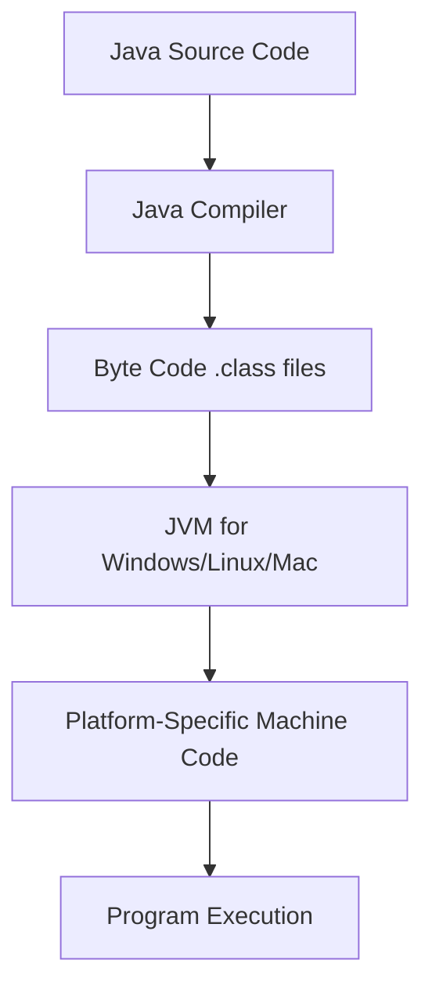
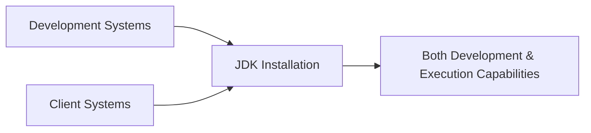

# Session 11: Java Fundamentals - JVM Architecture, Java Editions, and Print Statements

## Table of Contents
- [JVM Architecture Overview](#jvm-architecture-overview)
- [Java Software Editions and Concepts](#java-software-editions-and-concepts) 
- [Java 11 New Features](#java-11-new-features)
- [Print Statements and Program Execution](#print-statements-and-program-execution)
- [Introduction to Variables and Mathematical Operations](#introduction-to-variables-and-mathematical-operations)

## JVM Architecture Overview

### Overview
The Java Virtual Machine (JVM) is the runtime environment that enables Java programs to run in a platform-independent manner. This session covers the fundamental architecture of JVM, including its components, the role of different Java software packages (JDK, JRE), and how Java bytecode execution occurs.

### Key Concepts/Deep Dive

#### JVM Components and Their Roles
The JVM architecture consists of four main components working together to execute Java bytecode:

1. **Class Loader Subsystem**
   - Responsible for searching the specified class file in the file system
   - Loads bytecode from files into JVM memory (runtime data areas)
   - Enables dynamic class loading at runtime
   - Handles three main tasks: searching, loading, and storing class byte code

```bash
# Basic Java compilation and execution flow
javac Example.java      # Compiler creates Example.class
java Example           # JVM loads and executes Example.class
```

2. **Runtime Data Areas**
   - Composed of five memory areas for storing bytecode and executing logic
   - **Method Area**: Primary storage for loaded class byte code
   - Manages the entire lifecycle of class information during program execution
   - Stores class data: field information, method data, and constructor details

3. **Execution Engine**
   - Responsible for executing bytecode stored in runtime data areas
   - Handles CPU-level machine instruction conversion
   - Core component that makes Java platform-independent by converting bytecode to OS-specific instructions

4. **Java Native Interface (JNI)**
   - Enables JVM to interact with system libraries and native code
   - Allows Java programs to call C/C++ functions and vice versa
   - Loads native header files (compiled C/C++ libraries) into JVM memory
   - Essential for system-level operations not available in pure Java

#### Java Software Packages

| Software | Compiler | JVM | Usage |
|----------|----------|------|--------|
| **JDK** | ✅ | ✅ | Development and execution of Java programs |
| **JRE** | ❌ | ✅ | Runtime environment only - limited to execution |
| **JVM** | ❌ | ✅ | Core execution engine |

> [!NOTE]
> JDK provides complete development environment. JRE offers only runtime capabilities. JVM is embedded within both but cannot be used independently for development.

#### Platform Independence Mechanism
Java achieves platform independence through bytecode execution:



**Key Points:**
- Separate JVMs exist for each operating system (Windows, Linux, Mac OS)
- Java software (JDK/JRE) must be installed to get JVM
- Bytecode is platform-neutral intermediate representation
- Sun Microsystems discontinued JRE from Java 11 onwards

## Java Software Editions and Concepts

### Overview
Java editions categorize Java technologies based on their application areas and development requirements. This section explores the different Java editions, their purposes, and evolution of software editions in modern development.

### Key Concepts/Deep Dive

#### Java Platform Editions

| Edition | Purpose | Technologies | Use Cases |
|---------|---------|--------------|-----------|
| **Java SE (Standard Edition)** | Desktop applications, standalone programs | Core Java APIs, Collections | Console applications, desktop software |
| **Java EE (Enterprise Edition)** | Web and enterprise applications | Servlets, JSP, JDBC, EJB | Web applications, distributed systems |
| **Java ME (Micro Edition)** | Embedded systems, mobile applications | Simplified APIs for embedded devices | Mobile apps, IoT devices |
| **JavaFX** | Rich UI applications with animations | JavaFX APIs for interactive interfaces | Modern desktop UIs with multimedia |

> [!IMPORTANT]
> Modern development primarily uses Java SE and Jakarta EE (formerly Java EE). Java ME and JavaFX are specialized for specific use cases.

#### Evolution from JRE to JDK-Only Approach

```diff
- Early Java versions (1.0-10): JDK and separate JRE software exist
+ Modern approach (Java 11+): Only JDK available
  - Developer environment was separate
  - Client runtime was separate  
  - Two software packages to install
+ Single JDK installation for both development and runtime
+ No standalone JRE software from Java 11 onwards
```

**Business Rationale:**
- Clientele demand shifted towards feature-rich applications requiring compilation capabilities even on client systems
- Modern web applications often need dynamic content generation
- Market evolution: Nokia → Samsung analogy in software ecosystems

#### Modern Development Scenario



**Current Industry Practice:**
- Enterprise apps developed with both Java SE and Jakarta EE
- JDK versions 8, 11, and 17 are most commonly deployed
- Environment variable setup automated from Java 13 onwards

> [!NOTE]
> Java editions represent different "flavors" of Java technology stacks. SE and EE are fundamental for full-stack development, while ME and JavaFX serve specialized niches.

## Java 11 New Features

### Overview
Java 11 introduced significant changes to the compilation and execution workflow. The most notable feature eliminated the mandatory compilation step for single-file Java programs, streamlining development for beginners and scripting-like usage.

### Key Concepts/Deep Dive

#### Direct Execution Capability

```bash
# Traditional approach (Java 1.0 - 10)
javac Program.java    # Mandatory compilation step
java Program         # Execution step

# Java 11+ approach for single files
java Program.java    # Direct execution without separate compilation
```

**Key Benefits:**
- Beginner-friendly development experience
- Faster iteration for small programs
- Eliminates separate compilation step for learning purposes
- Maintains full Java capabilities in runtime

#### Workflow Comparison

| Aspect | Traditional (Pre-11) | Java 11+ |
|--------|---------------------|----------|
| **Compilation** | Required separate `javac` step | Automatic compilation during runtime |
| **Execution Command** | `java ClassName` | `java FileName.java` or `java ClassName` |
| **Dependency** | Requires pre-compiled .class files | Can work directly with source code |
| **Use Case** | Production projects with multiple classes | Single-file programs and learning |

> [!NOTE]
> This feature primarily benefits single-class programs. Multi-class projects still require traditional compilation approaches.

**Internal Mechanism:**
- JVM automates bytecode generation during execution
- No .class files are created in the file system
- Background compilation uses same Java compiler technology
- Feature designed for development convenience, not production optimization

## Print Statements and Program Execution

### Overview
Print statements control output formatting and layout. Understanding the differences between `print()`, `println()`, and `printf()` methods is crucial for formatting console output effectively.

### Key Concepts/Deep Dive

#### Print Method Variants

| Method | Function | Cursor Position After Execution |
|--------|----------|---------------------------------|
| `print()` | Displays content and keeps cursor on same line | Same line (side-by-side output possible) |
| `println()` | Displays content and moves cursor to next line | Next line (automatic line break) |
| `printf()` | Formatted output using format specifiers | Configurable positioning |

**Key Differences:**
- `print()` enables concatenation on single line
- `println()` provides automatic new line after each output
- `printf()` allows C-style formatted printing

#### Code Examples

```java
// Single line output using print()
System.out.print("Hello");
System.out.print(" World");

// Output: Hello World

// Multi-line output using println()
System.out.println("Hello");
System.out.println("World");

// Output:
// Hello
// World

// Formatted output using printf()
int a = 10;
int b = 20;
System.out.printf("The sum of %d and %d is %d", a, b, a + b);
// Output: The sum of 10 and 20 is 30
```

#### Practical Application

```java
// Program to print message in specific format
System.out.println("HK,");
System.out.println("NIT,");
System.out.println("Amirpet,");
System.out.print("Hyderabad. ");
System.out.print("Best for fullstack Java development.");
```

**Output:**
```
HK,
NIT,
Amirpet,
Hyderabad. Best for fullstack Java development.
```

#### Empty Line Creation

```java
// Creating empty line with println()
System.out.println("Message 1");
System.out.println();  // Empty println creates empty line
System.out.println("Message 2");

// Output:
// Message 1
//
// Message 2

// Using \n escape sequence in print()
System.out.print("Message 1\n\nMessage 2");

// Output:
// Message 1
//
// Message 2
```

## Introduction to Variables and Mathematical Operations

### Overview
Variables store data values that can be manipulated through mathematical operations. Understanding variable declaration, initialization, and the concatenation operator for display is fundamental to programming logic.

### Key Concepts/Deep Dive

#### Variable Concepts

```java
// Basic variable declaration and usage
class Addition {
    public static void main(String[] args) {
        int a = 10;        // Variable declaration with assignment
        int b = 20;        // Variable declaration with assignment
        
        // Mathematical operation
        int sum = a + b;   // Addition operation storing result
        
        // Output with concatenation
        System.out.println("The sum of " + a + " and " + b + " is " + sum);
    }
}
```

**Variable Operations:**
- **Declaration**: Defines variable type and name (`int a;`)
- **Initialization**: Assigns value to variable (`a = 10;`)
- **Arithmetic Operations**: Performs calculations (`a + b`, `a - b`, etc.)
- **Concatenation**: Combines strings and variables (`+` operator for joining)

#### Addition Program Example

**Program Structure:**
```java
class Addition {
    public static void main(String[] args) {
        // Step 1: Variable declaration and initialization 
        int a = 10;
        int b = 20;
        
        // Step 2: Mathematical operation
        int c = a + b;  // c = 30
        
        // Step 3: Output with formatting
        System.out.println("The result: " + c);
        // Alternative: System.out.print("The result: " + c + "\n");
    }
}
```

**Compilation and Execution:**
```bash
# Compile the program
javac Addition.java

# Execute the program  
java Addition
# Output: The result: 30
```

#### String Concatenation vs Mathematical Operations

```diff
+ Mathematical Addition: int c = a + b; (numerical calculation)
- String Concatenation: print("The sum: " + a + b); (text joining)
```

> [!NOTE]
> The `+` operator serves dual purposes: mathematical addition between numbers and concatenation between strings/text. Context determines the operation type.

**Key Learning Points:**
- Variables store and manipulate different data types
- Mathematical operations require appropriate variable declarations
- Output formatting combines literals and variables using concatenation
- Proper sequencing of operations ensures correct program flow

## Lab Demos

### Demo 1: Traditional Print Statements

**Objective:** Understand line control in output formatting

**Steps:**
1. Create a class named `PrintStatements`
2. Implement five separate print statements
3. Arrange to display 5 statements in 3 console lines
4. Use combination of `print()` and `println()`

**Code Implementation:**
```java
class PrintStatements {
    public static void main(String[] args) {
        System.out.print("HK, ");
        System.out.println("NIT,");
        System.out.print("Amirpet, ");
        System.out.println("Hyderabad.");
        System.out.println("Best for fullstack Java development.");
    }
}
```

**Expected Output:**
```
HK, NIT,
Amirpet, Hyderabad.
Best for fullstack Java development.
```

### Demo 2: Variable-Based Addition Program

**Objective:** Implement basic arithmetic with meaningful output

**Steps:**
1. Declare integer variables for operands
2. Perform addition operation
3. Display formatted result using concatenation
4. Test compilation and execution flow

**Code Implementation:**
```java
class VariableAddition {
    public static void main(String[] args) {
        int a = 10;
        int b = 20;
        int result = a + b;
        
        System.out.println("First number: " + a);
        System.out.println("Second number: " + b);
        System.out.println("Addition result: " + result);
    }
}
```

**Execution Flow:**
```bash
$ javac VariableAddition.java
$ java VariableAddition
First number: 10
Second number: 20  
Addition result: 30
```

### Demo 3: Print Method Variations Comparison

**Objective:** Demonstrate differences between print methods

**Steps:**
1. Create multiple versions of output statements
2. Compare `print()`, `println()`, and formatted approaches
3. Show empty line creation techniques
4. Execute and analyze output differences

**Code Implementation:**
```java
class PrintComparison {
    public static void main(String[] args) {
        // Using print() - same line output
        System.out.print("Line 1 content");
        System.out.print(" and Line 1 continuation");
        System.out.println();
        
        // Using println() - automatic line breaks
        System.out.println("Line 2 content");
        System.out.println("Line 3 content");
        
        // Empty line creation
        System.out.println("Before empty line");
        System.out.println();  // Empty println
        System.out.println("After empty line");
    }
}
```

## Summary

### Key Takeaways

```diff
+ JVM is platform-independent through bytecode and OS-specific virtual machines
+ Four main JVM components: Class Loader, Runtime Data Areas, Execution Engine, JNI
+ JDK provides complete development environment (compiler + JVM); JRE discontinued from Java 11
+ Java SE for desktop apps, Jakarta EE (formerly Java EE) for web/enterprise applications
+ Java 11 enables direct program execution without separate compilation for single files
+ print() keeps cursor on same line; println() moves cursor to next line automatically
+ + operator functions as concatenation for strings, addition for numbers
+ Variables store data for manipulation through mathematical/logical operations
- Traditional approach requires separate compilation step before execution
- JRE is no longer available as standalone software for modern development
- Multi-class projects still require traditional compilation workflow
```

### Real-world Application
**Production Java Development:**
Modern enterprise applications deploy using JDK in both development and production environments. The JVM architecture ensures applications can run on any operating system without code modification. Full-stack developers use Java SE for business logic and Jakarta EE for scalable web applications, leveraging JVM's platform independence for global software deployment.

**Enterprise Deployment Scenario:**
Large-scale systems like banking applications or e-commerce platforms rely on JVM's multi-threading capabilities and memory management. The execution engine's just-in-time (JIT) compilation optimizes performance for production workloads, making Java suitable for high-traffic systems.

### Expert Path
**Mastery Roadmap:**
1. **JVM Mastery**: Understand memory management, garbage collection algorithms, and performance tuning
2. **Platform Expertise**: Deep dive into Java EE architecture with microservices frameworks like Spring Boot
3. **Native Integration**: Learn JNI concepts for legacy system integration in enterprise environments
4. **Performance Optimization**: Study JVM profiling tools and memory leak prevention techniques

### Common Pitfalls

| Issue | Cause | Resolution | Prevention Tips |
|-------|--------|------------|-----------------|
| **Compilation errors** | Missing syntax elements or incorrect data types | Check variable declarations and operator compatibility | Always test small code segments incrementally |
| **Runtime exceptions** | Division by zero or null pointer references | Implement input validation before operations | Add defensive programming checks |
| **Output formatting issues** | Misusing print() vs println() | Test output layout with sample data | Plan output design before coding |
| **Variable scope errors** | Accessing variables outside declaration scope | Verify variable visibility rules | Use meaningful variable names and avoid global scope abuse |
| **String/number confusion** | Incorrect concatenation vs mathematical operations | Understand context of + operator | Use parentheses for clarity in complex expressions |

**Lesser Known Things About This Topic:**
- **JVM Hotspot**: Processing repeated code sections multiple times optimizes performance automatically
- **Platform Independence Depth**: Bytecode abstraction works across operating systems, but UI elements may vary slightly due to native widget rendering
- **JIT Compilation Dynamics**: Java starts with interpreter mode, then compiles hot methods to machine code dynamically
- **Memory Model Complexity**: Runtime data areas have sophisticated heap/stack management for concurrent execution
- **Native Integration Advanced**: JNI allows Java programs to seamlessly call legacy C/C++ libraries in enterprise systems</parameter>
