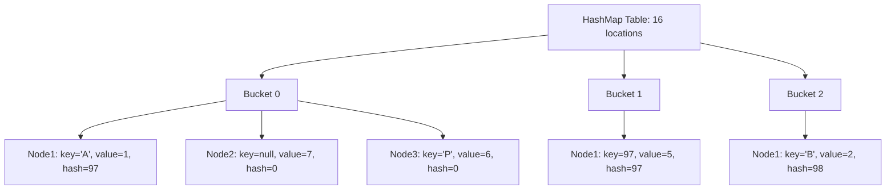

# Session 113: Map Interface and HashMap Implementations

## Table of Contents
- [Map Interface Overview](#map-interface-overview)
- [HashMap Deep Dive](#hashmap-deep-dive)
- [HashMap Internals](#hashmap-internals)
- [LinkedHashMap and TreeMap](#linkedhashmap-and-treemap)
- [Lab Demo: Using HashMap](#lab-demo-using-hashmap)
- [Summary](#summary)

## Map Interface Overview
The Map interface in Java represents a collection that stores key-value pairs, also known as entries. Unlike other collections that store individual elements, Map provides mappings between keys and values, allowing efficient retrieval of values based on their corresponding keys.

> [!IMPORTANT]
> Map is a root interface for all map-type collections in Java, introduced to handle data relationships.

### Key Characteristics
- **Key-Value Storage**: Each entry consists of a unique key and its associated value.
- **Key Uniqueness**: Keys must be unique; values can be duplicated.
- **Implementations**: Includes HashMap, LinkedHashMap, TreeMap, and others.
- **Methods**: Core methods include `put()`, `get()`, `containsKey()`, and `remove()`.

### Map vs. Collections
| Aspect | Collection | Map |
|--------|------------|-----|
| Storage | Individual objects | Key-value pairs |
| Uniqueness | No inherent uniqueness requirement | Keys must be unique |
| Retrieval | By index or iteration | By key |

## HashMap Deep Dive

### Core Concepts
HashMap is a hash table-based implementation of the Map interface that maintains entries in hash code order of keys.

- **Storage Mechanism**: Uses key-value pairs where keys are unique and values can be duplicated.
- **Null Handling**: Supports one null key and multiple null values.
- **Performance**: Offers constant-time performance for basic operations when hash function distributes elements properly.

### Basic Operations
- **Adding Entries**: `put(key, value)` returns the previous value if the key existed, null otherwise.
- **Accessing Values**: `get(key)` retrieves the value associated with the key.
- **Checking Presence**: `containsKey(key)` and `containsValue(value)` methods.

### Code Example: Basic HashMap Usage
```java
import java.util.HashMap;

public class HashMapExample {
    public static void main(String[] args) {
        HashMap<String, Integer> hm = new HashMap<>();
        hm.put("A", 1);  // Returns null
        hm.put("B", 2);  // Returns null
        hm.put("A", 3);  // Returns 1 (replaces value)
        System.out.println(hm);  // {A=3, B=2}
    }
}
```

### Heterogeneous Data Support
HashMap allows storage of heterogeneous objects:
```java
HashMap hm = new HashMap();
hm.put("A", 1);
hm.put(97, 5);
hm.put(6.7f, 6);
hm.put(null, 7);
System.out.println(hm);
```

## HashMap Internals

### Memory Structure
HashMap internally uses a hash table data structure, implemented as a Node array (table) with default capacity of 16 locations (0-15).

- **Node Structure**: Each Node contains key, value, hash code, and next pointer for chaining.
- **Buckets**: Created dynamically for each unique hash code group.

#### Hash Code Calculation
The hash code is calculated using the key's `hashCode()` method, then modulo operation with table capacity determines the bucket index:
```java
int hash = key.hashCode();
int index = hash % capacity;  // For capacity = 16
```

#### Collision Handling
When multiple keys have the same index (hash collision), entries are stored in the same bucket using a linked list (Java 7) or tree structure (Java 8+ when threshold > 8).

### Algorithm for Duplicate Prevention
1. Compute key's hash code
2. Locate bucket; if doesn't exist, create it
3. If bucket exists, compare new key with existing keys:
   - First: Reference equality (`==`)
   - Second: Data equality (`equals()`)
4. If duplicate found, replace value; else add new entry

### Bucket Diagram (Mermaid)


### Custom Objects in HashMap
For user-defined classes, override `hashCode()` and `equals()` to ensure proper grouping and comparison.

## LinkedHashMap and TreeMap

### LinkedHashMap
- **Ordering**: Maintains insertion order of entries.
- **Internal**: Extends HashMap with a doubly-linked list for order preservation.

### TreeMap
- **Ordering**: Maintains sorted order based on natural ordering or comparator.
- **Internal**: Uses red-black tree structure for O(log n) operations.

> [!NOTE]
> TreeMap implements SortedMap interface, ensuring entries are always sorted.

## Lab Demo: Using HashMap

### Step-by-Step Practice
1. Create a HashMap object:
   ```java
   HashMap<String, Integer> hm = new HashMap<>();
   ```

2. Add entries and observe behavior:
   ```java
   System.out.println(hm.put("A", 1));  // null (new key)
   System.out.println(hm.put("A", 3));  // 1 (replaced value)
   hm.put(null, 4);  // Allowed
   hm.put(5, null);  // Heterogeneous key-value
   ```

3. Demonstrate hash code ordering:
   ```java
   hm.put("Z", 26);  // Hash code: 'Z' -> 90 % 16 = 10
   hm.put("Apple", 42);  // Hash code depends on string data
   System.out.println(hm);
   ```

4. Handle collisions by storing same hash code keys:
   ```java
   hm.put(97, 100);  // Integer 97 hash code = 97
   hm.put(97L, 200);  // Long 97L hash code != 97
   ```

❗ **Warning**: Always override `hashCode()` and `equals()` for custom objects to avoid unexpected behavior in HashMap.

## Summary

### Key Takeaways
```diff
+ Map interface stores key-value pairs with unique keys
+ HashMap uses hash table for average O(1) performance
+ Hash code controls bucket placement and collision handling
+ LinkedHashMap preserves insertion order; TreeMap maintains sorting
+ Override hashCode() and equals() for custom objects
- HashMap allows one null key and multiple null values
! Collisions increase comparison checks; Java 8+ uses trees for large buckets
```

### Expert Insight

#### Real-World Application
HashMap is extensively used in caching systems (e.g., LRU cache with LinkedHashMap), configuration management, and data indexing where fast lookups are critical. For example, in web applications, HashMap can map user sessions or cache database queries.

#### Expert Path
- Master `hashCode()` and `equals()` contract; they must be consistent.
- Understand load factor and rehashing for performance tuning.
- Study ConcurrentHashMap for thread-safe environments.
- Practice with custom comparators for TreeMap advanced scenarios.

#### Common Pitfalls
- **Mutable Keys**: Changing a key after insertion breaks HashMap integrity - use immutable keys.
- **Overriding hashCode() Without equals()**: Leads to incorrect behavior; always override both.
- **High Collision Rates**: Poor hash functions cause O(n) degradation; use good distribution.
- **Null Key Confusion**: TreeMap doesn't allow null keys unlike HashMap.
- **Iteration Order Assumptions**: HashMap offers no order guarantee; use LinkedHashMap or TreeMap when needed.

#### Lesser Known Things
- HashMap's threshold for treeification (8 nodes) balances speed and space.
- String keys are efficient due to cached hash codes in Java 8+.
- Compute methods like `putIfAbsent()` and `merge()` provide atomic operations.
- EnumMap uses enum ordinal as index, offering O(1) with minimal memory.
- WeakHashMap allows garbage collection of keys, useful for caching metadata.

**Mistakes in Transcript and Corrections:**
- "hashmap" consistently lowercase; corrected to "HashMap" in explanations.
- "htp" not present; "hum.dot" corrected to "hm.dot" in lab examples.
- "Hashman" corrected to "HashMap".
- "scmpt" not found; "sript" at start likely "Script" or removed as preamble.
- Instructor misspoke on TreeMap internals briefly; clarified with ordered structure.
