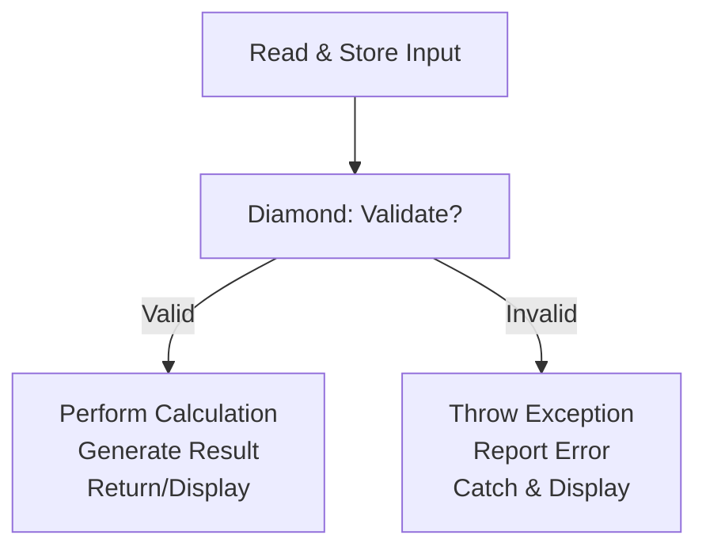

# Session 17: Core Java - Language Fundamentals and Building Logic

- [Introduction](#introduction)
- [Review of Previous Session](#review-of-previous-session)
- [Chapter Overview: Language Fundamentals and Building Logic](#chapter-overview-language-fundamentals-and-building-logic)
- [Building Logic Concepts](#building-logic-concepts)
- [Real-World Applications](#real-world-applications)
- [Programming Languages and Automation](#programming-languages-and-automation)
- [Benefits of Automation](#benefits-of-automation)
- [Language Fundamentals](#language-fundamentals)
- [Steps to Build Logic](#steps-to-build-logic)
- [Flowchart for Logic Development](#flowchart-for-logic-development)
- [Example Program: Simple Calculator](#example-program-simple-calculator)
- [Exception Handling Overview](#exception-handling-overview)
- [Class Recommendations](#class-recommendations)
- [Summary](#summary)

## Introduction
This study guide covers Session 17 of the Core Java & Full Stack Java training course, held on February 24th, conducted by Mr. Hari Krishna. The session focuses on Chapter 4: Language Fundamentals and Building Logic, introducing core programming concepts applicable across languages.

## Review of Previous Session
Last class reviewed comments, identifiers, keywords, reserved words, and separators. Discussed reserve words (63 standard + 1 added in Java 19), with preview and permanent statuses for features like `yield` (Java 13 to 14) and `sealed` (Java 15 to 17).

### Notes on Mistakes and Corrections
- The transcript includes the word "update" in timestamps, but no significant misspellings like "htp" for "http" or "cubectl" for "kubectl" were found. Minor instances of repeated words or slight audio artifacts are corrected for clarity (e.g., ensuring consistent terminology like "reserve word" is standardized to "reserved word").

## Chapter Overview: Language Fundamentals and Building Logic

### Overview
Language fundamentals and building logic introduce the core concepts used to develop programs. Logic building involves storing data, performing validations and calculations, controlling flow, and handling exceptions. These principles are common to all programming languages, applying universal techniques for problem-solving.

### Key Concepts
Building logic revolves around four primary operations:
1. Store data
2. Perform validations and calculations
3. Control flow of execution
4. Throw exceptions when errors occur

This framework turns manual real-world processes into automated programmatic solutions.

## Building Logic Concepts

### Operations in Logic Building
- **Store Data**: Using data types to create variables or objects for holding values.
- **Perform Validations and Calculations**:
  - Validations: Check if data meets criteria (e.g., positive numbers for addition).
  - Calculations: Arithmetic or logical operations to generate results.
- **Control Flow**: Decide which code blocks execute based on validation outcomes (e.g., if-else statements).
- **Throw Exceptions**: Handle invalid inputs by raising errors at runtime.

### Example: Deposit Operation in Banking
- **Validation**: Verify account exists, notes are authentic, and amount matches.
- **Calculation**: Add balance to existing amount.
- **Exception Handling**: Reject invalid inputs (e.g., fake notes or wrong account).
- **Control Flow**: If valid, process; else, throw exception.

### Four Activities in Any Operation
Every operation (manual or automated) involves:
1. Reading and storing inputs.
2. Validation and calculation.
3. Control flow decisions.
4. Exception throwing/reporting.

## Real-World Applications
- **Supermarket Security**: Body scanners validate safety before entry (validation); dishonest cheaters bypass safe honorable people (need for automation via checks).
- **Mobile Recharge**: Manual mode limits 24/7 access; automated systems enable it (e.g., post-blast security enhancements).
- **Banking/ATM Operations**: Manual banks may lack consistent service; automated systems provide 24/7 reliability and accuracy.

Apply these concepts daily: lunches, shopping, office access—all mirror the four activities.

## Programming Languages and Automation

### Overview
Programming languages automate business operations for computers, performing tasks in an automated way.

### Purpose
Languages enable implementing operations performed by computers automatically, replacing manual human effort.

### Structured vs. Object-Oriented Languages
- **Structured Languages** (e.g., C): Support variables, operators, control statements.
- **Object-Oriented Languages** (e.g., C++, Java, Python, .NET): Add objects and exception handling, prevalent in modern development.

> [!NOTE]
> All languages share fundamental concepts but differ in syntax.

## Benefits of Automation
Automation provides:
1. 24x7/365 days business operation (no holidays).
2. Good customer relations (consistent, error-free service).
3. Secure, accurate, efficient, and fast transactions.

### Examples
- **ATM/Phone Pay/Big Bazaar**: Enable round-the-clock access and accurate calculations.
- **Demart/Payment Scanners**: Prevent queuing and manual errors, achieving fast, efficient processing.

> [!DIFF]
> + Automated: Reliable, scalable, fast
> - Manual: Prone to errors, limited access, biases

## Language Fundamentals

### Overview
Programming languages provide fundamental concepts to perform the four activities:
- Data types and variables for storing data.
- Operators for validations and calculations.
- Control flow statements for decision-making.
- Exception handling statements for error management.

### Detailed Purpose
| Concept | Purpose | Example |
|---------|---------|---------|
| Data Types | Create variables/objects to store values | `int a` for holding integers |
| Operators | Validate (e.g., >, <, ==, !=) and calculate (+, -, *, /) | `a > 0` (validation), `a + b` (calculation) |
| Control Flow Statements | Decide execution path based on validation | `if-else` for branch selection |
| Exception Handling Statements | Throw, report, and catch exceptions | `throw new Exception(); try-catch` blocks |

- Control flow statements include loops (e.g., `for`, `while`) for repetition.
- Exception handling exists only in object-oriented languages (C++, Java, etc.).

## Steps to Build Logic
Follow these four steps to develop any operation:
1. Read and store input values from keyboard or other programs.
2. Validate those values (e.g., check for negatives).
3. Perform calculations if valid; throw exceptions if invalid.
4. Return or display results; handle exceptions for end-users.

### Lab Demos
1. **Deposit Slip Example**:
   - Read/store: Account number, amount, denominations.
   - Validate: Account exists, notes authentic, amount matches.
   - Calculate: Add to balance.
   - Exception: Throw if invalid.

2. **Classroom ID Card**:
   - Read/store: ID card data.
   - Validate: Verify authenticity.
   - Flow: Allow entry if valid; deny if invalid.

This process builds the logic for any application.

## Flowchart for Logic Development
Use the following flowchart for all logic building:



- **Arrows**: Represent execution flow.
- Apply to all programs: e.g., Amazon login (store mobile → validate → OTP or exception).

## Example Program: Simple Calculator
Implement a program adding two numbers with validations.

### Code Structure
- **Business Logic Class**: Handles core operations.
- **User Class**: Calls business logic, handles output/errors.

#### Java Code Example
```java
// Business Logic Class
public class Addition {
    public int add(int a, int b) {
        if (a < 0 || b < 0) {
            throw new IllegalArgumentException("Don't pass negative numbers");
        } else {
            return a + b;
        }
    }
}

// User Class (Calculator)
public class Calculator {
    public static void main(String[] args) {
        try {
            Addition add = new Addition();
            int result = add.add(5, 6); // Positive values
            System.out.println(result); // Output: 11
            int result2 = add.add(-5, 6); // Negative value
            System.out.println(result2);
        } catch (IllegalArgumentException e) {
            System.out.println(e.getMessage()); // Output: Don't pass negative numbers
        }
    }
}
```

#### Flow Explanation
- **Positive Input (5, 6)**:
  - Store: `a=5, b=6`
  - Validate: `a >= 0 && b >= 0` → true
  - Calculate: `5 + 6 = 11`, return 11
  - Display: Print 11

- **Negative Input (-5, 6)**:
  - Store: `a=-5, b=6`
  - Validate: `a < 0 || b >= 0` → true (fails)
  - Exception: Throw `IllegalArgumentException`
  - Catch: Display error message

### Test Cases
- Input: 10, 20 → Output: 30
- Input: -10, 20 → Exception: "Don't pass negative numbers"
- Input: 10, -20 → Exception: Same

> [!REMINDER]
> Practice rewriting the code multiple times without referring to notes to internalize the flow.

## Exception Handling Overview
- **Throw**: Raise exception (e.g., `throw new Exception()`).
- **Report**: Use `throws` keyword.
- **Catch**: Use `try-catch` blocks to handle.

## Class Recommendations
- Attend daily with punctuality and consistency.
- Revise notes post-class; practice until concepts stick.
- Schedule: Monday (Data Types), Tuesday (Literals), Wednesday (Type Conversions), etc.
- No class misses to ensure progression.

## Summary

### Key Takeaways
+ Programming automates operations using 4 activities: store, validate/calculate, control flow, exceptions
+ Language fundamentals: Data types (storage), Operators (validation/calculation), Control flow (decisions), Exceptions (errors)
+ Follow the flowchart for reliable logic building
+ Automation benefits: 24/7/365, accuracy, speed, security

### Expert Insight
#### Real-world Application
In production (e.g., e-commerce like Amazon), apply these fundamentals for user input validation (e.g., login), calculations (e.g., cart totals), and error handling (e.g., invalid payments). Build scalable services by layering business logic (calculations) on top of data storage and exception management.

#### Expert Path
Master by practicing real-world mappings: Identify validations (operators), decisions (if-else), and error paths (try-catch) in daily scenarios. Experiment with modifying the calculator example (e.g., add subtraction) to understand extensions. Combine with next topics (data types, type conversion) for complex apps.

#### Common Pitfalls
- Skipping order: Always store data first before validating—ignorance leads to runtime errors.
- Manual bias: Over-rely on manual thinking; force automation mapping early.
- Exception negligence: Failing to catch exceptions causes crashes; always wrap in try-catch for robustness, especially in user-facing apps.
- Less known things: Object-oriented languages unify exceptions and objects—streamline handling in Java/.NET vs. C's limited error mechanisms. Automated operations reveal hidden efficiencies; manual oversights (e.g., biased validations) vanish in code. Practice imposition for mental flowchart recall to prevent forgetting fundamentals under pressure.
