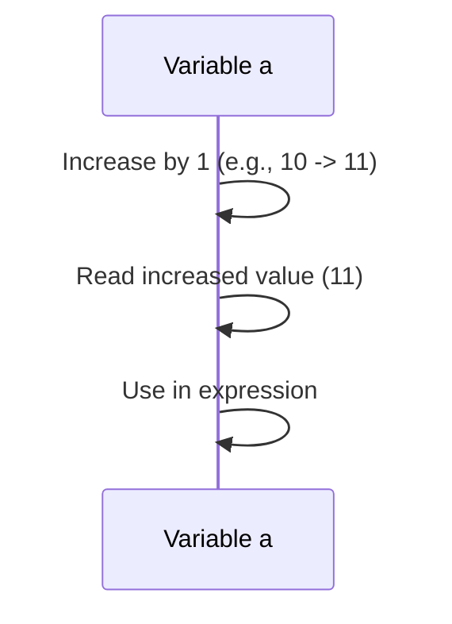
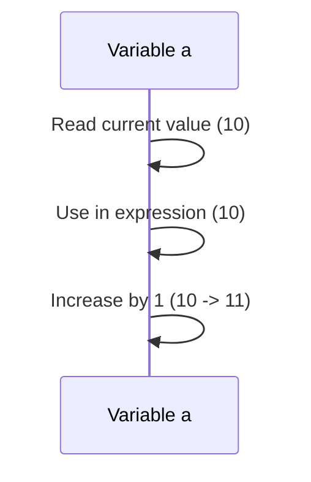

# Session 33: Increment and Decrement Operators

## Table of Contents
- [Increment and Decrement Operators](#increment-and-decrement-operators)

## Increment and Decrement Operators

### Overview
Increment and decrement operators in Java are used to increase or decrease a variable's value by exactly one. This lesson covers `++` (increment) and `--` (decrement) operators, including pre-increment, post-increment, pre-decrement, and post-decrement variations. Understanding these operators is crucial for efficient coding, especially in loops and conditional statements. The instructor emphasizes that these operators perform three operations: read, increase/decrease, and store, with execution order differences between pre and post forms.

### Key Concepts/Deep Dive

#### Increment Operator (++)

**Definition**: The `++` operator increases a variable's value by exactly 1. Its full form is `a = a + 1`, where `a++` serves as a shortcut.

**Example**:
```java
int a = 10;
a++;
System.out.println(a); // Output: 11
```

**Explanation**: The variable `a` is initialized to 10. Applying `++` increments it to 11 and stores the result in the same variable.

#### Decrement Operator (--)

**Definition**: The `--` operator decreases a variable's value by exactly 1. Its full form is `a = a - 1`, where `a--` serves as a shortcut.

**Example**:
```java
int b = 10;
b--;
System.out.println(b); // Output: 9
```

**Explanation**: The variable `b` is initialized to 10. Applying `--` decrements it to 9 and stores the result in the same variable.

#### Types of Increment and Decrement Operators

There are two types: pre-increment/pre-decrement and post-increment/post-decrement.

- **Pre-increment (++a or --a)**: The variable name is preceded by the operator. The increment/decrement happens first, then the value is used.
- **Post-increment (a++ or a--)**: The variable name is followed by the operator. The current value is used first, then the increment/decrement occurs.

**Examples**:
```java
int a = 10;
// Pre-increment: ++a
System.out.println(++a); // Output: 11 (increment first, then use)

// Post-increment: a++
a = 10;
System.out.println(a++); // Output: 10 (use first, then increment)

// Pre-decrement: --a
a = 10;
System.out.println(--a); // Output: 9 (decrement first, then use)

// Post-decrement: a--
a = 10;
System.out.println(a--); // Output: 10 (use first, then decrement)
```

**Difference Between Pre and Post**:
- In **pre**-forms (`++a`, `--a`): Increment/decrement happens first, then the new value is used in the expression.
- In **post**-forms (`a++`, `a--`): The current value is used in the expression first, then increment/decrement occurs afterward.
- **In the next line**: Both forms result in the variable being incremented/decremented. The difference is only within the same execution line where the operator is used.

#### Execution Flow in Expressions

Each increment/decrement operator involves three steps:
1. **Read**: Read the current value of the variable.
2. **Increase/Decrease**: Increment or decrement the value.
3. **Store/Use**: Store the result and/or use it in the expression.

**Diagrams for Execution Flow**:

**Pre-increment (++a)**:


**Post-increment (a++)**:


**Key Rules for Substitution in Expressions**:
- For pre-increment/pre-decrement: Substitute with the increased/decreased value immediately.
- For post-increment/post-decrement: Substitute with the original value, then increment/decrement afterward.
- In the next line or assignment, always use the modified value.

#### Simple Program Demos

**Demo 1: Basic Increment and Decrement**:
```java
public class IncrementDecrementDemo {
    public static void main(String[] args) {
        int x = 10;
        int y = 10;
        
        x++; // x becomes 11
        y--; // y becomes 9
        
        System.out.println("x: " + x); // 11
        System.out.println("y: " + y); // 9
    }
}
```

**Output**: 
```
x: 11
y: 9
```

**Lab Steps**:
1. Open your Java IDE or editor.
2. Create a new Java class file named `IncrementDecrementDemo.java`.
3. Copy the above code into the file.
4. Compile and run the program using `javac IncrementDecrementDemo.java` followed by `java IncrementDecrementDemo`.
5. Observe the output and verify that `x` is incremented and `y` is decremented.

**Demo 2: Difference in Same Line vs. Next Line**:
```java
public class PrePostDemo {
    public static void main(String[] args) {
        int a = 10;
        System.out.println(++a); // Pre-increment: 11
        System.out.println(a);   // 11
        
        a = 10;
        System.out.println(a--); // Post-decrement: 10
        System.out.println(a);   // 9
    }
}
```

**Output**:
```
11
11
10
9
```

**Lab Steps**:
1. Create a new file `PrePostDemo.java`.
2. Implement the code above.
3. Compile and run using commands:
   - `javac PrePostDemo.java`
   - `java PrePostDemo`
4. Note how pre-increment uses the incremented value in the same line, while post-decrement uses the original value.

#### Complex Expressions

**Demo 3: Mixed Increment/Decrement**:
```java
public class ComplexDemo {
    public static void main(String[] args) {
        int x = 1;
        int y = 2;
        
        y = x++ + ++x; // x++ -> use 1, then x=2; ++x -> x=3, use 3; y=1+3=4
        System.out.println("x: " + x + ", y: " + y); // x: 3, y: 4
        
        x = 1;
        y = x-- + --x; // x-- -> use 1, then x=0; --x -> x=-1, use -1; y=1+(-1)=0
        System.out.println("x: " + x + ", y: " + y); // x: -1, y: 0
    }
}
```

**Lab Steps**:
1. Create `ComplexDemo.java`.
2. Add the code snippet.
3. Compile and run:
   - `javac ComplexDemo.java`
   - `java ComplexDemo`
4. Draw a memory diagram for each line to visualize read/increment steps.

**Demo 4: Assignment to Same Variable**:
```java
public class SameVarDemo {
    public static void main(String[] args) {
        int x = 1;
        x = ++x; // x=2, then x=2
        System.out.println(x); // 2
        
        x = 1;
        x = x++; // x=1 (used), then x=2, but assign 1 back? x=1++
        System.out.println(x); // 1 (post-increment assigns original value if same var)
    }
}
```

**Output**:
```diff
1
1
```

**Explanation**: Post-increment in assignment to the same variable can replace the increased value with the original due to assignment order.

**Lab Steps**:
1. Test `SameVarDemo.java`.
2. Observe compilation and runtime to confirm behavior.

### Comparison Table: Increment vs. Decrement Operators

| Operator | Form     | Effect                          | Example               | Output Explanation |
|----------|----------|---------------------------------|-----------------------|-------------------|
| ++      | Pre      | Increment first, then use      | `++a` (a=10)         | 11                |
| ++      | Post     | Use first, then increment       | `a++` (a=10)         | 10                |
| --      | Pre      | Decrement first, then use      | `--a` (a=10)         | 9                 |
| --      | Post     | Use first, then decrement       | `a--` (a=10)         | 10                |

### Additional Demos and Homework

The instructor provided several interactive demos in class, including calculating expressions like `x++ + ++x` and assignments like `x = x++`.

**Homework Assignments**:
- Implement and run variations of the above demos.
- Predict outputs before running and draw memory diagrams.
- Practice until confident in distinguishing pre/post behavior.

## Summary

### Key Takeaways
```diff
+ Increment (++) and decrement (--) operators increase/decrease a variable's value by 1.
+ Pre-forms (++a, --a) increment/decrement first, then use the modified value in expressions.
+ Post-forms (a++, a--) use the original value in expressions, then modify afterward.
+ Both forms result in the same modified value in the next operations.
+ Execution involves read, modify, and store/use steps with order differences.
! Always think like the JVM/compiler: apply the algorithm step-by-step, not intuitively.
```

### Expert Insight

**Real-world Application**: These operators are heavily used in loop counters (`i++` or `++i`), array indexing, and performance-critical code where minimizing operations matters. For example, in games or data processing, using `i++` in loops can optimize CPU cycles.

**Expert Path**: Master these by practicing flow diagrams for complex expressions. Consider how compilers optimize these operations. Keep practicing until patterns are automatic, as they're common in coding interviews.

**Common Pitfalls**: 
- Assigning post-increment to the same variable can lead to unexpected results (e.g., `x = x++` leaves x unchanged).
- Mixing pre/post in expressions without drawing diagrams often causes bugs.
- Overusing in complex math can reduce readability; prefer clarity in production code.
- Lesser known thing: In multi-threaded environments, these operations aren't atomic without synchronization, which can cause race conditions.

**Resolutions and Avoidance**: Draw memory diagrams for every new expression. Use tools like Java decompilers to see bytecode. Avoid complex chained increments; break into simpler statements. Practice in controlled environments before production use. For thread safety, use atomic variables like `AtomicInteger`.
