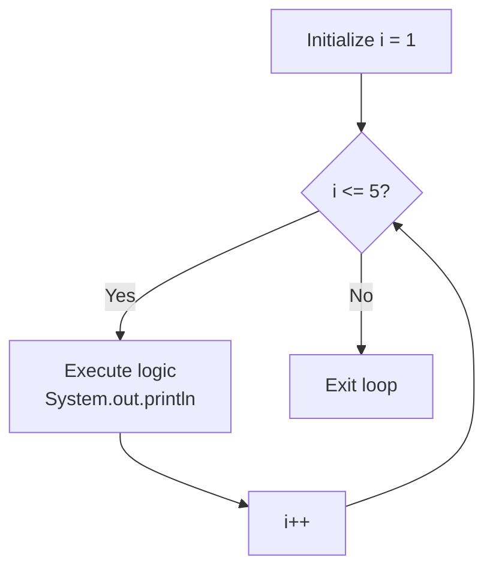
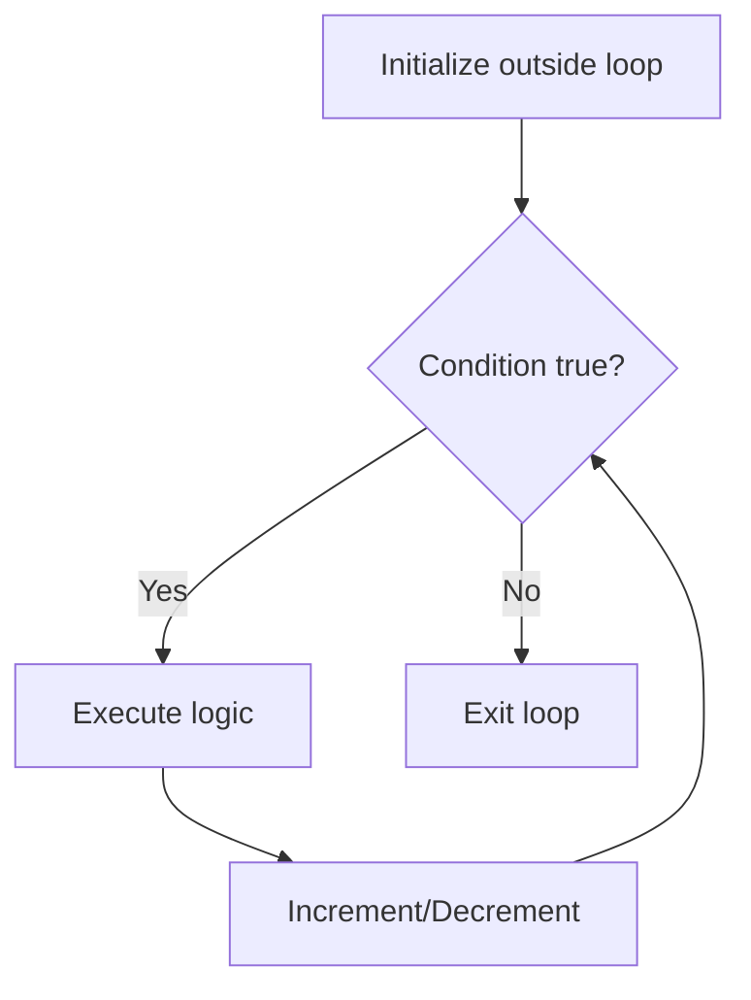
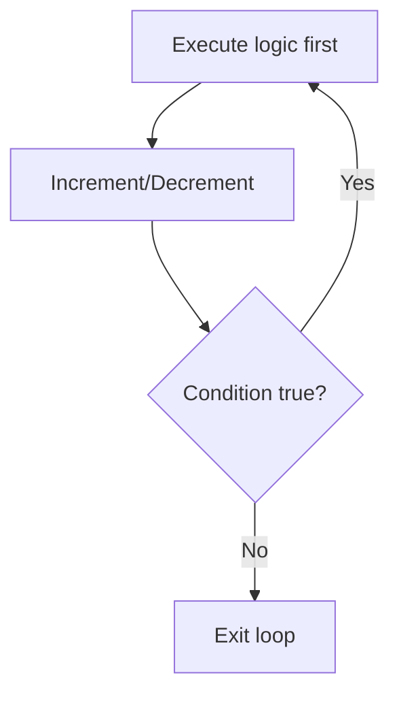
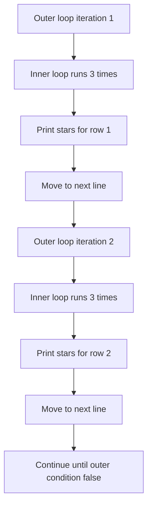

# Session 41: Loops

- [Loops](#loops)
  - [Overview](#overview)
  - [Key Concepts/Deep Dive](#key-conceptsdeep-dive)
    - [For Loop](#for-loop)
    - [While Loop](#while-loop)
    - [Do-While Loop](#do-while-loop)
    - [Nested Loops](#nested-loops)
    - [Infinite Loops](#infinite-loops)
  - [Lab Demos](#lab-demos)
- [Summary](#summary)
  - [Key Takeaways](#key-takeaways)
  - [Expert Insight](#expert-insight)

## Loops

### Overview

Loops in Java are control flow statements that allow code to be executed repeatedly based on a condition. There are three main types of loops: `for`, `while`, and `do-while`. Each serves different purposes and has specific execution patterns. Loops are fundamental for iterative programming, enabling tasks like processing arrays, generating patterns, and handling repetitive operations. Nested loops combine loops within loops, allowing for complex multidimensional processing such as matrix operations or pattern generation.

### Key Concepts/Deep Dive

#### For Loop

A for loop consists of three parts: initialization, condition, and increment/decrement. The flow of execution follows this sequence repeatedly until the condition becomes false:

1. Variable initialization
2. Condition check
3. Logic execution
4. Increment/decrement
5. Loop iteration back to condition check

```java
for (int i = 1; i <= 5; i++) {
    System.out.println("Value: " + i);
}
```

The above loop will execute 5 times, printing numbers 1 through 5.

**Execution Flow Diagram:**



#### While Loop

A while loop checks the condition first, then executes the logic if true. The structure is similar to for loops but with the initialization outside the loop.

```java
int i = 1;
while (i <= 5) {
    System.out.println("Value: " + i);
    i++;
}
```

**Execution Flow Diagram:**



#### Do-While Loop

A do-while loop executes the logic first, then checks the condition. This ensures the loop body executes at least once, even if the condition is initially false.

```java
int i = 1;
do {
    System.out.println("Value: " + i);
    i++;
} while (i <= 5);
```

**Execution Flow Diagram:**



#### Nested Loops

Nested loops involve placing one loop inside another. The inner loop executes completely for each iteration of the outer loop. This is commonly used for matrix operations and pattern generation.

```java
for (int i = 1; i <= 3; i++) {
    for (int j = 1; j <= i; j++) {
        System.out.print("* ");
    }
    System.out.println();
}
```

**Output:**
```
* 
* * 
* * * 
```

**Nested Loop Execution Flow:**



#### Infinite Loops

An infinite loop occurs when the loop condition never becomes false, causing continuous execution until manually terminated. Common causes include forgetting to increment variables or using always-true conditions.

**Examples of Infinite Loops:**

1. Using `true` as condition:
```java
while (true) {
    System.out.println("This runs forever");
}
```

2. Forgetting to increment:
```java
int count = 0;
while (count < 5) {
    System.out.println(count);
    // Missing count++
}
```

3. Using `true` in for loop (default behavior):
```java
for (;;) {
    System.out.println("Infinite");
}
```

> [!CAUTION]
> Infinite loops will run until the program is manually stopped and can cause system resource exhaustion. Always ensure loop termination conditions are properly implemented.

### Lab Demos

#### Pattern Generation with Nested Loops

**Right-Angled Triangle Pattern:**

```java
public class PatternDemo {
    public static void main(String[] args) {
        for (int i = 1; i <= 5; i++) {
            for (int j = 1; j <= i; j++) {
                System.out.print("* ");
            }
            System.out.println();
        }
    }
}
```

**Execution Steps:**
1. Outer loop controls rows (1 to 5)
2. Inner loop controls columns (1 to current row value)
3. Print "*" for each inner loop iteration
4. Use `System.out.println()` to move to next line after each row

#### Reverse Triangle Pattern

```java
public class ReversePatternDemo {
    public static void main(String[] args) {
        for (int i = 5; i >= 1; i--) {
            for (int j = 1; j <= i; j++) {
                System.out.print("* ");
            }
            System.out.println();
        }
    }
}
```

This creates a reverse triangle starting with 5 stars on the first row, decreasing to 1 star on the last row.

## Summary

### Key Takeaways

```diff
+ Loops enable repetitive execution based on conditions
+ For loops: initialization → condition → logic → increment (suitable for known iterations)
+ While loops: condition check first, then execute logic
+ Do-while loops: execute logic first, then check condition (guarantees at least one execution)
+ Nested loops: inner loop completes for each outer loop iteration (ideal for matrices and patterns)
+ Infinite loops occur when termination conditions are never met
+ Use print() for same-line output, println() for new lines in patterns
+ Variable scoping is crucial in nested loops to avoid conflicts
```

### Expert Insight

**Real-world Application:**
Loops are essential in Java development for processing collections, implementing algorithms, and handling data transformations. For example:
- Iterating through database result sets
- Processing array/list elements for business logic
- Generating reports with repeating data patterns
- Implementing search algorithms (linear/binary search)
- Matrix operations in scientific computing

**Expert Path:**
Master loop patterns by practicing algorithmic problems on platforms like LeetCode or HackerRank. Focus on time complexity analysis (Big O notation) to understand loop efficiency. Learn advanced concepts like:
- Loop unrolling for performance optimization
- Using `continue` and `break` statements effectively
- Converting recursive functions to iterative loops when memory is constrained
- Parallel processing with loops using `Stream API`

**Common Pitfalls:**
- Common mistakes include off-by-one errors in loop conditions (using `<=` instead of `<` or vice versa)
- Forgetting to update loop variables, causing infinite loops
- Incorrectly scoping variables in nested loops, leading to logical errors
- Using `==` for floating-point comparisons in loop conditions (use epsilon comparison instead)
- Poor indentation making nested loops unreadable

**Lesser known things:**
- Java's `for-each` loop (`enhanced for loop`) internally uses `Iterator` and throws `ConcurrentModificationException` when collections are modified during iteration
- The JVM optimizes empty loops differently than loops with work, which can affect benchmarking accuracy
- Loop variables in for loops have block scope, unlike while loops where variables are scoped to the containing block

**Transcription Correction Notes:**
- "ript" appears to be an incomplete word at the beginning of transcript - likely not relevant to content
- No instances of "htp" (should be "http"), "cubectl" (should be "kubectl"), or "JAVA" found requiring correction
- Transcript quality is generally good with clear explanations
