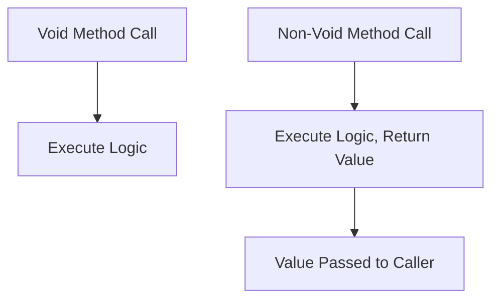

# Session 52: Core Java & Full Stack Java @ 9 AM IST on 6th April by Mr Hari Krishna

- [Types of Methods](#types-of-methods)
- [Static and Non-Static Methods](#static-and-non-static-methods)
- [Private and Non-Private Methods](#private-and-non-private-methods)
- [Void and Non-Void Methods](#void-and-non-void-methods)
- [Parameterized and Non-Parameterized Methods](#parameterized-and-non-parameterized-methods)
- [Method Calling](#method-calling)
- [Lab Demo: Void and Non-Void Methods](#lab-demo-void-and-non-void-methods)
- [Lab Demo: Mathematics-Based Program for Even or Odd](#lab-demo-mathematics-based-program-for-even-or-odd)

## Types of Methods

### Overview
In Java, methods define behaviors of objects or classes. They are categorized primarily into abstract and concrete methods, further subdivided based on access, return type, and parameters. Understanding these types helps in designing reusable and maintainable code.

### Key Concepts/Deep Dive

Java supports two main types of methods: **abstract** and **concrete** methods. Abstract methods lack implementation, while concrete methods provide full logic. Concrete methods divide into static/non-static, private/non-private, void/non-void, and parameterized/non-parameterized. Here's the classification:

1. **Abstract Methods**: Declared in abstract classes or interfaces; provide no body and must be overridden in subclasses.
2. **Concrete Methods**: Fully implemented methods. Further divided into:
   - **Static vs. Non-Static**: Static methods belong to the class, non-static to instances.
   - **Private vs. Non-Private**: Private methods are accessible only within the same class, non-private (public, default, protected) from outside.
   - **Void vs. Non-Void**: Void methods return no value, non-void return specific data types.
   - **Parameterized vs. Non-Parameterized**: Parameterized methods accept arguments, non-parameterized do not.

```diff
+ Core Classification: Abstract vs Concrete
- Abstract: No implementation, uses `abstract` keyword
+ Concrete: Fully implemented, further subdivided by static, access, return type, and parameters
```

### Code/Config Blocks

```java
// Example of abstract method in an abstract class
public abstract class Shape {
    public abstract void draw();  // Abstract method
}

// Example of concrete method types
public class Calculator {
    // Static method
    public static void printLogo() {
        System.out.println("Calculator V1.0");
    }

    // Non-static method
    public void calculate() {
        System.out.println("Calculating...");
    }

    // Private method
    private void validateInput(int input) {
        if (input < 0) throw new IllegalArgumentException("Invalid input");
    }

    // Void method
    public void displayResult() {
        System.out.println("Result: " + compute());
    }

    // Non-void method
    public int compute() {
        return 42;  // Returns an int
    }

    // Parameterized method
    public int add(int a, int b) {
        return a + b;
    }
}
```

## Static and Non-Static Methods

### Overview
Static methods are associated with the class itself, while non-static methods require an object instance for access. Static methods are ideal for utility operations shared across all instances, non-static for object-specific behaviors.

### Key Concepts/Deep Dive

- **Static Methods**:
  - Declared with `static` keyword.
  - Called using class name, e.g., `ClassName.methodName()`.
  - Cannot access non-static members directly.
  - Used for common logic applicable to all objects.

- **Non-Static Methods**:
  - Requires object instantiation.
  - Called using object reference, e.g., `obj.methodName()`.
  - Can access both static and non-static members.
  - Used for instance-specific operations.

> [!NOTE]
> Static methods are useful for defining class-level utilities, like factory methods or configuration loaders.

## Private and Non-Private Methods

### Overview
Private methods encapsulate internal logic, ensuring security and modularity. Non-private methods expose functionality for external interaction, following the principle of encapsulation.

### Key Concepts/Deep Dive

- **Private Methods**:
  - Declared with `private` keyword.
  - Accessible only within the same class.
  - Used for suboperations or helper logic that shouldn't be exposed.

- **Non-Private Methods**:
  - Include public, protected, or default access.
  - Allow access from other classes/packages.
  - Used for main operations or reusable logic.

Example in a bank account context:
```java
public class BankAccount {
    private void alertWithdrawal() {  // Private suboperation
        System.out.println("Alert: Withdrawal made");
    }

    public void withdraw(double amount) {  // Non-private main operation
        // Logic here
        alertWithdrawal();  // Call private method
    }
}
```

## Void and Non-Void Methods

### Overview
Void methods perform tasks without returning values, often for printing or side effects. Non-void methods return data, enabling reusability and data flow in code.

### Key Concepts/Deep Dive

- **Void Methods**:
  - Return type is `void`.
  - Can be empty or contain `return;` for early exit.
  - Called only as a single statement.
  - Compiler errors if attempting to use return value or incompatibilities in expressions/arguments.

- **Non-Void Methods**:
  - Return type: Primitive/reference type.
  - Must return a compatible value; empty methods cause compile-time errors.
  - Return value must match or be lesser than the declared type.
  - Callable in five ways: single statement, assignment, operand in expression, argument to another method, return value.

> [!IMPORTANT]
> Non-void methods require proper handling of return values to avoid "Missing return statement" errors.

```diff
+ Void: For actions without return
- Non-Void: For computations with return, enables flexible calling
```

### Code/Config Blocks

```java
public class Example {
    // Void method
    public static void printMessage() {
        System.out.println("Message printed");
        // return;  // Optional for early exit
    }

    // Non-void method
    public static int getValue() {
        return 42;  // Mandatory return statement
    }
}
```

Graph TD;
    A[Void Method Call] --> B[Execute Logic, No Return Value];
    C[Non-Void Method Call] --> D[Execute Logic, Return Value];
    D --> E[Value Substituted in Caller Context];



## Parameterized and Non-Parameterized Methods

### Overview
Parameterized methods enhance flexibility by accepting inputs, allowing dynamic behavior. Non-parameterized methods operate on fixed logic, suitable for static tasks.

### Key Concepts/Deep Dive

- **Parameterized Methods**: Accept arguments via parameters, enabling runtime customization.
- **Non-Parameterized Methods**: No parameters, perform predefined actions.

### Code/Config Blocks

```java
public class MathUtils {
    // Non-parameterized method
    public static void printPi() {
        System.out.println(Math.PI);
    }

    // Parameterized method
    public static double power(float base, int exponent) {
        return Math.pow(base, exponent);
    }
}
```

## Method Calling

### Overview
Methods are invoked explicitly; Java provides five ways for non-void methods, one for void methods. Correct calling ensures data flow and prevents errors like incompatible assignments.

### Key Concepts/Deep Dive

**Ways to Call Methods**:
1. **As a Single Statement**: `methodName();` (Both void and non-void; non-void value lost).
2. **As Variable Assignment**: `Type var = methodName();` (Non-void only, must match types).
3. **As Operand in Expression**: `int result = a * methodName();` (Non-void only).
4. **As Method Argument**: `System.out.println(methodName());` (Non-void only).
5. **As Return Value**: `return methodName();` (Non-void only).

Void methods: Only way 1. Non-void: All five, with type compatibility.

## Lab Demo: Void and Non-Void Methods

### Overview
This demo illustrates void and non-void method behaviors, including calling restrictions and compilation errors.

### Key Concepts/Deep Dive

Steps for the demo:
1. Create a class with void(`m1()`) and non-void(`m2()`) methods.
2. Attempt invalid calls for void method (e.g., assignment, expression) to demonstrate errors: "Void type not allowed here".
3. Successfully call void as a single statement.
4. Demonstrate all five calling ways for non-void method, ensuring proper returns.

### Code/Config Blocks

```java
public class Demo {
    public static void m1() {  // Void method
        System.out.println("M1 executed");
    }

    public static int m2() {   // Non-void method
        System.out.println("M2 executed");
        return 5;
    }

    public static void main(String[] args) {
        // Valid void call
        m1();  // Single statement

        // Valid non-void calls
        m2();  // Single statement (value lost)
        int a = m2();  // Assignment
        int b = 10 * m2();  // Expression
        System.out.println(m2());  // Argument
    }
}
```

Expected Outputs:
- Invalid void calls cause compile-time errors.
- Valid calls execute logic; non-void returns values appropriately.

## Lab Demo: Mathematics-Based Program for Even or Odd

### Overview
Develop a program to check if a number is even or odd using a user-defined boolean method, demonstrating static, non-void, parameterized method usage.

### Key Concepts/Deep Dive

Project Structure:
1. Two classes: `EvenOddLogic` (business logic) and `EvenOddMain` (calling/UI logic).
2. `EvenOddLogic`: Static, public, boolean, parameterized method `isEven(int num)`.
3. `EvenOddMain`: Uses Scanner for input, calls logic, prints results using if-else (no unnecessary comparisons).

Steps:
1. Define logic class with method implementation.
2. In main class, read input with Scanner.
3. Call logic method, assign to boolean variable.
4. Use direct boolean in if: `if (isEven) { /* even */ } else { /* odd */ }`.
5. Practice shortcuts: Ternary for returns, but prioritize clean code.

### Code/Config Blocks

`EvenOddLogic.java`:
```java
public class EvenOddLogic {
    public static boolean isEven(int number) {
        if (number % 2 == 0)
            return true;
        else
            return false;
        // Shortcut: return number % 2 == 0;  // Preferred, as expression is boolean
    }
}
```

`EvenOddMain.java`:
```java
import java.util.Scanner;

public class EvenOddMain {
    public static void main(String[] args) {
        Scanner sc = new Scanner(System.in);
        System.out.println("Enter number:");
        int num = sc.nextInt();

        boolean isEven = EvenOddLogic.isEven(num);
        if (isEven)  // Direct boolean check, no == true
            System.out.println(num + " is even");
        else
            System.out.println(num + " is odd");

        sc.close();
    }
}
```

Compilation: `javac *.java` then `java EvenOddMain`.

Expected Behavior: Enter 10 → "10 is even". Enter 15 → "15 is odd".

## Summary

### Key Takeaways

```diff
+ Java has four main method types: static, non-static, private, non-private, void, non-void, parameterized, non-parameterized
- Void methods: Return no value, printable as single statement; errors when used in assignments
! Non-void methods: Return values, callable in five ways with type matching required
- Abstract methods lack implementation; concrete methods are fully coded
+ Secure encapsulation: Private for internal logic, non-private for API exposure
- Flexible calls: Mastering five calling techniques enhances code reusability
```

### Expert Insight

**Real-world Application**: In web development (MVC architecture), void methods handle views (e.g., printing responses), non-void in controllers (returning data models). Static methods for utility libraries, parameterized for configurable operations like database connections.

**Expert Path**: Deepen by implementing recursive methods (e.g., factorial with parameterized recursion). Study Java 8+ lambdas for functional equivalents. Practice design patterns like Factory using method variations.

**Common Pitfalls**: Forgetting mandatory return in non-void methods causes "Missing return statement" errors. Mismatched return types lead to "Incompatible type" issues. Avoid overusing static for instance-specific logic. Neglect encapsulation breaks security. Use meaningful names; avoid generic flags like "flag". In demos, correct "wide" to "void" as it's a common transcription error. Common issues: "Void cannot be converted to int" in assignments; "Unreachable code" from misplaced returns. To avoid: Always test types; visualize control flow; refactor for clarity. Lesser known: `return;` in void is optional but useful for guards; expressions like `if (booleanFlag)` skip comparisons for efficiency.
