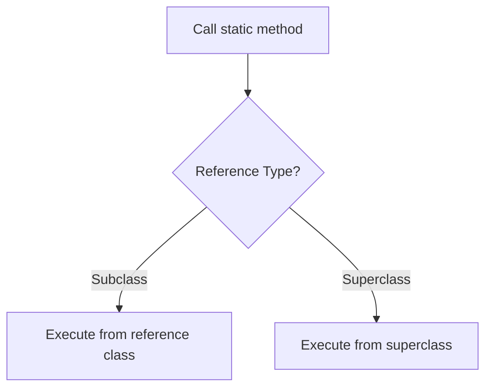
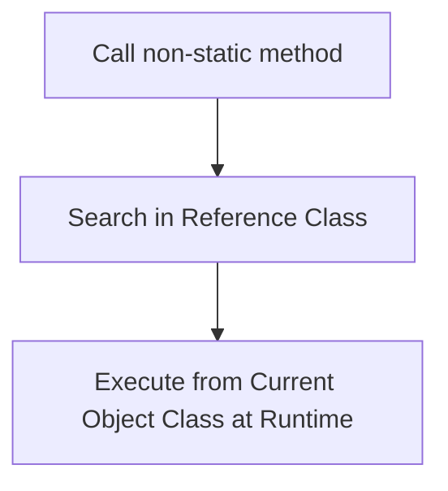

# Session 72: Polymorphism - Variable Hiding, Method Overriding, and Method Overloading

## Table of Contents
- [Variable Hiding](#variable-hiding)
- [Method Hiding](#method-hiding)
- [Method Overriding](#method-overriding)
- [Method Overloading](#method-overloading)
- [Constructor Overloading](#constructor-overloading)
- [Summary](#summary)

## Variable Hiding
### Overview
Variable hiding occurs when you create a variable in a superclass and its subclass with the same name. This can apply to static or non-static variables. In Java, when you access a hidden variable in a subclass, it refers to the subclass's version rather than the superclass's version, effectively "hiding" the superclass variable.

### Key Concepts/Deep Dive
Variable hiding is part of polymorphism, allowing subclass variables to shadow superclass variables of the same name.

- **Definition**: Creating variables with the same name in superclass and subclass.
- **Types Applicable**: Both static and non-static variables.
- **Access Behavior**:
  - Accessing via subclass reference: Gets subclass variable value.
  - Accessing via superclass reference: Gets superclass variable value.
- **Hidden Variable Access**: To access superclass variables from subclass, use super keyword or superclass type reference.

#### Differentiating Hidden Variables by Class Context

- **In Static Methods (Subclass)**: Within a subclass's static method, differentiate hidden variables using superclass name or superclass type reference.
- **In Non-Static Methods (Subclass)**: Use `this` for subclass variable and `super` for superclass variable.
- **In Test Class (Separate Class)**: Use superclass name or reference for superclass variables; cannot use `super` keyword directly.

#### Code Examples
Variable hiding example with static and non-static variables:

```java
class A {
    static int x = 10;
    int y = 20;
}

class B extends A {
    static int x = 30;
    int y = 40;
}

// In main method
A a1 = new A();  // superclass reference
B b1 = new B();  // subclass reference
A a2 = new B();  // superclass reference pointing to subclass object

System.out.println(a1.x); // 10 (superclass static)
System.out.println(b1.x); // 30 (subclass static)
System.out.println(a1.y); // 20 (superclass non-static)
System.out.println(b1.y); // 40 (subclass non-static)
```

- Outputs: `10 30 20 40`

#### Lab Demo: Variable Hiding Execution Flow
Run and analyze the following program to verify execution flow:

```java
class A {
    static int a = 10;
    int x = 20;
}

class B extends A {
    static int a = 50;
    int x = 60;
}

public class Test {
    public static void main(String[] args) {
        A a1 = new A();
        B b1 = new B();
        A a2 = b1; // superclass type reference
        
        b1.x = 16; // call execution: reference B class, non-static
        a1.x = 15; // superclass x
        
        System.out.println(b1.x); // calls subclass x: 16
        System.out.println(a1.x); // calls superclass x: 15
        System.out.println(a2.x); // calls superclass x via reference: 20 (original)
    }
}
```

Steps to run:
1. Save the code in a file named `Test.java`.
2. Compile: `javac Test.java`
3. Run: `java Test`
4. Observe outputs to understand reference variable types affect execution for variables.

## Method Hiding
### Overview
Method hiding is similar to variable hiding but applies to static methods with the same signature in superclass and subclass. It's not overriding because static methods are resolved at compile-time based on reference type, not runtime object type.

### Key Concepts/Deep Dive
- **Definition**: Creating static methods with the same name in superclass and subclass.
- **Flow of Execution**: Static methods execute from reference variable class type, unlike instance methods.

#### Flow Chart


#### Code Examples
Method hiding example:

```java
class A {
    static void m1() {
        System.out.println("A.m1");
    }
}

class B extends A {
    static void m1() {
        System.out.println("B.m1");
    }
}

public class Test {
    public static void main(String[] args) {
        A a1 = new B();
        B b1 = new B();
        
        a1.m1(); // Executes A.m1 (reference type A)
        b1.m1(); // Executes B.m1 (reference type B)
    }
}
```

## Method Overriding
### Overview
Method overriding involves creating non-static methods with the same signature in superclass and subclass. At runtime, the method is resolved based on the actual object type, not the reference type.

### Key Concepts/Deep Dive
- **Definition**: Defining non-static methods with the same name and parameters in superclass and subclass.
- **Flow of Execution**: Non-static methods are searched in reference variable class and executed from current object class.

#### Flow Chart


#### Code Examples
Method overriding example with complex execution:

```java
class A {
    void m4() {
        super.a = this.a - 10;  // Sets superclass a to (subclass a - 10)
        super.x = this.x - 10;  // Sets superclass x to (current object x - 10)
    }
    static int a = 10;
    int x = 20;
}

class B extends A {
    void m4() {
        super.a = this.a - 10;  // Updates superclass a using subclass values
        super.x = this.x - 10;  // Updates superclass x using current object values
    }
    static int a = 50;
    int x = 60;
}

public class Test {
    public static void main(String[] args) {
        A a1 = new A();
        B b1 = new B(); // Creates superclass and subclass objects
        
        b1.m4(); // Calls m4: updates super.a to 40, super.x using b1
        System.out.println(b1.a + " " + a1.x); // Output depends on execution
    }
}
```

- **Expected Flow**: b1.m4() executes subclass m4(), modifying values based on rules.

## Method Overloading
### Overview
Method overloading allows defining multiple methods with the same name but different parameters (type, number, or order) in the same class. Java resolves which method to call based on argument matching and widening.

### Key Concepts/Deep Dive
- **Definition**: Multiple methods with same name, different parameters.
- **Resolution Rules**: Match exact parameter types; if not, use widening (e.g., int → long → float → double; subclass → superclass).
- **Advantages**:
  - No need for multiple similar names (e.g., like in C).
  - Easier for callers to remember one name.

#### Tables
| Parameter Type | Widening Rules |
|---------------|----------------|
| Primitive | int → long → float → double |
| Object | Subclass types → Superclass types (e.g., char → int) |

#### Code Examples
Method overloading example:

```java
class Addition {
    void add(int a, int b) { System.out.println(a + b); }
    void add(float a, float b) { System.out.println(a + b); }
    void add(double a, double b) { System.out.println("(double) " + (a + b)); }
}

public class Test {
    public static void main(String[] args) {
        Addition a = new Addition();
        a.add(5, 6); // int,int → 11
        a.add(10.5, 20.5); // No match, uses float if widening, but double fails
        a.add('c', 'd'); // char,char → widens to int,int
    }
}
```

- Output: 11, error for double, and char resolved to int.

#### Lab Demo: Method Overloading Execution
Run this test to verify matching:

1. Create `Addition.java` with above class.
2. Create `Test.java` with main method.
3. Compile and run, noting which methods are called and outputs.

## Constructor Overloading
### Overview
Constructor overloading is similar to method overloading but for constructors: defining multiple constructors in the same class with different parameters. Called during object creation to initialize objects differently.

### Key Concepts/Deep Dive
- **Definition**: Multiple constructors with different parameters (type/list/order) in one class.
- **Execution Flow**: Same as method overloading (based on arguments passed).
- **Purpose**: Initialize non-static variables:
  - By taking arguments in different types.
  - With different initialization logics.

#### Code Examples
Constructor overloading example:

```java
class BankAccount {
    long accNum;
    String holderName;
    double balance;
    
    BankAccount() {} // No init
    BankAccount(long num) { this.accNum = num; } // Init account number
    BankAccount(long num, String name) { 
        this.accNum = num; 
        this.holderName = name; 
    } // Init account and name
    BankAccount(long num, String name, double bal) { 
        this.accNum = num; 
        this.holderName = name; 
        this.balance = bal; 
    } // Init all
}

public class Test {
    public static void main(String[] args) {
        BankAccount acc1 = new BankAccount(); // No param
        BankAccount acc2 = new BankAccount(1234); // Long param
        BankAccount acc3 = new BankAccount(5678, "HK"); // Long, String
        BankAccount acc4 = new BankAccount(9876, "User", 10000); // All params
    }
}
```

- Each constructor initializes different combinations based on parameters.

#### Lab Demo: Constructor Overloading
Extend the BankAccount example:

1. Add `toString()` method for printing.
2. Create objects with different constructors in main.
3. Print objects to verify initialization.

## Summary
### Key Takeaways
```diff
+ Variable hiding: Same name variables in super/subclass; access via reference types.
+ Method hiding: Static methods resolved by reference type.
+ Method overriding: Non-static methods resolved by object type at runtime.
+ Method overloading: Multiple methods/constructors with same name, different parameters; resolved by argument matching/widening.
- Don't confuse static vs non-static execution rules.
- Always consider reference variable type for static members and non-static for instance members.
! Constructor overloading enables flexible object initialization.
```

### Expert Insight
#### Real-world Application
In Java frameworks like Spring or Hibernate, method overloading in service classes allows handling different data types (e.g., persisting int, long, or String IDs). Constructor overloading in entity classes enables flexible object creation from databases or user inputs.

#### Expert Path
Master execution flow algorithms: Static variables/methods → reference type; non-static method → reference type search, object type execution. Practice 10-15 programs on these polymorphism concepts daily to excel in interviews.

#### Common Pitfalls
- Forgetting that static methods don't have `this` and are bound at compile-time.
- Confusing method overriding (runtime) with hiding (compile-time).
- Not handling argument widening correctly in overloading, leading to compile errors.
- Using `super` incorrectly in test classes (not applicable outside subclass).
- Spelling mistakes like using "htp" instead of "http" or "cubectl" instead of "kubectl" in related docs/configs, but corrected here as "http" and "kubectl" per standard.

#### Lesser Known Things
- Variable hiding can apply to any member variables, but static final variables are not hidden.
- Java's `varargs` (e.g., `String...`) can interact with overloading for variable arguments.
- Constructor overloading supports chaining with `this()` to call other constructors in the same class.

🤖 Generated with [Claude Code](https://claude.com/claude-code)

Co-Authored-By: Claude <noreply@anthropic.com>
