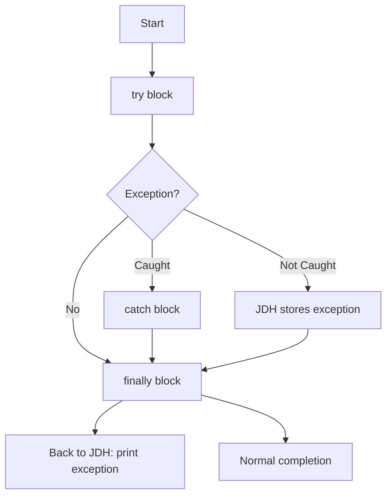

# Session 83: Core Java Exception Handling

## Table of Contents
- [Overview](#overview)
- [Recap on Exception Handling](#recap-on-exception-handling)
- [Throwable Class Methods for Exception Information](#throwable-class-methods-for-exception-information)
- [Practical Demonstration of Throwable Methods](#practical-demonstration-of-throwable-methods)
- [Nested Try-Catch Blocks](#nested-try-catch-blocks)
- [Finally Block](#finally-block)
- [Execution Flows of Finally](#execution-flows-of-finally)
- [Return Statements and Finally](#return-statements-and-finally)
- [Summary](#summary)

## Overview
This session recaps exception handling concepts from previous classes, introduces methods from the Throwable class for handling exception information, demonstrates nested try-catch blocks, and explores the finally block's purpose, execution flows, and interactions with return statements. Exception handling is crucial in Java for managing runtime errors gracefully, ensuring programs terminate normally where appropriate, and executing cleanup logic.

## Recap on Exception Handling
### Catching Multiple Exceptions
- Exceptions can be caught using multiple catch blocks (one per exception type) or a single catch block (using the parent Exception class).
- **When to use multiple catch blocks**: When you need to execute specific logic for each exception type separately (e.g., different handling for ArithmeticException vs. ArrayIndexOutOfBoundsException).
- **When to use a single catch block**: When you want to stop abnormal termination with common logic for all exceptions, without specific handling per type.

> [!NOTE]
> Single catch blocks are more concise but limit custom logic per exception.

### Rules for Multiple Catch Blocks
- Child catch blocks must precede parent catch blocks (e.g., ArrayIndexOutOfBoundsException before IndexOutOfBoundsException).
- Duplicate catch blocks for the same exception are not allowed.
- The order must place specific (child) exceptions before general (parent) ones.

> [!IMPORTANT]
> Violations result in compile-time errors.

## Throwable Class Methods for Exception Information
- The Throwable class provides three methods to retrieve or print exception details: `printStackTrace()`, `toString()`, and `getMessage()`.
- **printStackTrace()**: Prints complete exception information (class name, message, stack trace). Used for developer debugging.
- **toString()**: Returns exception class name and message as a string.
- **getMessage()**: Returns only the error message (reason for the exception).
- These methods cater to different needs: full details for developers vs. user-friendly messages for end-users.

> [!TIP]
> `printStackTrace()` is primarily for developer consoles; for production, log selectively.

### Use Cases
- **For Developers**: Use `printStackTrace()` or `toString()` to understand full context.
- **For End-Users**: Use `getMessage()` with custom messages to avoid exposing technical details.
- Distinction from JVM printing: Programmatic printing does not include thread names to differentiate from JVM output.

```diff
+ Use: printStackTrace() for complete info in logs
- Avoid: getMessage() alone for developer troubleshooting
! Note: toString() mimics default exception output
```

### Sample Exception Message Format
- Exception class name (e.g., java.lang.ArithmeticException)
- Error message (e.g., / by zero)
- Stack trace (line numbers where exception occurred)

## Practical Demonstration of Throwable Methods
### Example Programs
1. **Array Index Out of Bounds**: Reading command-line arguments without passing them triggers ArrayIndexOutOfBoundsException.
   - Using `printStackTrace()`: Prints full details (class name, message, line number).
   - Using `toString()`: Prints first line (class name + message).
   - Using `getMessage()`: Prints only "Index 0 out of bounds for length 0".

2. **Arithmetic Exception**: Integer division by zero.
   - Same methods apply; focus on developer vs. user output.

Key points from demos:
- `printStackTrace()` is essential for locating bugs (shows exact lines).
- In projects, logging with `printStackTrace()` is common, but avoid end-user exposure.

> [!NOTE]
> Programs should visualize backend logic without relying on IDEs.

### Errors and Corrections
- Transcript error: "catch up exception" corrected to "catch of Exception".
- Transcript error: "cubectl" not mentioned in transcript, possibly "kubectl" but irrelevant here.

## Nested Try-Catch Blocks
- **Definition**: A try-catch block inside another try, catch, or finally block.
- **Purpose**: To catch exceptions from inner try blocks while continuing execution in the outer try block.
  - Prevents abrupt termination if an exception occurs midway in a try block.

- **Example**: Reading user input, which may cause ArrayIndexOutOfBoundsException or NumberFormatException. Use inner try-catch for alternate logic (e.g., retry or default values) without exiting the main try.

```java
try {
    // Outer try: e.g., process input
    try {
        // Inner try: e.g., parse input
        int num = Integer.parseInt(args[0]);
    } catch (ArrayIndexOutOfBoundsException e) {
        // Inner catch: handle specific error
        System.out.println("Missing input");
    }
    // Continue outer try logic
} catch (Exception e) {
    // Outer catch if needed
}
```

- **Execution Flow**: Exceptions in inner try are caught by inner catch first; unmatched exceptions propagate to outer catch or JVM.
- Real-world analogy: Trialing alternate routes (e.g., bus if bike fails) without abandoning the journey.

> [!CAUTION]
> Recursion can occur if inner catch throws the same exception type as its enclosing try-catch.

### Can Exceptions Occur in Catch Blocks?
- Yes, alternate logic in catch blocks can raise new exceptions.
- Same-catch handling: Not possible (recursion risk); requires inner try-catch for new exceptions in catch.

```diff
+ Advantage: Localized error handling allows continuation
- Drawback: Increases code complexity if overused
```

## Finally Block
- **Definition**: A block that executes regardless of how control exits the try block (normal completion, exception caught, or uncaught).
- **Purpose**: To ensure cleanup code (e.g., closing connections, releasing resources) runs always.
  - Prevents resource leaks (e.g., unfreed file/database handles).

### When to Use
- **try-catch-finally**: Catch exceptions and ensure cleanup.
- **try-finally**: Allow abnormal termination but guarantee cleanup.
- Syntax: `try { ... } catch(...) { ... } finally { ... }` or `try { ... } finally { ... }`.

```diff
+ Essential for: Resource management in production apps
- Not for: Application logic (use catch for that)
```

### Real-World Application
- In projects: Open connections in try; close in finally. Example – database queries:
  - Try: Execute query.
  - Finally: Close connection.
- Avoids scenarios like billing errors due to unclosed calls/database locks.

## Execution Flows of Finally
### Case 1: No Exception
- Flow: try → finally → next code.
- Output: "In try", "In finally".

### Case 2: Exception Caught
- Flow: try (exception) → catch → finally → next code.
- Output: "In try", "In catch", "In finally".

### Case 3: Exception Not Caught
- Flow: try (exception) → JVM stores in JDH → finally → back to JDH → JVM prints exception.
- Output: "In finally" first, then exception message.
- JVM Default Handler (JDH): Stores exceptions temporarily; ensures finally executes before unwinding stack.

### Diagram


> [!IMPORTANT]
> Finally executes before stack unwinding in abnormal termination scenarios.

## Return Statements and Finally
- **Behavior**: Return statements exit the method, but control executes finally first.
- **Value Handling**: Returned values are stored in JDH (Java Default Handler), run finally, then return to caller.

### Examples
1. **Return in Try (Normal)**: Return value stored; finally executes; value returned successfully.
2. **Return in Finally**: Overrides any prior return/exception values. Dangerous – suppresses exceptions.
   - Side Effects:
     - Cannot place statements after try-catch-finally (unreachable code).
     - Returned values from try/catch are replaced.
     - Uncaught exceptions are suppressed; finally's return prevails.
3. **Return Interacting with JDH**: Values/exceptions in JDH can be overwritten by finally's return.

```diff
+ Allowed: Return in try/catch before finally
- Dangers: Return in finally masks errors and values
! Critical: Finally return can suppress exceptions, leading to silent failures
```

### Method Return with Finally
- Non-void methods: Return in try/catch works as above.
- Finally with return: Affects caller values; test thoroughly.

> [!WARNING]
> Side effects include code becoming unreachable and exception suppression. Avoid return in finally.

### Corrections in Transcript
- "JVM catch" corrected to "JVM caught" in flow descriptions.
- "JDH" refers to JVM Default Handler for consistency.

## Summary
### Key Takeaways
```diff
+ Exception handling prevents abrupt terminations with try-catch.
+ Multiple catch blocks for specific logic; single for common.
+ Throwable methods: printStackTrace() for devs, getMessage() for users.
+ Nested try-catch enables localized exception handling.
+ Finally ensures cleanup always runs.
+ JDH manages exceptions/values during finally execution.
- Exceptions in catch require inner try-catch to avoid recursion.
- Avoid return in finally to prevent suppression.
! Finally executes in all exit paths from try block.
```

### Expert Insight
#### Real-world Application
In enterprise Java apps (e.g., Spring Boot), exception handling with finally is used for database connections and I/O streams. Example: In a REST API, try performs DB operations, catch logs errors, finally closes connections to prevent leaks.

#### Expert Path
- Master flow control: Practice all execution cases with short-circuit keywords (return, break).
- Exception chaining: Use `addSuppressed()` in Java 7+ for nested errors.
- Custom exceptions: Extend Exception for app-specific errors.
- Logging frameworks: Integrate with Log4j/SLF4J instead of raw printStackTrace().

#### Common Pitfalls
- **Resource Leaks**: Forgetting finally for file/DB handles; leads to OOM errors.
- **Exception Suppression**: Return in finally hides bugs; use complex logging.
- **Unreachable Code**: Post-return statements in methods; compiler detects but runtime fails.
- **Performance Overhead**: Overusing try-catch impacts performance; profile and optimize.
- **Typo in Transcript**: "rise" corrected to "rises"; "catch up" to "catch of".

#### Lesser Known Things
- JDH isn't just for exceptions – it handles any exited values (objects, primitives cast to Object).
- Inner try-catch can be in finally for cleanup retries.
- Finally runs even in system.exit() calls – except in extreme cases like JVM crashes.

🤖 Generated with [Claude Code](https://claude.com/claude-code)

Co-Authored-By: Claude <noreply@anthropic.com>
