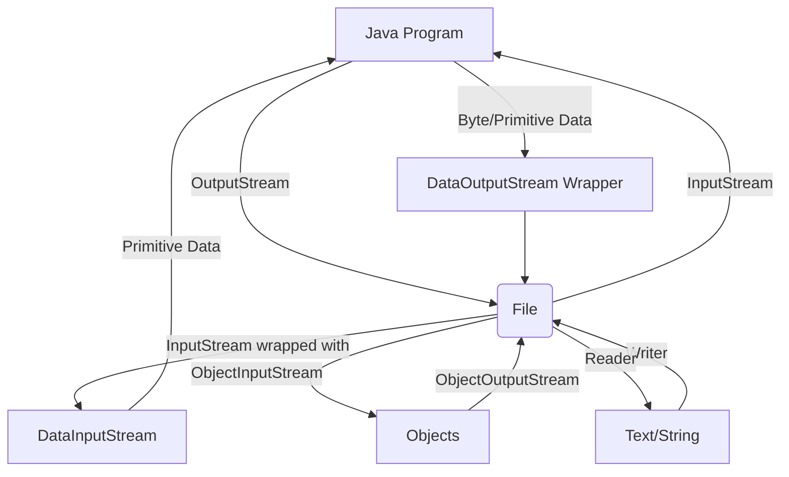

# Session 89: IO Streams

## Table of Contents
- [IO Streams](#io-streams)
  - [Overview](#overview)
  - [Key Concepts and Deep Dive](#key-concepts-and-deep-dive)
    - [Why IO Streams?](#why-io-streams)
    - [Persistence Media and Logic](#persistence-media-and-logic)
    - [What is a Stream?](#what-is-a-stream)
    - [Types of Streams](#types-of-streams)
    - [Stream Classes](#stream-classes)
    - [Writing Data to Files](#writing-data-to-files)
    - [Reading Data from Files](#reading-data-from-files)
    - [Converting Strings to Bytes](#converting-strings-to-bytes)
  - [Lab Demos](#lab-demos)
    - [Writing Bytes to a File](#writing-bytes-to-a-file)
    - [Reading Bytes from a File](#reading-bytes-from-a-file)
- [Summary](#summary)
  - [Key Takeaways](#key-takeaways)
  - [Expert Insight](#expert-insight)

## IO Streams

### Overview

This session introduces IO (Input/Output) streams in Java, a fundamental concept for handling file operations and persistent data storage. From the transcript, the instructor Mr. Hari Krishna covers the basics of streams, their types, and practical implementation for reading from and writing to files. The chapter focuses on storing and retrieving primitive data types, text, and objects permanently using Java's IO API. Key areas include understanding streams as logical connections between Java applications and persistence media (files or databases), distinguishing between binary and character streams, and using core classes like `FileInputStream`, `FileOutputStream`, and related filter streams for enhanced functionality.

### Key Concepts and Deep Dive

#### Why IO Streams?
The basic objective of the IO streams chapter is storing and reading data permanently in files or databases. Unlike variables and objects in RAM (which are volatile), persisted data survives program termination. Applications act as bridges between end users and persistence media, performing CRUD operations. The instructor emphasizes four terminology terms: persistence media (files/databases), persistence logic (IO/database code), persistence technologies (IO streams/JDBC), and persistence technologies APIs (stream/JDBC APIs). In a complete application, this complements business logic (core Java features like OOP, exceptions) and presentation logic (user interaction via Scanner).

#### Persistence Media and Logic
- **Persistence Media**: Environment for permanent storage, e.g., files, databases, remote computers (sockets).  
- **Persistence Logic**: Code performing persist operations.  
- **Persistence Technologies**: Tools providing APIs for persistence logic, e.g., IO streams, JDBC, Hibernate.  
Three logics in projects: presentation (UI/Scanner), business (processing/validation), and persistence (file/DB storage). Core Java covers persistence logic via IO streams.

> [!IMPORTANT]  
> IO streams handle file-based operations; databases use SQL/JDBC (covered later).

#### What is a Stream?
A stream is a logical connection between a Java program and a file/database, enabling flow of data for input (reading) or output (writing). Not physical—represents byte or character flow. Two main types: input (read from source) and output (write to destination). For files, input streams read data; output streams write data. One stream per direction—separate for reading/writing. Data travels as binary (0s/1s), typically in bytes.

Types of streams: binary (primitives/objects) and character streams (text). Superclasses: `InputStream` (abstract), `OutputStream` (abstract), `Reader` (abstract), `Writer` (abstract). Subclasses handle specific sources like files or keyboard.

#### Types of Streams
- **Binary Streams**: For binary data (primitives, images, objects). Divided into input (reading) and output (writing). Represented by `InputStream`/`OutputStream`.
- **Character Streams**: For text data. Divided into read (`Reader`) and write (`Writer`).  
- Differences: Binary handles zero/ones efficiently; character handles Unicode text.  

```diff
+ Binary Streams: Used for primitives, objects, images (e.g., banking apps storing account objects).
- Character Streams: Used for plain text like names, biographies (e.g., storing user profiles).
! Note: Binary data written in native sizes (e.g., int = 4 bytes); file size = content + headers.
```

> [!NOTE]  
> Stream size depends on data type—byte streams read/write one byte; filter streams (e.g., `DataInputStream`) read native sizes.

#### Stream Classes
From the transcript, focus on key classes for file IO:
- **FileInputStream/FileOutputStream**: Core for byte-level read/write (one byte at a time).
- **DataInputStream/DataOutputStream**: Filter streams adding primitive type support (e.g., writeInt for 4 bytes).
- **ObjectInputStream/ObjectOutputStream**: For object serialization/deserialization.
- **Reader/Writer subclasses**: `FileReader/FileWriter` for character streams.
- **BufferedReader/PrintWriter**: Advanced; BufferedReader wraps others for efficient reading; PrintWriter for formatted writing.
- **PrintStream**: Integrates with `System.out`.

Defaults: JVM provides streams like `System.in` (keyboard input, `InputStream`) and `System.out` (console output, `PrintStream`).

| Stream Type | Class | Purpose | Data Size Support |
|-------------|-------|---------|-------------------|
| Binary Input  | `FileInputStream` | Read bytes from files | 1 byte |
| Binary Output | `FileOutputStream` | Write bytes to files | 1 byte |
| Filter Input  | `DataInputStream` | Read primitives/objects | Native sizes (e.g., 4 bytes for int) |
| Filter Output | `DataOutputStream` | Write primitives/objects | Native sizes |
| Character Input | `FileReader` | Read text from files | Characters (2 bytes) |
| Character Output | `FileWriter` | Write text to files | Characters |
| Advanced Reader | `BufferedReader` | Efficient reading (wraps others) | Lines/strings |
| Advanced Writer | `PrintWriter` | Formatted writing | Text |

#### Writing Data to Files
Basic steps: Create stream → Write data → Flush (push to file) → Close (free resources). `FileOutputStream` writes one byte; create byte arrays for multiple bytes. Exceptions: `IOException` (unchecked, but handle as checked for compatibility). Files auto-create if missing; overwrite if existing (unless append mode).

#### Reading Data from Files
Basic steps: Create stream → Read data (one byte; loop for all) → Close. `FileInputStream` reads one byte; casts to `char` for text display. Exceptions: `IOException`. Data read as binary; convert to characters if needed.

#### Converting Strings to Bytes
`String.getBytes()` converts strings to byte arrays for writing. Example: `"HK".getBytes()` creates byte array for each character. Read back: Accumulate bytes → Cast to `String`.



### Lab Demos

The instructor demonstrated simple programs for writing and reading bytes. Note: Programs throw checked exceptions—handle via `throws` or try-catch.

#### Writing Bytes to a File
```java
package com.hk.streams;

import java.io.*;

public class Test {
    public static void main(String[] args) throws IOException {
        FileOutputStream fos = new FileOutputStream("abc.txt");
        fos.write(97); // Writes 97 (ASCII 'a') as one byte
        // fos.write(new byte[] {(byte)'a', (byte)'b', (byte)'c'}); // For multiple bytes
        // fos.write("HK".getBytes()); // Convert string to bytes and write
        fos.flush(); // Push to file (optional for some streams)
        fos.close();
        System.out.println("Data written.");
    }
}
```
Output: Creates `abc.txt` with binary data. Notepad displays as characters (e.g., 'a' for 97 if in text mode).

#### Reading Bytes from a File
```java
package com.hk.streams;

import java.io.*;

public class TestRead {
    public static void main(String[] args) throws IOException {
        FileInputStream fis = new FileInputStream("abc.txt");
        int data = fis.read(); // Reads one byte as int
        System.out.println(data); // Prints int value (e.g., 97)
        // System.out.println((char)data); // Cast to char for text
        fis.close();
    }
}
```
Output: Reads first byte; loop for all bytes if needed. Data returned as int (inherits `InputStream.read()` contract).

Practices: Run programs, check file creation/deletion, observe binary vs. text display differences.

## Summary

### Key Takeaways
```diff
+ Streams are logical connections for permanent data transfer between Java programs and files/databases.
+ Binary streams (InputStream/OutputStream) handle primitives/objects; character streams (Reader/Writer) handle text.
+ Core classes: FileInputStream/FileOutputStream for bytes; DataInputStream/DataOutputStream for primitives; ObjectInputStream/ObjectOutputStream for objects.
+ Writing: Connect → Write (bytes/native sizes) → Flush → Close.
+ Reading: Connect → Read (bytes) → Convert if needed → Close.
+ Handle IOExceptions; use getBytes() for strings; filter streams add capabilities like primitive typing.
- Streams create files automatically but overwrite existing content; separate input/output streams per operation.
! Persistence media ensures data survival beyond program execution.
```

### Expert Insight

**Real-world Application**:  
In production systems like banking apps, IO streams serialize customer objects to files for backup/cache, enabling recovery without database hits. E.g., a hospital system writes patient records to files during outages, using ObjectOutputStream for complex object persistence.

**Expert Path**:  
Master file paths (File class), experiment with BufferedReader for line-by-line text processing, and learn NIO.2 (java.nio) for advanced async operations. Practice serialization pitfalls (transient fields) by profiling file I/O performance.

**Common Pitfalls**:  
Data corruption from incomplete flushes; forgetting to close streams (resource leaks); mistaking binary for text (leading to unreadable files). E.g., writing '5000' as int with DataOutputStream vs. as string—use consistent methods. Undefined behavior if streams opened on closed resources.

Lesser known: JVM's `System.in` is an `InputStream` internally using `BufferedReader` equivalents; `PrintStream` auto-flushes on newlines, optimizing console output. Files store unsigned bytes (0-255); negative values convert to positive ranges (e.g., -1 → 255). Serialization adds headers/metadata—binary files larger than plain text.
