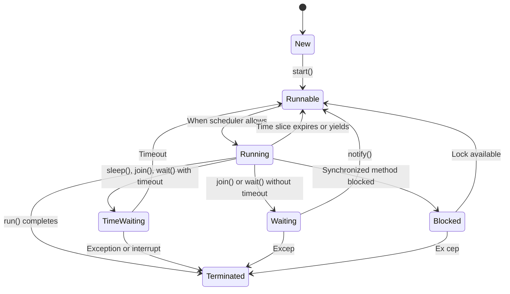

# Session 93: Thread Life Cycle and Execution Algorithms

## Table of Contents
1. [Recap of Last Class and Multi-Threading Basics](#recap-of-last-class-and-multi-threading-basics)
2. [Executing Different Logics in Custom Threads](#executing-different-logics-in-custom-threads)
3. [Overriding the Start Method](#overriding-the-start-method)
4. [Creating Threads from Other Threads](#creating-threads-from-other-threads)
5. [Thread Life Cycle States](#thread-life-cycle-states)
6. [Thread Execution Algorithms](#thread-execution-algorithms)
7. [Thread Priorities](#thread-priorities)
8. [Thread Naming and Identification](#thread-naming-and-identification)

## Recap of Last Class and Multi-Threading Basics

In multi-threading, we use multiple threads to execute tasks concurrently, completing projects faster. Threads allow running logic in separate paths, preventing one task from blocking others.

Key concepts include:
- What is a thread?
- Multi-threading advantages.
- Custom thread creation.
- Running logic in custom threads.

Threads have relationships with the Runnable interface: implements Runnable (for the run method) and has-a (to call run on the Runnable object). Two approaches to create custom threads: extending Thread or implementing Runnable. Implementing Runnable is preferred for multiple inheritance compatibility.

Three ways to create and run a custom thread: extend Thread, implement Runnable, or implement Callable.

Starting with same logic with different inputs or different logics using multiple threads.

Threads execute concurrently, managed by JVM.

Example program demonstrating sequential vs. concurrent execution:

```java
class Example {
    public void m1() { /* logic */ }
    public void m2() { /* logic */ }
    public void m3() { /* logic */ }
}

class Test {
    public static void main(String[] args) {
        Example ex = new Example();
        ex.m1();  // Block others
        ex.m2();
        ex.m3();
    }
}
```

Problem: If m1 blocks (e.g., waiting for input), m2 and m3 cannot run. Solution: Use separate threads for each method.

```java
class M1Thread extends Thread {
    public void run() {
        ex.m1();
    }
}

class M2Thread extends Thread {
    public void run() {
        ex.m2();
    }
}

class M3Thread extends Thread {
    public void run() {
        ex.m3();
    }
}

public class Test {
    public static void main(String[] args) {
        new M1Thread().start();
        new M2Thread().start();
        new M3Thread().start();
    }
}
```

Benefit: Concurrent execution; if m1 blocks, others continue.

## Executing Different Logics in Custom Threads

To execute different logics, create separate subclasses, each with its own run method.

Example: Addition and subtraction threads.

```java
class AddThread extends Thread {
    public void run() {
        int sum = 0;
        for (int i = 1; i <= 20; i++) {
            sum += i;  // Compound assignment operator
            System.out.println("Addition: " + sum);
        }
    }
}

class SubThread extends Thread {
    public void run() {
        int diff = 0;
        for (int i = 1; i <= 20; i++) {
            diff -= i;
            System.out.println("Subtraction: " + diff);
        }
    }
}

public class Test {
    public static void main(String[] args) {
        new AddThread().start();
        new SubThread().start();
    }
}
```

Execution: Main start → Main end → Add thread executes concurrently with Sub thread → Output alternates randomly.

Three threads: Main, AddThread, SubThread.

## Overriding the Start Method

Extending Thread allows overriding start, but it's not recommended. Overriding prevents custom thread creation unless super.start() is called.

If overridden without super.start(), run() doesn't execute.

Correct procedure: Override start, call super.start() to create thread, then run executes.

Why override? To execute logic just before thread start, e.g., in constructors or static blocks, but for per-thread pre-start logic, override start.

```java
class MyThread extends Thread {
    public void run() {
        System.out.println("My logic in run");
    }

    public void start() {
        // Custom logic before start
        System.out.println("Logic before start");
        super.start();  // Must call to create thread
        // Custom logic after start (if needed)
        System.out.println("Logic after start");
    }
}
```

Start method is not final, allowing override.

## Creating Threads from Other Threads

Possible to create custom threads from other custom threads.

Example:

```java
class MyThread extends Thread {
    public void run() {
        // Logic in run
        MyThread child = new MyThread();
        child.start();  // Creates child from parent thread
    }
}

public class Test {
    public static void main(String[] args) {
        MyThread mt = new MyThread();
        mt.start();  // Creates first thread
    }
}
```

Child thread's priority inherits from parent.

## Thread Life Cycle States

Threads have five life cycle states: New, Runnable, Running, Non-Runnable (Blocked/Time-Waiting/Waiting), Terminated (Dead).

### State Definitions and Transitions



Old names: Ready to Run, Running, Non-Runnable (Timed Waiting, Waiting, Blocked).

New names (from Java 5, enum Thread.State): NEW, RUNNABLE, TIMED_WAITING, WAITING, BLOCKED, TERMINATED.

Get state using `Thread.State state = thread.getState();`

Example program:

```java
public class ThreadStates {
    public static void main(String[] args) throws InterruptedException {
        Thread t = new Thread(() -> {
            try {
                Thread.sleep(2000);
            } catch (InterruptedException e) {}
            System.out.println("Run completed");
        });
        System.out.println("State after creation: " + t.getState());  // NEW
        t.start();
        System.out.println("State after start: " + t.getState());     // RUNNABLE
        Thread.sleep(500);  // Allow execution
        System.out.println("State during run: " + t.getState());      // RUNNABLE
        Thread.sleep(2000);  // Wait for sleep in run
        System.out.println("State after sleep: " + t.getState());     // TERMINATED
    }
}
```

Call start() only on NEW state threads; otherwise, IllegalThreadStateException.

## Thread Execution Algorithms

Threads execute based on two algorithms: Scheduling and Priority.

### Thread Scheduling
Threads get time slices (e.g., 10-15ms). If not completed, thread yields to next in queue.

In programs without sleep, threads run concurrently until completion or yielding.

Example: Custom thread with long loop yields to main after limited iterations.

### Thread Priority
Priority: int 1-10 (MIN_PRIORITY=1, NORM_PRIORITY=5, MAX_PRIORITY=10). Default: Parent's priority.

Get: `thread.getPriority()`
Set: `thread.setPriority(int priority)` (throws IllegalArgumentException if not 1-10)

High priority gets longer time slices, likely to complete first. Same priority: random selection.

Example program:

```java
class MyThread extends Thread {
    private String name;

    MyThread(String name) {
        super(name);
    }

    public void run() {
        for (int i = 1; i <= 20; i++) {
            System.out.println(Thread.currentThread().getName() + " - " + i);
            try {
                Thread.sleep(100);  // Simulate work
            } catch (InterruptedException e) {}
        }
    }
}

public class Test {
    public static void main(String[] args) {
        MyThread mt1 = new MyThread("Thread-1");
        MyThread mt2 = new MyThread("Thread-2");

        System.out.println("Default priorities: " + mt1.getPriority() + ", " + mt2.getPriority());  // Both 5

        mt1.setPriority(7);
        mt2.setPriority(9);

        mt1.start();
        mt2.start();
    }
}
```

Output: Thread-2 (higher priority) often completes/starts first.

## Thread Naming and Identification

Default name: "Thread-N" where N increments for no-arg Thread().

Set name:
- Constructor: `new Thread(String name)`
- After creation: `setName(String name)`

Get name: `getName()`

Same name allowed; JVM uses ID, not name.

Get ID: `getId()` (deprecated in Java 21; use `threadId()`).

JVM has ~19 default threads (including main with ID 1).

Example:

```java
public class ThreadNaming {
    public static void main(String[] args) {
        Thread t1 = new Thread();           // Name: Thread-0
        Thread t2 = new Thread("CustomName"); // Name: CustomName
        t1.setName("RenamedThread");         // Rename

        System.out.println("Main ID: " + Thread.currentThread().threadId());
        System.out.println("T1 Name: " + t1.getName() + ", ID: " + t1.threadId());
        System.out.println("T2 Name: " + t2.getName() + ", ID: " + t2.threadId());
    }
}
```

## Summary

### Key Takeaways

```diff
+ Multi-threading fundamentals: Concurrent execution prevents blocking.
+ Three custom thread approaches: Extend Thread, implement Runnable, Callable.
+ Overriding start: Allowed, but call super.start() for thread creation.
+ Life cycle states: NEW → RUNNABLE → RUNNING → Non-Runnable → TERMINATED.
+ Execution: Scheduling (time slices) and Priority (high priority gets more time).
+ Naming: Default "Thread-N", set via constructor or setName().
+ IDs: Use threadId() for identification.
! Start multiple times on same thread: Throws IllegalThreadStateException.
```

### Expert Insight

**Real-world Application**: In web servers or databases, multi-threading handles concurrent user requests efficiently, using priorities for critical tasks (e.g., high-prio admin ops, low-prio background scans).

**Expert Path**: Master synchronizing threads to avoid race conditions; study java.util.concurrent for advanced utilities like ExecutorService.

**Common Pitfalls**: 
- Forgetting to call super.start() when overriding start() → No thread creation.
- Assuming high-prio threads always start first → Guarantee only more time slices, not start order.
- Blocking operations (e.g., sleep) in run() without exception handling → Thread unexpectedly terminates.

**Common Issues and Resolutions**:
- IllegalArgumentException on setPriority: Pass value 1-10 only.
- IllegalThreadStateException on start(): Check thread state (must be NEW).
- Thread starvation: Adjust priorities or use yield() for fairness.
- Naming conflicts: Use unique names for debugging ease, though JVM uses IDs.

**Lesser Known Things**: JVM's main thread (ID 1) has NORM_PRIORITY; all child threads inherit priority. ThreadGroup can organize threads hierarchically, affecting scheduling. Use ThreadLocal for per-thread data isolation.
