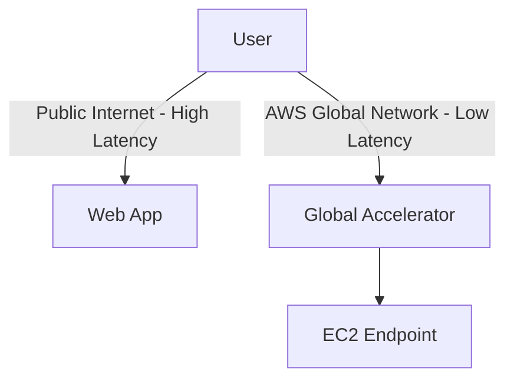

# Session 03: EC2 Instances, SSH Connections, Socks Proxy Setup, and AWS Global Accelerator Introduction

**Table of Contents**
- [Overview](#overview)
- [EC2 Instance Launching and Management](#ec2-instance-launching-and-management)
  - [Launching EC2 Instances in Different Regions](#launching-ec2-instances-in-different-regions)
  - [Connecting to EC2 via SSH](#connecting-to-ec2-via-ssh)
- [Setting up a Simple Web Server on EC2](#setting-up-a-simple-web-server-on-ec2)
- [HTTP Access and Security Groups](#http-access-and-security-groups)
- [AWS Global View](#aws-global-view)
- [Socks Proxy for Location Spoofing](#socks-proxy-for-location-spoofing)
- [AWS Global Accelerator Overview](#aws-global-accelerator-overview)
  - [AWS Private Global Network](#aws-private-global-network)
- [Summary](#summary)

## Overview

This session covers foundational concepts in Amazon Web Services (AWS), focusing on Elastic Compute Cloud (EC2) instances as virtual machines in the cloud. It explains launching instances in different regions, connecting via SSH, setting up a basic web server, configuring security groups for access, and introduces advanced networking features like socks proxies for IP location changes and AWS Global Accelerator for performance optimization across global networks.

The content emphasizes practical use cases, highlighting how EC2 enables running applications, testing, and optimizing global accessibility without basic prerequisite knowledge. Key themes include performance enhancement through AWS's infrastructure, security considerations, and real-world applications for latency-sensitive workloads.

## EC2 Instance Launching and Management

### Launching EC2 Instances in Different Regions

AWS EC2 allows launching virtual machines (instances) in various global regions. This enables positioning resources closer to users for reduced latency and better performance.

- **Selecting Regions**: AWS provides regions worldwide (e.g., Mumbai in India, California in the US). Choose a region based on user proximity.
- **Instance Families**: Use free-tier options like t2.micro for cost-effective experimentation.
- **Operating Systems**: Options include Amazon Linux (default), Red Hat Linux, Ubuntu, Windows, etc.
- **Key Concepts**:
  - **AMI (Amazon Machine Image)**: Pre-configured OS templates.
  - **Instance Type**: Hardware configuration (e.g., t2.micro for free tier).
  - **Security Groups**: Firewalls controlling inbound/outbound traffic.
  - **Key Pairs**: SSH keys for secure access (generated during launch).
- **Use Cases**: Launch instances for websites, databases, Python/Java apps, or tunneling setups.

### Connecting to EC2 via SSH

SSH (Secure Shell) is a protocol for remote login to Linux systems over the internet. Use IP addresses and keys for authentication.

- **Required Components**:
  - Public IP of the instance.
  - Username (e.g., ec2-user for Amazon Linux).
  - Private key generated during launch.
- **Connection Steps**:
  1. Download the key pair (.pem file) locally.
  2. Use SSH command: `ssh -i path/to/key.pem username@public-ip`
  - Example: `ssh -i aws-virginia-key.pem ec2-user@54.123.45.67`
- **Troubleshooting**:
  - On Windows CMD, may fail; use Git Bash or alternative tools.
  - For launch failures, check "Fingerprint" prompts (type "yes" to confirm host).

Not all OS images (e.g., some Linux flavors like Red Hat) support browser-based connection; SSH is required.

## Setting up a Simple Web Server on EC2

Demonstrates installing and configuring a basic web server (Apache HTTPD) on a Linux instance.

### Step-by-Step Lab Demo

1. **Connect via SSH**:
   - Use `ssh -i key.pem ec2-user@public-ip` to access the instance.

2. **Switch to Root User**:
   - Command: `sudo su -` (privileged access for installations).

3. **Install HTTPD (Apache)**:
   - Update packages: `yum update -y`
   - Install: `yum install httpd -y`

4. **Create Web Content**:
   - Navigate to web directory: `cd /var/www/html`
   - Create index.html: `cat > index.html` (type content, e.g., "Welcome to Linux World Website."), Ctrl+D to save.

5. **Start and Enable Services**:
   - Start HTTPD: `systemctl start httpd`
   - Enable on boot: `systemctl enable httpd`

6. **Verify**:
   - Use `curl` locally: Check if the page loads correctly.

This sets up a basic website accessible via HTTP protocol.

## HTTP Access and Security Groups

AWS security groups act as firewalls, controlling traffic to instances.

- **Issue**: New instances block HTTP (port 80) by default, only allowing SSH.
- **Solution**:
  - Go to EC2 > Security Groups.
  - Edit Inbound Rules: Add rule for HTTP, source "0.0.0.0/0" (anywhere).
  - Protocol: HTTP (TCP, port 80).
- **Result**: Website now accessible globally via `http://public-ip`.

| Protocol | Port | Purpose | Default Allowance |
|----------|------|---------|-------------------|
| SSH      | 22   | Remote Login | Allowed            |
| HTTP     | 80   | Web Access   | Not Allowed (Must Add) |
| HTTPS    | 443  | Secure Web   | Not Allowed       |

## AWS Global View

AWS Global View provides a single-pane-of-glass dashboard for resources across all enabled regions.

- **Features**:
  - Shows total instances per region (e.g., 3 in Mumbai, 1 in California).
  - Helps monitor status without switching regions.
  - Accessible via EC2 > Global View.
- **Benefits**: Prede Caution charges by spotting unused instances.

## Socks Proxy for Location Spoofing

Socks (specifically Socks5) proxy tunnels traffic through an EC2 instance, masking origin IP and location for testing or security purposes.

### Key Concepts

- **Purpose**: Change apparent location (e.g., route requests through US server to appear US-based).
- **Tunnel vs. VPN**: Uses SSH-based socks proxy for layer-5 TCP/UDP forwarding.
- **Use Cases**: Geo-testing, accessing blocked content (not recommended for malicious intent), anonymous browsing for legitimate purposes.
- **How It Works**:
  ```
  ! Local Machine → EC2 (US) → Target Website
  ```
  Target sees requests from EC2's IP/location.

### Step-by-Step Lab Demo

1. **Launch Proxy Server**: EC2 in target region (e.g., California) as "exit node".

2. **Establish Tunnel**:
   - Command: `ssh -D 1080 -N ec2-user@public-ip` (binds local port 1080).
     - `-D`: Dynamic port forwarding for socks proxy.
     - `-N`: No remote commands (tunnel only).

3. **Configure Browser**:
   - In Chrome: Run special command to enable proxy.
   - Example: `chrome.exe --proxy-server=socks5://localhost:1080`
   - Access `whatismyipaddress.com` → Shows EC2's location (e.g., California).

4. **Verification**:
   - Without proxy: Shows local IP (e.g., Jaipur, India).
   - With proxy: Shows EC2 IP (e.g., US-based).

5. **Terminate**: Ctrl+C to close tunnel.

### Performance Test

Use `curl` with socks proxy to measure latency:

```bash
curl -s -w 'Total Time: %{time_total}s\n' -o /dev/null --socks5 localhost:1080 http://example.com
```

+ Performance tip: Socks proxy adds encryption but may increase latency; use for testing only.

## AWS Global Accelerator Overview

AWS Global Accelerator (GA) improves application performance, security, and availability by routing traffic over AWS's private global network instead of public internet.

### Key Concepts

- **Problem Solved**: Latency and unreliability of public internet (interferences, congestion, lack of control).
- **Solution**: Uses AWS global private network (billion-dollar investment) for ultra-low latency, high-speed, secure routing.
- **Features**:
  - **Static IP Addresses**: Global entry points, failover without DNS changes.
  - **Intelligent Routing**: Routes to optimal endpoints based on proximity/health.
  - **Health Checks**: Auto-reroutes <30 seconds if endpoint fails.
  - **Performance Boost**: Up to 60% faster than public internet.
- **Comparison**: Unlike CDN (CloudFront), GA directly accelerates traffic without caching, ideal for dynamic/tunneling apps.

### AWS Private Global Network

Amazon built a proprietary global network for resilience and security beyond public internet.

- **Unique Aspects**:
  - High-speed fiber optics spanning continents.
  - Fault-tolerant (auto-reroutes during disasters/wars).
  - Isolated from public internet vulnerabilities.
  - No control by telecom companies; fully AWS-managed.
- **Benefits**: 
  - Reliability: No single-point failures.
  - Security: Encrypted, private paths.
  - Speed: Dedicated bandwidth (10-100 Gbit/s).



Tables comparison of internet routing:

| Aspect          | Public Internet                 | AWS Private Global Network     |
|-----------------|---------------------------------|-------------------------------|
| Latency        | Variable (~0.5-2s+)            | Ultra-Low (<0.1s)            |
| Reliability    | Low (Depends on telecoms)      | High (Redundant paths)        |
| Security       | Vulnerable (Man-in-middle risk)| Secure (Fully controlled)     |
| Cost           | Free (for users)                | Paid via GA/other services    |

### Lab Demo Preview

(Setup not fully completed in transcript; involves assigning GA static IPs to EC2 endpoints for global access.)

## Summary

### Key Takeaways
```diff
+ AWS EC2 enables global virtual machine deployment for any workload.
- Public internet limits performance; use AWS alternatives for critical apps.
! Security groups are mandatory firewalls; misconfiguration blocks access.
+ SSH is fundamental for Linux remote access; socks proxies aid location testing.
! Global Accelerator leverages private network for <60% latency reduction.
```

### Quick Reference
- **Launch EC2**: EC2 > Launch Instance > Choose AMI + Instance Type > Configure Key Pair > Security Group.
- **SSH Connect**: `ssh -i key.pem ec2-user@public-ip`
- **Install HTTPD**: `yum install httpd -y; systemctl start httpd; systemctl enable httpd`
- **Socks Proxy**: `ssh -D 1080 -N ec2-user@public-ip` → Browser: `chrome --proxy-server=socks5://localhost:1080`
- **Curl Latency Check**: `curl -s -w 'Total Time: %{time_total}s\n' -o /dev/null http://url`
- **Global View**: EC2 > Global View for multi-region status.

### Expert Insight

#### Real-world Application
In e-commerce, deploy EC2 in target markets (e.g., US East for North American clients) with GA for sub-second response times during high-traffic sales. Socks proxies test localized features like payment gateways.

#### Expert Path
- Master networking basics (TCP/IP, ports, protocols) via AWS docs.
- Experiment with multi-region deployments and auto-scaling for production readiness.
- Certify with AWS Solutions Architect Associate to design optimized architectures.

#### Common Pitfalls
- **Forgotten Security Groups**: Instances inaccessible; always add inbound rules immediately.
- **Key Pair Loss**: Permanent instance access loss; use secure storage for keys.
- **Public IP Misuse**: Exposing sensitive apps without HTTPS; use ELB/ALB for load balancing.
- **Over-reliance on Public Internet**: Latency issues in gaming apps; switch to GA early.
- **Misinterpreting GA for CDN**: GA accelerates direct traffic; use CloudFront for static content caching.

#### Lesser-Known Facts
- AWS regions include isolated zones for disaster recovery; GA spans all for seamless failover.
- Socks proxy can integrate with tools like Proxifier for app-wide routing, not just browsers.
- Global network uses multiple undersea cables; some routes bypass insecure regions entirely.
