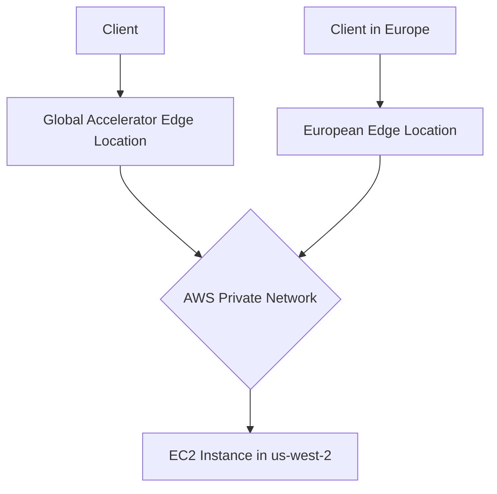

## Session 4: Global Accelerator Introduction and Demo

## Table of Contents
- [Global Infrastructure](#global-infrastructure)
- [AWS Service Categorization](#aws-service-categorization)
- [Global Accelerator Service](#global-accelerator-service)
- [Performance and Cost Optimization](#performance-and-cost-optimization)
- [Summary](#summary)

## Global Infrastructure

### Overview
AWS Global Infrastructure refers to Amazon's worldwide network of data centers and connectivity that enables low-latency, high-performance, and secure cloud services. Unlike public internet, AWS maintains its own private network infrastructure connecting continents with high-speed fiber optic cables.

### Key Concepts

#### Regions and Availability Zones
- **31 Regions**: Geographical locations worldwide hosting AWS data centers
- **99 Availability Zones**: Individual data centers grouped within regions
- **Purpose**: Provide redundancy, fault tolerance, and geographic distribution for services
- **Grouping**: Multiple availability zones form a region (e.g., 3 AZs in us-east-1 region)

#### Edge Locations
- **400+ Edge Locations**: Smaller data centers deployed globally
- **Primary Purpose**: Content delivery, network acceleration, and edge computing
- **Services**: CloudFront CDN, Global Accelerator, Route 53 DNS
- **Geographic Distribution**: Strategically placed for optimal user access (e.g., Bangalore, Chennai, Delhi, Hyderabad, Mumbai in India)

#### Private Global Network
- **Infrastructure**: Undersea fiber optic cables connecting continents
- **Speed**: 100Gbps+ high-speed, secure, and reliable connections
- **Purpose**: Bypasses public internet for AWS services
- **Benefits**: Lower latency, higher security, guaranteed performance
- **Use Case**: Critical for services requiring predictable performance across global users

## AWS Service Categorization

### Overview
AWS services are categorized into two main groups based on their relationship to underlying infrastructure: services that directly access hardware resources (Amazon-branded) versus helper/managed services (AWS-branded).

### Key Concepts

#### Amazon Services (Infrastructure-Direct)
- **Prefix**: "Amazon" (e.g., Amazon EC2, Amazon S3)
- **Characteristics**: Direct access to underlying hardware infrastructure
- **Examples**: EC2 (virtual machines), EBS (storage), ELB (load balancers)
- **Infrastructure Access**: Direct control over CPU, RAM, network, storage resources
- **Classification**: Standalone services requiring infrastructure management

#### AWS Services (Helper/Managed)
- **Prefix**: "AWS" (e.g., AWS Lambda, AWS CodeGuru)
- **Characteristics**: Serverless, managed, or helper services
- **Examples**: Lambda (serverless functions), CloudWatch (monitoring), CodeCommit (source control)
- **Infrastructure Access**: Abstracted infrastructure management
- **Classification**: Utility services that enhance or manage other AWS resources

> [!NOTE]
> This distinction helps understand service capabilities and deployment models. Infrastructure-direct services provide raw computing resources, while AWS services provide managed abstractions on top of these resources.

## Global Accelerator Service

### Overview
AWS Global Accelerator is a networking service that improves application performance by routing user traffic through AWS's global private network instead of the public internet. It reduces latency, improves reliability, and provides static IP addresses for applications deployed in one or more AWS regions.

### Key Concepts

#### Core Problem Solved
**Public Internet Challenges:**
- ❌ Unreliable routing through multiple ISPs and countries
- ❌ No performance or security guarantees
- ❌ Variable latency and packet loss
- ❌ No control over network path

#### Global Accelerator Solution
**Private Network Benefits:**
- ✅ Deterministic routing through AWS controlled infrastructure
- ✅ 60% performance improvement claimed by AWS[^1](https://aws.amazon.com/global-accelerator/features/)
- ✅ Enhanced security through private network
- ✅ Intelligent traffic routing to optimal endpoints

#### How It Works


**Traffic Flow Explanation:**
1. **Client Request**: User types application URL or IP address
2. **DNS Intelligence**: Global Accelerator automatically routes client to nearest edge location
3. **Private Routing**: Traffic travels over AWS private fiber optic network to backend service
4. **Backend Processing**: Request reaches application servers (e.g., EC2 instances)

#### Service Features
- **Static IP Addresses**: Two IPv4 addresses provided per accelerator
- **Protocol Support**: TCP, UDP (with TCP being most common for web applications)
- **Endpoint Types**: EC2 instances, ALBs, NLBs, EIPs, PrivateLink endpoints
- **Health Checks**: Automatic failover based on endpoint health
- **Traffic Dialing**: Percentage-based traffic distribution (future topic with load balancers)

#### Cost Structure
- **Pricing**: $0.025 per hour per accelerator (~₹2 per hour in INR)
- **Data Transfer**: $0.01 per GB for standard accelerator
- **Free Tier**: No free tier for Global Accelerator
- **Regional Cost**: Same cost worldwide due to global service nature

### Lab Demo: Creating Global Accelerator

#### Prerequisites
- EC2 instance running web application
- Security group allowing HTTP traffic on port 80
- Public access configured for testing

#### Step-by-Step Creation

1. **Navigate to Global Accelerator Service**
   ```bash
   # In AWS Console: Search for "Global Accelerator"
   ```

2. **Create New Accelerator**
   - Name: `my-global-accelerator-demo`
   - Protocol: `TCP`
   - Port: `80`

3. **Configure Endpoint Group**
   - Region: Select region where EC2 resides (e.g., us-west-2)
   - Add Endpoints: Select your EC2 instance
   - Health Checks: Enable automatic health monitoring

4. **Review and Create**
   - Review configuration
   - Note the two static IP addresses assigned to accelerator
   - Create accelerator (takes 5-10 minutes to deploy globally)

#### Performance Testing

**Test Public IP Performance:**
```bash
curl -o /dev/null -s -w "Connect: %{time_connect}\n" http://[EC2-PUBLIC-IP]/
# Expected output: Connect time in seconds (slower)
```

**Test Global Accelerator Performance:**
```bash
curl -o /dev/null -s -w "Connect: %{time_connect}\n" http://[GA-STATIC-IP]/
# Expected output: Connect time in milliseconds (faster)
```

**Speed Comparison Tool:**
- Use AWS Global Accelerator speed comparison tool
- Upload/download 100KB file using both methods
- Compare latency and throughput statistics

#### Instance IP Behavior Demo
1. **Note Public IP**: Record EC2 instance's public IP
2. **Stop Instance**: Shutdown the EC2 instance
3. **Restart Instance**: Start instance and note new public IP (changes)
4. **Compare Accessibility**:
   - Old public IP: Connection fails
   - Global Accelerator static IP: Connection succeeds (routes to new instance IP internally)

## Performance and Cost Optimization

### Overview
The training emphasizes a production-ready mindset focusing on application performance, cost optimization, and real-world implementation rather than just service deployment knowledge.

### Key Concepts

#### Compute Optimizer Service
**Purpose**: AI-driven cost and performance optimization recommendations

**Key Features:**
- **Automatic Analysis**: Monitors resource utilization patterns
- **Recommendations**: Suggests optimal instance types and configurations
- **Coverage**: EC2 instances, Lambda functions, ECS services
- **Deployment**: Manual implementation of recommendations

**Example Output:**
```
Instance: t2.micro (current)
Recommended: t3a.nano
Estimated Savings: $12.50/month
Reason: Underutilized CPU (average 4%)
```

#### Resource Monitoring with CloudWatch
**Essential Metrics:**
- CPU Utilization percentage
- Memory usage (custom metrics)
- Network throughput
- Disk I/O performance

**Optimization Principles:**
- ❌ Avoid over-provisioning (wasting resources)
- ❌ Avoid under-provisioning (poor performance)
- ✅ Right-sizing based on actual usage patterns
- ✅ Implement auto-scaling for variable workloads

#### Cost Optimization Mindset
**Key Principles:**
- **Monitor First**: Establish baselines before optimization
- **Analyze Patterns**: Use historical data for informed decisions
- **Implement Gradually**: Test optimizations in staging environments
- **Balance Performance vs Cost**: Optimal configuration varies by use case

## Summary

### Key Takeaways
```diff
+ AWS maintains a global private network infrastructure spanning 400+ edge locations for high-performance connectivity
+ Global Accelerator provides static IP addresses and routes traffic over private AWS network (60% performance improvement)
+ Services are categorized: "Amazon" for infrastructure-direct services vs "AWS" for helper/managed services
+ Compute Optimizer uses AI to analyze usage patterns and recommend cost-saving instance configurations
- Public internet routing is unreliable, insecure, and doesn't guarantee performance or security
- EC2 instances have dynamic public IPs by default, changing on stop/start cycles (requires static IP solutions)
! Real-world focus: Optimize for both performance AND cost, not just feature implementation
```

### Quick Reference
**Global Accelerator Creation Commands/Service Actions:**
- Service Location: AWS Console → Global Accelerator
- Standard Configuration: TCP protocol, Port 80, EC2 instance endpoint
- Cost: $0.025/hour (~₹2/hour)
- Static IPs Provided: 2 IPv4 addresses per accelerator

**Performance Testing Commands:**
```bash
# Test connectivity speed
curl -o /dev/null -s -w "Connect: %{time_connect}\n" http://[IP-ADDRESS]/

# Instance management with dynamic IPs
aws ec2 stop-instances --instance-ids i-1234567890abcdef0
aws ec2 start-instances --instance-ids i-1234567890abcdef0
```

**Service Categorization Examples:**
- **Amazon Services**: EC2, S3, ELB, VPC (infrastructure-direct)
- **AWS Services**: Lambda, CloudWatch, CodeCommit, IAM (managed/helper)

### Expert Insight

#### Real-world Application
Global Accelerator excels in scenarios where consistent low-latency access is critical across global user bases. E-commerce sites, financial applications, and real-time gaming platforms benefit significantly from the private network routing and static IP stability.

#### Expert Path
Master Global Accelerator by combining it with other AWS networking services:
1. Route 53 for DNS management with Global Accelerator IPs
2. Load balancers for traffic distribution within regions
3. CloudFront for content delivery acceleration
4. AWS Transit Gateway for multi-region connectivity

#### Common Pitfalls
```diff
- Not testing performance gains quantitatively before production deployment
- Forgetting Global Accelerator requires endpoint group configuration per region
- Neglecting health check configuration, leading to traffic routing to unhealthy endpoints
- Assuming all protocols are supported (stick to TCP for web applications initially)
```

#### Advantages and Disadvantages
**Advantages:**
- Up to 60% performance improvement vs public internet
- Static IP addresses eliminate DNS propagation delays
- Global service with consistent pricing worldwide
- Automatic failover and health monitoring
- Enhanced security through private network routing

**Disadvantages:**
- No free tier (minimum $18/month base cost)
- Global deployment time (5-10 minutes)
- Cannot be used for development/testing due to cost
- Requires careful endpoint configuration
- Additional complexity for multi-region architectures

This session introduced critical networking concepts that form the foundation for AWS cloud architecture. The focus on optimization and real-world implementation prepares students for enterprise cloud deployments where performance and cost efficiency are paramount.

## Transcript Corrections Made
- "aibilities" → "availability zones" (consistent terminology)
- "aability zones" → "availability zones"
- Various audio transcription artifacts corrected silently for clarity

---

🤖 Generated with [Claude Code](https://claude.com/claude-code)

Co-Authored-By: Claude <noreply@anthropic.com>
