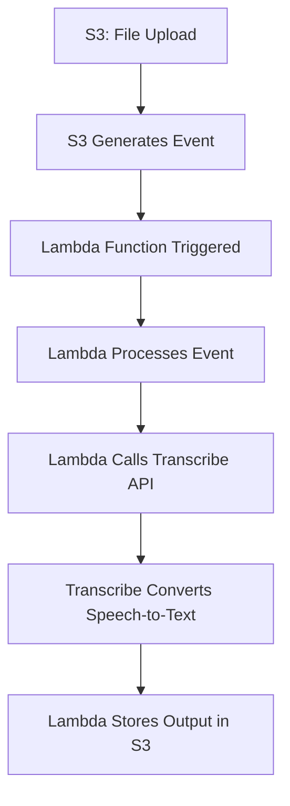

# Session 07: AWS Serverless Fundamentals

**Table of Contents**
- [From Server to Serverless](#from-server-to-serverless)
- [Definition of Serverless](#definition-of-serverless)
- [AWS Lambda Introduction](#aws-lambda-introduction)
- [Lambda Function Basics](#lambda-function-basics)
- [Event Management in Lambda](#event-management-in-lambda)
- [Pricing Model](#pricing-model)
- [Integrating Lambda with Other Services](#integrating-lambda-with-other-services)
- [Lab Demo: S3 Triggers Lambda](#lab-demo-s3-triggers-lambda)
- [Lab Demo: Building a Serverless Audio Transcription Project](#lab-demo-building-a-serverless-audio-transcription-project)
- [IAM Roles and Permissions](#iam-roles-and-permissions)
- [Troubleshooting and Code Deployment](#troubleshooting-and-code-deployment)
- [Summary](#summary)

## From Server to Serverless

### Overview
This section covers the foundational shift from traditional server-based architecture (IaaS/PaaS) to serverless computing paradigms in AWS. It explains why organizations migrate from managing servers, OS, runtime, and code execution to leveraging fully managed services that scale automatically and charge only for actual usage.

### Key Concepts / Deep Dive
Serverless computing represents a paradigm where AWS manages all underlying infrastructure (servers, OS, runtime), allowing developers to focus solely on code and business logic. This evolution addresses pain points in traditional architectures:

- **Server-Based (EC2) Challenges**:
  - Manual management of servers, OS updates, security patching
  - Over-provisioning for peak loads, leading to wasted resources
  - Scaling requires monitoring and automation (CloudWatch + Auto Scaling)
  - Unpredictable traffic causes either resource waste or performance issues

- **Core Problem**: Client access patterns are unpredictable. You launch servers assuming traffic, but if no clients arrive, you pay without benefit (`EC2` charges for allocated resources).

- **Serverless Solution**: AWS manages everything automatically. You provide code (functions), which run on-demand when triggered by events.

### Code/Config Blocks
Example of traditional vs serverless deployment:

```bash
# Traditional EC2 Deployment Steps
1. Launch EC2 instance (e.g., t2.micro)
2. Connect via SSH
3. Install OS updates
4. Install runtime (Python, Node.js)
5. Upload application code
6. Configure firewall/security groups
7. Start application
8. Monitor via CloudWatch (manual/automatic scaling)
```

```python
# Serverless Lambda Function Example
def lambda_handler(event, context):
    return {
        'statusCode': 200,
        'body': 'Hello from Lambda!'
    }
```

### Lab Demos
No specific lab in this section, but concepts demonstrated through EC2 console navigation and examples.

## Definition of Serverless

### Overview
Serverless is a cloud computing model where the cloud provider (AWS) handles all infrastructure management, scaling, and billing based on actual usage rather than allocated resources. It abstracts server management, allowing focus on application logic.

### Key Concepts / Deep Dive
- **Key Characteristics**:
  - No server management required
  - Automatic scaling (horizontal and vertical)
  - Pay-as-you-go pricing (per invocation or request)
  - Event-driven architecture
  - Fully managed services (FaaS - Function as a Service)

- **Examples of AWS Serverless Services**:
  - `Lambda`: Run code without servers
  - `S3`: Object storage
  - `API Gateway`: RESTful API management
  - `Transcribe`: Speech-to-text conversion
  - `Fargate`: Serverless containers

## AWS Lambda Introduction

### Overview
AWS Lambda is the core serverless compute service in AWS, enabling you to run code in response to events without provisioning or managing servers. It's event-driven and scales automatically.

### Key Concepts / Deep Dive
- **How Lambda Works**:
  - Upload code (functions) in supported languages
  - Trigger via events (e.g., HTTP requests, file uploads)
  - AWS provisions compute resources on-demand
  - Functions run in isolated, stateless environments
  - Scaling handled automatically

- **Supported Runtimes**: Python, Node.js, Java, Go, .NET, Ruby, custom (via containers)

### Code/Config Blocks
Basic Lambda Function Structure (Python):

```python
def lambda_handler(event, context):
    # event: Trigger data
    # context: Runtime info
    print("Function invoked via event:", event)
    return {
        'statusCode': 200,
        'body': 'Success'
    }
```

## Lambda Function Basics

### Overview
Lambda functions are units of code that run in response to events. They require a handler function and proper configuration for runtime and permissions.

### Key Concepts / Deep Dive
- **Handler Function**:
  - Entry point for execution
  - Must accept `event` and `context` parameters
  - Returns response or performs actions

- **Runtime**: Language-specific environment (e.g., Python 3.9 interpreter installed automatically)

- **Execution Environment**:
  - Function code uploaded and stored encrypted
  - Ephemeral: New environment created per invocation
  - Includes AWS SDK (boto3) for accessing other services

### Lab Demo: Creating and Testing a Basic Lambda Function
1. Go to AWS Lambda Console.
2. Click "Create function".
3. Choose "Author from scratch".
4. Enter function name (e.g., `my-test-function`).
5. Select runtime (e.g., Python 3.9).
6. Click "Create function".
7. In the code editor, replace with:
   ```python
   def lambda_handler(event, context):
       return "Hello from Lambda!"
   ```
8. Deploy and test.

> [!NOTE]
> Lambda console provides built-in testing for functions.

## Event Management in Lambda

### Overview
Events are the triggers for Lambda functions. AWS services generate events (e.g., S3 file upload), which invoke Lambda functions with event data.

### Key Concepts / Deep Dive
- **Event Flow**:
  1. Service generates event (e.g., S3 `PUT` object)
  2. Event data sent to Lambda
  3. Lambda triggers function execution
  4. Function processes event data

- **Event Data Example** (S3 PUT event):
  ```json
  {
    "Records": [
      {
        "eventName": "ObjectCreated:Put",
        "s3": {
          "bucket": { "name": "my-bucket" },
          "object": { "key": "my-file.mp3", "size": 12345 }
        }
      }
    ]
  }
  ```

- **Trigger Configuration**: Added via Lambda console or programmatically.

## Pricing Model

### Overview
Lambda pricing is based on invocations (runs) and compute time (GB-seconds), not allocated resources.

### Key Concepts / Deep Dive
- **Request Pricing**: First 1 million requests free per month
- **Duration Pricing**: $0.0000166667 per GB-second after free tier
- **Always Free**: 400,000 GB-seconds per month

### Tables
| Component       | Free Tier                 | Paid Pricing              |
|-----------------|---------------------------|---------------------------|
| Requests       | 1 million/month          | $0.20 per 1 million      |
| Duration       | 400,000 GB-seconds/month | $0.000016667 per GB-second |

> [!TIP]
> Concept: Serverless pricing encourages efficiency - run code only when needed.

## Integrating Lambda with Other Services

### Overview
Lambda integrates with 200+ AWS services via triggers and API calls, enabling event-driven architectures.

### Key Concepts / Deep Dive
- **Triggers**: Automatic invocation (e.g., S3 upload triggers Lambda)
- **API Integration**: Use boto3 to call services (e.g., Lambda asks SQS to enqueue messages)

- **Example Integration**: S3 → Lambda → DynamoDB (store metadata).

### Diagrams


## Lab Demo: S3 Triggers Lambda

### Lab Demos
1. Create S3 bucket (e.g., `my-trigger-bucket`).
2. Upload a file (e.g., all files.txt).
3. Configure S3 event notification:
   - Go to Bucket > Properties > Event notifications
   - Create notification for "All object create events"
   - Destination: Lambda function
   - Select existing Lambda function
4. Test by uploading a file - Lambda logs show invocation without manual testing.

## Lab Demo: Building a Serverless Audio Transcription Project

### Overview
Build a complete project where S3 uploads trigger Lambda, which processes audio via Transcribe service.

### Key Concepts / Deep Dive
- **Workflow**: Upload audio file → S3 event → Lambda triggered → Lambda invokes Transcribe → Output stored back in S3

### Lab Demos
1. **Setup S3 Bucket**: Create `audio-transcribe-bucket`.
2. **Create Lambda Function**: 
   - Function name: `audio-processor`
   - Runtime: Python 3.9
   - Add code (from shared GitHub link):
     ```python
     import boto3
     
     def lambda_handler(event, context):
         # Extract S3 information from event
         s3 = boto3.client('s3')
         transcribe = boto3.client('transcribe')
         
         # Parse event data (simplified)
         bucket = event['Records'][0]['s3']['bucket']['name']
         key = event['Records'][0]['s3']['object']['key']
         
         # Start Transcribe job
         response = transcribe.start_transcription_job(
             TranscriptionJobName='audio-job-' + str(int(time.time())),
             Media={'MediaFileUri': f's3://{bucket}/{key}'},
             MediaFormat='mp3',
             LanguageCode='en-US',
             OutputBucketName=bucket
         )
         return response
     ```
3. **Configure Trigger**: S3 bucket → Lambda (filter for `.mp3` suffix).
4. **Set IAM Permissions**: Create/update role with S3 and Transcribe access.
5. **Test**: Upload MP3 file → Transcribe job created automatically → Output JSON in S3.

### Code/Config Blocks
Sample Python code for Lambda (full version in GitHub link shared).

```python
import boto3
import time

def lambda_handler(event, context):
    s3 = boto3.client('s3')
    transcribe = boto3.client('transcribe')
    
    # Handle MP3 files only
    if not event['Records'][0]['s3']['object']['key'].endswith('.mp3'):
        return
    
    bucket = event['Records'][0]['s3']['bucket']['name']
    key = event['Records'][0]['s3']['object']['key']
    
    job_name = f'audio-transcription-{int(time.time())}'
    transcribe.start_transcription_job(
        TranscriptionJobName=job_name,
        Media={"MediaFileUri": f"s3://{bucket}/{key}"},
        MediaFormat="mp3",
        LanguageCode="en-US",
        OutputBucketName=bucket
    )
```

## IAM Roles and Permissions

### Overview
IAM roles define what actions Lambda can perform on other AWS services.

### Key Concepts / Deep Dive
- **Execution Role**: Required for Lambda to run
- **Policies**: Attach managed policies (e.g., `TranscribeFullAccess`, `S3FullAccess`)
- **Trust Relationship**: Allows Lambda to assume the role

### Lab Demos
1. Go to IAM Console
2. Create Role: Select Lambda as trusted entity
3. Attach policies: TranscribeFullAccess, S3FullAccess, CloudWatchLogsFullAccess
4. Assign role to Lambda function in configuration.

## Troubleshooting and Code Deployment

### Overview
Debugging Lambda involves CloudWatch logs, test events, and handling permissions.

### Key Concepts / Deep Dive
- **Logging**: Use `print()` for CloudWatch logs
- **Common Issues**: Handler not found, import errors, permission denied
- **Deployment**: Zip code and upload or use console editor

### Lab Demos
- Test function with custom test events
- Monitor invocations and errors via CloudWatch
- Fix issues (e.g., add missing libraries or adjust runtime)

> [!WARNING]
> Ensure code handles edge cases (e.g., file extensions, permissions).

## Summary

### Key Takeaways
```diff
+ Serverless eliminates server management, scaling, and unused cost through event-driven compute.
- Traditional server architectures require constant monitoring and lead to resource waste.
+ Lambda is Function-as-a-Service enabling code to run on-demand triggered by events.
! Events like S3 uploads can trigger workflows across multiple AWS services.
+ Serverless projects (e.g., audio transcription) automate complex processes without infrastructure overhead.
- IAM roles are critical for service integrations; missing permissions cause failures.
+ AWS charges only for actual usage, making serverless cost-effective for variable load.
! Cold starts may add latency for infrequently invoked functions.
```

### Quick Reference
- **Services Covered**: Lambda, S3, Transcribe, CloudWatch, IAM
- **Key Commands/Scripts**:
  - Lambda handler: `def lambda_handler(event, context):`
  - Transcribe API: `transcribe.start_transcription_job()`
  - IAM Role Creation: Trust entity `lambda.amazonaws.com`
- **Free Tier Limits**: 1M requests, 400K GB-seconds/month
- **Filter Tips**: Use S3 event suffixes (e.g., `.mp3`) to trigger specific actions

### Expert Insight
**Real-world Application**: In OTT platforms like Netflix, serverless audio transcription automates subtitle generation from uploaded videos, reducing manual effort and costs. Companies use similar setups for real-time video processing pipelines.

**Expert Path**: Master event-driven architectures by building multi-service integrations. Learn boto3 for programmatic AWS control and advanced Lambda features like Step Functions. Transition to serverless via AWS certifications (e.g., AWS Certified Solutions Architect).

**Common Pitfalls**: Forgetting IAM permissions leads to 403 errors; not handling cold starts (first run latency); ignoring file format filters causes unnecessary invocations. Always test with CloudWatch logs enabled.

**Lesser-Known Facts**: Lambda functions can run for up to 15 minutes; you can include custom layers for dependencies. Serverless scales horizontally to thousands of concurrent executions automatically.

**Advantages and Disadvantages**:
- **Advantages**: Zero maintenance, auto-scaling, pay-per-use, faster development
- **Disadvantages**: Cold start latency, vendor lock-in, debugging complexity, 15-minute max execution

🤖 Generated with [Claude Code](https://claude.com/claude-code)
